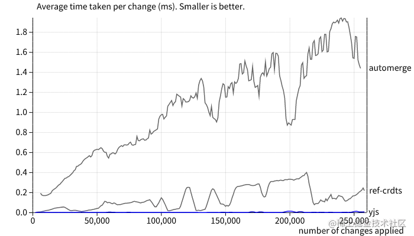

这是一个 toB 的项目，主要是管理美团内部人员的违规违纪行为，包括线索的研判、案件的调查、挽损的管理、绩效的考核和审批等等。资保同学是负责线索的研判和案件的调查，以及挽损的管理。策略同学负责查看工单找到异常违纪的内容，然后录入到案件中。

组件的职责单一
单一职责原则：每个组件应该只负责一个功能或一组相关的功能，避免组件过于复杂。
分而治之：将复杂的组件拆分为多个小组件，以提高可维护性。 2. 良好的接口设计
属性（Props）：定义清晰的输入接口，使用 props 传递数据和配置。
事件（Events）：通过事件向父组件传递信息，避免直接操作父组件的数据。
插槽（Slots）：使用插槽提供灵活的内容分发机制，允许父组件自定义子组件的部分内容。 3. 组件的可复用性
通用性：设计组件时考虑不同的使用场景，避免过于特定的实现。
配置化：通过 props 提供多种配置选项，以适应不同需求。 4. 组件的可扩展性
开放封闭原则：组件应该对扩展开放，对修改封闭。通过提供钩子或插槽来支持扩展。
继承和组合：优先使用组合而非继承来扩展组件功能。 5. 组件的性能优化
避免不必要的渲染：使用 v-if 和 v-show 控制组件的显示，避免不必要的渲染。
使用 key：在列表渲染中使用唯一的 key，帮助 Vue 高效地更新 DOM。
懒加载：对于大型组件或第三方库，考虑使用懒加载以减少初始加载时间。 6. 组件的样式管理
作用域样式：使用 scoped 样式或 CSS Modules，避免样式冲突。
BEM 命名规范：使用 BEM 或其他命名规范，保持样式的可读性和可维护性。 7. 组件的测试
单元测试：为组件编写单元测试，确保组件在各种情况下都能正常工作。
集成测试：测试组件与其他组件的交互，确保整体功能的正确性。 8. 文档和注释
文档：为组件编写详细的文档，说明组件的使用方法、属性、事件等。
注释：在代码中添加必要的注释，帮助其他开发者理解组件的实现。 9. 错误处理
边界情况：考虑组件在异常情况下的表现，提供合理的错误处理机制。
用户反馈：在组件出现错误时，提供用户友好的反馈信息。
总结:
封装组件时，需要综合考虑功能、性能、可维护性和用户体验等多个方面。通过良好的设计和实现，可以创建出高质量的组件，提高开发效率和代码质量。

# 线索研判和案件调查显示关联线索和案件重复问题优化

项目背景

1. 对于啄木鸟来源的线索，在业务支持组研判时，需要参照历史关联线索和案件，若判定与历史线索重复，可研判关闭；

2. 对于合规自录线索，需要参照历史关联线索和案件，若举报人或者举报对象重复，可取消新增；

以上两种场景，若在研判或者新增线索时未及时查询到相关线索，造成线索及案件重复，人力调查的浪费。

这两种场景的共同问题在于，如果在研判或新增线索时，没有及时查询到相关的历史线索，就会导致线索和案件的重复，从而浪费人力资源进行不必要的调查。简而言之，就是需要一个有效的机制来避免重复处理相同或相似的线索和案件，以提高工作效率和减少资源浪费。

这个封装了两个标签组件，一个是举报人的线索组件和被举报人的关联案件组件（合作商，社会人士，内部员工，合作个体）。并且又分为一线和调查员工看到的内部员工不一样

```vue
<template>
  <mtd-popover :key="isFrontline"> </mtd-popover>
</template>
```

# 文档在线编辑实现

背景：历史合规系统的文件在线预览实现存在预览慢的问题，且无法支持文件的在线编辑功能。
合规系统中用户上传的文件都存放在合规自己的 S3Plus 桶中，目前通过一种较为扭捏的形式接入内容中台实现了文件的预览功能，但若想要实现文件的在线编辑功能则需要进一步改造系统，完全弃用 S3 转而依赖内容中台提供的服务。


# 案件手法线上化

任务: 案件手法新增、编辑、详情页面的编写，案件手法弹窗的编写
背景： 案件管理方面为更好的分析风险（违规违纪行为是通过什么手法操作），识别新的业务风险，快小优资保同学在案件完成调查后填报案件的业务风险标签，如业务模块（是哪个业务模块的风险？是商品、物流部的风险？）、业务环节（在哪个环节？是在商品配送环节、网格站履约、商家结算？ 环节）、资产类型（是损失了纸皮收入？绩效相关？）、案件手法（作案的方式？）以及案件类型。但当前存在如下问题：

案件手法相关信息维护困难：目前需由产运同学（通过数据字典-案件手法）、策略同学（wiki 的手法字典；风险监控-风险场景系统中二次维护）分别在多个系统维护，维护效率低以及维护成本高；

资保同学录入案件手法困难：由于案件手法较多、未限制该业务模块下可选择的手法、案件手法适用场景信息（案件手法的解读信息）等导致一线资保同学较难选取，虽通过案件手法字典（ 💡|优选-案件手法字典 💡|小象-案件手法字典 💡|快驴-案件手法字典）指导用户，但仍存在误选手法、有相关手法但自拟手法（输入其他手法）的情况，选错业务模块和手法将导致案件误推送相关方;

资保区域负责人的考核加分项未经过风控同学的审批：如绩效考核评价中的风控建模加分项是需要经过风控负责人的审批才可。
为使合规能更好的分析案件数据，亟需实现案件手法的线上化能力，将案件手法的维护、案件手法的快捷选取和风控建模审批流程等线上化。

这个背景描述了案件管理系统中存在的几个主要问题和改进需求：

1. 案件风险分析需求：

   - 需要分析违规违纪行为的操作手法
   - 识别新的业务风险
   - 案件调查后需填报业务风险标签（业务模块、环节、资产类型、案件手法等）

2. 当前存在的问题：

   - 案件手法信息维护困难：多系统分散维护，效率低，成本高
   - 案件手法录入困难：选项过多，缺乏限制和指导，易出错
   - 考核加分项缺乏审批：资保区域负责人的风控建模加分未经风控同学审批

3. 改进需求：
   实现案件手法的线上化，包括：
   - 案件手法的集中维护
   - 案件手法的快捷选取
   - 风控建模审批流程线上化

总的来说，这个背景描述了当前案件管理系统在案件手法管理方面的 inefficiencies，以及通过线上化来优化这些流程的需求。目的是为了提高案件数据分析的效率和准确性，从而更好地识别和管理业务。

# 规范化挽损需求

任务: 挽损记录的录入、凭证的上传、部分挽损记录的审批确认过程。（更改挽损管理的表单界面，进行挽损统计、凭证的录入、部分挽损记录的审批确认过程。）

案件的挽损管理系统目前仅提供挽损记录的录入未提供凭证上传，导致审批用户需要切换多个页面审批，审批较为繁琐；对于挽损的统计目前仅在案件结案审批时知晓，过程中一线用户随意更改挽损记录而没有对应的提示，审批人感知不到变更情况而出现一线骚操作、每月月报和双周报告的统计数据不准确、以及资保同学的激励金或可能多发的情况出现。为保证数据的稳定性、准确性亟需实现挽损管理线上化即凭证的上传以及过程中部分挽损记录的审批确认过程，以规范化管理案件的挽损情况。

这段描述主要讲述了当前案件挽损管理系统存在的问题和改进需求：
现有系统的问题：

1. 只能录入挽损记录，无法上传凭证

- 审批流程繁琐，需要在多个页面间切换
- 挽损统计仅在案件结案时可知
- 一线用户可随意更改挽损记录，缺乏监管
- 审批人无法及时感知挽损记录的变更

2. 这些问题导致的后果：

- 一线操作可能出现不规范行为
- 月报和双周报告的统计数据不准确
- 可能出现资保同学激励金多发的情况

3. 改进需求： 实现挽损管理的线上化，包括：

- 添加凭证上传功能
- 引入部分挽损记录的审批确认流程

4. 改进目的：

- 保证数据的稳定性和准确性
- 规范化管理案件的挽损情况
  总之，这个背景描述了当前挽损管理系统的不足，以及通过线上化和流程优化来提高数据准确性和管理效率的

# 快小优资保绩效考核审批流程调整需求

- 需求背景

绩效属性包含风控建模，考核周期内考察且挽损案件，自爆主动向风控输出建模建议，被采纳则被蒋爱芬，这点需要风控同学审批，目前缺少这一功能。

绩效评价发起的审批流，只有一个通过和驳回，驳回的情况下无法识别到底是什么原因驳回的，需要优化。

- 需求价值
  对于风控建模，需要风控同学审批，加强数据严谨性

  对各个绩效属性分为通过和驳回，明确需要修正的绩效属性，减少线下沟通成本

## 负责

操作日志的记录，当之前已审核通过的绩效属性。

一个界面上一段文字进行换行的样式，然后一开始没有想到可以使用 css 来进行处理，就考虑用组件库的一些其他的属性来实现，但是没达到效果，然后想到了 css 的一个属性，word-break: break-all;

```
white-space: pre-wrap;
```

# bug 优化

sortablejs 来进行列表拖动排序

虚拟 dom 和真实 dom 不对应，因为 sortablejs 是真实操作的 dom，需要给每一个列表项添加一个 key，这样 vue 才能识别到是同一个列表项，从而进行精确的 DOM 更新。

总结来说，使用 key 能够在 Vue 中实现精确、高效的 DOM 更新，尤其在你有频繁的数据变动的场景（如拖拽、排序等）。它不仅使得数据与 DOM 的映射更准确，还提升了应用的性能。例如，在一个大型的动态列表中，每次更新都能保持稳定的界面状态，避免了因为 DOM 状态不一致而导致的潜在问题。

页面样式的调整
bug 修复

# 操作日志

因为每一个编辑页面需要针对用户的行为、操作进行记录，所以需要实现一个通用的操作日志组件。

# 其他方面上的整体认识

## 团队协作

在家或者在学校的时候，一直都是自己独立地开发项目，前后端都是自己一个人梭哈，怎么写，任凭自己主宰，在这种独自一人开发的模式中，对于团队协作模式可谓是一无所知。 后来，实习期间，经过几次版本的迭代之后，对于团队协作开发模式已经有了整体上的认知。例如一个项目的需求周期是怎样的：

- 需求评审
- 需求进入排期表
- 进入开发
- 前后端自测联调
- 自测无误后发起提测
- 测试提 bug（最好没有 bug）
- 要是有 bug 就修复
- 发布上线
  在这些过程中，前端主要发挥什么作用，也有了大致上的了解。

## 工程化的理解

在实习之前，我对于工程化的概念比较模糊，更多的是局限于 组件化，模块化 等。虽然之前平时逛有一些技术博客网站的时候，会看到一些类似 《xx 走进工程化 xx》《xx 自动化 xx》，我也迫不及待地点进去了，但对于我来说，确实只是玄学，于是我会马上关闭，然后深呼吸，接着，选择《js 的基本类型》《css 选择器的顺序》等文章 津津有味地读起来。

实习期间，进过几次发版之后，了解到，原来上线，是不需要手动把资源上传到服务器的。用名为 jenkins 的持续集成／持续发布的工具实现起来要方便许多。

慢慢的刷新了我对工程化的认知，工程化远不止组件与模块，原来它还包括 规范化、 持续集成、自动化构建、自动化部署、自动化测试等等。

## git 的使用

## 业务比技术更重要

在实习期间，我了解到，业务的优先级要高于技术，技术只是手段。
当我进入美团的时候想着是如何提升自己的技术水平，就是无论 pm 提出什么需求，都要去实现它，这就造成了一种后果，那就是我只关心技术方面的东西，其他的我一概不管，就是我们这个平台做的什么不去思考，忘记了需求是建立在业务上的。

评审需求的时候，我不关心 pm 想要做什么，也不关心需求的目的是什么，更不关心是否是不合理的需求，我只考虑怎么从技术上实现 pm 的需求，哪怕是再复杂再不合理的需求我也一定要用我的技术手段去实现，甚至以此为荣，我认为这是体现我个人能力的方式，有些时候我的组长因为考虑到一些实现比较复杂，主动给我说一些简单的实现方案，我反而内心还有点鄙视，觉得组长太老油条了，什么复杂需求，不存在的，多给我一天的时间我就能给你实现出来。

所以技术要和业务相结合，因为能够发现业务的痛点，所以想用技术去解决，带着明确的目的去学习与尝试，必然会有更高的效率；因为有了足够强的技术，所以能够解决更大的业务问题，获得更多的成就感。如果你没有做业务的主动意识，而是被业务方赶着走，这种行为就是搬砖，反之，如果是你推着业务走，让业务方因你而改变，那么就是你赋能了业务。就比如我在实习之前，总是想着哪些项目能够让我的技术得到最大的提升和学习了很多框架、跨平台技术等等，根本没有想过业务方面的问题，导致自己很快陷入到了迷茫中，找不到方向。

如果你没有做业务的主动意识，而是被业务方赶着走，这种行为就是搬砖，反之，如果是你推着业务走，让业务方因你而改变，那么就是你赋能了业务

举例子：

经常看到一些三到五年工作经验的前端很迷茫，明明知道路已经走到底了，却不知道下一步该怎么走，于是开始尝试着去改变，但路子可能走得不太对，例如看 Flutter 比较火，所以跑去学 Flutter，看到 WebGL 可能有前途，于是跑去学 WebGL，甚至有的人跑去学 java/python

不是说这些尝试新事物的行为不好，相反的，很好，敢于尝试敢于行动无论什么时候都是值得鼓励的事情，但是得明确你做这些事情的目的，考虑一下 ROI，比如，你看好 Flutter 未来的发展，并计划好将来投身于 Flutter 领域，于是先自己学起来，打好基础为将来进入一个 Flutter 团队，甚至是在自己的团队内推广 Flutter 做好准备，那么显然是正确的思路

但是如果你只是觉得现在的工作到瓶颈了，觉得大家都在吹 Flutter，反正自己也不知道要干啥，那就跟风学学吧，或许可能将来就派上用场了，到时候自己一鸣惊人，那么这种思路其实就有点跑偏了，Flutter 确实能带给你新鲜感与学习到新东西的成就感，但这并不能解决你目前工作碰到瓶颈的问题，你只是选择去回避它而已，leader 给你打绩效并不会看在你学会了 Flutter 的面子上，就手下留情，除非你团队真的在用 Flutter 并且你也参与其中做了贡献了

## 如何了解业务

每次接需求的时候，都要了解需求背景，并主动去理解

我们写一个表格简简单单，把数据展示出来就好，但是表格中的数据是什么意思呢？比如我之前写一个 kafka 管理平台，里面有表格表单，涉及什么 cluster controller topic broker partition…… 我真的完全不了解，很后悔我几年时间也没有耐下心来去了解。

每次做完一个需求，都需要了解结果

有些时候，后台管理的团队可能根本没有 PM，那你也要和业务方了解，这个功能做了之后，多少人使用，效率提高了吗？数据是怎样的？

理解需求，并主动去优化

产品要展示一千条数据，你要考虑要不要分页，不分页会不会卡，要不要上虚拟表格？

产品要做一个可拖拽表单，你要考虑是否需要拖动，是否需要配置。

其实很多时候，产品的思维可能会被局限在竞品的实现方式，而前端可以给 TA 更多选项。在和产品沟通的时候，你不仅是沟通页面的实现，也更能理解业务。

## 关注源码

如果你用了 Element UI 你可以说写了什么自定义 Element UI 表单组件，Element UI 表单源码是什么原理，怎么通信的？用了 Axios 可以说 Axios 的原理，它的拦截器怎么实现的？用了编辑器 diff 那你知道 diff 算法是什么吗？用了 ECharts 那你知道他底层是用什么绘制的吗？用了 husky ？husky 的原理是什么？用了 Vite，它为什么快？是怎么打包的？写过插件吗？

axios 的拦截器源码，axios 原理。
vite 和 webpack 原理，为什么快。

## 代码规范

1. eslint
2. commitlint （git 提交规范）
3. husky

## 了解了一些其他的名词

1. 埋点
2. 灰度
3. 全量
4. 自动化部署
5. code view
6. ab 测试

前端监控：

1. 错误监控
2. 性能监控
   他们的原理是什么？

# 大文件上传操作

```js
<template>
    <div>
        <div
            v-if="!disabled"
            class="button-box"
        >
            <mtd-upload
                v-if="fileLists.length < limit"
                ref="fileRef"
                class="upload-box"
                action="/"
                :data="updateParams"
                multiple
                :limit="limit"
                :accept="accept"
                :fileSize="fileSize"
                :show-file-list="false"
                :file-list="fileLists"
                :onError="handleError"
                :onSuccess="handleSuccess"
                :onProgress="handleProgress"
                :before-upload="handleBeforeUpload"
                :disabled="uploadLoading"
                :http-request="handleHttpRequest"
            >
                <mtd-button
                    type="primary"
                    icon="mtdicon-export-o"
                    class="upload-text"
                    :loading="uploadLoading"
                >
                    {{ uploadText }}
                </mtd-button>
            </mtd-upload>
            <slot name="operateBtn"></slot>
        </div>
        <div
            v-for="(item, index) in fileLists"
            :key="index"
            class="file-list-box"
        >
            <div class="file-info">
                <div class="file-left">
                    <mtd-tooltip
                        :content="fileNameLog(item.fileName)"
                        placement="top"
                        class="file-name-tooltip"
                    >
                        <div>{{ fileNameLog(item.fileName) }}</div>
                    </mtd-tooltip>
                </div>
                <div class="file-right">
                    <mtd-icon
                        v-if="fileIconBlock(item, 'preview')"
                        name="visibility-on-o"
                        class="preview-icon"
                        @click="handleFilePreview(item)"
                    />
                    <mtd-icon
                        v-if="fileIconBlock(item, 'down')"
                        name="download-o"
                        class="download-icon"
                        @click="handleFileDownload(item)"
                    />
                    <mtd-icon
                        v-if="fileIconBlock(item, 'edit')"
                        name="edit-o"
                        class="edit-icon"
                        @click="handleFileEdit(item)"
                    />
                    <mtd-icon
                        v-if="!disabled"
                        name="error-o"
                        class="delete-icon"
                        @click="handleFileDelete(index)"
                    />
                </div>
            </div>
        </div>
        <mtd-progress
            v-if="progressBlock"
            :percentage="progressValue"
            class="progress-base"
            :status="progressStatus"
        />
    </div>
</template>
<script>
import { ref, computed } from '@vue/composition-api';
import {
    upload2,
    initMultipartUpload,
    completeMultipartUpload,
    uploadSinglePart,
    getPreviewUrl,
    getDownloadUrl,
    getEditUrl,
} from 'api/common';
import { mtdMessage, fileNameLog } from 'utils';
import { mtdMessage, fileNameLog, uniqueArray } from 'utils';
import { getItem } from 'utils/cookie';
import { acceptData, pictureType, wordType, audioType, videoType } from './config';

export default {
    props: {
        value: {
            type: Array,
            default: () => [],
        },
        // 上传个数
        limit: {
            type: Number,
            default: 1,
        },
        // 上传类型
        accept: {
            type: String,
            default: acceptData,
        },
        // 上传按钮文本
        uploadText: {
            type: String,
            default: '上传文件',
        },
        // 是否禁用上传、删除功能
        disabled: {
            type: Boolean,
            default: false,
        },
        // 文件大小
        fileSize: {
            type: Number,
            default: 500,
        },
        // 业务模块类型
        bizEntityType: {
            type: String,
            default: 'event',
        },
        // 业务主体id
        form: {
            type: Object,
            default: () => {},
        },
    },
    setup(props, ctx) {
        const { accept, fileSize, bizEntityType, form } = props;
        const fileRef = ref(null);
        const fileLists = ref([]);
        const uploadLoading = ref(false);
        const progressValue = ref(0);
        const progressStatus = ref('success');
        const updateParams = ref({});
        // 初始化信息
        const initFileLists = computed({
            get() {
                return props.value;
            },
            set(data) {
                ctx.emit('input', data);
                return data;
            },
        });
        // 上传文件前校验
        const handleBeforeUpload = file => {
            const imgSize = Number(file.size / 1024 / 1024);
            const reg = /(\S*)\./;
            if (file.name.split(' ')?.length > 1) {
                mtdMessage.warning('文件名不能带空格');
                return false;
            }
            if (!accept?.includes(file.name.split('.').slice(-1)[0])) {
                mtdMessage.warning(`请选择${accept}文件格式`);
                return false;
            }
            if (file.name?.match(reg)[1]?.length > 200) {
                mtdMessage.warning('文件名称最大为200个字');
                return false;
            }
            if (imgSize > fileSize) {
                mtdMessage.warning(`文件上传大小限制为${fileSize}M！`);
                return false;
            }
            uploadLoading.value = true;
            return true;
        };
        // 文件上传成功
        const handleSuccess = row => {
            uploadLoading.value = false;
            if (+row?.code !== 0) {
                mtdMessage.error(row?.msg || '上传出错');
            } else {
                mtdMessage.success('上传成功');
            }
        };
        // 文件上传失败
        const handleError = () => {
            uploadLoading.value = false;
        };
        // 进度条展示时机
        const progressBlock = computed(() => progressStatus.value !== 'success');
        // 文件上传时
        const handleProgress = event => {
            // 设置上传进度
            const setProgress = () => {
                setTimeout(() => {
                    if (event.percent < 100) {
                        progressValue.value = event.percent;
                        progressStatus.value = 'doing';
                    } else {
                        progressValue.value = 100;
                        progressStatus.value = 'success';
                        uploadLoading.value = false;
                    }
                }, 200);
            };
            setProgress();
        };
        // 普通上传
        const ordinaryUpload = params => new Promise((resolve, reject) => {
            upload2(params)
                .then(res => resolve({
                    code: 0,
                    message: '上传成功',
                    data: res,
                }),
                )
                .catch(err => reject(err));
        });
        // 获取文件类型
        const getFileType = file => {
            const fileSuffix = file?.name?.split('.')?.slice(-1)?.[0] || '';
            if (pictureType.includes(fileSuffix)) {
                return 'IMAGE';
            } else if (audioType.includes(fileSuffix)) {
                return 'AUDIO';
            } else if (videoType.includes(fileSuffix)) {
                return 'VIDEO';
            } else {
                return 'FILE';
            }
        };
        // 分片上传
        const uploadByPieces = async (file, newFileBizInfoDTO) => {
            // 1、注册分片上传
            const initMultipartParams = {
                fileType: getFileType(file),
                fileBizInfoDTO: newFileBizInfoDTO,
            };
            const initMultipartMethod = () => new Promise((resolve, reject) => {
                initMultipartUpload(initMultipartParams)
                    .then(res => resolve(res))
                    .catch(err => reject(err));
            });
            const multipartRes = await initMultipartMethod();
            if (!multipartRes?.value) {
                return {
                    code: 500,
                    message: '上传出错',
                    data: null,
                };
            }
            // 上传过程中用到的变量
            const chunkSize = 5 * 1024 * 1024; // 5MB一片
            const chunkCount = Math.ceil(file.size / chunkSize); // 总片数
            // 获取当前chunk数据
            const getChunkInfo = (fileItem, index) => {
                const start = index * chunkSize;
                const end = Math.min(fileItem.size, start + chunkSize);
                const chunk = fileItem.slice(start, end);
                return { start, end, chunk };
            };

            const errList = [];
            const successList = [];

            // 分片上传
            const uploadChunk = data => new Promise((resolve, reject) => {
                uploadSinglePart(data)
                    .then(res => resolve({
                        eTag: res?.value,
                        partNumber: Number(data.get('partNumber')),
                    }),
                    )
                    .then(res => {
                        if (res?.value) {
                            successList.push({
                                eTag: res?.value,
                                partNumber: Number(data.get('partNumber')),
                            });
                        } else {
                            errList.push({
                                eTag: res?.value,
                                partNumber: Number(data.get('partNumber')),
                            });
                        }
                        return resolve({
                            eTag: res?.value,
                            partNumber: Number(data.get('partNumber')),
                        });
                    })
                    .catch(err => reject(err));
            });

            // 针对单个文件进行chunk上传
            const readChunk = index => {
                const fetchForm = new FormData();
                const { chunk } = getChunkInfo(file, index);
                fetchForm.append('bizFileId', multipartRes?.value);
                fetchForm.append('fileInputStream', chunk);
                fetchForm.append('partNumber', index + 1);
                fetchForm.append('fileName', file.name);
                return uploadChunk(fetchForm);
            };
            // 针对每个文件进行chunk处理
            const indexList = [];
            // 2、分片上传
            for (let index = 0; index < chunkCount; ++index) {
                indexList.push(index);
            }

            // 解决并发
            const asyncPool = async (poolLimit, array, iteratorFn) => {
                const ret = []; // 用于存放所有的promise实例,存储所有的异步任务
                const executing = []; // 用于存放目前正在执行的promise,存储正在执行的异步任务
                const ret = []; // 所有的promise实例
                const executing = []; // 目前正在执行的promise
                for (const n of array) {
                    // 调用iteratorFn函数创建异步任务
                    // 防止回调函数返回的不是promise，使用Promise.resolve进行包裹
                    // 创建异步任务
                    const p = Promise.resolve(iteratorFn(n));
                    // 保存新的异步任务
                    ret.push(p);
                    // 当poolLimit值小于或等于总任务个数时，进行并发控制

                    // 进行并发控制
                    if (poolLimit <= array.length) {
                        // then回调中，当这个promise状态变为fulfilled后，将其从正在执行的promise列表executing中删除
                        // 当任务完成后，从正在执行的任务数组中移除已完成的任务
                        const e = p.then(() => executing.splice(executing.indexOf(e), 1));
                        // 保存正在执行的异步任务
                        executing.push(e);
                        if (executing.length >= poolLimit) {
                            // 一旦正在执行的promise列表数量等于限制数，就使用Promise.race等待某一个promise状态发生变更，
                            // 状态变更后，就会执行上面then的回调，将该promise从executing中删除，
                            // 然后再进入到下一次for循环，生成新的promise进行补充
                            // 等待较快的任务执行完成
                            await Promise.race(executing);
                        }
                    }
                }
                return Promise.all(ret);
            };

            try {
                const singleRes = await asyncPool(10, indexList, readChunk);
                const isSuccess = singleRes?.every(item => item?.eTag);
                const errorRes = [];
                /** 失败重新请求接口
                 *
                 * times: 初始次数
                 * errIndexList: 失败集合
                 * successIndexList: 成功集合
                 */
                const failedRetry = async (times, errIndexList = [], successIndexList = []) => {
                    errIndexList = errList?.map(item => Number(item?.partNumber) - 1);
                    successIndexList = successList?.map(item => Number(item?.partNumber) - 1);
                    const newErrIndexList = errIndexList?.filter(
                        item => !successIndexList.includes(item),
                    );
                    const bisNewErrIndexList = Array.from(new Set(newErrIndexList));
                    if (bisNewErrIndexList?.length && times < 3) {
                        errorRes.push(await asyncPool(10, bisNewErrIndexList, readChunk));
                    }
                };

                for (let i = 0; i < 3; i++) {
                    await failedRetry(i);
                }

                const successRes = [];
                singleRes?.forEach(item => {
                    if (item?.eTag) {
                        successRes.push(item);
                    }
                });
                errorRes.flat()?.forEach(item => {
                    if (item?.eTag) {
                        successRes.push(item);
                    }
                });

                const isSuccess =
                    singleRes?.length === uniqueArray(successRes, 'partNumber')?.length; // 全部分片是否成功
                if (isSuccess) {
                    // 3、完成分片上传
                    const completeMultipartParams = {
                        bizFileId: multipartRes?.value,
                        partETagList: singleRes,
                        partETagList: uniqueArray(successRes, 'partNumber'),
                    };
                    const completeRes =
                        (await completeMultipartUpload(completeMultipartParams)) || {};
                    if (completeRes?.value) {
                        fileLists.value.push({
                            fileName: file.name,
                            url: '',
                            fileBizID: multipartRes?.value,
                        });
                        return {
                            code: 0,
                            message: '上传成功',
                            data: completeRes,
                        };
                    } else {
                        return {
                            code: 500,
                            message: '上传出错',
                            data: null,
                        };
                    }
                } else {
                    return {
                        code: 500,
                        message: '上传出错',
                        data: null,
                    };
                }
            } catch (error) {
                return error;
            }
        };
        // 自定义上传行为
        const handleHttpRequest = async ({ data, file }) => {
            // data是上传时附带的额外参数，file是文件
            uploadLoading.value = true;
            const newFileBizInfoDTO = {
                ...data,
                fileName: file.name,
            };
            try {
                // 如果文件小于100MB，直接上传
                if (file.size < 100 * 1024 * 1024) {
                    const formData = new FormData();
                    formData.append('fileBizInfoDTO', JSON.stringify(newFileBizInfoDTO));
                    formData.append('fileInputStream', file);
                    const ordinaryRes = (await ordinaryUpload(formData)) || {};
                    uploadLoading.value = false;
                    if (ordinaryRes.data?.value) {
                        fileLists.value.push({
                            fileName: file.name,
                            url: '',
                            fileBizID: ordinaryRes.data?.value,
                        });
                    } else {
                        // 上传失败
                        fileRef.value.clearFiles();
                    }
                    return ordinaryRes;
                } else {
                    // 如果文件大于等于100MB，分片上传
                    const singleRes = await uploadByPieces(file, newFileBizInfoDTO);
                    uploadLoading.value = false;
                    if (!singleRes?.data) {
                        // 上传失败
                        fileRef.value.clearFiles();
                    }
                    return singleRes;
                }
            } catch (e) {
                uploadLoading.value = false;
                return e;
            }
        };
        // icon-展示时机
        const fileIconBlock = (item, type) => {
            const suffix = item?.fileName?.split('.')?.slice(-1)?.[0] || ''; // 上传类型
            if (type === 'preview') {
                // 预览
                const typeList = pictureType.concat(wordType);
                return item?.fileBizID && typeList.includes(suffix);
            } else if (type === 'down') {
                // 下载
                return item?.fileBizID;
            } else {
                // 在线编辑
                return (
                    item?.fileBizID && wordType.includes(suffix) && ![21, 30].includes(form?.status)
                );
            }
        };
        // 预览
        const handleFilePreview = async item => {
            try {
                const res = await getPreviewUrl({
                    value: item?.fileBizID,
                });
                if (res?.value) {
                    window.open(res?.value || '');
                }
            } catch (error) {}
        };
        // 下载
        const handleFileDownload = async item => {
            try {
                const res = await getDownloadUrl({
                    value: item?.fileBizID,
                });
                if (res?.value) {
                    window.open(res?.value || '');
                }
            } catch (error) {}
        };
        // 在线编辑
        const handleFileEdit = async item => {
            try {
                const res = await getEditUrl({
                    value: item?.fileBizID,
                });
                if (res?.value) {
                    window.open(res?.value || '');
                }
            } catch (error) {}
        };
        // 删除
        const handleFileDelete = index => {
            fileLists.value.splice(index, 1);
            mtdMessage.success('删除成功');
            ctx.emit('input', fileLists.value);
        };
        const init = () => {
            fileLists.value = initFileLists.value || [];
            // 额外携带参数
            updateParams.value = {
                bizEntityType,
                bizEntityId: form.id,
                operator: getItem('msid'), // 操作人
            };
        };
        init();
        return {
            fileRef,
            fileLists,
            uploadLoading,
            handleBeforeUpload,
            handleSuccess,
            handleError,
            handleProgress,
            progressBlock,
            progressValue,
            progressStatus,
            handleHttpRequest,
            updateParams,
            handleFilePreview,
            handleFileDownload,
            handleFileEdit,
            handleFileDelete,
            fileIconBlock,
            fileNameLog,
        };
    },
};
</script>
```

# 操作日志

操作日志组件的封装

```vue
<template>
  <mtd-modal
    :visible.sync="visible"
    width="750px"
    :title="title"
    destroy-on-close
    @close="handleClose"
  >
    <log-content
      :id="id"
      :fields="fields"
      :api="api"
      :dataProcessor="dataProcessor"
      :resultProcessor="resultProcessor"
    />
    <div slot="footer">
      <mtd-button @click="handleClose"> 取消 </mtd-button>
    </div>
  </mtd-modal>
</template>

<script>
import LogContent from "./Content"

export default {
  components: {
    LogContent,
  },
  props: {
    visible: {
      type: Boolean,
      default: false,
    },
    title: {
      type: String,
      default: "",
    },
    /** 数据字段
     * 使用方式：
     * dataFields = [
     * { prop: 数据字段, label: 标签, formatter: (value) => {value数据处理函数}  },
     * ]
     */
    fields: {
      type: Array,
      default: () => [],
    },
    /** 日志接口 数据请求源函数 */
    api: {
      type: Function,
      default: () => {},
    },
    /** 请求数据的id传参 */
    id: {
      type: [Number, String],
      default: "",
    },
    /** 处理生数据，params: 原始数据, return: 处理后的数据 */
    resultProcessor: {
      type: Function,
      default: null,
    },
    /** 整理数据处理函数，params: 原始数据, return: 处理后的数据 */
    dataProcessor: {
      type: Function,
      default: (params) => params,
    },
  },
  setup(props, ctx) {
    const handleClose = () => {
      ctx.emit("update:visible", false)
    }
    return {
      handleClose,
    }
  },
}
</script>

<style lang="scss"></style>

<template>
  <div>
    <log-table-pro
      v-show="!compareVisible"
      ref="tableRef"
      :ajax="ajax"
      row-id="id"
      :columns="columns"
      name="opTable"
      @selection-change="handleSelect"
    >
      <mtd-button slot="prefix" type="primary" @click="handleCompare('show')">
        对比
      </mtd-button>
      <template slot="operation" slot-scope="scope">
        <div :style="scope.$index === 0 ? { color: '#67c23a' } : {}">
          {{
            scope.$index === 0
              ? `当前版本(${scope.row.operation})`
              : scope.row.operation
          }}
        </div>
      </template>
    </log-table-pro>
    <compare-content
      v-if="compareVisible"
      :fields="fields"
      :compare-records="selectedRecords"
      :dataProcessor="dataProcessor"
      @back="handleCompare('close')"
    />
  </div>
</template>

<!-- Content -->
<script>
import { computed, ref } from "@vue/composition-api"
import { mtdMessage } from "utils"
import CompareContent from "./CompareContent"

export default {
  components: {
    CompareContent,
  },
  props: {
    id: {
      type: [Number, String],
      default: "",
    },
    fields: {
      type: Array,
      default: () => [],
    },
    api: {
      type: Function,
      default: () => {},
    },
    resultProcessor: {
      type: Function,
      default: null,
    },
    dataProcessor: {
      type: Function,
      default: () => {},
    },
  },
  setup(props) {
    const selectedRecords = ref([])
    const tableRef = ref()
    const columns = [
      {
        type: "selection",
        label: "全选",
        fixed: "left",
      },
      {
        prop: "id",
        label: "版本",
        width: 80,
      },
      {
        prop: "mis",
        label: "操作人",
      },
      {
        prop: "operateAt",
        label: "操作时间",
        formatter: (row) => moment(row.operateAt).format("YYYY-MM-DD HH:mm:ss"),
      },
      {
        slot: "operation",
        label: "操作类型",
      },
      {
        label: "操作说明",
        prop: "instructions",
      },
    ]
    const ajax = computed(() => async (pagingData) => {
      try {
        const res = await props.api({
          id: props.id,
          ...pagingData,
        })
        if (props.resultProcessor) {
          return props.resultProcessor(res)
        }
        return { list: res.itemList, total: res.total }
      } catch (error) {
        return {}
      }
    })

    const compareVisible = ref(false)
    const handleCompare = (type = "show") => {
      if (type === "close") {
        compareVisible.value = false
        return
      }
      if (selectedRecords.value.length !== 2) {
        mtdMessage.error("请选择2条记录")
        return
      }
      compareVisible.value = true
    }

    const handleSelect = (rows) => {
      const tmpRows = rows
      selectedRecords.value = tmpRows.slice(0, 2)
      const unselectedRows = tmpRows.slice(2)
      // 限制列表最多选择
      if (tmpRows.length > 2) {
        mtdMessage.error("只能选择2条记录")

        unselectedRows.forEach((row) => {
          tableRef.value.toggleRowSelection(row, false)
        })
      }
    }
    return {
      handleCompare,
      handleSelect,

      columns,
      ajax,
      tableRef,
      compareVisible,
      selectedRecords,
    }
  },
}
</script>

<style lang="scss" scoped>
.fade-enter-active,
.fade-leave-active {
  transition: opacity 0.5s;
}
.fade-enter, .fade-leave-to /* .fade-leave-active below version 2.1.8 */ {
  opacity: 0;
}
</style>

<!-- CompareContent -->
<template>
  <log-table-pro
    :columns="columns"
    :data="data"
    name="compareTable"
    :local-data="data"
    source="local"
    :pagination="{ show: false }"
  >
    <template slot="prefix">
      <mtd-button type="primary" @click="handleBack"> 返回 </mtd-button>
      <div>
        <mtd-checkbox v-model="isOnlyShowChanged">仅显示修改项</mtd-checkbox>
      </div>
    </template>
    <template slot="first" slot-scope="{ row }">
      <!-- 自定义渲染 -->
      <template v-if="row.template">
        <render-comp
          :tpl="row.template.tpl"
          :attrs="{
            value: {
              first: row.first,
              second: row.second,
              position: 'first',
              firstRecord: row.firstRecord,
              secondRecord: row.secondRecord,
            },
          }"
        />
      </template>
      <mtd-tooltip
        v-else
        :content="contRender(row.first)"
        placement="top"
        theme="light"
      >
        <span :style="{ color: row.different ? '#f56c6c' : '' }">
          <span style="cursor: pointer">
            {{ showLimitedText(contRender(row.first), 20) }}
          </span>
        </span>
      </mtd-tooltip>
    </template>
    <template slot="second" slot-scope="{ row }">
      <!-- 自定义渲染 -->
      <template v-if="row.template">
        <render-comp
          :tpl="row.template.tpl"
          :attrs="{
            value: {
              first: row.first,
              second: row.second,
              position: 'second',
              firstRecord: row.firstRecord,
              secondRecord: row.secondRecord,
            },
          }"
        />
      </template>
      <mtd-tooltip
        v-else
        :content="contRender(row.second)"
        placement="top"
        theme="light"
      >
        <span :style="{ color: row.different ? '#f56c6c' : '' }">
          <span style="cursor: pointer">
            {{ showLimitedText(contRender(row.second), 20) }}
          </span>
        </span>
      </mtd-tooltip>
    </template>
  </log-table-pro>
</template>

<script>
import { ref, watch } from "@vue/composition-api"
import { showLimitedText } from "utils"
import { isEmpty } from "lodash"

export default {
  components: {
    "render-comp": {
      functional: true,
      render(h, ctx) {
        return h(ctx.props.tpl, {
          attrs: ctx.props.attrs,
          on: ctx.props.on,
        })
      },
    },
  },
  props: {
    compareRecords: {
      type: Array,
      default: () => [],
    },
    fields: {
      type: Array,
      default: () => [],
    },
    visible: {
      type: Boolean,
      default: false,
    },
    dataProcessor: {
      type: Function,
      default: () => {},
    },
  },
  setup(props, ctx) {
    const data = ref([])
    const dataCache = ref([])
    // 保证最后修改的在后面
    const records = [...props.compareRecords].sort((prev, next) =>
      prev.id > next.id ? 1 : -1
    )
    const firstRecord = records[0]
    const secondRecord = records[1]

    const init = async () => {
      const getLabel = (prop) => {
        const targetField = props.fields.find(
          (field) => (field.prop || field.slot) === prop
        )
        const label = targetField?.label || prop
        return label
      }

      // 使用fields的formatter处理数据
      const format = (prop, fieldData, fieldDataList) => {
        const targetField = props.fields.find(
          (field) => (field.prop || field.slot) === prop
        )
        const res =
          (fieldData !== null &&
            fieldData !== undefined &&
            targetField?.formatter?.(fieldData, fieldDataList)) ||
          fieldData
        return res
      }

      // 处理数据，把值变为描述
      const firstContent = await props.dataProcessor(firstRecord.content)
      const secondContent = await props.dataProcessor(secondRecord.content)

      const processedData = props.fields.map((field) => {
        const prop = field.prop || field.slot
        const template = field.template

        const first = field.template
          ? firstContent[prop]
          : format(prop, firstContent[prop], firstContent)
        const second = field.template
          ? secondContent[prop]
          : format(prop, secondContent[prop], secondContent)

        const label = getLabel(prop)
        const different =
          JSON.stringify(isEmpty(first) ? "" : first) !==
          JSON.stringify(isEmpty(second) ? "" : second)
        return {
          label,
          first,
          second,
          different,
          template,
          firstRecord,
          secondRecord,
        }
      })
      data.value = processedData.filter((item) => item.different)
      dataCache.value = processedData
    }
    const isOnlyShowChanged = ref(true)
    watch(isOnlyShowChanged, (val) => {
      if (val) {
        data.value = dataCache.value.filter((item) => item.different)
      } else {
        data.value = dataCache.value
      }
    })

    const columns = [
      {
        prop: "label",
        label: "版本：",
      },
      {
        slot: "first",
        label: String(firstRecord.id),
        width: 300,
      },
      {
        slot: "second",
        label: String(secondRecord.id),
        width: 300,
      },
    ]

    const handleBack = () => {
      ctx.emit("back")
    }
    // 列数据容错
    const contRender = (list) => (list?.length ? list : "")

    init()
    return {
      handleBack,
      contRender,

      showLimitedText,
      columns,
      data,
      isOnlyShowChanged,
    }
  },
}
</script>

<style lang="scss"></style>
```

# 表单生成器

这段代码的主要作用是创建一个动态表单生成器，能够根据传入的字段配置 (fields) 动态生成表单项。它支持自定义渲染模板、插槽渲染、HTML 渲染和文本渲染。通过这种方式，可以灵活地创建和管理复杂的表单结构。

1. 灵活性和可扩展性
   动态渲染：通过 fields 配置数组，开发者可以轻松地添加、删除或修改表单项，而无需更改组件内部逻辑。这使得表单的结构和内容可以根据需求动态调整。
   自定义渲染：支持自定义模板和插槽渲染，允许开发者为特定字段提供自定义的渲染逻辑和样式，满足不同的业务需求。
2. 代码复用
   组件化设计：通过将表单生成逻辑封装在一个组件中，可以在多个页面或项目中复用该组件，减少重复代码，提高开发效率。
   模板和插槽：使用模板和插槽机制，开发者可以在不同的上下文中复用相同的渲染逻辑，进一步提高代码的复用性。
3. 易于维护
   配置驱动：表单的结构和行为由配置驱动，开发者只需修改配置即可实现不同的表单布局和功能，降低了维护成本。
   格式化和验证：通过 formatData 方法，开发者可以集中管理数据的格式化和验证逻辑，确保数据的一致性和正确性。
4. 提高开发效率
   快速迭代：由于表单结构可以通过配置快速调整，开发者可以更快地响应需求变化，进行快速迭代和发布。
   减少错误：通过封装和复用，减少了手动编码的机会，从而降低了引入错误的风险。
5. 用户体验
   一致性：通过统一的表单生成逻辑，确保了不同表单在外观和行为上的一致性，提高了用户体验。
   灵活的样式控制：支持通过配置控制表单项的样式和布局，确保表单在不同设备和屏幕上的良好显示。
   总之，这种动态表单生成器通过提高灵活性、复用性和可维护性，为开发者提供了一个高效、可靠的解决方案来管理复杂的表单结构。

```vue
<template>
  <div>
    <mtd-form>
      <mtd-form-item
        v-for="(field, index) in fields"
        :key="`form-item-${index}`"
        :label="item.label"
        :label-width="labelWidth"
        :prop="item.prop"
        class="form"
        :style="{ '--width': field.width || defaultWidth }"
      >
        <!-- 自定义渲染 -->
        <render-comp
          v-if="field.template"
          :tpl="field.template.tpl"
          :attrs="{ value: data[field.prop], scope: data }"
        />
      </mtd-form-item>
      <slot
        v-else-if="field.slot"
        :name="field.slot"
        :data="data"
        :value="data[field.slot]"
      />
      <div
        v-else-if="isHtml"
        style="word-break:break-all"
        v-html="formatData(field, data)"
      ></div>
      <div v-else style="word-break: break-all">
        {{ formatData(field, data) }}
      </div>
    </mtd-form>
  </div>
</template>
<script>
import { ref, watch } from "@vue/composition-api"

export default {
  components: {
    "render-comp": {
      functional: true,
      render(h, ctx) {
        return h(ctx.props.tpl, {
          attrs: ctx.props.attrs,
          on: ctx.props.on,
        })
      },
    },
  },
  props: {
    //字段配置
    fields: {
      type: Array,
      default: () => [],
    },
    //标签默认宽度
    labelWidth: {
      type: String,
      default: "100px",
    },
    //数据
    data: {
      type: Object,
      default: () => {},
    },
    //一项数据的默认宽度
    defaultWidth: {
      type: String,
      default: "100px",
    },
    //是否是html
    isHtml: {
      type: Boolean,
      default: false,
    },
  },
  data() {
    return {
      data: this.data,
    }
  },
  methods: {
    formatData(field, data) {
      return field.formatter && ![null, undefined, ""].includes(data)
        ? field.formatter(data[field.prop], data)
        : data[field.prop] ?? "--"
    },
  },
}
</script>
```

<!-- export default {
  data() {
    return {
      fields: [
        {
          prop: 'name',
          label: '姓名',
          formatter: (value) => value.toUpperCase(), // 将名字转换为大写
        },
        {
          prop: 'age',
          label: '年龄',
          width: '50px',
        },
        {
          prop: 'address',
          label: '地址',
          template: {
            tpl: 'AddressComponent', // 自定义组件用于渲染地址
          },
        },
        {
          slot: 'customSlot', // 使用插槽自定义渲染
          label: '自定义内容',
        },
      ],
      data: {
        name: '张三',
        age: 28,
        address: '北京市朝阳区',
      },
    };
  },
}; -->

# 上段实习学到了什么?

1. 团队协作
   沟通协作：与设计师、后端开发人员协作，参与团队会议和讨论。
   问题解决：在项目中遇到问题时，学习如何查找资料和解决问题。
2. 软技能
   时间管理：合理安排工作时间，提高工作效率。
   学习能力：快速学习新技术和工具，适应变化。
3. 规范开发流程
   代码规范：遵循团队代码规范，提高代码质量。
4. 了解业务
   了解业务需求，学习如何将技术与业务相结合，明白了有业务才有技术，技术是服务于业务的。

# 项目架构

iframe 微前端

## iframe 微前端问题

- url 不同步。浏览器刷新 iframe url 状态丢失、后退前进按钮无法使用。
- UI 不同步，DOM 结构不共享。想象一下屏幕右下角 1/4 的 iframe 里来一个带遮罩层的弹框，同时我们要求这个弹框要浏览器居中显示，还要浏览器 resize 时自动居中..
- 全局上下文完全隔离，内存变量不共享。iframe 内外系统的通信、数据同步等需求，主应用的 cookie 要透传到根域名都不同的子应用中实现免登效果。
- 慢。每次子应用进入都是一次浏览器上下文重建、资源重新加载的过程。

## 架构

https://www.cnblogs.com/vivotech/p/16649961.html
