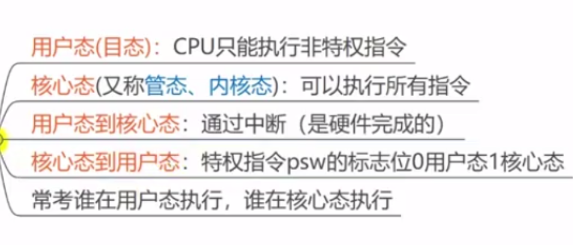
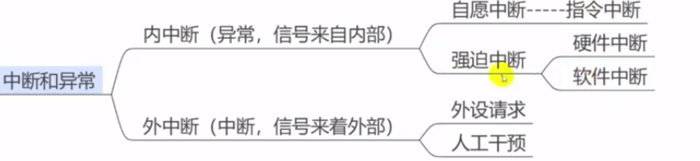
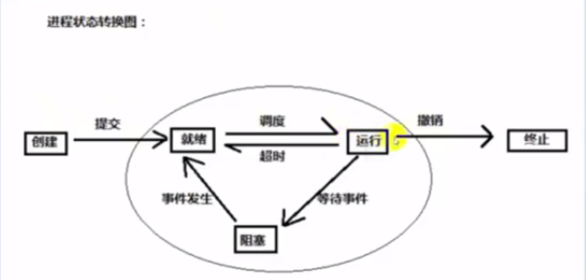

# 绪论

操作系统（Operating System，简称 OS）是管理计算机硬件与软件资源的程序，是计算机的基石。操作系统本质上是一个运行在计算机上的软件程序 ，主要用于管理计算机硬件和软件资源。 举例：运行在你电脑上的所有应用程序都通过操作系统来调用系统内存以及磁盘等等硬件

## 操作系统的功能

1. 进程和线程的管理：进程的创建、撤销、阻塞、唤醒，进程间的通信等。
2. 存储管理：内存的分配和管理、外存（磁盘等）的分配和管理等。
3. 文件管理：文件的读、写、创建及删除等。
4. 设备管理：完成设备（输入输出设备和外部存储设备等）的请求或释放，以及设备启动等功能。
5. 网络管理：操作系统负责管理计算机网络的使用。网络是计算机系统中连接不同计算机的方式，操作系统需要管理计算机网络的配置、连接、通信和安全等，以提供高效可靠的网络服务。
6. 安全管理：用户的身份认证、访问控制、文件加密等，以防止非法用户对系统资源的访问和操作。

## 不得不知道的概念

两种指令：

1. 特权指令：用户不能操作的，操作系统可以操作的
2. 普通指令： 一些运算操作
   两种程序
3. 内核程序： 系统的管理者，可执行一切指令、运行在核心态
4. 应用程序： 普通用户智能执行非特权指令，运行在用户态

处理机状态：

为什么要有用户态和内核态？只有一个内核态不行么？在 CPU 的所有指令中，有一些指令是比较危险的比如内存分配、设置时钟、IO 处理等，如果所有的程序都能使用这些指令的话，会对系统的正常运行造成灾难性地影响。因此，我们需要限制这些危险指令只能内核态运行。这些只能由操作系统内核态执行的指令也被叫做 特权指令 。
如果计算机系统中只有一个内核态，那么所有程序或进程都必须共享系统资源，例如内存、CPU、硬盘等，这将导致系统资源的竞争和冲突，从而影响系统性能和效率。并且，这样也会让系统的安全性降低，毕竟所有程序或进程都具有相同的特权级别和访问权限。因此，同时具有用户态和内核态主要是为了保证计算机系统的安全性、稳定性和性能。

原语:

什么是系统调用
我们运行的程序基本都是运行在用户态，如果我们调用操作系统提供的内核态级别的子功能咋办呢？那就需要系统调用了！也就是说在我们运行的用户程序中，凡是与系统态级别的资源有关的操作（如文件管理、进程控制、内存管理等)，都必须通过系统调用方式向操作系统提出服务请求，并由操作系统代为完成。

中断和异常:

体系结构：大内核和微内核

用户态切换到内核态的 3 种方式：

1. 系统调用（Trap）：用户态进程 主动 要求切换到内核态的一种方式，主要是为了使用内核态才能做的事情比如读取磁盘资源。系统调用的机制其核心还是使用了操作系统为用户特别开放的一个中断来实现。
2. 中断（Interrupt）：当外围设备完成用户请求的操作后，会向 CPU 发出相应的中断信号，这时 CPU 会暂停执行下一条即将要执行的指令转而去执行与中断信号对应的处理程序，如果先前执行的指令是用户态下的程序，那么这个转换的过程自然也就发生了由用户态到内核态的切换。比如硬盘读写操作完成，系统会切换到硬盘读写的中断处理程序中执行后续操作等。
3. 异常（Exception）：当 CPU 在执行运行在用户态下的程序时，发生了某些事先不可知的异常，这时会触发由当前运行进程切换到处理此异常的内核相关程序中，也就转到了内核态，比如缺页异常。在系统的处理上，中断和异常类似，都是通过中断向量表来找到相应的处理程序进行处理。区别在于，中断来自处理器外部，不是由任何一条专门的指令造成，而异常是执行当前指令的结果。

# 进程和线程

进程（Process） 是指计算机中正在运行的一个程序实例。举例：你打开的微信就是一个进程。
线程（Thread） 也被称为轻量级进程，更加轻量。多个线程可以在同一个进程中同时执行，并且共享进程的资源比如内存空间、文件句柄、网络连接等。举例：你打开的微信里就有一个线程专门用来拉取别人发你的最新的消息。

## 有了进程为什么还需要线程

为了更好的使用多道程序并发执行，提高资源。是程序执行的最小单元，调度的基本单元（不拥有系统的基本资源）

进程切换是一个开销很大的操作，线程切换的成本较低。
线程更轻量，一个进程可以创建多个线程。
多个线程可以并发处理不同的任务，更有效地利用了多处理器和多核计算机。而进程只能在一个时间干一件事，如果在执行过程中遇到阻塞问题比如 IO 阻塞就会挂起直到结果返回。
同一进程内的线程共享内存和文件，因此它们之间相互通信无须调用内核。

## 定义

PCB：保存进程运行期间相关的数据，是进程存在的唯一标志
程序段：能被进程调度到 cpu 的代码
数据段

## 进程的状态

1. 创建状态(new)：进程正在被创建，尚未到就绪状态。
2. 就绪状态(ready)：进程已处于准备运行状态，即进程获得了除了处理器之外的一切所需资源，一旦得到处理器资源(处理器分配的时间片)即可运行。
3. 运行状态(running)：进程正在处理器上运行(单核 CPU 下任意时刻只有一个进程处于运行状态)。
4. 阻塞状态(waiting)：又称为等待状态，进程正在等待某一事件而暂停运行如等待某资源为可用或等待 IO 操作完成。即使处理器空闲，该进程也不能运行。
5. 结束状态(terminated)：进程正在从系统中消失。可能是进程正常结束或其他原因中断退出运行。
   状态变化：
   

## 进程的调度算法

- 先到先服务调度算法(FCFS，First Come, First Served) : 从就绪队列中选择一个最先进入该队列的进程为之分配资源，使它立即执行并一直执行到完成或发生某事件而被阻塞放弃占用 CPU 时再重新调度。
- 短作业优先的调度算法(SJF，Shortest Job First) : 从就绪队列中选出一个估计运行时间最短的进程为之分配资源，使它立即执行并一直执行到完成或发生某事件而被阻塞放弃占用 CPU 时再重新调度。
- 时间片轮转调度算法（RR，Round-Robin） : 时间片轮转调度是一种最古老，最简单，最公平且使用最广的算法。每个进程被分配一个时间段，称作它的时间片，即该进程允许运行的时间。
- 多级反馈队列调度算法（MFQ，Multi-level Feedback Queue）：前面介绍的几种进程调度的算法都有一定的局限性。如短进程优先的调度算法，仅照顾了短进程而忽略了长进程 。多级反馈队列调度算法既能使高优先级的作业得到响应又能使短作业（进程）迅速完成，因而它是目前被公认的一种较好的进程调度算法，UNIX 操作系统采取的便是这种调度算法。
- 优先级调度算法（Priority）：为每个流程分配优先级，首先执行具有最高优先级的进程，依此类推。具有相同优先级的进程以 FCFS 方式执行。可以根据内存要求，时间要求或任何其他资源要求来确定优先级。

# 死锁

产生的原因：非剥夺资源的竞争和进程不恰当推进顺序。
定义：多个进程因竞争资源而造成的一种僵局，如果没有外力，这些进程将无法推进。

## 产生死锁的四个必要条件是什么?

- 互斥：资源必须处于非共享模式，即一次只有一个进程可以使用。如果另一进程申请该资源，那么必须等待直到该资源被释放为止。
- 占有并等待：一个进程至少应该占有一个资源，并等待另一资源，而该资源被其他进程所占有。
- 非抢占：资源不能被抢占。只能在持有资源的进程完成任务后，该资源才会被释放。
- 循环等待：有一组等待进程 {P0, P1,..., Pn}， P0 等待的资源被 P1 占有，P1 等待的资源被 P2 占有，……，Pn-1 等待的资源被 Pn 占有，Pn 等待的资源被 P0 占有。

## 解决死锁
