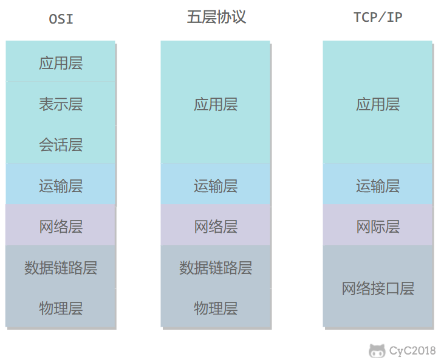
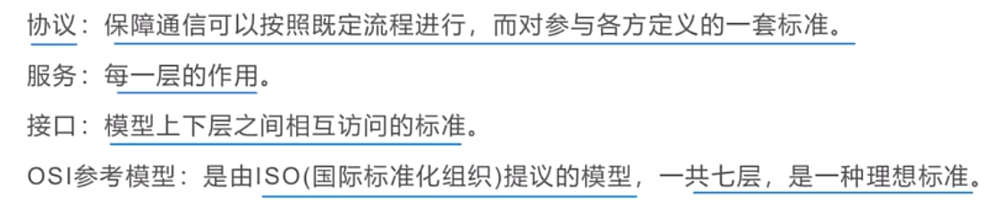
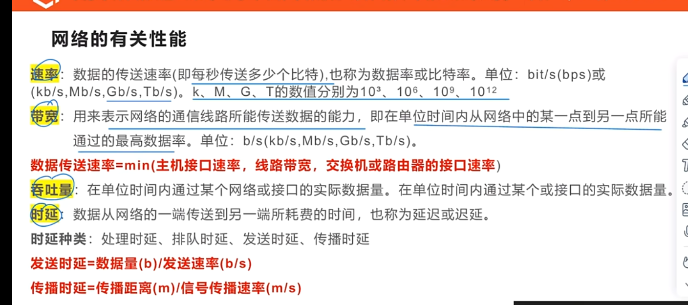
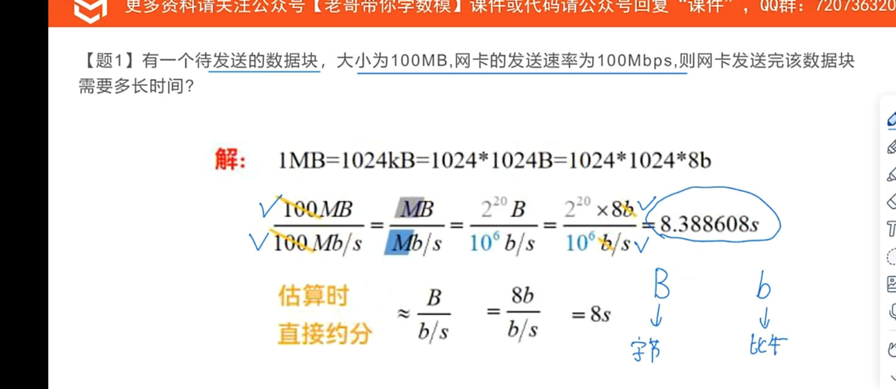
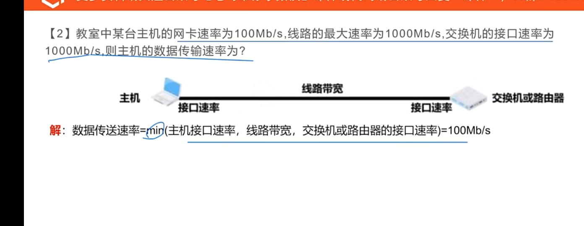
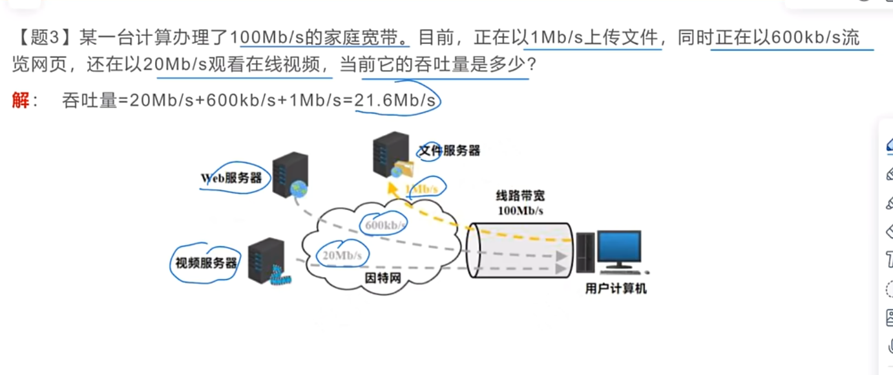
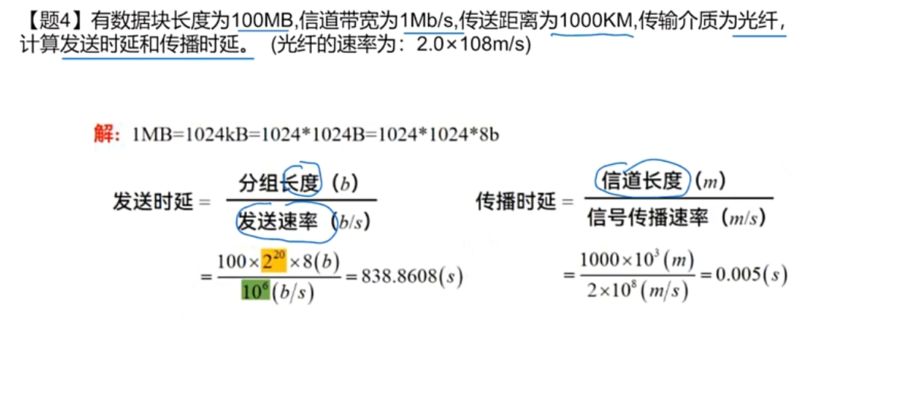

面试看小林 coding 计网

# 概述

## 电路交换和分组交换和（报文交换）

1. 电路交换
   电路交换用于电话通信系统，两个用户要通信之前需要建立一条专用的物理链路，并且在整个通信过程中始终占用该链路。由于通信的过程中不可能一直在使用传输线路，因此电路交换对线路的利用率很低，往往不到 10%。

2. 分组交换
   每个分组都有首部和尾部，包含了源地址和目的地址等控制信息，在同一个传输线路上同时传输多个分组互相不会影响，因此在同一条传输线路上允许同时传输多个分组，也就是说分组交换不需要占用传输线路。

在一个邮局通信系统中，邮局收到一份邮件之后，先存储下来，然后把相同目的地的邮件一起转发到下一个目的地，这个过程就是存储转发过程，分组交换也使用了存储转发过程。

## 时延

总时延 = 排队时延 + 处理时延 + 传输时延 + 传播时延

## 计算机体系

### 题目

### 五层协议

应用层 ：为特定应用程序提供数据传输服务，例如 HTTP、DNS 等协议。数据单位为报文。

传输层 ：为进程提供通用数据传输服务。由于应用层协议很多，定义通用的传输层协议就可以支持不断增多的应用层协议。运输层包括两种协议：传输控制协议 TCP，提供面向连接、可靠的数据传输服务，数据单位为报文段；用户数据报协议 UDP，提供无连接、尽最大努力的数据传输服务，数据单位为用户数据报。TCP 主要提供完整性服务，UDP 主要提供及时性服务。

网络层 ：为**主机**提供数据传输服务。而传输层协议是为**主机中的进程**提供数据传输服务。网络层把传输层传递下来的报文段或者用户数据报封装成分组。

数据链路层 ：网络层针对的还是主机之间的数据传输服务，而主机之间可以有很多链路，链路层协议就是为同一链路的主机提供数据传输服务。数据链路层把网络层传下来的分组封装成帧。

物理层 ：考虑的是怎样在传输媒体上传输数据比特流，而不是指具体的传输媒体。物理层的作用是尽可能屏蔽传输媒体和通信手段的差异，使数据链路层感觉不到这些差异。

### OSI

表示层 ：数据压缩、加密以及数据描述，这使得应用程序不必关心在各台主机中数据内部格式不同的问题。

会话层 ：建立及管理会话。

# 物理层

# 链路层

# 传输层

# 网络层

# 应用层
