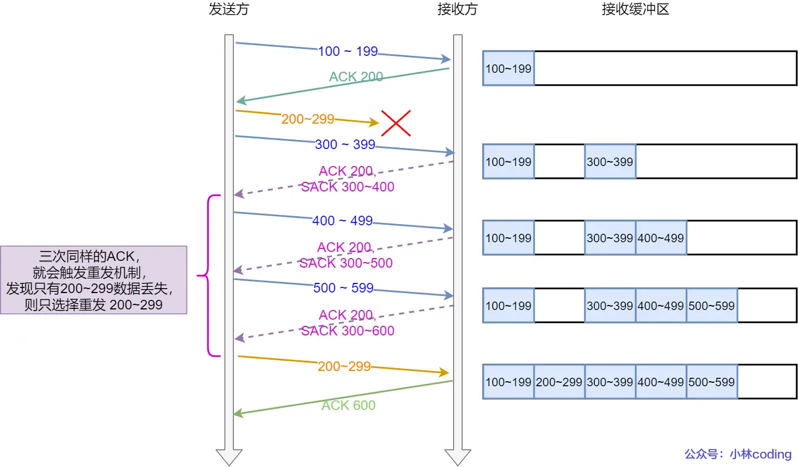
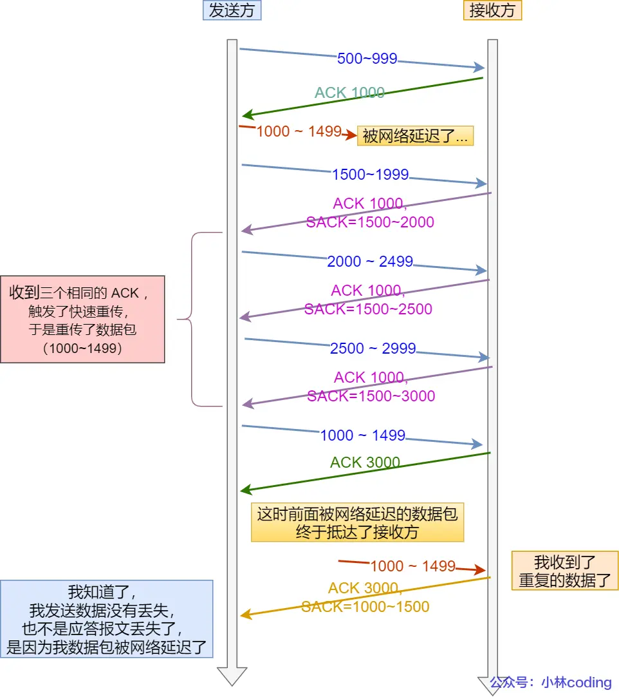

# 计网部分

## 数字签名用什么算法

（SHA256，任意内容转 256 位哈希值）

## 网络分层

1. 分层意义
   - 各层之间相互独立：各层之间相互独立，各层之间不需要关心其他层是如何实现的，只需要知道自己如何调用下层提供好的功能就可以了（可以简单理解为接口调用）。
   - 提高了灵活性和可替换性：每一层都可以使用最适合的技术来实现，你只需要保证你提供的功能以及暴露的接口的规则没有改变就行了。
   - 大问题化小：分层可以将复杂的网络问题分解为许多比较小的、界线比较清晰简单的小问题来处理和解决。
2. OSI 七层模型

   - 应用层
   - 表示层
   - 会话层
   - 传输层
   - 网络层
   - 数据链路层
   - 物理层

3. TCP/IP 四层模型
   - 应用层
   - 传输层
   - 网络层
   - 网络接口层
4. 五层模型
   - 应用层
   - 传输层
   - 网络层
   - 数据链路层
   - 物理层

<1>应用层
OSI 参考模型中最靠近用户的一层，是为计算机用户提供应用接口，也为用户直接提供各种网络服务。我们常见应用层的网络服务协议有：HTTP，HTTPS，FTP，POP3、SMTP 等。
实际公司 A 的老板就是我们所述的用户，而他要发送的商业报价单，就是应用层提供的一种网络服务，当然，老板也可以选择其他服务，比如说，发一份商业合同，发一份询价单，等等。
　　<2>表示层
表示层提供各种用于应用层数据的编码和转换功能,确保一个系统的应用层发送的数据能被另一个系统的应用层识别。如果必要，该层可提供一种标准表示形式，用于将计算机内部的多种数据格式转换成通信中采用的标准表示形式。数据压缩和加密也是表示层可提供的转换功能之一。
由于公司 A 和公司 B 是不同国家的公司，他们之间的商定统一用英语作为交流的语言，所以此时表示层（公司的文秘），就是将应用层的传递信息转翻译成英语。同时为了防止别的公司看到，公司 A 的人也会对这份报价单做一些加密的处理。这就是表示的作用，将应用层的数据转换翻译等。
　　<3>会话层
会话层就是负责建立、管理和终止表示层实体之间的通信会话。该层的通信由不同设备中的应用程序之间的服务请求和响应组成。  
 会话层的同事拿到表示层的同事转换后资料，（会话层的同事类似公司的外联部），会话层的同事那里可能会掌握本公司与其他好多公司的联系方式，这里公司就是实际传递过程中的实体。他们要管理本公司与外界好多公司的联系会话。当接收到表示层的数据后，会话层将会建立并记录本次会话，他首先要找到公司 B 的地址信息，然后将整份资料放进信封，并写上地址和联系方式。准备将资料寄出。等到确定公司 B 接收到此份报价单后，此次会话就算结束了，外联部的同事就会终止此次会话。
　　<4>传输层
传输层建立了主机端到端的链接，传输层的作用是为上层协议提供端到端的可靠和透明的数据传输服务，包括处理差错控制和流量控制等问题。该层向高层屏蔽了下层数据通信的细节，使高层用户看到的只是在两个传输实体间的一条主机到主机的、可由用户控制和设定的、可靠的数据通路。我们通常说的，TCP UDP 就是在这一层。端口号既是这里的“端”。
传输层就相当于公司中的负责快递邮件收发的人，公司自己的投递员，他们负责将上一层的要寄出的资料投递到快递公司或邮局。
　　<5>网络层
本层通过 IP 寻址来建立两个节点之间的连接，为源端的运输层送来的分组，选择合适的路由和交换节点，正确无误地按照地址传送给目的端的运输层。就是通常说的 IP 层。这一层就是我们经常说的 IP 协议层。IP 协议是 Internet 的基础。
网络层就相当于快递公司庞大的快递网络，全国不同的集散中心，比如说，从深圳发往北京的顺丰快递（陆运为例啊，空运好像直接就飞到北京了），首先要到顺丰的深圳集散中心，从深圳集散中心再送到武汉集散中心，从武汉集散中心再寄到北京顺义集散中心。这个每个集散中心，就相当于网络中的一个 IP 节点。
　　<6>数据链路层
将比特组合成字节,再将字节组合成帧,使用链路层地址 (以太网使用 MAC 地址)来访问介质,并进行差错检测。
数据链路层又分为 2 个子层：逻辑链路控制子层（LLC）和媒体访问控制子层（MAC）。

       MAC子层处理CSMA/CD算法、数据出错校验、成帧等；LLC子层定义了一些字段使上次协议能共享数据链路层。 在实际使用中，LLC子层并非必需的。

<7>物理层

        实际最终信号的传输是通过物理层实现的。通过物理介质传输比特流。规定了电平、速度和电缆针脚。常用设备有（各种物理设备）集线器、中继器、调制解调器、网线、双绞线、同轴电缆。这些都是物理层的传输介质。
         快递寄送过程中的交通工具，就相当于我们的物理层，例如汽车，火车，飞机，船。

5. 常见的协议
   应用层：DNS、HTTP、FTP、SMTP、SSH（Secure Shell Protocol，安全的网络传输协议）：基于 TCP 协议，通过加密和认证机制实现安全的访问和文件传输等业务
   网络层：IP：TCP/IP 协议中最重要的协议之一，属于网络层的协议，主要作用是定义数据包的格式、对数据包进行路由和寻址，以便它们可以跨网络传播并到达正确的目的地。目前 IP 协议主要分为两种，一种是过去的 IPv4，另一种是较新的 IPv6，目前这两种协议都在使用，但后者已经被提议来取代前者。、ARP：ARP 协议解决的是网络层地址和链路层地址之间的转换问题。因为一个 IP 数据报在物理上传输的过程中，总是需要知道下一跳（物理上的下一个目的地）该去往何处，但 IP 地址属于逻辑地址，而 MAC 地址才是物理地址，ARP 协议解决了 IP 地址转 MAC 地址的一些问题。ICMP（Internet Control Message Protocol，互联网控制报文协议）：一种用于传输网络状态和错误消息的协议，常用于网络诊断和故障排除。例如，Ping 工具就使用了 ICMP 协议来测试网络连通性,ICMP 主要的功能包括：确认 IP 包是否成功送达目标地址、报告发送过程中 IP 包被废弃的原因和改善网络设置等。在 IP 通信中如果某个 IP 包因为某种原因未能达到目标地址，那么这个具体的原因将由 ICMP 负责通知。

   传输层：TCP、UDP、

## 从输入 URL 到页面展示到底发生了什么？（非常重要）

（1）解析 URL：首先会对 URL 进行解析，分析所需要使用的传输协议和请求的资源的路径。如果输入的 URL 中的协议或者主机名不合法，将会把地址栏中输入的内容传递给搜索引擎。如果没有问题，浏览器会检查 URL 中是否出现了非法字符，如果存在非法字符，则对非法字符进行转义后再进行下一过程。
（2）缓存判断：浏览器会判断所请求的资源是否在缓存里，如果请求的资源在缓存里并且没有失效，那么就直接使用，否则向服务器发起新的请求。
（3）DNS 解析：下一步首先需要获取的是输入的 URL 中的域名的 IP 地址，首先会判断本地是否有该域名的 IP 地址的缓存，如果有则使用，如果没有则向本地 DNS 服务器发起请求。本地 DNS 服务器也会先检查是否存在缓存，如果没有就会先向根域名服务器发起请求，获得负责的顶级域名服务器的地址后，再向顶级域名服务器请求，然后获得负责的权威域名服务器的地址后，再向权威域名服务器发起请求，最终获得域名的 IP 地址后，本地 DNS 服务器再将这个 IP 地址返回给请求的用户。用户向本地 DNS 服务器发起请求属于递归请求，本地 DNS 服务器向各级域名服务器发起请求属于迭代请求。
（4）获取 MAC 地址：当浏览器得到 IP 地址后，数据传输还需要知道目的主机 MAC 地址，因为应用层下发数据给传输层，TCP 协议会指定源端口号和目的端口号，然后下发给网络层。网络层会将本机地址作为源地址，获取的 IP 地址作为目的地址。然后将下发给数据链路层，数据链路层的发送需要加入通信双方的 MAC 地址，本机的 MAC 地址作为源 MAC 地址，目的 MAC 地址需要分情况处理。
（5）TCP 三次握手：下面是 TCP 建立连接的三次握手的过程，首先客户端向服务器发送一个 SYN 连接请求报文段和一个随机序号，服务端接收到请求后向服务器端发送一个 SYN ACK 报文段，确认连接请求，并且也向客户端发送一个随机序号。客户端接收服务器的确认应答后，进入连接建立的状态，同时向服务器也发送一个 ACK 确认报文段，服务器端接收到确认后，也进入连接建立状态，此时双方的连接就建立起来了。
（6）HTTPS 握手：如果使用的是 HTTPS 协议，在通信前还存在 TLS 的一个四次握手的过程。首先由客户端向服务器端发送使用的协议的版本号、一个随机数和可以使用的加密方法。服务器端收到后，确认加密的方法，也向客户端发送一个随机数和自己的数字证书。客户端收到后，首先检查数字证书是否有效，如果有效，则再生成一个随机数，并使用证书中的公钥对随机数加密，然后发送给服务器端，并且还会提供一个前面所有内容的 hash 值供服务器端检验。服务器端接收后，使用自己的私钥对数据解密，同时向客户端发送一个前面所有内容的 hash 值供客户端检验。这个时候双方都有了三个随机数，按照之前所约定的加密方法，使用这三个随机数生成一把秘钥，以后双方通信前，就使用这个秘钥对数据进行加密后再传输。
（7）返回数据：当页面请求发送到服务器端后，服务器端会返回一个 html 文件作为响应，浏览器接收到响应后，开始对 html 文件进行解析，开始页面的渲染过程。
（8）页面渲染：浏览器首先会根据 html 文件构建 DOM 树，根据解析到的 css 文件构建 CSSOM 树，如果遇到 script 标签，则判端是否含有 defer 或者 async 属性，要不然 script 的加载和执行会造成页面的渲染的阻塞。当 DOM 树和 CSSOM 树建立好后，根据它们来构建渲染树。渲染树构建好后，会根据渲染树来进行布局。布局完成后，最后使用浏览器的 UI 接口对页面进行绘制。这个时候整个页面就显示出来了。
（9）TCP 四次挥手：最后一步是 TCP 断开连接的四次挥手过程。若客户端认为数据发送完成，则它需要向服务端发送连接释放请求。服务端收到连接释放请求后，会告诉应用层要释放 TCP 链接。然后会发送 ACK 包，并进入 CLOSE_WAIT 状态，此时表明客户端到服务端的连接已经释放，不再接收客户端发的数据了。但是因为 TCP 连接是双向的，所以服务端仍旧可以发送数据给客户端。服务端如果此时还有没发完的数据会继续发送，完毕后会向客户端发送连接释放请求，然后服务端便进入 LAST-ACK 状态。客户端收到释放请求后，向服务端发送确认应答，此时客户端进入 TIME-WAIT 状态。该状态会持续 2MSL（最大段生存期，指报文段在网络中生存的时间，超时会被抛弃） 时间，若该时间段内没有服务端的重发请求的话，就进入 CLOSED 状态。当服务端收到确认应答后，也便进入 CLOSED 状态。

## http

### http 状态码

（1）2XX 成功
● 200 OK，表示从客户端发来的请求在服务器端被正确处理
● 204 No content，表示请求成功，但响应报文不含实体的主体部分
● 205 Reset Content，表示请求成功，但响应报文不含实体的主体部分，但是与 204 响应不同在于要求请求方重置内容
● 206 Partial Content，进行范围请求
（2）3XX 重定向
● 301 moved permanently，永久性重定向，表示资源已被分配了新的 URL
● 302 found，临时性重定向，表示资源临时被分配了新的 URL
● 303 see other，表示资源存在着另一个 URL，应使用 GET 方法获取资源
● 304 not modified，表示服务器允许访问资源，但因发生请求未满足条件的情况
● 307 temporary redirect，临时重定向，和 302 含义类似，但是期望客户端保持请求方法不变向新的地址发出请求
（3）4XX 客户端错误
● 400 bad request，请求报文存在语法错误
● 401 unauthorized，表示发送的请求需要有通过 HTTP 认证的认证信息
● 403 forbidden，表示对请求资源的访问被服务器拒绝
● 404 not found，表示在服务器上没有找到请求的资源
（4）5XX 服务器错误
● 500 internal sever error，表示服务器端在执行请求时发生了错误
● 502 bad gateway，表示作为网关或者代理工作的服务器尝试执行请求时，从上游服务器接收到无效的响应
● 503 service unavailable，表明服务器暂时处于超负载或正在停机维护，无法处理请求
504 gateway timeout，表示网关或者代理的服务器，未及时从上游服务器获取请求

### 常见的请求头和响应头

HTTP Request Header 常见的请求头：
● Accept:浏览器能够处理的内容类型
● Accept-Charset:浏览器能够显示的字符集
● Accept-Encoding：浏览器能够处理的压缩编码
● Accept-Language：浏览器当前设置的语言
● Connection：浏览器与服务器之间连接的类型
● Cookie：当前页面设置的任何 Cookie
● Host：发出请求的页面所在的域
● Referer：发出请求的页面的 URL
● User-Agent：浏览器的用户代理字符串

HTTP Responses Header 常见的响应头：
● Date：表示消息发送的时间，时间的描述格式由 rfc822 定义
● server:服务器名称
● Connection：浏览器与服务器之间连接的类型
● Cache-Control：控制 HTTP 缓存
● content-type:表示后面的文档属于什么 MIME 类型

常见的 Content-Type 属性值有以下四种：
（1）application/x-www-form-urlencoded：浏览器的原生 form 表单，如果不设置 enctype 属性，那么最终就会以 application/x-www-form-urlencoded 方式提交数据。该种方式提交的数据放在 body 里面，数据按照 key1=val1&key2=val2 的方式进行编码，key 和 val 都进行了 URL 转码。
（2）multipart/form-data：该种方式也是一个常见的 POST 提交方式，通常表单上传文件时使用该种方式。
（3）application/json：服务器消息主体是序列化后的 JSON 字符串。
（4）text/xml：该种方式主要用来提交 XML 格式的数据。

### http 和 https 区别

- HTTP 是超文本传输协议，信息是明文传输，存在安全风险的问题。HTTPS 则解决 HTTP 不安全的缺陷，在 TCP 和 HTTP 网络层之间加入了 SSL/TLS 安全协议，使得报文能够加密传输。

- HTTP 连接建立相对简单， TCP 三次握手之后便可进行 HTTP 的报文传输。而 HTTPS 在 TCP 三次握手之后，还需进行 SSL/TLS 的握手过程，才可进入加密报文传输。所有传输的内容都经过加密，加密采用对称加密，但对称加密的密钥用服务器方的证书进行了非对称加密。所以说，HTTP 安全性没有 HTTPS 高，但是 HTTPS 比 HTTP 耗费更多服务器资源。

- 两者的默认端口不一样，HTTP 默认端口号是 80，HTTPS 默认端口号是 443。

- HTTPS 协议需要向 CA（证书权威机构）申请数字证书，来保证服务器的身份是可信的。

### https 解决了 http 哪些问题?

- 窃听风险，比如通信链路上可以获取通信内容，用户号容易没。
- 篡改风险，比如强制植入垃圾广告，视觉污染，用户眼容易瞎。
- 冒充风险，比如冒充淘宝网站，用户钱容易没。

HTTPS 在 HTTP 与 TCP 层之间加入了 SSL/TLS 协议，可以很好的解决了上述的风险：

- 信息加密：交互信息无法被窃取，但你的号会因为「自身忘记」账号而没。
- 校验机制：无法篡改通信内容，篡改了就不能正常显示，但百度「竞价排名」依然可以搜索垃圾广告。
- 身份证书：证明淘宝是真的淘宝网，但你的钱还是会因为「剁手」而没。

HTTPS 是如何解决上面的三个风险的？

- 混合加密的方式实现信息的机密性，解决了窃听的风险。
- 摘要算法的方式来实现完整性，它能够为数据生成独一无二的「指纹」，指纹用于校验数据的完整性，解决了篡改的风险。
- 将服务器公钥放入到数字证书中，解决了冒充的风险。

### https 的算法

https://xiaolincoding.com/network/2_http/http_interview.html#https-%E8%A7%A3%E5%86%B3%E4%BA%86-http-%E7%9A%84%E5%93%AA%E4%BA%9B%E9%97%AE%E9%A2%98

### https 的握手过程

1. 客户端向服务器发起请求，请求中包含使用的协议版本号、生成的一个随机数、以及客户端支持的加密方法。
2. 服务器端接收到请求后，确认双方使用的加密方法、并给出服务器的证书、以及一个服务器生成的随机数。
3. 客户端确认服务器证书有效后，生成一个新的随机数，并使用数字证书中的公钥，加密这个随机数，然后发给服 务器。并且还会提供一个前面所有内容的 hash 的值，用来供服务器检验。
4. 服务器使用自己的私钥，来解密客户端发送过来的随机数。并提供前面所有内容的 hash 值来供客户端检验。
5. 客户端和服务器端根据约定的加密方法使用前面的三个随机数，生成对话秘钥，以后的对话过程都使用这个秘钥来加密信息。

### https 一定可靠吗

https://xiaolincoding.com/network/2_http/http_interview.html#https-%E4%B8%80%E5%AE%9A%E5%AE%89%E5%85%A8%E5%8F%AF%E9%9D%A0%E5%90%97

### http1.0 和 http1.1 的区别

HTTP/1.1 相比 HTTP/1.0 提高了什么性能？
HTTP/1.1 相比 HTTP/1.0 性能上的改进：

- 使用长连接的方式改善了 HTTP/1.0 短连接造成的性能开销。
- 支持管道（pipeline）网络传输，只要第一个请求发出去了，不必等其回来，就可以发第二个请求出去，可以减少整体的响应时间。
- 缓存机制 : 在 HTTP/1.0 中主要使用 Header 里的 If-Modified-Since,Expires 来做为缓存判断的标准，HTTP/1.1 则引入了更多的缓存控制策略例如 Entity tag，If-Unmodified-Since, If-Match, If-None-Match 等更多可供选择的缓存头来控制缓存策略。
- 带宽：HTTP/1.0 中，存在一些浪费带宽的现象，例如客户端只是需要某个对象的一部分，而服务器却将整个对象送过来了，并且不支持断点续传功能，HTTP/1.1 则在请求头引入了 range 头域，它允许只请求资源的某个部分，即返回码是 206（Partial Content），这样就方便了开发者自由的选择以便于充分利用带宽和连接。

但 HTTP/1.1 还是有性能瓶颈：

- 请求 / 响应头部（Header）未经压缩就发送，首部信息越多延迟越大。只能压缩 Body 的部分；
- 发送冗长的首部。每次互相发送相同的首部造成的浪费较多；
- 服务器是按请求的顺序响应的，如果服务器响应慢，会招致客户端一直请求不到数据，也就是队头阻塞；
- 没有请求优先级控制；
- 请求只能从客户端开始，服务器只能被动响应。

### http2.0 和 http1.1 的区别

- 头部压缩：HTTP/1.1 支持 Body 压缩，Header 不支持压缩。HTTP/2.0 支持对 Header 压缩，使用了专门为 Header 压缩而设计的 HPACK 算法，减少了网络开销。
- 二进制分帧： 使用二进制帧进行数据传输，而 HTTP/1.1 则使用文本格式的报文。二进制帧更加紧凑和高效，减少了传输的数据量和带宽消耗。
- 多路复用：HTTP/2.0 在同一连接上可以同时传输多个请求和响应（可以看作是 HTTP/1.1 中长链接的升级版本），互不干扰。HTTP/1.1 则使用串行方式，每个请求和响应都需要独立的连接，而浏览器为了控制资源会有 6-8 个 TCP 连接的限制。。这使得 HTTP/2.0 在处理多个请求时更加高效，减少了网络延迟和提高了性能。
- 服务器推送：HTTP/2.0 支持服务器推送，可以在客户端请求一个资源时，将其他相关资源一并推送给客户端，从而减少了客户端的请求次数和延迟。而 HTTP/1.1 需要客户端自己发送请求来获取相关资源。

### http2.0 和 http3.0 区别

前面我们知道了 HTTP/1.1 和 HTTP/2 都有队头阻塞的问题：

HTTP/1.1 中的管道（ pipeline）虽然解决了请求的队头阻塞，但是没有解决响应的队头阻塞，因为服务端需要按顺序响应收到的请求，如果服务端处理某个请求消耗的时间比较长，那么只能等响应完这个请求后， 才能处理下一个请求，这属于 HTTP 层队头阻塞。
HTTP/2 虽然通过多个请求复用一个 TCP 连接解决了 HTTP 的队头阻塞 ，但是一旦发生丢包，就会阻塞住所有的 HTTP 请求，这属于 TCP 层队头阻塞。
HTTP/2 队头阻塞的问题是因为 TCP，所以 HTTP/3 把 HTTP 下层的 TCP 协议改成了 UDP！

UDP 发送是不管顺序，也不管丢包的，所以不会出现像 HTTP/2 队头阻塞的问题。大家都知道 UDP 是不可靠传输的，但基于 UDP 的 QUIC 协议 可以实现类似 TCP 的可靠性传输。

QUIC 有以下 3 个特点。

无队头阻塞
更快的连接建立
连接迁移

1、无队头阻塞

QUIC 协议也有类似 HTTP/2 Stream 与多路复用的概念，也是可以在同一条连接上并发传输多个 Stream，Stream 可以认为就是一条 HTTP 请求。

QUIC 有自己的一套机制可以保证传输的可靠性的。当某个流发生丢包时，只会阻塞这个流，其他流不会受到影响，因此不存在队头阻塞问题。这与 HTTP/2 不同，HTTP/2 只要某个流中的数据包丢失了，其他流也会因此受影响。

所以，QUIC 连接上的多个 Stream 之间并没有依赖，都是独立的，某个流发生丢包了，只会影响该流，其他流不受影响。
2、连接迁移
连接迁移：HTTP/3.0 支持连接迁移，因为 QUIC 使用 64 位 ID 标识连接，只要 ID 不变就不会中断，网络环境改变时（如从 Wi-Fi 切换到移动数据）也能保持连接。而 TCP 连接是由（源 IP，源端口，目的 IP，目的端口）组成，这个四元组中一旦有一项值发生改变，这个连接也就不能用了。

3. 更快的连接
   但是 HTTP/3 的 QUIC 协议并不是与 TLS 分层，而是 QUIC 内部包含了 TLS，它在自己的帧会携带 TLS 里的“记录”，再加上 QUIC 使用的是 TLS 1.3，因此仅需 1 个 RTT 就可以「同时」完成建立连接与密钥协商，甚至在第二次连接的时候，应用数据包可以和 QUIC 握手信息（连接信息 + TLS 信息）一起发送，达到 0-RTT 的效果。

## TCP 和 UDP

### TCP 三次握手和四次挥手

三次握手:
刚开始客户端处于 Closed 的状态，服务端处于 Listen 状态。
● 第一次握手：客户端给服务端发一个 SYN 报文，并指明客户端的初始化序列号 ISN，此时客户端处于 SYN_SEND 状态。
首部的同步位 SYN=1，初始序号 seq=x，SYN=1 的报文段不能携带数据，但要消耗掉一个序号。
● 第二次握手：服务器收到客户端的 SYN 报文之后，会以自己的 SYN 报文作为应答，并且也是指定了自己的初始化序列号 ISN。同时会把客户端的 ISN + 1 作为 ACK 的值，表示自己已经收到了客户端的 SYN，此时服务器处于 SYN_REVD 的状态。
在确认报文段中 SYN=1，ACK=1，确认号 ack=x+1，初始序号 seq=y
● 第三次握手：客户端收到 SYN 报文之后，会发送一个 ACK 报文，当然，也是一样把服务器的 ISN + 1 作为 ACK 的值，表示已经收到了服务端的 SYN 报文，此时客户端处于 ESTABLISHED 状态。服务器收到 ACK 报文之后，也处于 ESTABLISHED 状态，此时，双方已建立起了连接。
确认报文段 ACK=1，确认号 ack=y+1，序号 seq=x+1（初始为 seq=x，第二个报文段所以要+1），ACK 报文段可以携带数据，不携带数据则不消耗序号。

四次挥手:
● 第一次挥手： 客户端会发送一个 FIN 报文，报文中会指定一个序列号。此时客户端处于 FIN_WAIT1 状态。
即发出连接释放报文段（FIN=1，序号 seq=u），并停止再发送数据，主动关闭 TCP 连接，进入 FIN_WAIT1（终止等待 1）状态，等待服务端的确认。
● 第二次挥手：服务端收到 FIN 之后，会发送 ACK 报文，且把客户端的序列号值 +1 作为 ACK 报文的序列号值，表明已经收到客户端的报文了，此时服务端处于 CLOSE_WAIT 状态。
即服务端收到连接释放报文段后即发出确认报文段（ACK=1，确认号 ack=u+1，序号 seq=v），服务端进入 CLOSE_WAIT（关闭等待）状态，此时的 TCP 处于半关闭状态，客户端到服务端的连接释放。客户端收到服务端的确认后，进入 FIN_WAIT2（终止等待 2）状态，等待服务端发出的连接释放报文段。
● 第三次挥手：如果服务端也想断开连接了，和客户端的第一次挥手一样，发给 FIN 报文，且指定一个序列号。此时服务端处于 LAST_ACK 的状态。
即服务端没有要向客户端发出的数据，服务端发出连接释放报文段（FIN=1，ACK=1，序号 seq=w，确认号 ack=u+1），服务端进入 LAST_ACK（最后确认）状态，等待客户端的确认。
● 第四次挥手：客户端收到 FIN 之后，一样发送一个 ACK 报文作为应答，且把服务端的序列号值 +1 作为自己 ACK 报文的序列号值，此时客户端处于 TIME_WAIT 状态。需要过一阵子以确保服务端收到自己的 ACK 报文之后才会进入 CLOSED 状态，服务端收到 ACK 报文之后，就处于关闭连接了，处于 CLOSED 状态。
即客户端收到服务端的连接释放报文段后，对此发出确认报文段（ACK=1，seq=u+1，ack=w+1），客户端进入 TIME_WAIT（时间等待）状态。此时 TCP 未释放掉，需要经过时间等待计时器设置的时间 2MSL 后，客户端才进入 CLOSED 状态。

### TCP 和 UDP 可以使用同一个端口吗

可以

IP
我们先具体看下网络层。在 IP 网路层，发送者向接收者传输数据的时候，首先需要知道接收者的 IP 地址，IP 地址可以在网络中唯一标识一台计算机，然后数据就可以根据 IP 协议抵达接收者所在的计算机，但是接收者所在的计算机上运行了几十个程序，计算机应该把这个数据交给哪个程序呢？

端口号
这就像快递员到达了一栋大楼，下一步它怎么把快递送到对应的用户手中呢？聪明的你一定想到了，那就是门牌号。

在计算机中，端口号就是门牌号。计算机的操作系统可以为不同的程序绑定不同的端口号，这样发送者发送数据时不仅要设置接收者的 IP，还要加上接收者的端口号，如此接收者所在的计算机就能把数据转发给正确的程序了。

TCP/UDP
那么 TCP 和 UDP 能不能使用同一个端口号呢？其实在查找端口号之前还有一个传输层协议的处理过程，操作系统收到数据后，会先查看数据包使用的是 TCP 协议还是 UDP 协议，然后再根据协议进行不同的解析处理，提取到数据后，再转发到拥有对应端口的程序。

所以 TCP 和 UDP 是可以使用相同的端口号的，这在现实中也是常见的。比如 DNS（域名系统）可能需要同时支持 TCP 和 UDP 查询，这两种查询就都可以通过 53 这个标准端口来进行接收和响应。

但是在同一个传输协议下，端口号就不能相同了。如果相同，操作系统的协议栈就不知道该把这个数据包转给哪个程序了，这种设计会增加很多麻烦。

有的同学可能会观察到一个现象，那就是同一个计算机上的多个网站可以共享 80 或者 443 端口，这其实是应用层的能力，这些网站都寄宿在同一个 Web 服务器程序上，这个 Web 服务器程序绑定了 80 端口，Web 服务器收到数据后再根据 HTTP 协议中的主机头（可以理解成域名）转发给不同的网站程序。

还有，如果你的电脑上有多个 IP，那就更没有问题了。不同的 IP 代表不同的网络接口，即使都使用 TCP 协议，只要 IP 不同，端口号一样也完全不会冲突。

“IP+传输层协议+端口号”就是我们常说的套接字，它能确保数据从一个网络程序传递到另一个网络程序。大家如果直接使用 TCP 和 UDP 编程，就需要手动为套接字设置这几个参数。


### 为什么是三次握手？不是两次、四次？

1. TCP 使用三次握手建立连接的最主要原因是防止「历史连接」初始化了连接。
   
   
   你想想，在两次握手的情况下，服务端在收到 SYN 报文后，就进入 ESTABLISHED 状态，意味着这时可以给对方发送数据，但是客户端此时还没有进入 ESTABLISHED 状态，假设这次是历史连接，客户端判断到此次连接为历史连接，那么就会回 RST 报文来断开连接，而服务端在第一次握手的时候就进入 ESTABLISHED 状态，所以它可以发送数据的，但是它并不知道这个是历史连接，它只有在收到 RST 报文后，才会断开连接。

有人问：客户端发送三次握手（ack 报文）后就可以发送数据了，而被动方此时还是 syn_received 状态，如果 ack 丢了，那客户端发的数据是不是也白白浪费了？

不是的，即使服务端还是在 syn_received 状态，收到了客户端发送的数据，还是可以建立连接的，并且还可以正常收到这个数据包。这是因为数据报文中是有 ack 标识位，也有确认号，这个确认号就是确认收到了第二次握手。

原因二：同步双方初始序列号

TCP 协议的通信双方， 都必须维护一个「序列号」， 序列号是可靠传输的一个关键因素，它的作用：

- 接收方可以去除重复的数据；
- 接收方可以根据数据包的序列号按序接收；
- 可以标识发送出去的数据包中， 哪些是已经被对方收到的（通过 ACK 报文中的序列号知道）；

原因三：避免资源浪费

如果只有「两次握手」，当客户端发生的 SYN 报文在网络中阻塞，客户端没有接收到 ACK 报文，就会重新发送 SYN ，由于没有第三次握手，服务端不清楚客户端是否收到了自己回复的 ACK 报文，所以服务端每收到一个 SYN 就只能先主动建立一个连接，这会造成什么情况呢？

如果客户端发送的 SYN 报文在网络中阻塞了，重复发送多次 SYN 报文，那么服务端在收到请求后就会建立多个冗余的无效链接，造成不必要的资源浪费。

「两次握手」：无法防止历史连接的建立，会造成双方资源的浪费，也无法可靠的同步双方序列号；
「四次握手」：三次握手就已经理论上最少可靠连接建立，所以不需要使用更多的通信次数

### 为什么挥手需要四次？

关闭连接时，客户端向服务端发送 FIN 时，仅仅表示客户端不再发送数据了但是还能接收数据。
服务端收到客户端的 FIN 报文时，先回一个 ACK 应答报文，而服务端可能还有数据需要处理和发送，等服务端不再发送数据时，才发送 FIN 报文给客户端来表示同意现在关闭连接。
从上面过程可知，服务端通常需要等待完成数据的发送和处理，所以服务端的 ACK 和 FIN 一般都会分开发送，因此是需要四次挥手。

最后一次挥手中，客户端会等待一段时间再关闭的原因，是为了防止发送给服务器的确认报文段丢失或者出错，从而导致服务器 端不能正常关闭。

### 为什么不能把服务端发送的 ACK 和 FIN 合并起来，变成三次挥手？

因为服务端收到客户端断开连接的请求时，可能还有一些数据没有发完，这时先回复 ACK，表示接收到了断开连接的请求。等到数据发完之后再发 FIN，断开服务端到客户端的数据传送。

### 为什么第四次挥手客户端需要等待 2\*MSL（报文段最长寿命）时间后才进入 CLOSED 状态？

第四次挥手时，客户端发送给服务端的 ACK 有可能丢失，如果服务端因为某些原因而没有收到 ACK 的话，服务端就会重发 FIN，如果客户端在 2\*MSL 的时间内收到了 FIN，就会重新发送 ACK 并再次等待 2MSL，防止 Server 没有收到 ACK 而不断重发 FIN。MSL(Maximum Segment Lifetime) : 一个片段在网络中最大的存活时间，2MSL 就是一个发送和一个回复所需的最大时间。如果直到 2MSL，Client 都没有再次收到 FIN，那么 Client 推断 ACK 已经被成功接收，则结束 TCP 连接。

### TCP


#### 超时重传

由于 TCP 的下层网络（网络层）可能出现丢失、重复或失序的情况，TCP 协议提供可靠数据传输服务。为保证数据传输的正确性，TCP 会重传其认为已丢失（包括报文中的比特错误）的包。TCP 使用两套独立的机制来完成重传，一是基于时间，二是基于确认信息。

TCP 在发送一个数据之后，就开启一个定时器，若是在这个时间内没有收到发送数据的 ACK 确认报文，则对该报文进行重传，在达到一定次数还没有成功时放弃并发送一个复位信号。

#### 快速重传

快速重传机制，不以时间作为衡量标准，而是通过收到失序的报文段，来判断是否需要重传。


#### 选择性重传

这种方式需要在 TCP 头部「选项」字段里加一个 SACK 的东西，它可以将已收到的数据的信息发送给「发送方」，这样发送方就可以知道哪些数据收到了，哪些数据没收到，知道了这些信息，就可以只重传丢失的数据。

如下图，发送方收到了三次同样的 ACK 确认报文，于是就会触发快速重发机制，通过 SACK 信息发现只有 200~299 这段数据丢失，则重发时，就只选择了这个 TCP 段进行重复。


#### 重复确认

使用了 SACK 来告诉「发送方」有哪些数据被重复接收了。



### 滑动窗口

滑动窗口是 TCP 实现流量控制（TCP 连接的双方主机要防止对方发送得过快而使自己来不及接收）的一种措施，窗口大小即决定了在收到对方确认之前可以发送多少个字节的数据。

我们都知道 TCP 是每发送一个数据，都要进行一次确认应答。当上一个数据包收到了应答了， 再发送下一个。
所以，这样的传输方式有一个缺点：数据包的往返时间越长，通信的效率就越低。

为解决这个问题，TCP 引入了窗口这个概念。即使在往返时间较长的情况下，它也不会降低网络通信的效率。

那么有了窗口，就可以指定窗口大小，窗口大小就是指无需等待确认应答，而可以继续发送数据的最大值。


### 拥塞控制

一般来说，计算机网络都处在一个共享的环境。因此也有可能会因为其他主机之间的通信使得网络拥堵。

在网络出现拥堵时，如果继续发送大量数据包，可能会导致数据包时延、丢失等，这时 TCP 就会重传数据，但是一重传就会导致网络的负担更重，于是会导致更大的延迟以及更多的丢包，这个情况就会进入恶性循环被不断地放大....

所以，TCP 不能忽略网络上发生的事，它被设计成一个无私的协议，当网络发送拥塞时，TCP 会自我牺牲，降低发送的数据量。

于是，就有了拥塞控制，控制的目的就是避免「发送方」的数据填满整个网络。

为了在「发送方」调节所要发送数据的量，定义了一个叫做「拥塞窗口」的概念。

拥塞控制主要是四个算法：

慢启动
拥塞避免
拥塞发生
快速恢复


很多人问题，快速恢复算法过程中，为什么收到新的数据后，cwnd 设置回了 ssthresh ？

我在评论区看到@muum641651 (opens new window)回答的不错，这里贴出来给大家。

我的理解是：

在快速恢复的过程中，首先 ssthresh = cwnd/2，然后 cwnd = ssthresh + 3，表示网络可能出现了阻塞，所以需要减小 cwnd 以避免，加 3 代表快速重传时已经确认接收到了 3 个重复的数据包；
随后继续重传丢失的数据包，如果再收到重复的 ACK，那么 cwnd 增加 1。加 1 代表每个收到的重复的 ACK 包，都已经离开了网络。这个过程的目的是尽快将丢失的数据包发给目标。
如果收到新数据的 ACK 后，把 cwnd 设置为第一步中的 ssthresh 的值，恢复过程结束。
首先，快速恢复是拥塞发生后慢启动的优化，其首要目的仍然是降低 cwnd 来减缓拥塞，所以必然会出现 cwnd 从大到小的改变。

其次，过程 2（cwnd 逐渐加 1）的存在是为了尽快将丢失的数据包发给目标，从而解决拥塞的根本问题（三次相同的 ACK 导致的快速重传），所以这一过程中 cwnd 反而是逐渐增大的。

### 流量控制

发送方不能无脑的发数据给接收方，要考虑接收方处理能力。

如果一直无脑的发数据给对方，但对方处理不过来，那么就会导致触发重发机制，从而导致网络流量的无端的浪费。

为了解决这种现象发生，TCP 提供一种机制可以让「发送方」根据「接收方」的实际接收能力控制发送的数据量，这就是所谓的流量控制。


### 可靠传输

自动重传请求（Automatic Repeat-reQuest，ARQ）是 OSI 模型中数据链路层和传输层的错误纠正协议之一。它通过使用确认和超时这两个机制，在不可靠服务的基础上实现可靠的信息传输。如果发送方在发送后一段时间之内没有收到确认信息（Acknowledgements，就是我们常说的 ACK），它通常会重新发送，直到收到确认或者重试超过一定的次数。

ARQ 包括停止等待 ARQ 协议和连续 ARQ 协议。

停止等待 ARQ 协议
停止等待协议是为了实现可靠传输的，它的基本原理就是每发完一个分组就停止发送，等待对方确认（回复 ACK）。如果过了一段时间（超时时间后），还是没有收到 ACK 确认，说明没有发送成功，需要重新发送，直到收到确认后再发下一个分组；

在停止等待协议中，若接收方收到重复分组，就丢弃该分组，但同时还要发送确认。

1. 无差错情况:

发送方发送分组,接收方在规定时间内收到,并且回复确认.发送方再次发送。

2. 出现差错情况（超时重传）:

停止等待协议中超时重传是指只要超过一段时间仍然没有收到确认，就重传前面发送过的分组（认为刚才发送过的分组丢失了）。因此每发送完一个分组需要设置一个超时计时器，其重传时间应比数据在分组传输的平均往返时间更长一些。这种自动重传方式常称为 自动重传请求 ARQ 。另外在停止等待协议中若收到重复分组，就丢弃该分组，但同时还要发送确认。

3. 确认丢失和确认迟到

确认丢失：确认消息在传输过程丢失。当 A 发送 M1 消息，B 收到后，B 向 A 发送了一个 M1 确认消息，但却在传输过程中丢失。而 A 并不知道，在超时计时过后，A 重传 M1 消息，B 再次收到该消息后采取以下两点措施：1. 丢弃这个重复的 M1 消息，不向上层交付。 2. 向 A 发送确认消息。（不会认为已经发送过了，就不再发送。A 能重传，就证明 B 的确认消息丢失）。
确认迟到：确认消息在传输过程中迟到。A 发送 M1 消息，B 收到并发送确认。在超时时间内没有收到确认消息，A 重传 M1 消息，B 仍然收到并继续发送确认消息（B 收到了 2 份 M1）。此时 A 收到了 B 第二次发送的确认消息。接着发送其他数据。过了一会，A 收到了 B 第一次发送的对 M1 的确认消息（A 也收到了 2 份确认消息）。处理如下：1. A 收到重复的确认后，直接丢弃。2. B 收到重复的 M1 后，也直接丢弃重复的 M1。
连续 ARQ 协议
连续 ARQ 协议可提高信道利用率。发送方维持一个发送窗口，凡位于发送窗口内的分组可以连续发送出去，而不需要等待对方确认。接收方一般采用累计确认，对按序到达的最后一个分组发送确认，表明到这个分组为止的所有分组都已经正确收到了。

优点： 信道利用率高，容易实现，即使确认丢失，也不必重传。
缺点： 不能向发送方反映出接收方已经正确收到的所有分组的信息。 比如：发送方发送了 5 条 消息，中间第三条丢失（3 号），这时接收方只能对前两个发送确认。发送方无法知道后三个分组的下落，而只好把后三个全部重传一次。这也叫 Go-Back-N（回退 N），表示需要退回来重传已经发送过的 N 个消息。

# 数据结构和算法

存储：顺序存储和链式存储

## 时间复杂度

算法各个语句执行时间的和

## 空间复杂度

分析辅助变量所占的额外空间（常量为 1），算法执行所需要的临时空间不会随着变量 n 的大小而变化，则算法的空间复杂度为 O(1)

## 线性数据结构

### 数组 vs 链表

- 数组支持随机访问，而链表不支持。
- 数组使用的是连续内存空间对 CPU 的缓存机制友好，链表则相反。
- 数组的大小固定，而链表则天然支持动态扩容。如果声明的数组过小，需要另外申请一个更大的内存空间存放数组元素，然后将原数组拷贝进去，这个操作是比较耗时的！

存储方式：

数组：数组是在内存中连续存储的元素，所有的元素都被保存在一个固定大小的内存块中。
链表：链表中的元素被称为节点，每个节点包含数据和一个指向下一个节点的指针。链表的节点可以分散存储在内存的不同位置。
内存分配：

数组：数组的大小在创建时需要指定，并且大小是固定的。一旦分配内存，就无法改变大小。
链表：链表的节点是在需要时动态分配内存，可以灵活地增加或删除元素，不需要事先知道大小。
访问方式：

数组：数组支持通过索引直接访问元素（O(1) 时间复杂度），访问速度非常快。
链表：链表必须从头节点开始逐个遍历，才能找到指定的元素（O(n) 时间复杂度）。
插入和删除操作：

数组：在数组中插入或删除元素需要移动元素，尤其是在数组中间进行操作时，时间复杂度是 O(n)。
链表：链表插入和删除元素时，只需要改变节点的指针，不需要移动其他节点，因此插入和删除的时间复杂度是 O(1)，但需要定位到操作位置。

### 栈 vs 队列

栈：先进后出
栈场景：函数调用栈,括号匹配，浏览器前进后退

队列：先进先出
队列场景：消息队列,线程池，广度优先搜索（BFS）

都可以顺序存储(数组)和链式存储(链表)

### 栈和堆区别


## 非线性数据结构

### 树

判断是否为树？

1. 有且仅有一个根节点
2. 除了根节点外，其他节点都有且仅有一个父节点
3. 树中所有节点形成一个首尾相连的闭环

节点的度：节点拥有的子树数
深度：树中节点的最大层次
节点的高度：该节点到叶子节点的最长路径所包含的边数。
节点的深度：根节点到该节点的路径所包含的边数
节点的层数：节点的深度+1。

#### 树的分类

二叉树
完全二叉树：如果一个二叉树除了最后一层外，其他层的节点数都达到最大，并且最后一层的节点都连续集中在最左边，那么这个二叉树就是完全二叉树。
平衡二叉树：一个二叉树，如果每一个节点的左右子树的高度差不超过 1，那么这个二叉树就是平衡二叉树。
满二叉树：一个二叉树，如果每一个层的结点数都达到最大值，则这个二叉树就是 满二叉树。也就是说，如果一个二叉树的层数为 K，且结点总数是(2^k) -1 ，则它就是 满二叉树。

二叉树的性质:

1. 二叉树第 i 层最多有 2^i-1 个节点
2. 深度为 k 的二叉树最多有 2^k-1 个节点
3. 二叉树中，叶子节点数为 n0，度为 2 的节点数为 n2，则 n0=n2+1
4. 具有 n 个节点的完全二叉树的深度为 log2n+1

存储方式：链式存储和线性存储

二叉树遍历方法:
先序遍历(根前后)、中序遍历(左根右)、后序遍历(左右根)

##### 平衡二叉树

### 5. **平衡二叉树（AVL 树）特点**：

平衡二叉树（也称为 AVL 树）是一种自平衡的二叉搜索树（BST），它的特点是：

- **二叉搜索树**：它是一个满足二叉搜索树性质的树，意味着对于任意一个节点，其左子树的值都比该节点小，右子树的值都比该节点大。
- **平衡因子**：对于平衡二叉树，每个节点的左右子树的高度差（即**平衡因子**）的绝对值不能大于 1。平衡因子定义为：
  \[
  \text{平衡因子} = \text{左子树的高度} - \text{右子树的高度}
  \]

  - 如果平衡因子的值是 -1、0 或 1，则认为该节点是平衡的。
  - 如果平衡因子的值大于 1 或小于 -1，则需要进行旋转操作来恢复平衡。

- **高度平衡**：AVL 树通过保持每个节点的平衡因子在 -1、0、1 之间，确保树的高度始终在 log(n) 的量级。这样，树的深度尽可能小，从而保证操作（如查找、插入、删除）效率。

- **自平衡性**：插入和删除节点时，AVL 树会自动进行调整，以确保每个节点的平衡因子符合要求。这样，即使在频繁的插入和删除操作后，树仍然保持平衡。

### 6. **平衡二叉树的插入和删除的时间复杂度**

#### 插入操作的时间复杂度：

1. **查找插入位置**：

   - 插入操作的第一步是查找合适的插入位置，这个过程和普通的二叉搜索树相同。查找插入位置的时间复杂度是 **O(log n)**，其中 n 是树中节点的个数，因为树是平衡的，所以树的高度为 O(log n)。

2. **插入节点并更新平衡因子**：
   - 一旦插入新节点，我们需要从插入节点向上回溯，更新路径上所有祖先节点的平衡因子。每个节点的更新操作是常数时间 **O(1)**。
3. **旋转操作**：
   - 插入后，可能会出现不平衡的情况，需要进行旋转来恢复平衡。旋转操作的时间复杂度是 **O(1)**，但可能会发生多次旋转（最多 2 次旋转，通常为 1 次），因此整个插入操作的时间复杂度是 **O(log n)**。

综上，**插入操作的时间复杂度**是 **O(log n)**。

#### 删除操作的时间复杂度：

1. **查找删除节点**：

   - 删除操作的第一步是查找待删除节点。查找节点的时间复杂度与插入操作相同，都是 **O(log n)**。

2. **删除节点并更新平衡因子**：
   - 删除节点后，可能会使得某些节点失去平衡，因此需要向上回溯并更新这些节点的平衡因子。每个节点的更新操作仍然是常数时间 **O(1)**。
3. **旋转操作**：
   - 删除操作可能需要旋转来恢复树的平衡。和插入操作类似，删除操作最多可能需要 1 到 2 次旋转来恢复平衡，因此删除操作的时间复杂度是 **O(log n)**。

综上，**删除操作的时间复杂度**是 **O(log n)**。

### 总结：

- 平衡二叉树（AVL 树）通过保持平衡因子来保证树的高度始终保持在 **O(log n)**，从而确保操作的时间复杂度。
- **插入操作**：时间复杂度是 **O(log n)**。
- **删除操作**：时间复杂度是 **O(log n)**。

这些操作的时间复杂度都与树的高度直接相关，而平衡二叉树通过旋转操作保持树的平衡，保证了操作的高效性。

### 图

顶点、边、度。
顶点集不能为空，边集可以为空。

有向图和无向图:
边表示的是顶点之间的关系，有的关系是双向的，比如同学关系，A 是 B 的同学，那么 B 也肯定是 A 的同学，那么在表示 A 和 B 的关系时，就不用关注方向，用不带箭头的边表示，这样的图就是无向图。

有的关系是有方向的，比如父子关系，师生关系，微博的关注关系，A 是 B 的爸爸，但 B 肯定不是 A 的爸爸，A 关注 B，B 不一定关注 A。在这种情况下，我们就用带箭头的边表示二者的关系，这样的图就是有向图。

无权图和带权图:
对于一个关系，如果我们只关心关系的有无，而不关心关系有多强，那么就可以用无权图表示二者的关系。

对于一个关系，如果我们既关心关系的有无，也关心关系的强度，比如描述地图上两个城市的关系，需要用到距离，那么就用带权图来表示，带权图中的每一条边一个数值表示权值，代表关系的强度

图的存储方式：邻接矩阵和邻接表


邻接矩阵 vs 邻接表


图的遍历：广度优先搜索(BFS)和深度优先搜索(DFS)
BFS

和队列一样，将顶点入队，然后取出后将他的所有邻接点入队，然后重复这个过程，直到队列为空。

DFS

和栈一样，将顶点入栈，然后取出后将他的所有邻接点入栈，然后重复这个过程，直到栈为空。

最短路径：Dijkstra（迪杰斯特拉，单源最短路径） 算法和 Floyd（弗洛伊德，多源最短路径） 算法

迪杰斯特拉:

弗洛伊德:
核心思想就是遍历所有节点，每个直连路径都从这个节点走的话会不会更近，近的话更新，不近的话不更新。Floyd 算法就这样求出了任点到任意点的最短路径的值。但是这个最短路径怎么走，没有对应的保留。


### 堆

https://www.bilibili.com/video/BV1AF411G7cA/?spm_id_from=333.337.search-card.all.click&vd_source=df80b9c17b56cca9fc3d838b356f1a9c
堆必须是一个完全二叉树

堆分为大顶堆和小顶堆

堆的存储：
数组：首先给这个堆进行层序编号，然后按照编号将堆的元素存储到数组中。


堆的操作：下滤和上滤

建堆：
自顶向下建堆：从上到下，从左到右，依次对每个非叶子节点进行上滤操作。

自底向上建堆：从下到上，从右到左，依次对每个叶子节点进行下滤操作。


实际应用：

1. 优先队列:插入队列（上滤）并且弹出最小的元素（小顶堆）接着构建成堆（将最后一个元素和根节点交换，然后对根节点进行下滤操作），插入队列并且弹出最大的元素（大顶堆）
2. 堆排序(大顶堆)：将堆顶元素和堆底元素交换，然后对堆顶元素进行下滤操作，重复这个过程，直到堆为空。（复杂度 O(nlogn)）

#### 如何使用堆来创建队列

### 排序算法

冒泡算法:将最大的元素冒泡到最后面

```js
function bubbleSort(arr) {
  for (let i = 0; i < arr.length; i++) {
    for (let j = 0; j < arr.length - i - 1; j++) {
      if (arr[j] > arr[j + 1]) {
        ;[arr[j], arr[j + 1]] = [arr[j + 1], arr[j]]
      }
    }
  }
  return arr
}
// 3. 什么时候最快
// 当输入的数据已经是正序时（都已经是正序了，我还要你冒泡排序有何用啊）。 O(n)

// 4. 什么时候最慢
// 当输入的数据是反序时（写一个 for 循环反序输出数据不就行了，干嘛要用你冒泡排序呢，我是闲的吗）。 O(n^2)
bubbleSort([1, 2, 3, 4, 5])
bubbleSort([5, 4, 3, 2, 1])

// 5. 稳定性
// 冒泡排序是稳定的排序算法。

// 时间复杂度:O(n^2)
// 空间复杂度:O(1)
// 稳定性:稳定
```

选择排序:将最小的元素选择出来，然后和第一个（未排序的第一个）元素交换，然后重复这个过程

```js
function selectSort(arr) {
  for (let i = 0; i < arr.length; i++) {
    let minIndex = i
    for (let j = i + 1; j < arr.length; j++) {
      if (arr[minIndex] > arr[j]) {
        minIndex = j
      }
    }
    let temp = arr[i]
    arr[i] = arr[minIndex]
    arr[minIndex] = temp
  }
  return arr
}

// 时间复杂度:O(n^2)，最差和最好都是 O(n^2)
// 空间复杂度:O(1)
// 稳定性:不稳定
```

快速排序算法的基本思想是：

从数组中取出一个数，称之为基数（pivot）
遍历数组，将比基数大的数字放到它的右边，比基数小的数字放到它的左边。遍历完成后，数组被分成了左右两个区域
将左右两个区域视为两个数组，重复前两个步骤，直到排序完成

```js
function quickSort(arr) {
  if (arr.length <= 1) return arr
  const pivotIndex = Math.floor(arr.length / 2)
  const pivot = arr.splice(pivotIndex, 1)[0]
  const left = []
  const right = []
  for (let i = 0; i < arr.length; i++) {
    if (arr[i] < pivot) {
      left.push(arr[i])
    } else {
      right.push(arr[i])
    }
  }
  return quickSort(left).concat(pivot, quickSort(right))
}

// 时间复杂度:O(nlogn)，最差 O(n^2)
// 空间复杂度:O(logn)
// 稳定性:不稳定

//假设数组长度为n=8：
// 第1层：                     8
//                           / \
// 第2层：                  4   4
//                        / \  / \
// 第3层：               2  2 2  2
//                     / \ /\/\ /\
// 第4层：            1 1 1 1 1 1 1 1

// - 每一层的总元素个数都是n
// - 每一层需要O(n)的时间进行partition
// - 树的高度是log₂n（假设每次都能平分）

// 每层处理时间：O(n)
// 层数：O(log n)
// 总时间复杂度：O(n) × O(log n) = O(n log n)

//最坏的情况
// - 每次partition都划分得极不平衡（比如已经排好序的数组）
// - 递归树会退化成一条链
// - 树的高度变成n
// - 时间复杂度退化成O(n²)
```

归并排序:
借助了分治的思想，将数组分成两部分，然后对两部分进行排序，最后将两部分合并。

```js
function merge(left, right) {
  const result = []
  while (left.length && right.length) {
    if (left[0] < right[0]) {
      result.push(left.shift())
    } else {
      result.push(right.shift())
    }
  }
  return result.concat(left, right)
}
function mergeSort(arr) {
  if (arr.length <= 1) return arr
  const mid = Math.floor(arr.length / 2)
  const left = arr.splice(0, mid)
  const right = arr.splice(mid)
  return merge(mergeSort(left), mergeSort(right))
}

// 时间复杂度:O(nlogn),最差 O(n^2)，最好 O(nlogn)
// 空间复杂度:O(n)
// 稳定性:稳定

// 时间复杂度计算：
// 每层合并时间：O(n)
// merge操作需要遍历两个子数组的所有元素
// 每层所有merge操作加起来正好处理n个元素
// 层数：O(log n)
// 每次都将数组平分
// 从n个元素到1个元素需要log₂n次划分
// 总时间复杂度：O(n) × O(log n) = O(n log n)
```

插入排序:

```js
function insertSort(arr) {
  const len = arr.length
  let preIndex, current
  for (let i = 1; i < len; i++) {
    preIndex = i - 1
    current = arr[i]
    while (preIndex >= 0 && arr[preIndex] > current) {
      arr[preIndex + 1] = arr[preIndex]
      preIndex--
    }
    arr[preIndex + 1] = current
  }
  return arr
}

// 时间复杂度:O(n^2),最差 O(n^2)，最好 O(n)
// 空间复杂度:O(1)
// 稳定性:稳定
```

# 操作系统

## 总括

### 操作系统主要有哪些功能？

从资源管理的角度来看，操作系统有 6 大功能：

进程和线程的管理：进程的创建、撤销、阻塞、唤醒，进程间的通信等。
存储管理：内存的分配和管理、外存（磁盘等）的分配和管理等。
文件管理：文件的读、写、创建及删除等。
设备管理：完成设备（输入输出设备和外部存储设备等）的请求或释放，以及设备启动等功能。
网络管理：操作系统负责管理计算机网络的使用。网络是计算机系统中连接不同计算机的方式，操作系统需要管理计算机网络的配置、连接、通信和安全等，以提供高效可靠的网络服务。
安全管理：用户的身份认证、访问控制、文件加密等，以防止非法用户对系统资源的访问和操作。

### 什么是用户态和内核态？

根据进程访问资源的特点，我们可以把进程在系统上的运行分为两个级别：

- 用户态(User Mode) : 用户态运行的进程可以直接读取用户程序的数据，拥有较低的权限。当应用程序需要执行某些需要特殊权限的操作，例如读写磁盘、网络通信等，就需要向操作系统发起系统调用请求，进入内核态。
- 内核态(Kernel Mode)：内核态运行的进程几乎可以访问计算机的任何资源包括系统的内存空间、设备、驱动程序等，不受限制，拥有非常高的权限。当操作系统接收到进程的系统调用请求时，就会从用户态切换到内核态，执行相应的系统调用，并将结果返回给进程，最后再从内核态切换回用户态。
  
  内核态相比用户态拥有更高的特权级别，因此能够执行更底层、更敏感的操作。不过，由于进入内核态需要付出较高的开销（需要进行一系列的上下文切换和权限检查），应该尽量减少进入内核态的次数，以提高系统的性能和稳定性。

### 为什么要有用户态和内核态？只有一个内核态不行么？

- 在 CPU 的所有指令中，有一些指令是比较危险的比如内存分配、设置时钟、IO 处理等，如果所有的程序都能使用这些指令的话，会对系统的正常运行造成灾难性地影响。因此，我们需要限制这些危险指令只能内核态运行。这些只能由操作系统内核态执行的指令也被叫做 特权指令 。
- 如果计算机系统中只有一个内核态，那么所有程序或进程都必须共享系统资源，例如内存、CPU、硬盘等，这将导致系统资源的竞争和冲突，从而影响系统性能和效率。并且，这样也会让系统的安全性降低，毕竟所有程序或进程都具有相同的特权级别和访问权限。
  因此，同时具有用户态和内核态主要是为了保证计算机系统的安全性、稳定性和性能。

### 用户态切换到内核态的 3 种方式：

- 系统调用（Trap）：用户态进程 主动 要求切换到内核态的一种方式，主要是为了使用内核态才能做的事情比如读取磁盘资源。系统调用的机制其核心还是使用了操作系统为用户特别开放的一个中断来实现。
- 中断（Interrupt）：当外围设备完成用户请求的操作后，会向 CPU 发出相应的中断信号，这时 CPU 会暂停执行下一条即将要执行的指令转而去执行与中断信号对应的处理程序，如果先前执行的指令是用户态下的程序，那么这个转换的过程自然也就发生了由用户态到内核态的切换。比如硬盘读写操作完成，系统会切换到硬盘读写的中断处理程序中执行后续操作等。
- 异常（Exception）：当 CPU 在执行运行在用户态下的程序时，发生了某些事先不可知的异常，这时会触发由当前运行进程切换到处理此异常的内核相关程序中，也就转到了内核态，比如缺页异常。

### 系统调用的过程了解吗？

系统调用的过程可以简单分为以下几个步骤：

1. 用户态的程序发起系统调用，因为系统调用中涉及一些特权指令（只能由操作系统内核态执行的指令），用户态程序权限不足，因此会中断执行，也就是 Trap（Trap 是一种中断）。
2. 发生中断后，当前 CPU 执行的程序会中断，跳转到中断处理程序。内核程序开始执行，也就是开始处理系统调用。
3. 内核处理完成后，主动触发 Trap，这样会再次发生中断，切换回用户态工作。

## 线程和进程

### 概念

进程（Process） 是指计算机中正在运行的一个程序实例。举例：你打开的微信就是一个进程。
线程（Thread） 也被称为轻量级进程，更加轻量。多个线程可以在同一个进程中同时执行，并且共享进程的资源比如内存空间、文件句柄、网络连接等。举例：你打开的微信里就有一个线程专门用来拉取别人发你的最新的消息。
线程是进程当中的一条执行流程。同一个进程内多个线程之间可以共享代码段、数据段、打开的文件等资源，但每个线程各自都有一套独立的寄存器和栈，这样可以确保线程的控制流是相对独立的。

### 区别

- 线程是进程划分成的更小的运行单位,一个进程在其执行的过程中可以产生多个线程。
- 线程和进程最大的不同在于基本上各进程是独立的，而各线程则不一定，因为同一进程中的线程极有可能会相互影响。
- 线程执行开销小，但不利于资源的管理和保护；而进程正相反。

线程与进程的比较如下：

- 进程是资源（包括内存、打开的文件等）分配的单位，线程是 CPU 调度的单位；
- 进程拥有一个完整的资源平台，而线程只独享必不可少的资源，如寄存器和栈；
- 线程同样具有就绪、阻塞、执行三种基本状态，同样具有状态之间的转换关系；
- 线程能减少并发执行的时间和空间开销；
  对于，线程相比进程能减少开销，体现在：
- 线程的创建时间比进程快，因为进程在创建的过程中，还需要资源管理信息，比如内存管理信息、文件管理信息，而线程在创建的过程中，不会涉及这些资源管理信息，而是共享它们；
- 线程的终止时间比进程快，因为线程释放的资源相比进程少很多；
- 同一个进程内的线程切换比进程切换快，因为线程具有相同的地址空间（虚拟内存共享），这意味着同一个进程的线程都具有同一个页表，那么在切换的时候不需要切换页表。而对于进程之间的切换，切换的时候要把页表给切换掉，而页表的切换过程开销是比较大的；
- 由于同一进程的各线程间共享内存和文件资源，那么在线程之间数据传递的时候，就不需要经过内核了，这就使得线程之间的数据交互效率更高了；

### 为什么需要多线程？

多线程是一种通过同时执行多个任务来提高程序效率和性能的技术。我们可以从几个方面来理解为什么要使用多线程。

从基本概念来看

1. **轻量级进程**：线程可以被看作是进程内的一个小单位，创建和切换线程所需的资源和时间要远少于进程。换句话说，线程的“开销”小，让我们能够更高效地利用计算资源。

2. **多核 CPU**：现代计算机通常拥有多个核心，这意味着可以同时处理多个任务。多线程能够让我们的程序充分利用这些核心，从而实现更高的并发性和性能。

从实际需求来看

1. **高并发**：最近的互联网应用往往需要处理成千上万的请求。例如，社交网络、在线游戏或电商平台都需要同时为众多用户提供服务。通过多线程编程，我们可以同时处理多个请求，从而显著提高系统处理能力。

深入理解

单核时代

在单核时代，虽然 CPU 的计算能力有限，但我们可以通过多线程来提高效率。例如，当某个线程在等待 I/O（输入/输出）操作，比如读取文件或网络请求时，如果只有一个线程，那整个程序都会停下来等这个操作完成。但是，如果我们创建多个线程，其他线程可以继续使用 CPU，完成其他计算任务。这就好比一个人在等待一件事情时，可以同时做其他的事情来提高效率。

多核时代

随着多核处理器的普及，我们不仅可以提高资源的使用效率，还可以显著提升处理速度。当我们需要进行复杂的计算时，单个线程可能只能利用一个 CPU 核心。利用多线程，我们可以将任务分成多个小部分，并让这些部分在不同的 CPU 核心上同时运行。假设你有一个 10 核心的 CPU，通过合理的多线程设计，你的任务执行时间有可能减少至原来的 10 分之一（理论上），这将极大提升计算效率。

总结

简单说，多线程的主要优势在于提高资源利用和提升程序性能。在单核时代，我们利用多线程来避免 I/O 阻塞，在多核时代，我们则利用它来并行处理任务。无论是哪种情况，多线程都是提升应用性能的重要工具。

### 线程同步的方法（线程安全）

1. 互斥锁：用于保护共享资源，确保在同一时间只有一个线程能够访问该资源。
2. 信号量：它允许同一时刻多个线程访问同一资源，但是需要控制同一时刻访问此资源的最大线程数量。使用硬件或语言提供的原子操作（如原子变量）来保证对共享资源的操作是不可分割的。

另外，还有两个原子操作的系统调用函数来控制信号量的，分别是：

P 操作：将 sem 减 1，相减后，如果 sem < 0，则进程/线程进入阻塞等待，否则继续，表明 P 操作可能会阻塞；（申请资源）
V 操作：将 sem 加 1，相加后，如果 sem <= 0，唤醒一个等待中的进程/线程，表明 V 操作不会阻塞；（释放资源）
semaphore 是信号量，是一种用于进程间同步和互斥的机制。


3. 读写锁：用于保护共享资源，允许多个线程同时读取资源，但在写入时需要互斥。
4. 事件：用于线程间的通信和同步。

### 进程有哪几种状态?

我们一般把进程大致分为 5 种状态，这一点和线程很像！

创建状态(new)：进程正在被创建，尚未到就绪状态。
就绪状态(ready)：进程已处于准备运行状态，即进程获得了除了处理器之外的一切所需资源，一旦得到处理器资源(处理器分配的时间片)即可运行。
运行状态(running)：进程正在处理器上运行(单核 CPU 下任意时刻只有一个进程处于运行状态)。
阻塞状态(waiting)：又称为等待状态，进程正在等待某一事件而暂停运行如等待某资源为可用或等待 IO 操作完成。即使处理器空闲，该进程也不能运行。
结束状态(terminated)：进程正在从系统中消失。可能是进程正常结束或其他原因中断退出运行。


### PCB PCB 是什么？包含哪些信息？

PCB（Process Control Block） 即进程控制块，是操作系统中用来管理和跟踪进程的数据结构，每个进程都对应着一个独立的 PCB。你可以将 PCB 视为进程的大脑。

当操作系统创建一个新进程时，会为该进程分配一个唯一的进程 ID，并且为该进程创建一个对应的进程控制块。当进程执行时，PCB 中的信息会不断变化，操作系统会根据这些信息来管理和调度进程。

PCB 主要包含下面几部分的内容：

进程的描述信息，包括进程的名称、标识符等等；
进程的调度信息，包括进程阻塞原因、进程状态（就绪、运行、阻塞等）、进程优先级（标识进程的重要程度）等等；
进程对资源的需求情况，包括 CPU 时间、内存空间、I/O 设备等等。
进程打开的文件信息，包括文件描述符、文件类型、打开模式等等。
处理机的状态信息（由处理机的各种寄存器中的内容组成的），包括通用寄存器、指令计数器、程序状态字 PSW、用户栈指针。
……

### 进程间通信方式

1. 管道
   上面命令行里的「|」竖线就是一个管道，它的功能是将前一个命令（ps auxf）的输出，作为后一个命令（grep mysql）的输入，从这功能描述，可以看出管道传输数据是单向的，如果想相互通信，我们需要创建两个管道才行。

同时，我们得知上面这种管道是没有名字，所以「|」表示的管道称为匿名管道，用完了就销毁。

管道还有另外一个类型是命名管道，也被叫做 FIFO，因为数据是先进先出的传输方式。

在使用命名管道前，先需要通过 mkfifo 命令来创建，并且指定管道名字：

单向数据流，管道这种通信方式效率低，不适合进程间频繁地交换数据。


匿名管道顾名思义，它没有名字标识，匿名管道是特殊文件只存在于内存，没有存在于文件系统中，shell 命令中的「|」竖线就是匿名管道，通信的数据是无格式的流并且大小受限，通信的方式是单向的，数据只能在一个方向上流动，如果要双向通信，需要创建两个管道，再来匿名管道是只能用于存在父子关系的进程间通信，匿名管道的生命周期随着进程创建而建立，随着进程终止而消失。

命名管道突破了匿名管道只能在亲缘关系进程间的通信限制，因为使用命名管道的前提，需要在文件系统创建一个类型为 p 的设备文件，那么毫无关系的进程就可以通过这个设备文件进行通信。另外，不管是匿名管道还是命名管道，进程写入的数据都是缓存在内核中，另一个进程读取数据时候自然也是从内核中获取，同时通信数据都遵循先进先出原则，不支持 lseek 之类的文件定位操作。

2. 共享内存
   现代操作系统，对于内存管理，采用的是虚拟内存技术，也就是每个进程都有自己独立的虚拟内存空间，不同进程的虚拟内存映射到不同的物理内存中。所以，即使进程 A 和 进程 B 的虚拟地址是一样的，其实访问的是不同的物理内存地址，对于数据的增删查改互不影响。

共享内存的机制，就是拿出一块虚拟地址空间来，映射到相同的物理内存中。这样这个进程写入的东西，另外一个进程马上就能看到了，都不需要拷贝来拷贝去，传来传去，大大提高了进程间通信的速度。


对共享内存的访问互斥，可以使用信号量来实现。

共享内存可以解决消息队列通信中用户态与内核态之间数据拷贝过程带来的开销，它直接分配一个共享空间，每个进程都可以直接访问，就像访问进程自己的空间一样快捷方便，不需要陷入内核态或者系统调用，大大提高了通信的速度，享有最快的进程间通信方式之名。但是便捷高效的共享内存通信，带来新的问题，多进程竞争同个共享资源会造成数据的错乱。

那么，就需要信号量来保护共享资源，以确保任何时刻只能有一个进程访问共享资源，这种方式就是互斥访问。信号量不仅可以实现访问的互斥性，还可以实现进程间的同步，信号量其实是一个计数器，表示的是资源个数，其值可以通过两个原子操作来控制，分别是 P 操作和 V 操作。

3.  消息传递
    对于这个问题，消息队列的通信模式就可以解决。比如，A 进程要给 B 进程发送消息，A 进程把数据放在对应的消息队列后就可以正常返回了，B 进程需要的时候再去读取数据就可以了。同理，B 进程要给 A 进程发送消息也是如此。
    
    
    
    消息队列克服了管道通信的数据是无格式的字节流的问题，消息队列实际上是保存在内核的「消息链表」，消息队列的消息体是可以用户自定义的数据类型，发送数据时，会被分成一个一个独立的消息体，当然接收数据时，也要与发送方发送的消息体的数据类型保持一致，这样才能保证读取的数据是正确的。消息队列通信的速度不是最及时的，毕竟每次数据的写入和读取都需要经过用户态与内核态之间的拷贝过程。

4.  socket
    想跨网络与不同主机上的进程之间通信，就需要 Socket 通信了。
    实际上，Socket 通信不仅可以跨网络与不同主机的进程间通信，还可以在同主机上进程间通信。

### 线程的状态转换


### 进程的调度算法

这是一个很重要的知识点！为了确定首先执行哪个进程以及最后执行哪个进程以实现最大 CPU 利用率，计算机科学家已经定义了一些算法，它们是：

- 先到先服务调度算法(FCFS，First Come, First Served) : 从就绪队列中选择一个最先进入该队列的进程为之分配资源，使它立即执行并一直执行到完成或发生某事件而被阻塞放弃占用 CPU 时再重新调度。
- 短作业优先的调度算法(SJF，Shortest Job First) : 从就绪队列中选出一个估计运行时间最短的进程为之分配资源，使它立即执行并一直执行到完成或发生某事件而被阻塞放弃占用 CPU 时再重新调度。
- 时间片轮转调度算法（RR，Round-Robin） : 时间片轮转调度是一种最古老，最简单，最公平且使用最广的算法。每个进程被分配一个时间段，称作它的时间片，即该进程允许运行的时间。
- 多级反馈队列调度算法（MFQ，Multi-level Feedback Queue）：前面介绍的几种进程调度的算法都有一定的局限性。如短进程优先的调度算法，仅照顾了短进程而忽略了长进程 。多级反馈队列调度算法既能使高优先级的作业得到响应又能使短作业（进程）迅速完成，因而它是目前被公认的一种较好的进程调度算法，UNIX 操作系统采取的便是这种调度算法。
- 优先级调度算法（Priority）：为每个流程分配优先级，首先执行具有最高优先级的进程，依此类推。具有相同优先级的进程以 FCFS 方式执行。可以根据内存要求，时间要求或任何其他资源要求来确定优先级。

### 孤儿进程和僵尸进程

什么是僵尸进程和孤儿进程？
在 Unix/Linux 系统中，子进程通常是通过 fork()系统调用创建的，该调用会创建一个新的进程，该进程是原有进程的一个副本。子进程和父进程的运行是相互独立的，它们各自拥有自己的 PCB，即使父进程结束了，子进程仍然可以继续运行。

当一个进程调用 exit()系统调用结束自己的生命时，内核会释放该进程的所有资源，包括打开的文件、占用的内存等，但是该进程对应的 PCB 依然存在于系统中。这些信息只有在父进程调用 wait()或 waitpid()系统调用时才会被释放，以便让父进程得到子进程的状态信息。

这样的设计可以让父进程在子进程结束时得到子进程的状态信息，并且可以防止出现“僵尸进程”（即子进程结束后 PCB 仍然存在但父进程无法得到状态信息的情况）。

僵尸进程：子进程已经终止，但是其父进程仍在运行，且父进程没有调用 wait()或 waitpid()等系统调用来获取子进程的状态信息，释放子进程占用的资源，导致子进程的 PCB 依然存在于系统中，但无法被进一步使用。这种情况下，子进程被称为“僵尸进程”。避免僵尸进程的产生，父进程需要及时调用 wait()或 waitpid()系统调用来回收子进程。

孤儿进程：一个进程的父进程已经终止或者不存在，但是该进程仍在运行。这种情况下，该进程就是孤儿进程。孤儿进程通常是由于父进程意外终止或未及时调用 wait()或 waitpid()等系统调用来回收子进程导致的。为了避免孤儿进程占用系统资源，操作系统会将孤儿进程的父进程设置为 init 进程（进程号为 1），由 init 进程来回收孤儿进程的资源。

## 死锁

### 概念


死锁: 各个进程都在等待对方进程里面的资源，导致各个进程都阻塞，无法继续执行。

### 死锁产生的必要条件


### 如何解决死锁

1. 破坏互斥
   
2. 破坏不剥夺
   
3. 破坏请求保持
   
4. 破坏循环等待‘
   

### 死锁的避免

上面提到的 破坏 死锁产生的四个必要条件之一就可以成功 预防系统发生死锁 ，但是会导致 低效的进程运行 和 资源使用率 。而死锁的避免相反，它的角度是允许系统中同时存在四个必要条件 ，只要掌握并发进程中与每个进程有关的资源动态申请情况，做出 明智和合理的选择 ，仍然可以避免死锁，因为四大条件仅仅是产生死锁的必要条件。

我们将系统的状态分为 安全状态 和 不安全状态 ，每当在为申请者分配资源前先测试系统状态，若把系统资源分配给申请者会产生死锁，则拒绝分配，否则接受申请，并为它分配资源。
那么如何保证系统保持在安全状态呢？通过算法，其中最具有代表性的 避免死锁算法 就是 Dijkstra 的银行家算法，银行家算法用一句话表达就是：当一个进程申请使用资源的时候，银行家算法 通过先 试探 分配给该进程资源，然后通过 安全性算法 判断分配后系统是否处于安全状态，若不安全则试探分配作废，让该进程继续等待，若能够进入到安全的状态，则就 真的分配资源给该进程。

死锁的避免(银行家算法)改善了 资源使用率低的问题 ，但是它要不断地检测每个进程对各类资源的占用和申请情况，以及做 安全性检查 ，需要花费较多的时间。

### 死锁检测


### 死锁解除


## 内存

- 内存的分配与回收：对进程所需的内存进行分配和释放，malloc 函数：申请内存，free 函数：释放内存。
- 地址转换：将程序中的虚拟地址转换成内存中的物理地址。
- 内存扩充：当系统没有足够的内存时，利用虚拟内存技术或自动覆盖技术，从逻辑上扩充内存。 -内存安全：保证进程之间使用内存互不干扰，避免一些恶意程序通过修改内存来破坏系统的安全性。

### 虚拟内存


总结


### 没有虚拟内存有什么问题？

如果没有虚拟内存的话，程序直接访问和操作的都是物理内存，看似少了一层中介，但多了很多问题。

具体有什么问题呢？ 这里举几个例子说明(参考虚拟内存提供的能力回答这个问题)：

用户程序可以访问任意物理内存，可能会不小心操作到系统运行必需的内存，进而造成操作系统崩溃，严重影响系统的安全。

同时运行多个程序容易崩溃。比如你想同时运行一个微信和一个 QQ 音乐，微信在运行的时候给内存地址 1xxx 赋值后，QQ 音乐也同样给内存地址 1xxx 赋值，那么 QQ 音乐对内存的赋值就会覆盖微信之前所赋的值，这就可能会造成微信这个程序会崩溃。

程序运行过程中使用的所有数据或指令都要载入物理内存，根据局部性原理，其中很大一部分可能都不会用到，白白占用了宝贵的物理内存资源。

### 虚拟内存的优点

总结来说，虚拟内存主要提供了下面这些能力：

- 隔离进程：物理内存通过虚拟地址空间访问，虚拟地址空间与进程一一对应。每个进程都认为自己拥有了整个物理内存，进程之间彼此隔离，一个进程中的代码无法更改正在由另一进程或操作系统使用的物理内存。
- 提升物理内存利用率：有了虚拟地址空间后，操作系统只需要将进程当前正在使用的部分数据或指令加载入物理内存。
- 简化内存管理：进程都有一个一致且私有的虚拟地址空间，程序员不用和真正的物理内存打交道，而是借助虚拟地址空间访问物理内存，从而简化了内存管理。
- 多个进程共享物理内存：进程在运行过程中，会加载许多操作系统的动态库。这些库对于每个进程而言都是公用的，它们在内存中实际只会加载一份，这部分称为共享内存。
- 提高内存使用安全性：控制进程对物理内存的访问，隔离不同进程的访问权限，提高系统的安全性。
- 提供更大的可使用内存空间：可以让程序拥有超过系统物理内存大小的可用内存空间。这是因为当物理内存不够用时，可以利用磁盘充当，将物理内存页（通常大小为 4 KB）保存到磁盘文件（会影响读写速度），数据或代码页会根据需要在物理内存与磁盘之间移动。

### 哈希冲突

**哈希冲突**（Hash Collision）指的是在使用哈希函数（Hash Function）将数据映射到哈希表（Hash Table）中时，出现不同的输入数据（通常称为“键”）通过哈希函数得到了相同的哈希值。由于哈希值是有限的，而输入数据可能是无限的，因此不可避免地会发生哈希冲突。

### 1. **为什么会有哈希冲突**

哈希函数的作用是将任意大小的数据（如字符串、数字等）映射到固定大小的值（哈希值）。哈希表使用哈希值作为索引来存储数据。但哈希值的范围是有限的，而输入数据的范围是无限的。因此，不同的输入数据有可能映射到相同的哈希值上，这就是哈希冲突。

### 2. **举个简单的例子**

假设我们有一个哈希表，它只能存储大小为 10 的哈希值（例如 0 到 9）。我们将两个不同的输入（例如 `hello` 和 `world`）通过哈希函数计算，可能它们的哈希值都变成了 5。这样，`hello` 和 `world` 的哈希值就发生了冲突，导致它们都要存储在哈希表的索引位置 5。

### 3. **如何处理哈希冲突**

有多种方法可以解决哈希冲突，常见的包括：

#### 1. **链表法（Chaining）**

链表法是最常见的解决哈希冲突的方法。每个哈希表的桶（bucket）不再是一个单一的值，而是一个链表。当多个元素发生哈希冲突时，它们会被存储在同一个桶中的链表中。

**示例：**

- 哈希表的桶索引是 5，`hello` 和 `world` 都通过哈希函数映射到这个索引。于是，它们就被放入索引为 5 的链表中。

```js
// 哈希表
[
  0: null,
  1: null,
  2: null,
  3: null,
  4: null,
  5: ["hello", "world"],  // 哈希冲突，存放在链表中
  6: null,
  7: null,
  8: null,
  9: null
]
```

#### 2. **开放地址法（Open Addressing）**

开放地址法是通过在哈希表中寻找一个空的桶来解决冲突，而不是通过链表来存储多个冲突的元素。常见的开放地址法有以下几种：

- **线性探测（Linear Probing）**：如果发生冲突，直接向后查找下一个空桶。
- **二次探测（Quadratic Probing）**：冲突后，按平方步长查找空桶。
- **双重哈希（Double Hashing）**：使用第二个哈希函数来计算步长，解决冲突。

**示例：**

- `hello` 和 `world` 的哈希值都映射到 5，如果 5 处已经有一个元素，那么通过线性探测查找下一个空位置，例如 6。

```js
// 哈希表
[
  0: null,
  1: null,
  2: null,
  3: null,
  4: null,
  5: "hello", // "hello" 存储在索引 5
  6: "world", // "world" 存储在索引 6
  7: null,
  8: null,
  9: null
]
```

#### 3. **哈希函数改进**

改进哈希函数也是减少哈希冲突的一种方法。如果哈希函数能够更加均匀地分布输入数据，那么哈希冲突的概率就会降低。例如，通过选择一个良好的哈希算法（如 MD5、SHA）来尽量避免冲突。

### 4. **哈希冲突的影响**

哈希冲突的发生会影响哈希表的性能，特别是查找、插入和删除操作的效率。如果冲突较多，性能可能退化到 O(n)，尤其是链表法的情况下，最坏的情况是变成线性查找（O(n)）。

### 5. **如何减少哈希冲突**

减少哈希冲突的主要方式是设计一个好的哈希函数，它应该能够将输入数据均匀地分布到哈希表的各个桶中。常见的减少冲突的技巧包括：

- 使用质数作为哈希表的大小。
- 使用多项式哈希函数或随机化哈希函数来增加冲突概率的不可预测性。

总结

- **哈希冲突**是指不同的输入数据经过哈希函数计算后，得到相同的哈希值。
- 常见的处理哈希冲突的方法包括 **链表法** 和 **开放地址法**。
- 为了减少哈希冲突，可以设计更好的哈希函数，合理选择哈希表的大小，或者使用更加高效的冲突解决策略。

哈希冲突是不可避免的，但可以通过合理的设计来减少其对性能的影响。

# Linux

## 常见命令

1.目录切换
cd usr：切换到该目录下 usr 目录
cd ..（或 cd../）：切换到上一层目录
cd /：切换到系统根目录
cd ~：切换到用户主目录
cd -： 切换到上一个操作所在目录

2.目录操作
目录操作
ls：显示目录中的文件和子目录的列表。例如：ls /home，显示 /home 目录下的文件和子目录列表。
ll：ll 是 ls -l 的别名，ll 命令可以看到该目录下的所有目录和文件的详细信息
mkdir [选项] 目录名：创建新目录（增）。例如：mkdir -m 755 my*directory，创建一个名为 my_directory 的新目录，并将其权限设置为 755，即所有用户对该目录有读、写和执行的权限。
find [路径] [表达式]：在指定目录及其子目录中搜索文件或目录（查），非常强大灵活。例如：① 列出当前目录及子目录下所有文件和文件夹: find .；② 在/home 目录下查找以 .txt 结尾的文件名:find /home -name "*.txt" ,忽略大小写: find /home -i name "_.txt" ；③ 当前目录及子目录下查找所有以 .txt 和 .pdf 结尾的文件:find . \( -name "_.txt" -o -name "_.pdf" \)或 find . -name "_.txt" -o -name "\_.pdf"。
pwd：显示当前工作目录的路径。
rmdir [选项] 目录名：删除空目录（删）。例如：rmdir -p my_directory，删除名为 my_directory 的空目录，并且会递归删除 my_directory 的空父目录，直到遇到非空目录或根目录。
rm [选项] 文件或目录名：删除文件/目录（删）。例如：rm -r my_directory，删除名为 my_directory 的目录，-r(recursive,递归) 表示会递归删除指定目录及其所有子目录和文件。
cp [选项] 源文件/目录 目标文件/目录：复制文件或目录（移）。例如：cp file.txt /home/file.txt，将 file.txt 文件复制到 /home 目录下，并重命名为 file.txt。cp -r source destination，将 source 目录及其下的所有子目录和文件复制到 destination 目录下，并保留源文件的属性和目录结构。
mv [选项] 源文件/目录 目标文件/目录：移动文件或目录（移），也可以用于重命名文件或目录。例如：mv file.txt /home/file.txt，将 file.txt 文件移动到 /home 目录下，并重命名为 file.txt。mv 与 cp 的结果不同，mv 好像文件“搬家”，文件个数并未增加。而 cp 对文件进行复制，文件个数增加了。 3.文件操作
touch [选项] 文件名：创建空文件（增）。例如：touch file.txt，创建一个名为 file.txt 的空文件。
cat [选项] 文件名：查看文件内容（查）。例如：cat file.txt，查看 file.txt 文件的内容。
echo [选项] 字符串 > 文件名：向文件中写入内容（改）。例如：echo "Hello, World!" > file.txt，将 "Hello, World!" 写入到 file.txt 文件中。
echo [选项] 字符串 >> 文件名：向文件中追加内容（改）。例如：echo "Hello, World!" >> file.txt，将 "Hello, World!" 追加到 file.txt 文件中。
echo [选项] 字符串 | 文件名：将字符串写入到文件中。例如：echo "Hello, World!" | tee file.txt，将 "Hello, World!" 写入到 file.txt 文件中，并显示在终端上。
echo [选项] 字符串 | 文件名：将字符串写入到文件中。例如：echo "Hello, World!" | tee file.txt，将 "Hello, World!" 写入到 file.txt 文件中，并显示在终端上。
echo [选项] 字符串 | 文件名：将字符串写入到文件中。例如：echo "Hello, World!" | tee file.txt，将 "Hello, World!" 写入到 file.txt 文件中，并显示在终端上。
像 mv、cp、rm 等文件和目录都适用的命令，这里就不重复列举了。
touch [选项] 文件名..：创建新文件或更新已存在文件（增）。例如：touch file1.txt file2.txt file3.txt ，创建 3 个文件。
ln [选项] <源文件> <硬链接/软链接文件>：创建硬链接/软链接。例如：ln -s file.txt file_link，创建名为 file_link 的软链接，指向 file.txt 文件。-s 选项代表的就是创建软链接，s 即 symbolic（软链接又名符号链接） 。
cat/more/less/tail 文件名：文件的查看（查） 。命令 tail -f 文件 可以对某个文件进行动态监控，例如 Tomcat 的日志文件， 会随着程序的运行，日志会变化，可以使用 tail -f catalina-2016-11-11.log 监控 文 件的变化 。
vim 文件名：修改文件的内容（改）。vim 编辑器是 Linux 中的强大组件，是 vi 编辑器的加强版，vim 编辑器的命令和快捷方式有很多，但此处不一一阐述，大家也无需研究的很透彻，使用 vim 编辑修改文件的方式基本会使用就可以了。在实际开发中，使用 vim 编辑器主要作用就是修改配置文件，下面是一般步骤：vim 文件------>进入文件----->命令模式------>按 i 进入编辑模式----->编辑文件 ------->按 Esc 进入底行模式----->输入：wq/q! （输入 wq 代表写入内容并退出，即保存；输入 q!代表强制退出不保存）。 4.文件压缩
1）打包并压缩文件：
Linux 中的打包文件一般是以 .tar 结尾的，压缩的命令一般是以 .gz 结尾的。而一般情况下打包和压缩是一起进行的，打包并压缩后的文件的后缀名一般 .tar.gz。
命令：tar -zcvf 打包压缩后的文件名 要打包压缩的文件 ，其中：
z：调用 gzip 压缩命令进行压缩
c：打包文件
v：显示运行过程
f：指定文件名
比如：假如 test 目录下有三个文件分别是：aaa.txt、 bbb.txt、ccc.txt，如果我们要打包 test 目录并指定压缩后的压缩包名称为 test.tar.gz 可以使用命令：tar -zcvf test.tar.gz aaa.txt bbb.txt ccc.txt 或 tar -zcvf test.tar.gz /test/ 。
2）解压压缩包：
命令：tar [-xvf] 压缩文件
其中 x 代表解压
示例：
将 /test 下的 test.tar.gz 解压到当前目录下可以使用命令：tar -xvf test.tar.gz
将 /test 下的 test.tar.gz 解压到根目录/usr 下:tar -xvf test.tar.gz -C /usr（-C 代表指定解压的位置）

5.文件权限

文件的类型：

d：代表目录 -：代表文件
l：代表软链接（可以认为是 window 中的快捷方式）
Linux 中权限分为以下几种：

r：代表权限是可读，r 也可以用数字 4 表示
w：代表权限是可写，w 也可以用数字 2 表示
x：代表权限是可执行，x 也可以用数字 1 表示

修改文件/目录的权限的命令：chmod

示例：修改/test 下的 aaa.txt 的权限为文件所有者有全部权限，文件所有者所在的组有读写权限，其他用户只有读的权限。

chmod u=rwx,g=rw,o=r aaa.txt 或者 chmod 764 aaa.txt

6.用户管理
Linux 用户管理相关命令:

useradd [选项] 用户名:创建用户账号。使用 useradd 指令所建立的帐号，实际上是保存在 /etc/passwd 文本文件中。
userdel [选项] 用户名:删除用户帐号。
usermod [选项] 用户名:修改用户账号的属性和配置比如用户名、用户 ID、家目录。
passwd [选项] 用户名: 设置用户的认证信息，包括用户密码、密码过期时间等。。例如：passwd -S 用户名 ，显示用户账号密码信息。passwd -d 用户名: 清除用户密码，会导致用户无法登录。passwd 用户名，修改用户密码，随后系统会提示输入新密码并确认密码。
su [选项] 用户名（su 即 Switch User，切换用户）：在当前登录的用户和其他用户之间切换身份。

7.用户组
用户组管理
每个用户都有一个用户组，系统可以对一个用户组中的所有用户进行集中管理。不同 Linux 系统对用户组的规定有所不同，如 Linux 下的用户属于与它同名的用户组，这个用户组在创建用户时同时创建。

用户组的管理涉及用户组的添加、删除和修改。组的增加、删除和修改实际上就是对/etc/group 文件的更新。

Linux 系统用户组的管理相关命令:

groupadd [选项] 用户组 :增加一个新的用户组。
groupdel 用户组:要删除一个已有的用户组。
groupmod [选项] 用户组 : 修改用户组的属性。

8.系统状态
ps [选项]：用于查看系统中的进程信息，包括进程的 ID、状态、资源使用情况等。ps -ef/ps -aux：这两个命令都是查看当前系统正在运行进程，两者的区别是展示格式不同。如果想要查看特定的进程可以使用这样的格式：ps aux|grep redis （查看包括 redis 字符串的进程），也可使用 pgrep redis -a。
systemctl [命令] [服务名称]：用于管理系统的服务和单元，可以查看系统服务的状态、启动、停止、重启等。

9.网络通信
ping [选项] 目标主机：测试与目标主机的网络连接。
ifconfig 或 ip：用于查看系统的网络接口信息，包括网络接口的 IP 地址、MAC 地址、状态等。
netstat [选项]：用于查看系统的网络连接状态和网络统计信息，可以查看当前的网络连接情况、监听端口、网络协议等。

10.其他
sudo + 其他命令：以系统管理者的身份执行指令，也就是说，经由 sudo 所执行的指令就好像是 root 亲自执行。
grep 要搜索的字符串 要搜索的文件 --color：搜索命令，--color 代表高亮显示。
kill -9 进程的 pid：杀死进程（-9 表示强制终止）先用 ps 查找进程，然后用 kill 杀掉。

## 环境变量

按照作用域来分，环境变量可以简单的分成:

用户级别环境变量 : ~/.bashrc、~/.bash_profile。
系统级别环境变量 : /etc/bashrc、/etc/environment、/etc/profile、/etc/profile.d。

按照生命周期来分，环境变量可以简单的分成:

永久的：需要用户修改相关的配置文件，变量永久生效。
临时的：用户利用 export 命令，在当前终端下声明环境变量，关闭 shell 终端失效。

```js
vim ~/.bashrc
source ~/.bashrc
export PATH=$PATH:/usr/local/mysql/bin
```

# 数据库

## 基本知识

### 主键和外键有什么区别?

主键(主码)：主键用于唯一标识一个元组，不能有重复，不允许为空。一个表只能有一个主键。
外键(外码)：外键用来和其他表建立联系用，外键是另一表的主键，外键是可以有重复的，可以是空值。一个表可以有多个外键。

### 索引

索引是数据库中为查询性能优化提供的一种数据结构，索引是数据表中的一列或一列组合，通过索引列的值来查找数据，索引列的值必须是唯一的，索引列的值不能为空。

### left join 和 right join 和 join 的区别

https://blog.csdn.net/Li_Jian_Hui_/article/details/105801454

### NoSQL

#### SQL 和 NoSQL 的区别


SQL 和 NoSQL 数据库是两种最流行的数据库类型。它们都以各自的方式强大而有价值。以下是主要的区别。

SQL 数据库是关系型数据库。这意味着数据被组织成表，每个表都有特定的结构。表与表之间是通过关系连接的。这使得 SQL 数据库在存储需要以特定方式访问的数据时非常强大。
NoSQL 数据库是非关系型数据库。这意味着数据被存储在一个文档的集合中。这些文件没有特定的结构，而且它们之间没有通过关系连接。因此，它们更适合于存储不需要以特定方式访问的数据。
SQL 和 NoSQL 数据库之间的一个主要区别是它们如何扩展。SQL 数据库使用垂直扩展方法，这意味着它们通过向服务器添加更多动力来扩展。NoSQL 数据库使用的是水平扩展方法，这意味着它们通过增加更多的服务器来扩展。
另一个区别是，SQL 数据库的维护成本通常比 NoSQL 数据库更高。SQL 数据库需要更多的管理，如创建和维护索引和视图。NoSQL 数据库通常成本较低，因为它们需要的管理较少。
SQL 数据库通常也比 NoSQL 数据库更复杂。这是因为 SQL 数据库必须遵循 ACID 规则（原子性、一致性、隔离性和耐久性），这可能使它们变得更慢、更复杂。另一方面，NoSQL 数据库通常更直接，并且可以更快，因为它们不必遵循 ACID 规则。
SQL 的 ACID 规则。

ACID 是指原子性、一致性、隔离性和耐久性。简而言之，它意味着数据被安全可靠地存储，事务被可靠和一致地处理。另一方面，NoSQL 不遵循 ACID 规则。这意味着它在存储和处理数据方面更加灵活。然而，这也意味着数据并不总是安全地存储，交易处理也可能不可靠和不一致。

# 前端

## 框架

### vue

#### vue 虚拟 DOM 和 Diff 算法和 v-for 中 key 的作用

在 Vue.js 中，虚拟 DOM（Virtual DOM）、Diff 算法和 `v-for` 中 `key` 的作用是核心概念，它们共同协作以提高渲染性能并确保视图的正确更新。以下是详细的解释：

---

1.  **虚拟 DOM（Virtual DOM）**
    虚拟 DOM 是 Vue.js 用于优化 DOM 操作的一种技术。它是一个轻量级的 JavaScript 对象，是对真实 DOM 的抽象表示。

虚拟 DOM 的作用：

- **减少直接操作真实 DOM 的开销**：直接操作 DOM 是非常昂贵的操作，虚拟 DOM 通过批量更新和最小化 DOM 操作来提高性能。
- **跨平台渲染**：虚拟 DOM 可以渲染到不同的平台（如浏览器、移动端、服务器端）。

虚拟 DOM 的工作流程：

1. **初始化**：Vue 将模板编译为虚拟 DOM。
2. **更新**：当数据变化时，Vue 生成一个新的虚拟 DOM 树。
3. **对比**：通过 Diff 算法对比新旧虚拟 DOM 树，找出需要更新的部分。
4. **渲染**：将变化应用到真实 DOM 上。

---

2.  **Diff 算法**
    Diff 算法是虚拟 DOM 的核心，用于比较新旧虚拟 DOM 树的差异，并高效地更新真实 DOM。

Diff 算法的特点：

- **同层比较**：Vue 的 Diff 算法只会比较同一层级的节点，不会跨层级比较。
- **就地复用**：如果节点类型相同，Vue 会尝试复用现有节点，而不是销毁并重新创建。
- **Key 的作用**：通过 `key` 属性，Vue 可以更准确地识别节点的唯一性，从而优化更新过程。

Diff 算法的流程：

1. **节点类型不同**：直接销毁旧节点，创建新节点。
2. **节点类型相同**：
   - 如果节点有 `key`，则根据 `key` 判断是否是同一节点。
   - 如果节点没有 `key`，则按顺序比较子节点。
3. **更新属性**：对比节点的属性，更新变化的部分。
4. **递归子节点**：对子节点重复上述过程。

---

3. **`v-for` 中 `key` 的作用**
   在 Vue 的 `v-for` 指令中，`key` 是一个特殊的属性，用于标识每个节点的唯一性。

`key` 的作用：

1. **提高渲染性能**：

   - 通过 `key`，Vue 可以更高效地识别节点的变化，避免不必要的 DOM 操作。
   - 如果没有 `key`，Vue 会按顺序对比节点，可能导致性能下降。

2. **确保节点正确更新**：
   - 当列表数据发生变化时（如排序、插入、删除），`key` 可以帮助 Vue 准确地识别哪些节点需要更新、移动或删除。
   - 如果没有 `key`，可能会导致节点状态错误（如输入框内容错乱）。
     示例：

```html
<template>
  <ul>
    <li v-for="item in items" :key="item.id">{{ item.name }}</li>
  </ul>
</template>

<script>
  export default {
    data() {
      return {
        items: [
          { id: 1, name: "Apple" },
          { id: 2, name: "Banana" },
          { id: 3, name: "Cherry" },
        ],
      }
    },
  }
</script>
```

说明：

- 每个 `li` 元素都有一个唯一的 `key`（`item.id`）。
- 当 `items` 数据变化时，Vue 会根据 `key` 识别节点的变化，确保正确更新。

---

4.  **为什么 `key` 不能是索引？**
    在 `v-for` 中使用索引（`index`）作为 `key` 是一种常见的错误做法，尤其是在列表数据可能发生变化的情况下。

问题：

- **数据变化时无法正确识别节点**：
  - 如果列表数据发生变化（如插入、删除、排序），索引会发生变化，导致 Vue 无法正确识别节点。
  - 例如，删除第一个元素后，原来的第二个元素会变成第一个元素，但其 `key` 仍然是 `1`，这会导致 Vue 错误地复用节点。

示例：

```html
<template>
  <ul>
    <li v-for="(item, index) in items" :key="index">{{ item.name }}</li>
  </ul>
</template>

<script>
  export default {
    data() {
      return {
        items: [
          { id: 1, name: "Apple" },
          { id: 2, name: "Banana" },
          { id: 3, name: "Cherry" },
        ],
      }
    },
    mounted() {
      setTimeout(() => {
        this.items.splice(0, 1) // 删除第一个元素
      }, 2000)
    },
  }
</script>
```

结果：

- 删除第一个元素后，第二个元素的 `key` 从 `1` 变为 `0`，Vue 会错误地复用节点，导致渲染错误。

#### vue2 和 vue3 区别

1. vue2 选项式 API，vue3 组合式 API
2. vue2 使用 Object.defineProperty 实现响应式，vue3 使用 Proxy 实现响应式
3. diff 算法，vue2 是双端比较，vue3 是双端比较+最长递增子序列
4. 生命周期，vue2 是 beforeCreate、created、beforeMount、mounted、beforeUpdate、updated、beforeDestroy、destroyed，vue3 是 setup、onMounted、onUnmounted、onUpdated、onBeforeMount、onBeforeUpdate、onBeforeUnmount、onActivated、onDeactivated、onErrorCaptured、onRenderTracked、onRenderTriggered
5. 更好的 TS 支持
6. Teleport 组件
7. 多根节点组件（Fragment）

#### 响应式(vue2 和 vue3)

vue2:


vue3:


```js
const bucket = new WeakMap()

const obj = {
  a: 1,
  b: 2,
  c: {
    c: 1,
    d: 2,
  },
}

let activeEffect
const effectStack = []
const proxyObj = new Proxy(obj, {
  get(target, key, receiver) {
    //记录依赖
    track(target, key)
    return Reflect.get(target, key, receiver)
  },
  set(target, key, value, receiver) {
    Reflect.set(target, key, value, receiver)
    //触发依赖
    trigger(target, key)
  },
})

function track(target, key) {
  if (!activeEffect) return
  let depsMap = bucket.get(target)
  if (!depsMap) {
    bucket.set(target, (depsMap = new Map()))
  }
  let deps = depsMap.get(key)
  if (!deps) {
    depsMap.set(key, (deps = new Set()))
  }
  //添加依赖
  deps.add(activeEffect)
  activeEffect.deps.push(deps)
}

function trigger(target, key) {
  let depsMap = bucket.get(target)
  if (!depsMap) return
  let effects = depsMap.get(key)
  let effectsToRun = new Set()

  effects &&
    effects.forEach((fn) => {
      if (fn !== activeEffect) {
        effectsToRun.add(fn)
      }
    })
  effectsToRun.forEach((fn) => {
    //看是否有调度器
    if (fn.options.scheduler) {
      fn.options.scheduler(fn)
    } else {
      fn()
    }
  })
}

function effect(fn, options = {}) {
  const effectFn = () => {
    //清理副作用
    cleanUp(effectFn)
    activeEffect = effectFn
    effectStack.push(effectFn)
    const res = fn()
    effectStack.pop()
    activeEffect = effectStack[effectStack.length - 1]
    return res
  }
  effectFn.options = options
  effectFn.deps = []
  if (!options.lazy) {
    effectFn()
  }
  return effectFn
}

function cleanUp(effectFn) {
  for (let i = 0; i < effectFn.deps.length; i++) {
    const deps = effectFn.deps[i]
    deps.delete(effectFn)
  }
  effectFn.deps.length = 0
}
```

reactive 和 ref 实现：

```js
//reactive实现
function reactive(target) {
  return new Proxy(target, {
    get(target, key, receiver) {
      const res = Reflect.get(target, key, receiver)
      track(target, key) // 依赖收集
      return isObject(res) ? reactive(res) : res // 深度代理
    },
    set(target, key, value, receiver) {
      const oldValue = target[key]
      const result = Reflect.set(target, key, value, receiver)
      if (hasChanged(value, oldValue)) {
        trigger(target, key) // 触发更新
      }
      return result
    },
    deleteProperty(target, key) {
      const hadKey = hasOwn(target, key)
      const result = Reflect.deleteProperty(target, key)
      if (hadKey && result) {
        trigger(target, key) // 触发更新
      }
      return result
    },
  })
}

//ref实现
function ref(value) {
  // 创建包装对象
  const refObject = {
    get value() {
      track(refObject, "value") // 依赖收集
      return value
    },
    set value(newValue) {
      value = newValue
      trigger(refObject, "value") // 触发更新
    },
  }

  return refObject
}
```

computed 实现：
核心:

1. 懒执行
2. 缓存
3. 依赖收集
4. 调度器

```js
function computed<T>(getter: () => T): ComputedRef<T> {
    // 创建依赖收集器
    const dep = new Set();

    // 创建包装对象
    let value: T;
    let dirty = true;

// 创建副作用
    const runner = effect(getter, {
        lazy: true,
        scheduler: () => {
            if (!dirty) {
                dirty = true;
                // 触发依赖
                dep.forEach(effect => effect());
            }
        }
    });

    return {
        get value() {
            if (dirty) {
                value = runner();
                dirty = false;
            }
            // 收集依赖
            if (activeEffect) {
                dep.add(activeEffect);
            }
            return value;
        }
    } as any;
}
```

watch 实现：
核心:

1. 懒执行
2. 调度器
3. 依赖收集
4. 清理函数
5. 新旧值

```js
function watch(source, callback) {
  let getter
  // 判断 source 类型
  if (typeof source === "function") {
    getter = source
  } else {
    // 如果是对象，递归遍历收集依赖
    getter = () => traverse(source)
  }

  // 存储旧值
  let oldValue
  // 清理函数
  let cleanup

  const job = () => {
    // 获取新值
    const newValue = effectFn()
    // 如果有清理函数则调用
    if (cleanup) {
      cleanup()
    }
    // 执行回调
    callback(newValue, oldValue, (onCleanup) => {
      cleanup = onCleanup
    })
    // 更新旧值
    oldValue = newValue
  }

  const effectFn = effect(() => getter(), {
    lazy: true,
    scheduler: job,
  })

  // 手动调用获取初始值
  oldValue = effectFn()
}
```

#### 虚拟 dom

#### diff 算法

vue2: 双端 diff
Vue2 采用了双端 Diff 算法，算法流程主要是：

1. 对比头头、尾尾、头尾、尾头是否可以复用，如果可以复用，就进行节点的更新或移动操作。

2. 如果经过四个端点的比较，都没有可复用的节点，则将就的子序列保存为节点 key 为 key ，index 为 value 的 map 。

3. 拿新的一组子节点的头部节点去 map 中查找，如果找到可复用的节点，则将相应的节点进行更新，并将其移动到头部，然后头部指针右移。

4. 然而，拿新的一组子节点中的头部节点去旧的一组子节点中寻找可复用的节点，并非总能找到，这说明这个新的头部节点是新增节点，只需要将其挂载到头部即可。

5. 经过上述处理，最后还剩下新的节点就批量新增，剩下旧的节点就批量删除。

vue3：最长递增子序列 + 双端 diff

Vue3 的 Diff 算法的流程如下:

1. 处理前置节点
2. 处理后置节点
3. 新节点有剩余，则挂载剩余的新节点
4. 旧节点有剩余，则卸载剩余的旧节点
5. 乱序情况（新、旧节点都有剩余），则构建最长递增子序列
6. 节点在最长递增子序列中，则该节点不需移动
7. 节点不在最长递增子序列中，则移动该节点

```js
function getSequence(arr) {
  if (arr.length === 0) return []
  const result = [arr[0]]
  for (let i = 1; i < arr.length; i++) {
    const num = arr[i]
    update(num)
  }
  function update(num) {
    for (let i = result.length - 1; i >= 0; i--) {
      const line = result[i]
      const tail = line[line.length - 1]
      if (num > tail) {
        result[i + 1] = [...line, num]
        break
      } else if (num < tail && i === 0) {
        result[0] = [num]
      }
    }
  }
  return result[result.length - 1]
}
// ;[5, 6, 1, 2, 8, 5, 3, 5, 3]
// 1
// 1, 2
// 1, 2, 3
// 1, 2, 3, 5
```

#### 双向绑定原理

vue2 和 vue3 上面的
Vue 的数据观测原理基于 **响应式系统**，其核心思想是通过 **getter/setter** 来跟踪数据的变化，并在数据发生变化时自动更新视图。这个过程主要通过 Vue 内部的 **Object.defineProperty**（Vue 2.x）和 **Proxy**（Vue 3.x）来实现。下面是两种实现方式的详细解释：

1. Vue 2.x 中的数据观测（使用 `Object.defineProperty`）

在 Vue 2.x 中，响应式系统的核心是 `Object.defineProperty`。Vue 会在初始化时对数据对象的每个属性使用 `Object.defineProperty` 来定义 getter 和 setter，以便在属性值被访问或修改时执行相应的操作。

过程：

- **初始化**：Vue 会递归地遍历数据对象的所有属性，并通过 `Object.defineProperty` 给每个属性定义 getter 和 setter。
- **getter**：当组件访问该属性时，getter 会被触发，这时 Vue 会收集这个属性的依赖（即哪些视图或计算属性使用了这个属性）。每当视图发生变化时，Vue 会重新渲染受影响的部分。
- **setter**：当组件修改该属性时，setter 会被触发，这时 Vue 会通知所有依赖于该属性的视图重新渲染。

通过这种方式，Vue 可以自动更新视图而不需要开发者手动去操作 DOM。

2.  Vue 3.x 中的数据观测（使用 `Proxy`）

Vue 3.x 引入了 `Proxy` 来实现响应式系统，相较于 Vue 2.x 中使用的 `Object.defineProperty`，`Proxy` 的实现更加简洁和强大。它可以监听对象的所有操作，包括属性的读取、修改、删除等，不需要对每个属性进行逐个定义。

过程：

- **初始化**：Vue 会通过 `Proxy` 创建一个代理对象，该对象会拦截对原数据对象的所有操作。
- **拦截器**：通过 `Proxy` 的 `get` 和 `set` 方法，Vue 可以捕获对数据的访问和修改操作，并执行相应的回调函数。
- **依赖收集**：当组件访问数据时，`get` 方法会被触发，Vue 会收集依赖。
- **视图更新**：当数据发生变化时，`set` 方法会被触发，Vue 会通知视图进行更新。

总结：

- **Vue 2.x** 使用 `Object.defineProperty` 来实现数据的响应式，这种方式需要对每个属性都进行定义，适合小范围的数据对象，但在处理嵌套对象和数组时可能效率较低。
- **Vue 3.x** 使用 `Proxy`，其拦截能力更强，能够监听对象的所有操作，不需要逐个定义属性，效率和灵活性都得到了提升。

Vue 通过这些技术实现了数据和视图的双向绑定，让开发者可以专注于业务逻辑而无需关心视图的更新。

#### 模板编译

vue 框架中有一个 compile 模块，用来将模板编译为 render 函数，而 render 函数调用后会得到虚拟 dom。

编译过程：

1. 解析模板：将模板字符串解析为 AST（抽象语法树）结构（用 js 对象的结构描述出来页面的结构是啥）。
2. 生成渲染函数：将 AST 结构转换为渲染函数，渲染函数会返回虚拟 DOM。

传统引入是运行时编译模板，vue-cli 引入是打包后编译。

编译特别耗性能，预编译可以有效的提高运行时的性能，而且运行的时候已经不需要编译了，已经为 render 函数了。

#### 虚拟 dom 转化为真实 dom

一个组件实例首次渲染的时候，会生成虚拟 dom 树，然后根据虚拟 dom 树创建生成的真实 dom 树。如果数据发生了变化，会重新生成虚拟 dom 树，然后根据新旧虚拟 dom 树进行比对，更新真实 dom 树。

如果界面只需要渲染一次，后面不需要重新渲染的话，vue 的效率是比直接操作 dom 要低的，因为还要生成虚拟的 dom。（vue 第一次渲染效率不高，因为还需要生成虚拟 dom 转化为真实 dom,后面的话效率高，因为 diff 算法，尽可能地减少 dom 操作）

#### 组件渲染更新过程

#### keep-alive 原理

初始化：

创建 cache 和 keys（进行 lru），用于存储缓存和 key 列表。

渲染：

- 获取默认插槽中的第一个组件。

- 根据 include 和 exclude 判断是否需要缓存。

- 如果组件已经缓存，直接使用缓存实例。

- 如果组件未缓存，将组件实例存入缓存，并更新 keys。

缓存淘汰：

如果缓存数量超过 max，使用 LRU 算法淘汰最久未使用的缓存。

销毁：

在 destroyed 钩子中，销毁所有缓存的组件实例，并清空 cache 和 keys。

#### nextTick 原理

1. 调用 nextTick 的时候，会将这个回调函数放到队列中
2. 接着创建异步任务（进行异步降级）
3. （下一个时间循环的时候）异步任务执行的时候，会调用 flushCallbacks 函数
4. 在 flushCallbacks 函数中，会遍历 callbacks 队列，执行其中的回调函数

#### 前端路由原理

##### 路由

8.1 模式
hash —— 即地址栏 URL 中的#符号（此 hash 不是密码学里的散列运算）。比如这个 URL：http://www.abc.com/#/hello，hash 的值为 #/hello。它的特点在于：hash 虽然出现在 URL 中，但不会被包括在 HTTP 请求中，对后端完全没有影响，因此改变 hash 不会重新加载页面。【小程序无法使用 hash 模式】

​ 使用 window.location.hash 属性及窗口的 onhashchange 事件，可以实现监听浏览器地址 hash 值变化，执行相应的 js 切换网页。下面具体介绍几个使用过程中必须理解的要点：

hash 指的是地址中#号以及后面的字符，也称为散列值。hash 也称作锚点，本身是用来做页面跳转定位的。如 http://localhost/index.html#abc，这里的#abc 就是 hash；
散列值是不会随请求发送到服务器端的，所以改变 hash，不会重新加载页面；
监听 window 的 hashchange 事件，当散列值改变时，可以通过 location.hash 来获取和设置 hash 值；
location.hash 值的变化会直接反应到浏览器地址栏；
触发 hashchange 事件的几种情况：

浏览器地址栏散列值的变化（包括浏览器的前进、后退）会触发 window.location.hash 值的变化，从而触发 onhashchange 事件；
当浏览器地址栏中 URL 包含哈希如 http://www.baidu.com/#home，这时按下输入，浏览器发送http://www.baidu.com/请求至服务器，请求完毕之后设置散列值为#home，进而触发onhashchange事件；
当只改变浏览器地址栏 URL 的哈希部分，这时按下回车，浏览器不会发送任何请求至服务器，这时发生的只是设置散列值新修改的哈希值，并触发 onhashchange 事件；
html 中<a>标签的属性 href 可以设置为页面的元素 ID 如 #top，当点击该链接时页面跳转至该 id 元素所在区域，同时浏览器自动设置 window.location.hash 属性，地址栏中的哈希值也会发生改变，并触发 onhashchange 事件；
history —— 利用了 HTML5 History Interface 中新增的 pushState() 和 replaceState() 方法。（需要特定浏览器支持）这两个方法应用于浏览器的历史记录栈，在当前已有的 back、forward、go 的基础之上，它们提供了对历史记录进行修改的功能。只是当它们执行修改时，虽然改变了当前的 URL，但浏览器不会立即向后端发送请求。

​ window.history 属性指向 History 对象，它表示当前窗口的浏览历史。当发生改变时，只会改变页面的路径，不会刷新页面。 History 对象保存了当前窗口访问过的所有页面网址。通过 history.length 可以得出当前窗口一共访问过几个网址。 由于安全原因，浏览器不允许脚本读取这些地址，但是允许在地址之间导航。 浏览器工具栏的“前进”和“后退”按钮，其实就是对 History 对象进行操作。

​ 在访问二级页面的时候，做刷新操作，会出现 404 错误，但因为没有 # 号，所以当用户刷新页面之类的操作时，浏览器还是会给服务器发送请求。为了避免出现这种情况，所以这个实现需要服务器的支持，需要把所有路由都重定向到根页面。

​ SPA 虽然在浏览器里游刃有余，但真要通过 URL 向后端发起 HTTP 请求时，两者的差异就来了。尤其在用户手动输入 URL 后回车，或者刷新（重启）浏览器的时候。

hash 模式下，仅 hash 符号之前的内容会被包含在请求中，如 http://www.abc.com，因此对于后端来说，即使没有做到对路由的全覆盖，也不会返回 404 错误。
history 模式下，前端的 URL 必须和实际向后端发起请求的 URL 一致，如 http://www.abc.com/book/id。如果后端缺少对 /book/id 的路由处理，将返回 404 错误。

刷新不会回退:
Vue Router 使用 HTML5 History Interface 默认的 history.pushState 方法来改变浏览器的 URL 而不会触发页面刷新。这是单页面应用(SPA)的工作原理，它们通过 JavaScript 来改变浏览器的历史状态和修改页面内容，而不是通过服务器来获取新的页面。

当你在 Vue Router 中从一个路由跳转到另一个路由时，URL 会改变，但页面不会刷新。这是因为 Vue Router 捕获了 URL 的变化，然后通过 JavaScript 动态地改变页面内容。

然而，当你手动刷新页面时，浏览器会向服务器发送一个新的请求，请求当前的 URL。服务器返回对应的页面，所以你看到的是你刷新后的 URL 对应的页面，而不是你之前所在的页面。

##### 路由守卫

导航被触发。
在失活的组件里调用离开守卫 beforeRouteLeave(to,from,next)。
调用全局的 beforeEach( (to,from,next) =>{} )守卫。
在重用的组件里调用 beforeRouteUpdate(to,from,next) 守卫。
在路由配置里调用 beforeEnter(to,from,next)路由独享的守卫。
解析异步路由组件。
在被激活的组件里调用 beforeRouteEnter(to,from,next)。
在所有组件内守卫和异步路由组件被解析之后调用全局的 beforeResolve( (to,from,next) =>{} )解析守卫。
导航被确认。
调用全局的 afterEach( (to,from) =>{} )钩子。
触发 DOM 更新。
用创建好的实例调用 beforeRouteEnter 守卫中传给 next 的回调函数

### vue 双向数据绑定。（感觉是面试必问）巴拉巴拉～说清楚了，面试官:怎么实现让 data 中的某个数据双向绑定失效？我-把它放在数组里，还说了为什么放数组（不过人家想问的根本不是这个 😓）

1. Object.freeze(obj)

```js
data() {
  return {
    message: Object.freeze("Hello Vue!")
  };
}
```

2. Object.defineProperty(obj, prop, descriptor)

```js
data() {
  const data = {};
  Object.defineProperty(data, 'message', {
    value: "Hello Vue!",
    enumerable: false, // 不可枚举
    writable: true
  });
  return data;
}
```

#### 状态管理工具


##### vuex

mutation 为什么不弄成异步：
​ Vuex 中所有的状态更新的唯一途径都是 mutation，异步操作通过 Action 来提交 mutation 实现，这样使得我们可以方便地跟踪每一个状态的变化，从而让我们能够实现一些工具帮助我们更好地了解我们的应用。​ 每个 mutation 执行完成后都会对应到一个新的状态变更，这样 devtools 就可以打个快照存下来，然后就可以实现 time-travel 了。​ 如果 mutation 支持异步操作，就没有办法知道状态是何时更新的，无法很好的进行状态的追踪，给调试带来困难。

### react

#### react 和 vue 的区别

1）相同点

都有组件化思想
都支持服务器端渲染
都有 Virtual DOM（虚拟 dom）
数据驱动视图
都有支持 native 的方案：Vue 的 weex、React 的 React native
都有自己的构建工具：Vue 的 vue-cli、React 的 Create React App

2)区别
数据流向的不同。react 从诞生开始就推崇单向数据流，而 Vue 是双向数据流
数据变化的实现原理不同。react 使用的是不可变数据，而 Vue 使用的是可变的数据
组件化通信的不同。react 中我们通过使用回调函数来进行通信的，而 Vue 中子组件向父组件传递消息有两种方式：事件和回调函数
diff 算法不同。react 主要使用 diff 队列保存需要更新哪些 DOM，得到 patch 树，再统一操作批量更新 DOM。Vue 使用双向指针，边对比，边更新 DOM
React 的核心理念是用一个 hooks 解决所有问题，vue 的理念是解决不了就新增 api

#### 生命周期


新版的


#### react 的性能优化

https://juejin.cn/post/6844903924302888973

#### react-router 和 vue-router 作用

VueRouter 和 ReactRouter 都是用来在 Vue 和 React 应用中管理路由的库。它们的主要作用是控制不同视图或页面之间的导航。路由系统让应用能够根据用户的行为（如点击链接或输入 URL）来显示不同的内容，而不需要重新加载整个页面。

#### 开发调试用过什么

1. 浏览器的 devtools
   network、Console：查看日志、错误信息和警告。
   Network：查看所有网络请求和响应，调试 API 请求。
   Elements：查看和修改 HTML 结构和 CSS 样式。
   Sources：查看和调试 JavaScript 代码，支持断点调试、步进执行等。
   Performance：分析页面性能，帮助找出性能瓶颈。
   Application：调试存储、cookies 和 sessionStorage/localStorage 等。
2. react devtools
3. vue devtools
4. console 和 debugger

#### react native 调试

1.React Native 提供了一个内置的开发者菜单，其中包含多个调试选项。您可以通过摇动设备或使用键盘快捷键访问开发者菜单

2. Hermes 通过实现 Chrome DevTools 协议来支持 Chrome 调试器。这意味着可以使用 Chrome 的工具直接调试在 Hermes 上运行的 JavaScript，无论是在模拟器还是在物理设备上。
   在 Chrome 浏览器窗口中，导航到 chrome://inspect。
   使用 "Configure..." 按钮添加开发服务器地址（通常是 localhost:8081）。
   现在应该能看到一个带有 "inspect" 链接的 "Hermes React Native" 目标。点击这个链接打开调试器。

3. react devtools 看组件树

4. 开发版本中的错误和警告会在您的应用程序内部的 LogBox 中显示。

#### 类组件和函数式组件区别

hooks 优点：

- 比 HOC 更优雅的逻辑复用方式。HOC 可能会带来嵌套地狱，而 Hooks 可以让你在无需修改组件结构的情况下复用状态逻辑
- 更加函数式。
- Hooks 可以更方便的让相关代码写在一起（可阅读性，可维护性更高）。Class Component 则会让相关代码分布在不同的声明周期中，不方便后续的代码维护以及阅读
- 没有 this 上下文的问题
- 更方便的依赖执行（useEffect, useMemo）。class component 需要在 shouldComponentUpdate, componentDidUpdate... 这些生命周期中各种判断

hooks 缺点：

- 没有统一的错误处理。而 Class Component 中有 componentDidCatch 和 getDerivedStateFromError
- 只能在最顶层使用 Hook，并且必须确保 Hook 在每一次渲染中都按照同样的顺序被调用
- 存在过期闭包问题。
- 副作用函数带来的心智负担。

function 和 class 最大区别只在于 UI 不一致，两者可以相互转换, 快照合理还是最新值合理，事实上在 class 里也可以拿到快照值，在 function 里也可以拿到最新值，class 里通过触发异步之前保存快照，function 里通过 ref 容器存取最新值。

#### react 的事件

#### react 的新特性

#### react 的常见 hooks

#### hooks

1. useState

为什么 setState 拿不到最新的 state？
React 的 setState 不是立刻同步更新状态的，它会合并对象并将更新排入更新队列，等到当前的组件生命周期完成之后，再执行更新。这就导致了当你调用 setState 时，直接读取 this.state 会返回更新前的状态，而不是更新后的状态。

解决方法：通过 setState 的回调获取最新的 state
如果你需要确保在 setState 完成后获取到最新的 state，可以使用 setState 提供的回调函数。setState 接收一个回调函数，它会在状态更新并且组件重新渲染之后被调用。

React 中 setState 什么时候是同步的，什么时候是异步的

1、由 React 控制的事件处理程序，以及生命周期函数调用 setState 不会同步更新 state 。只在合成事件如 onClick 等和钩子函数包括 componentDidMount、useEffect 等中是“异步”的。

​ 这里的“异步”并不是说内部由异步代码实现，其实本身执行的过程和代码都是同步的，只是合成事件和钩子函数的调用顺序在更新之前，导致在合成事件和钩子函数中没法立马拿到更新后的值，形式了所谓的“异步”。

​ 假如在一个合成事件中，循环调用了 setState 方法 n 次，如果 React 没有优化，当前组件就要被渲染 n 次，这对性能来说是很大的浪费。所以，React 为了性能原因，对调用多次 setState 方法合并为一个来执行。当执行 setState 的时候，state 中的数据并不会马上更新。

2、React 控制之外的事件中调用 setState 是同步更新的。比如原生 js 绑定的事件，setTimeoutsetInterval 或者直接在 DOM 上绑定原生事件和 Promise.then 等异步事件中会同步更新。

​ 每次渲染，函数都会重新执行。我们知道，每当函数执行完毕，所有的内存都会被释放掉。因此想让函数式组件拥有内部状态，并不是一件理所当然的事情。useState 就是帮助我们做这个事情,useState 利用闭包，在函数内部创建一个当前函数组件的状态。并提供一个修改该状态的方法。

useState()是使用 useReducer 构建的。纯函数不能有状态，所以把状态放在钩子里面。

initialState 参数只会在组件的初始化渲染中起作用，后续渲染时会被忽略；
如果初始 state 需要通过复杂计算获得，则可以传入一个函数，在函数中计算并返回初始的 state ，此函数只在初始渲染时被调用。
​ useState() 是异步函数 ，我们 setState() 后不会立刻对值进行改变，而是会将其暂时放入 pending 队列中。react 会合并多个 state ，然后值 render 一次，因此一些情况下 useState 获取不到最新的值。

执行 useState 后发生了什么

首先生成调用函数生成一个更新对象，这个更新对象带有任务的优先级、fiber 实例等。
再把这个对象放入更新队列中，等待协调。
react 会以优先级高低先后调用方法，创建 Fiber 树以及生成副作用列表。
在这个阶段会先判断主线程是否有时间，有的话先生成 workInProgress tree 并遍历之。
之后进入调教阶段，将 workInProgress tree 与 current Fiber 对比，并操作更新真实 dom。

2.  useEffect
    useEffect 是 React 中的一个核心 Hook，用于在函数组件中处理副作用（Side Effects）。它的作用是让组件在渲染后执行某些操作，例如数据请求、订阅事件、手动修改 DOM 等。执行副作用操作：在组件渲染完成后运行代码，避免阻塞 UI 渲染。替代生命周期方法：在类组件中，相当于 componentDidMount、componentDidUpdate 和 componentWillUnmount 的结合。
3.  useLayoutEffect
    ​ 在大多数情况下，我们都可以使用 useEffect 处理副作用，但是，如果副作用是跟 DOM 相关的，就需要使用 useLayoutEffect。useLayoutEffect 中的副作用会在 DOM 更新之后同步执行。

useEffect:

异步，在 DOM 更新后 但 浏览器绘制之前 执行。
它在渲染完成后异步执行，不会阻塞浏览器的绘制。useEffect 在 事件循环的下一次空闲时间 中运行，通常在浏览器渲染完成后执行。
适用于一些不影响布局的副作用，如：

数据请求（API 请求）
订阅/清理订阅
设置定时器
事件监听
useLayoutEffect:

同步，在 DOM 更新后 但 浏览器绘制之前 执行。
它会在所有 DOM 更新完成之后、浏览器绘制之前执行，因此它会阻塞浏览器的绘制，直到副作用完成。
useLayoutEffect 适用于那些需要 同步布局测量或 DOM 操作 的情况。
适用于一些影响布局的副作用，如：

测量 DOM 元素的尺寸和位置
直接操作 DOM （如修改元素样式）

4. useCurrent
   接收一个 context 对象（React.createContext 的返回值）并返回该 context 的当前值。当前的 context 值由上层组件中距离当前组件最近的 <MyContext.Provider> 的 value prop 决定。

当组件上层最近的 <MyContext.Provider> 更新时，该 Hook 会触发重渲染，并使用最新传递给 MyContext provider 的 context value 值。即使祖先使用 React.memo 或 shouldComponentUpdate，也会在组件本身使用 useContext 时重新渲染。

​ useContext 的原理类似于观察者模式。Provider 是被观察者， Consumer 和 useContext 是观察者。当 Provider 上的值发生变化， 观察者是可以观察到的，从而同步信息给到组件。

​ 在技术层面上，Provider 组件在其内部创建了一个特殊的 React 对象，这个对象存储了 Context 的当前值。当组件被渲染时，React 就会使用这个对象来决定 useContext 应该返回什么值。当你改变 Provider 的值时，React 就会重新渲染所有使用了这个 Context 的组件，以保证它们总是获取到最新的值。

```js
const themes = {
  light: {
    foreground: "#000000",
    background: "#eeeeee",
  },
  dark: {
    foreground: "#ffffff",
    background: "#222222",
  },
}

const ThemeContext = React.createContext(themes.light)

function App() {
  return (
    <ThemeContext.Provider value={themes.dark}>
      <Toolbar />
    </ThemeContext.Provider>
  )
}

function Toolbar(props) {
  return (
    <div>
      <ThemedButton />
    </div>
  )
}

function ThemedButton() {
  const theme = useContext(ThemeContext)
  return (
    <button style={{ background: theme.background, color: theme.foreground }}>
      I am styled by theme context!
    </button>
  )
}
```

5. useReducer

useState 的替代方案。它接收一个形如 (state, action) => newState 的 reducer，并返回当前的 state 以及与其配套的 dispatch 方法。

在某些场景下，useReducer 会比 useState 更适用，例如 state 逻辑较复杂且包含多个子值，或者下一个 state 依赖于之前的 state 等。并且，使用 useReducer 还能给那些会触发深更新的组件做性能优化，因为你可以向子组件传递 dispatch 而不是回调函数 。

```js
function init(initialCount) {
  return { count: initialCount }
}
function reducer(state, action) {
  switch (action.type) {
    case "increment":
      return { count: state.count + 1 }
    case "decrement":
      return { count: state.count - 1 }
    case "reset":
      return init(action.payload)
    default:
      throw new Error()
  }
}

function Counter({ initialCount }) {
  const [state, dispatch] = useReducer(reducer, initialCount, init)
  return (
    <>
      Count: {state.count}
      <button
        onClick={() => dispatch({ type: "reset", payload: initialCount })}
      >
        Reset
      </button>
      <button onClick={() => dispatch({ type: "decrement" })}>-</button>
      <button onClick={() => dispatch({ type: "increment" })}>+</button>
    </>
  )
}
```

6. useRef

7. useMemo
   把“创建”函数和依赖项数组作为参数传入 useMemo，它仅会在某个依赖项改变时才重新计算 memoized 值。这种优化有助于避免在每次渲染时都进行高开销的计算。

8. useCallback
   把内联回调函数及依赖项数组作为参数传入 useCallback，它将返回该回调函数的 memoized 版本，该回调函数仅在某个依赖项改变时才会更新。当你把回调函数传递给经过优化的并使用引用相等性去避免非必要渲染（例如 shouldComponentUpdate）的子组件时，它将非常有用。

9. React.memo

​ React.memo 函数是一个高阶组件，通常我们用它来包裹一个组件（函数的入参）它会检查入参组件的 props 的变更，相同的 props 会渲染相同的结果（跳过本次渲染操作并复用上一次的渲染结果）如果其包裹的是函数组件，并且该函数组件内部使用到了某些 hook（类似 useState、useContext 等），当 state 或者 context 发生变化时，该组件仍会重新渲染。

​ 默认情况下，memo 函数只会对复杂对象做浅比较，如果想要手动控制比对过程，可以将自定义的比较函数通过第二个参数传入来实现。

##### useEffect 的作用

useEffect 是 React 中的一个核心 Hook，用于在函数组件中处理副作用（Side Effects）。它的作用是让组件在渲染后执行某些操作，例如数据请求、订阅事件、手动修改 DOM 等。

##### hooks 规则

1. 只能在函数组件中使用 hooks
2. 不能在条件语句、循环或嵌套函数中调用

##### hooks 出现的问题

1. 依赖数组
   问题描述：useEffect 中的依赖数组（[]）如果没有正确设置，可能导致副作用没有按预期执行或产生意料之外的行为。
   常见错误：
   忘记添加依赖：如果依赖数组没有列出所有的依赖，可能会导致状态变化时 useEffect 不重新执行。
   误用空数组：如果依赖数组为空 []，useEffect 会在组件挂载时执行一次，但如果某些依赖值发生变化，它不会重新执行。
2. 问题描述：当 useState 用于更新状态时，若依赖于旧状态，使用直接的 state 可能会导致闭包问题，即使用的状态值并不是最新的状态。
   解决方法：使用 useState 的更新函数版本来确保状态更新的正确性，使用回调函数来获取最新的状态值。
3. 问题描述：每次组件重新渲染时，都会重新执行所有的 Hooks。如果某些副作用或计算密集的操作放在 Hook 中，可能会导致不必要的性能问题。

常见错误：在每次渲染时都执行某些资源密集型操作。

解决方法：

使用 useMemo 或 useCallback 来缓存计算结果或函数，避免不必要的重新计算。

##### 有没有自定义过 hooks

1. useClickOutSide
2. useDebounce

自定义 Hook 使得我们能够将组件中的逻辑提取到外部，复用性强，并且提高代码的可维护性。常见的自定义 Hook 包括表单处理、API 请求、事件监听、状态持久化等，几乎所有复杂逻辑都可以通过自定义 Hook 来实现和封装。

遵守 hooks 的规则，一个 hooks 只负责一个逻辑，避免过度抽象，可以尽可能优化，注重错误处理

##### Hooks 与 Fiber 的关系

函数组件的 Hooks（如 useState、useEffect）依赖于 Fiber 节点存储状态。例如：

每次调用 useState()，React 会将状态保存到当前 Fiber 节点的 memoizedState 链表中。

副作用（useEffect）也会被记录到 Fiber 节点的 updateQueue 中，在提交阶段执行。

这表明，函数组件必须有一个对应的 Fiber 节点来管理其状态和副作用。

##### 多个 react-hooks 用什么来记录每一个 hooks 的顺序的 ？ 换个问法！为什么不能条件语句中，声明 hooks? hooks 声明为什么在组件的最顶部？

fiber 来存储 hooks 的顺序，一个链表。

例如 useState 就是 index 和 state 值是一一对应的，当放在了循环、条件中，这些就不会对应了，就会破坏顺序。

##### hooks 实现原理：本质是什么？闭包

我们的第二阶段的 useState 其实还有问题的，因为我们在全局 App 中使用了 \_state 和 index，那么其他组件怎么办？

答案是给每个组件创建一个 \_state 和 index

问题又来了：放在全局作用域中重名了怎么办

解决方案，放在组件对应的 Fiber Node 上

```js
function FiberNode(
  this: $FlowFixMe,
  tag: WorkTag,
  pendingProps: mixed,
  key: null | string,
  mode: TypeOfMode,
) {
  ...
  //  保存该FunctionComponent对应的Hooks链表
  this.memoizedState = null;
  ...
}

hook = {
  // 环状单向链表
  queue: {
    pending: null,
  },
  // 保存hook对应的state
  memoizedState: initialState,
  // 与下一个Hook连接形成单向无环链表
  next: null,
};
```

##### react 是怎么捕获到 hooks 的执行上下文，是在函数组件内部的？

##### 哪些 hooks 会在首次渲染后执行？

#### react 的 fiber

https://fe.azhubaby.com/React/Fiber.html

##### fiber 结构

Fiber 节点的结构
每个 Fiber 节点包含以下关键信息：

type：组件的类型（如函数组件本身 MyComponent）。

stateNode：组件的实例（类组件实例或原生 DOM 节点）。

memoizedState：Hooks 的状态链表（函数组件的 useState、useEffect 等）。

return、child、sibling：指向父节点、子节点和兄弟节点的指针，构成 Fiber 树。

#### react 的 diff 算法

#### react 组件通信

1. props + 回调
2. context
3. redux
4. useRef 和 forwardRef 和 useImperativeHandle

#### react 的虚拟 dom

https://fe.azhubaby.com/React/VirtualDOM.html

#### react 的组件渲染更新过程

#### 状态管理工具

##### redux

https://www.bilibili.com/video/BV1oNBKY7Eiu?spm_id_from=333.788.videopod.sections&vd_source=df80b9c17b56cca9fc3d838b356f1a9c

##### zustand

##### mbox

## ts

### ts 有用过 enum 吗，enum 编译成 js 是啥

TypeScript 中的 enum（枚举）是一种特殊的类型，用于表示一组命名的常量。枚举可以使代码更加语义化，并帮助开发者管理一组相关的常量值。枚举的值可以是数字、字符串，甚至可以自动生成。

- 数字枚举：编译成一个对象和反向映射。
- 字符串枚举：编译成一个对象，但没有反向映射。
- 常量枚举（const enum）：在编译时内联枚举成员的值，不生成额外的代码。

### interface 和 type 区别

interface 和 type 的区别：interface 用于描述对象结构，并支持声明合并；type 更加灵活，可以定义联合类型、交叉类型等，但不支持声明合并。

### interface 和 type 编译成 js 是啥

interface 和 type 在编译时都不会生成任何 JavaScript 代码，它们仅存在于 TypeScript 中，用于类型检查。

### 有些库没有 ts 定义静态类型，只用 js 写的，该如何解决，如何自己给库写 ts

1. 使用 declare module 进行类型声明

```js
// custom-library.d.ts
declare module 'custom-library' {
  export interface SomeObject {
    name: string;
    age: number;
  }

  export function someFunction(obj: SomeObject): void;
  export const someConstant: number;
}

```

2. 在项目中引用类型定义：
   确保 TypeScript 能够找到你的类型定义文件。可以在 tsconfig.json 中配置 typeRoots 或 paths：

```js
{
    "compilerOptions": {
        "typeRoots": ["./node_modules/@types", "./types"],
        "paths": {
            "*": ["types/*"]
        }
    }
}
```

## 工程化

前端工程化的实践
1）使用构建工具进行资源打包和优化。

2）引入自动化工具简化开发和部署流程。

3）制定代码规范和文档化标准。

4）实施持续集成和持续部署流程。

### Commonjs 和 ESModule 区别

两者的模块导入导出语法不同，CommonJs 是 module.exports、exports 导出，require 导入；ESModule 是 export 导出，import 导入。
CommonJs 是运行时加载模块，ESModule 是在静态编译时确定模块依赖
CommonJs 导出的是一个值的浅拷贝，会对加载结果进行缓存，一旦内部再修改这个值，则不会同步到外部。ESModule 是导出的一个引用，内部修改可以同步到外部。
ESModule 在编译期间会将所有 import 提升到顶部，CommonJs 不会提升 require。
CommonJs 中顶层的 this 指向这个模块本身，而 ESModule 中顶层 this 指向 undefined。
CommonJS 加载的是整个模块，将所有的接口全部加载进来，ESModule 可以单独加载其中的某个接口；
CommonJS 和 ES Module 都对循环引入做了处理，不会进入死循环，但方式不同：
CommonJS 借助模块缓存，遇到 require 函数会先检查是否有缓存，已经有的则不会进入执行，在模块缓存中还记录着导出的变量的拷贝值；
ES Module 借助模块地图，已经进入过的模块标注为获取中，遇到 import 语句会去检查这个地图，已经标注为获取中的则不会进入，地图中的每一个节点是一个模块记录，上面有导出变量的内存地址，导入时会做一个连接——即指向同一块内存。

### 按需引入需要配置什么 为什么 与什么有关

按需引入的是和文件路径有关的。

使用了 babel-plugin-component
babel-plugin-component 的作用是 把简单语法 import { Button } from 'element-ui'; 转成按文件路径引入 import Button from 'element-ui/lib/button';

### 项目配置

1. vue/react 选择，js/ts 选择，css 选择
2. 构建工具选择
3. eslint、prettier
4. commitlint、husky
5. 测试工具选择

### eslint 原理

https://juejin.cn/post/7025256331120476197

- preprocess，把非 js 文本处理成 js
- 确定 parser（默认是 espree）
- 调用 parser，把源码 parse 成 SourceCode（ast）
- 调用 rules，对 SourceCode 进行检查，返回 linting problems
- 扫描出注释中的 directives，对 problems 进行过滤
- postprocess，对 problems 做一次处理
- 基于字符串替换实现自动 fix

### 为什么需要工程化

旧时代手动管理这些资源，但有以下几个对开发效率影响非常大的缺点：
● 依赖手工，比如有 50 个 JS 文件……操作过程繁琐
● 当代码文件之间有依赖的时候，就得严格按依赖顺序书写
● 开发与生产环境一致，难以接入 TS 或 JS 新特性
● 比较难接入 Less、Sass 等工具
● JS、 图片、CSS 资源管理模型不一致

### webpack

#### 基本

https://juejin.cn/post/7414371017253568539?searchId=20250125142041BA6C09A0618F415728AC

htmlWebpackPlugin:
使用 `html-webpack-plugin` 来自动生成 HTML 相比手动维护 HTML 内容，有一些明显的优缺点。下面是它们的总结：
优点

1. **自动注入资源**：
   `html-webpack-plugin` 会自动将 Webpack 打包后的资源（如 CSS、JS 文件）注入到 HTML 模板中。这样避免了手动更新 HTML 中的资源路径，尤其是当资源文件名包含 hash 时，手动维护变得繁琐且容易出错。

2. **简化配置**：
   使用该插件后，可以减少大量重复的工作，尤其是在需要生成多个页面时，只需配置一次模板，插件会自动处理所有页面的资源引用，避免手动修改每个 HTML 文件。

3. **提高开发效率**：
   自动生成 HTML 文件能够确保开发人员专注于业务逻辑，而不是维护 HTML 文件的内容，减少了人为错误的发生。每次打包时，HTML 文件会自动更新。

4. **支持多个页面**：
   如果项目中有多个页面，可以配置多个 `html-webpack-plugin` 实例来为每个页面生成独立的 HTML 文件。这对于大型项目特别有用。

5. **与其他插件兼容**：
   `html-webpack-plugin` 还可以与其他 Webpack 插件配合使用，进一步优化构建流程，例如结合 `MiniCssExtractPlugin` 来提取 CSS，或者使用 `webpack-bundle-analyzer` 进行包分析。
   缺点

6. **灵活性有限**：
   自动生成的 HTML 可能无法满足一些复杂的需求，尤其是当 HTML 中的内容有很强的自定义要求时（例如动态内容、复杂的结构）。这种情况可能需要手动编辑生成的 HTML 或通过自定义模板来解决。

7. **依赖外部工具**：
   如果项目没有使用 Webpack，或者你不想依赖 Webpack，那么就不能直接使用 `html-webpack-plugin`。它是 Webpack 的一部分，因此如果没有使用 Webpack，就需要手动管理 HTML。

8. **可能增加构建时间**：
   在一些复杂的项目中，`html-webpack-plugin` 可能增加一定的构建时间，特别是当需要处理多个页面时，生成和更新 HTML 文件的过程可能会占用一定的时间。

9. **生成的 HTML 不易调试**：
   如果出现了生成 HTML 出现问题，很难快速调试，因为 HTML 是自动生成的，修改和调试可能需要通过修改 Webpack 配置或模板文件来间接处理，而不像手动管理的 HTML 文件那样直接可见。

10. **维护依赖**：
    如果你依赖于 `html-webpack-plugin` 自动生成 HTML，并且项目中的依赖关系发生了变化，你可能需要定期检查该插件及其相关配置，确保它们与 Webpack 的版本兼容，否则可能导致构建失败或意外行为。

`html-webpack-plugin` 的自动化优点在于提高开发效率、减少重复工作、确保资源引用正确等，但它的灵活性较低，并且在一些复杂需求下可能需要额外的自定义。对于大部分常见项目，自动生成 HTML 会带来很大的便利，但如果项目有特殊需求，可能仍需要手动干预或在配置中做更多定制。

#### 编写插件

Webpack 插件的生命周期和钩子是指插件在 Webpack 构建过程中的不同阶段触发的事件或操作。理解这些生命周期和钩子有助于你在插件中执行自定义操作。下面是一个简单的说明，帮助你了解 Webpack 插件的生命周期及如何使用它们。

Webpack 插件生命周期

Webpack 插件的生命周期是与 Webpack 的构建流程紧密结合的，插件通过钩子来与 Webpack 交互。Webpack 的构建过程大致分为以下几个阶段：

1. **初始化阶段**：插件实例化时，配置和初始化的一些步骤。
2. **编译阶段**：准备和优化模块的过程。
3. **构建阶段**：构建资源并生成最终输出文件的过程。
4. **结束阶段**：Webpack 完成构建后，可以对结果进行操作，比如输出日志或生成额外的文件。

Webpack 插件的钩子

Webpack 插件的钩子与 Webpack 中的各种构建阶段绑定。通过这些钩子，插件可以在不同的阶段执行操作。以下是 Webpack 插件常用的一些生命周期钩子。

1.  **`apply` 方法**

- 所有插件必须实现 `apply` 方法。这个方法会在 Webpack 启动时调用。
- `apply` 方法接收一个 `compiler` 对象，该对象是 Webpack 构建过程中的核心，可以通过它来访问 Webpack 的钩子。

```js
class MyPlugin {
  constructor(options) {
    this.options = options // 可以传递配置项
  }

  apply(compiler) {
    // 在这里进行插件的初始化，绑定钩子
    compiler.hooks.compile.tap("MyPlugin", (params) => {
      console.log("编译开始")
    })

    compiler.hooks.emit.tapAsync("MyPlugin", (compilation, callback) => {
      console.log("资源生成完毕，正在写入输出目录")
      callback()
    })
  }
}
```

2.  **常用钩子**

- **`compiler.hooks.compile`**：当 Webpack 准备开始编译时触发。通常用来在 Webpack 开始构建之前执行某些操作。

```js
compiler.hooks.compile.tap("MyPlugin", (params) => {
  console.log("开始编译")
})
```

- **`compiler.hooks.run`**：在 Webpack 开始执行构建之前触发。与 `compile` 类似，但是触发时机更早。

```js
compiler.hooks.run.tap("MyPlugin", (compiler) => {
  console.log("开始运行 Webpack")
})
```

- **`compiler.hooks.emit`**：在构建结束并且资源准备好时触发。你可以在这个钩子中对生成的文件进行修改或者写入新的内容。

```js
compiler.hooks.emit.tapAsync("MyPlugin", (compilation, callback) => {
  console.log("生成资源，准备输出")
  callback()
})
```

- **`compiler.hooks.done`**：构建完成后触发。通常用来做一些后续操作，比如日志记录、通知等。

```js
compiler.hooks.done.tap("MyPlugin", (stats) => {
  console.log("Webpack 构建完成", stats.toString())
})
```

- **`compilation.hooks.optimizeModules`**：在模块优化阶段触发。你可以在这个钩子中对模块进行优化。

```js
compilation.hooks.optimizeModules.tap("MyPlugin", (modules) => {
  console.log("正在优化模块")
})
```

- **`compilation.hooks.chunkHash`**：在生成 chunk hash 时触发。你可以在这个钩子中修改 chunk 的哈希值。

```js
compilation.hooks.chunkHash.tap("MyPlugin", (chunk, hash) => {
  console.log("计算 chunk hash")
})
```

- **`compilation.hooks.processAssets`**：在处理资源时触发，可以用来修改或生成新的资源。

```js
compilation.hooks.processAssets.tap("MyPlugin", (assets) => {
  console.log("正在处理资源", assets)
})
```

3.  **常用的异步钩子**

- **`tapAsync`**：允许你在钩子中执行异步操作。在处理异步任务时必须调用 `callback()` 来结束异步操作。

```js
compiler.hooks.emit.tapAsync("MyPlugin", (compilation, callback) => {
  setTimeout(() => {
    console.log("异步操作完成")
    callback() // 必须调用 callback 才能完成
  }, 1000)
})
```

- **`tapPromise`**：允许你在钩子中返回一个 Promise，Webpack 会等待这个 Promise 完成后继续执行。

```js
compiler.hooks.emit.tapPromise("MyPlugin", (compilation) => {
  return new Promise((resolve, reject) => {
    setTimeout(() => {
      console.log("异步操作完成")
      resolve()
    }, 1000)
  })
})
```

示例：自定义插件实现

下面是一个完整的自定义 Webpack 插件示例：

```js
class MyCustomPlugin {
  apply(compiler) {
    // 在编译开始时输出日志
    compiler.hooks.compile.tap("MyCustomPlugin", () => {
      console.log("编译开始")
    })

    // 在生成资源并写入文件时触发
    compiler.hooks.emit.tapAsync("MyCustomPlugin", (compilation, callback) => {
      console.log("资源已生成，写入输出目录")
      // 在这里，你可以修改 `compilation` 中的文件内容
      callback()
    })

    // 在构建完成时输出统计信息
    compiler.hooks.done.tap("MyCustomPlugin", (stats) => {
      console.log("Webpack 构建完成！")
      console.log(stats.toString())
    })
  }
}

module.exports = MyCustomPlugin
```

总结

1. **`apply` 方法**：插件的入口，绑定钩子。
2. **常用的钩子**：`compiler.hooks.compile`、`compiler.hooks.emit`、`compiler.hooks.done`、`compilation.hooks.optimizeModules` 等。
3. **异步钩子**：通过 `tapAsync` 和 `tapPromise` 来支持异步操作。
4. **插件功能**：通过这些钩子，你可以在构建过程中的不同阶段执行特定操作，如修改文件、生成资源、输出日志等。

理解 Webpack 插件生命周期和钩子的使用，可以帮助你在构建过程中插入自定义操作，满足复杂的构建需求。

#### 分包

我的分包策略通常会根据应用的具体需求和性能优化目标来定制。一般来说，分包的核心目的是减少初次加载的时间，提高缓存的利用率，避免重复加载相同的代码，且保持良好的代码结构和可维护性。基于这些目标，我的分包策略通常会包括以下几个方面：

1.  **分离核心代码和外部依赖**

- **核心代码**：如应用的主入口、页面组件、业务逻辑等，通常不进行过多拆分，因为这些是应用启动时必须加载的部分。如果拆分过多，反而可能导致加载时出现额外的延迟。
- **外部依赖**：如第三方库和框架（例如 React、Vue、Ant Design、TailwindCSS 等），这些模块如果不经常变化，可以提取到一个单独的公共 chunk（比如 `vendor.js` 或 `libs.js`），以便浏览器缓存，避免重复加载。

2. **按路由或页面分割**

   - 对于单页面应用（SPA），按路由或页面分包是常见的策略。每个页面或组件作为一个单独的 chunk，只在需要时加载（懒加载），减少首次加载的 JavaScript 大小。
   - 比如，针对 React 或 Vue，可以使用动态 import 和 `React.lazy` 或 Vue 的 `defineAsyncComponent` 来实现按需加载。

3. **按模块功能分包**

- 如果应用内某些功能模块非常独立且变化不频繁，可以将这些模块拆分成独立的 chunk。比如，如果有一些独立的功能模块（例如某个特定的图表、视频播放器等），可以将这些功能独立打包，只有在用户访问时才加载。
- 例如，在 Webpack 中通过 `splitChunks` 配置中的 `cacheGroups` 设置来拆分这些功能模块。

4.  **按大小分包**

- 对于特别大的模块（例如超过 100KB 或 200KB 的库），我通常会选择单独将这些模块提取出来，放入一个独立的 chunk，避免它们和其他小文件混在一起，导致初次加载时增加延迟。
- 这也可以通过 Webpack 的 `splitChunks` 配置中的 `minSize` 参数来实现。

5.  **公共模块提取（Commons Chunk）**

- 把多个页面或功能模块中共享的代码提取到一个公共的 chunk，这样即使用户访问不同的页面或功能模块，也不需要重复加载相同的代码。
- Webpack 中的 `commonsChunkPlugin`（在 Webpack 5 中是通过 `splitChunks` 配置来实现的）就是为了实现这一目的，能将跨模块共享的代码提取出来。

6. **避免过度分包**

   - 虽然分包有助于减少文件体积，但过度分包也可能导致性能问题（例如，太多的网络请求）。因此，我会根据项目需求，确保不会拆分过多小的 chunk，保持合适的请求数量。
   - 例如，Webpack 5 的 `maxInitialRequests` 配置可以限制初始加载时并发请求的数量。

7. **CSS 和样式的分包**

- 如果使用了像 TailwindCSS 这样的大型 CSS 框架，或者有模块化的 CSS，考虑将 CSS 也进行分包。对于不同的页面或模块，使用按需加载的方式（例如通过 `import()` 语法动态加载 CSS 文件），减少不必要的样式加载。
- Webpack 可以通过 `MiniCssExtractPlugin` 插件将 CSS 提取成单独的文件，并通过 `splitChunks` 的 `styles` 配置来优化。

8.  **按模块复用**

- 我也会考虑模块的复用性，对于不同 chunk 中重复的模块，如果它们之间没有太大变化，可以配置 Webpack 重用现有的 chunk，避免重复打包。例如，`reuseExistingChunk` 配置可以帮助实现这一点。

9.  **动态加载和懒加载**

- 对于某些大型模块或第三方库，我会配置懒加载（Lazy Loading）。例如，只有用户点击了某个按钮或访问了某个页面时，才加载相关的代码块。这对于优化应用的首屏加载非常有效。

示例配置：

```js
splitChunks: {
  cacheGroups: {
    default: {
      minChunks: 2,
      priority: -20,
      reuseExistingChunk: true,
    },
    vendors: {
      test: /[\\/]node_modules[\\/]/,
      name: 'vendors',
      chunks: 'all',
      priority: 10,
      enforce: true,
    },
    commons: {
      name: 'commons',
      minChunks: 2,
      chunks: 'all',
      priority: 5,
      reuseExistingChunk: true,
    },
  },
},
maxInitialRequests: 10,  // 限制初始请求数
minSize: 30000,         // 设定 chunk 最小大小
```

总结
我的分包策略是通过合理地拆分应用代码来优化加载性能，同时尽量避免不必要的请求和重复加载，确保合理的缓存利用。根据项目的需求，我会综合考虑按路由、按功能、按大小、按模块复用等不同方式来进行分包，同时避免过度拆分以免增加网络请求的数量。

### vite

#### webpack 和 vite 选型

Webpack 和 Vite 是两种常用的现代前端构建工具，目的是帮助开发者优化项目代码，提升开发效率和项目性能。以下是它们的一些技术特点及适用场景，可供技术选型参考。

1. **Webpack**:

   - Webpack 是一个成熟的模块打包器，自 2012 年以来广泛应用于大型复杂的前端项目中。
   - 它可以处理各种模块类型（包括 JS、CSS、图片等），并可通过 loader 和 plugin 进行扩展。
   - Webpack 有非常广泛的社区支持和成熟的插件生态，适合需要高度自定制的项目。
   - 对于大型项目，Webpack 的构建时间会比较长，这可能会影响开发效率。

2. **Vite**:
   - Vite 是一个由 Vue.js 作者尤雨溪开发的新一代前端构建工具，设计目标是提供更快的开发服务器启动和热重载性能。
   - Vite 在开发模式下不需要打包操作，它通过利用现代浏览器支持的原生 ES modules 特性，实现快速的冷启动和模块热更新。
   - Vite 支持 Vue、React 和其他框架的开箱即用，对于小到中型项目，能大幅提升开发效率。
   - 尽管 Vite 的社区正在迅速发展，但相比 Webpack，其生态和插件支持仍较少。

技术选型建议：

- 如果是新项目，尤其是中小规模的项目，并且主要关注于开发效率和简单的构建设置，可以优先考虑 Vite。
- 如果项目非常依赖特定的 Webpack 插件，或者项目复杂度需要更细致的构建配置和优化，Webpack 可能是更好的选择。
- 考虑到项目未来的可扩展性和维护，与团队现有的技术栈兼容性也是一个重要的考虑因素。

### rollup

### git

#### 基本

Workspace：开发者工作区
Index / Stage：暂存区/缓存区
Repository：仓库区（或本地仓库）
Remote：远程仓库

#### 常用的命令

git add .
git commit -m "commit message"
git push origin main
git pull origin main
git merge
git rebase
git clone
git branch
git checkout
git checkout -b


#### git merge 和 git rebase

git merge：合并分支，将两个分支合并到当前分支。
git rebase：将当前分支的提交历史重写，将当前分支的提交历史重写为与目标分支的提交历史合并。

#### git fetch 和 git pull

git fetch：从远程仓库拉取更新，但不合并到当前分支。
git pull：从远程仓库拉取更新，并将更新合并到当前分支。

### git 如何回退

1. git reset --soft HEAD^
2. git reset --hard <commit-hash>

### npm、yarn、pnpm

https://www.bilibili.com/video/BV1Ex4y1G78Q/?spm_id_from=333.1391.0.0&vd_source=df80b9c17b56cca9fc3d838b356f1a9c

回答重点
npm、yarn 和 pnpm 是三种常用的 JavaScript 包管理工具，其各自优缺点，适合的场景主要区别如下：

1）npm：

优点：

官方工具：npm 是 Node.js 的默认包管理器，具有广泛的使用基础和社区支持。
易用性：简单易用，适合新手。
自动化：npm@5 及以上版本引入了 package-lock.json，自动锁定依赖版本，确保一致性。
缺点：

速度较慢：在历史版本中，npm 的安装速度相对较慢，但在 npm@5 及以上版本有显著提升。
重复安装：在处理重复依赖时，可能会导致 node_modules 目录冗余。
2）yarn：

优点：

速度快：yarn 使用并行安装，显著提高了依赖安装速度。
离线模式：支持离线安装，已下载的包可以在没有网络的情况下安装。
一致性：yarn.lock 文件确保了依赖版本的一致性。
缺点：

复杂性：yarn 的功能较多，可能会增加一些学习成本。
社区支持：虽然有较大的用户群体，但仍然不如 npm 广泛。
3）pnpm：

优点：

高效的磁盘使用：pnpm 通过硬链接和符号链接的方式管理依赖，显著减少磁盘空间占用。
快速安装：类似于 yarn，pnpm 也支持并行安装，速度较快。
一致性：pnpm-lock.yaml 文件确保版本一致性。
缺点：

兼容性：由于独特的包管理方式，可能在某些情况下需要调整项目配置以确保兼容性。
社区和生态：相对于 npm 和 yarn，pnpm 的用户群体和社区支持相对较小。

对于小型项目或个人项目，npm 是一个简单且直接的选择。
对于需要更快安装速度和一致性的大型项目，yarn 是一个不错的选择。
对于需要节省磁盘空间或在大型单体仓库中工作的项目，pnpm 提供了有效的解决方案。

### docker

https://juejin.cn/post/7332290436345905187#heading-1

dockerfile 和 docker compose

### ci/cd

借助 github actions，将 docker 镜像部署到服务器上

### 部署

加速项目交付：自动化构建和 CI/CD 缩短了从开发到上线的周期。
服务端部署
1）准备服务器：选择和配置合适的服务器，可以是云服务器如 AWS、Azure、GCP，或者自建服务器。
2）环境配置：安装 Node.js 和 npm，确保服务器有合适的运行环境。
3）代码传输：上传你的 Node.js 项目代码到服务器，通常可以使用 git 或者 FTP 的方式。
4）安装依赖：在服务器上运行 npm install，安装项目所需的依赖。
5）应用启动：使用 node 或者 npm start 命令启动项目，或者使用 pm2 等进程管理工具进行管理。
6）反向代理和负载均衡：设置 Nginx 或者 Apache 等反向代理，并根据需要配置负载均衡。
7）持续集成和部署：使用 CI/CD 工具，如 Jenkins、GitLab CI 或 GitHub Actions，自动化部署流程。

前端部署
1）准备服务器：选择和配置合适的服务器，可以是云服务器如 AWS、Azure、GCP，或者自建服务器。
2）静态资源部署：将静态资源（HTML、CSS、JavaScript 等）上传到服务器，并设置正确的路径。
3）服务器配置：设置 Nginx 或者 Apache 等反向代理，并根据需要配置负载均衡。

## js

### axios 原理

https://juejin.cn/post/7051209129985048584

### JS 执行原理

JavaScript 是一种单线程的语言，代码的执行遵循一定的步骤。理解 JavaScript 的执行原理，有助于优化代码性能、处理异步操作以及调试常见问题。以下是 JavaScript 执行过程的详细描述：

1.  **编译阶段（解析阶段）**
    在 JavaScript 代码执行之前，浏览器或 Node.js 引擎会对 JavaScript 代码进行解析和编译，具体包括以下几个步骤：

1.1 **词法分析（Lexical Analysis）**

- 引擎将代码分割成小的、具有语法意义的词法单元（Token）。例如，`let x = 5;` 会被分割成：

  - 关键字 `let`
  - 变量名 `x`
  - 操作符 `=`
  - 值 `5`
  - 分号 `;`

    1.2 **语法分析（Syntax Analysis）**

- 将这些 Token 按照 JavaScript 的语法规则组织成抽象语法树（Abstract Syntax Tree, AST）。语法树表示了代码的结构和逻辑。

  1.3 **生成执行上下文（Execution Context）**

- JavaScript 引擎会为每一段执行代码创建执行上下文。执行上下文是代码执行的环境，它包括：
  - 变量环境（Variable Environment）
  - 函数执行上下文（Function Execution Context）
  - 值的作用域链（Scope Chain）
  - this 指向

2.  **执行阶段（执行阶段）**

2.1 **创建全局执行上下文（Global Execution Context）**

- 当 JavaScript 执行时，会首先创建一个全局执行上下文，并将其压入调用栈中。全局执行上下文是 JavaScript 程序运行时的默认环境。

  2.2 **执行代码：执行栈（Call Stack）**

- JavaScript 使用 **调用栈（Call Stack）** 来管理函数的调用。当执行遇到函数调用时，会创建一个新的执行上下文并将其压入栈中。函数执行完后，该执行上下文被弹出栈。
- 执行上下文中包含两个主要的部分：

  - 变量对象（Variable Object）：保存了该上下文中所有声明的变量和函数。
  - 作用域链（Scope Chain）：帮助解析标识符的作用域。

    2.3 **变量提升（Hoisting）**

- JavaScript 中的 **变量提升** 是指在执行代码前，JavaScript 引擎会扫描整个代码并将所有的变量声明（`var`）和函数声明提升到作用域的顶部。需要注意的是，**只有声明会被提升，赋值不会**。
  2.4 **执行栈与执行上下文的退出**
- 当栈中的函数执行完毕时，它会从栈中弹出，控制权会返回到调用它的上下文。

  2.5 **异步代码与事件循环（Event Loop）**

- JavaScript 运行时是单线程的，但它可以处理异步操作，例如定时器（`setTimeout`、`setInterval`）、事件监听、网络请求等。
- 异步任务不会直接加入执行栈，而是先加入 **消息队列**（Message Queue）。一旦执行栈为空，事件循环（Event Loop）会从消息队列中取出任务，并将它们放到执行栈中执行。

  - **事件循环**（Event Loop）：是 JavaScript 运行时机制的一部分，它负责不断地检查执行栈是否为空。如果为空，就将消息队列中的第一个任务移到执行栈中，进行执行。

3. **JS 执行完后会做什么？**

当 JavaScript 代码执行完毕后，主要会经历以下几个过程：

3.1 **销毁执行上下文**

- JavaScript 会销毁所有执行上下文中的资源，尤其是变量和函数的引用。尤其在栈中的所有上下文被弹出后，它会释放内存并清理与该上下文相关的资源。
  3.2 **清理垃圾（Garbage Collection）**
- **垃圾回收机制**：JavaScript 的垃圾回收机制会定期检查并清理不再使用的内存空间。它通过 **标记-清除**（Mark-and-Sweep）算法来回收不再被引用的对象。

- 在 JavaScript 执行完毕后，垃圾回收机制会自动运行，清理不再被引用的变量、对象和函数，释放内存。

  3.3 **浏览器或 Node.js 的后续操作**

- 对于浏览器来说，当所有脚本执行完毕后，页面会进入空闲状态。如果设置了事件监听器，浏览器会继续监听事件并等待用户交互。
- 对于 Node.js，在主线程的事件循环结束时，程序会退出。

  3.4 **渲染阶段**

- 如果 JavaScript 修改了 DOM 或 CSSOM，浏览器会在脚本执行完后进行 **重排（Reflow）** 和 **重绘（Repaint）** 操作，更新页面的布局和样式。
- 如果 JavaScript 中涉及到异步请求（如 Ajax），会触发数据的更新，随后页面会进行局部渲染。

总结

1. **编译阶段**：
   - 词法分析 -> 语法分析 -> 创建执行上下文。
2. **执行阶段**：

   - 创建全局执行上下文 -> 逐个执行函数 -> 执行栈与异步任务管理 -> 异步任务通过事件循环处理。

3. **代码执行完后**：
   - 执行上下文销毁，释放内存。
   - 垃圾回收机制清理不再使用的对象。
   - 如果涉及渲染，浏览器会进行布局与绘制操作。

JavaScript 的执行是通过事件循环和执行栈来管理的，虽然它是单线程的，但通过异步处理机制和事件循环来处理并发任务，这样就能够保持高效的运行。

### js 包含什么内容

1. 事件循环
2. 原型和原型链和继承
3. this
4. dom 和 bom
5. 垃圾回收机制（自动回收）
6. 函数、构造函数和类
7. 异步操作：promise、async、await

### 递归数组求和。

想着还挺简单的，一会写完了，面试官:这怎么优化呢？我？？？说了可以用动态规划哈哈哈哈哈。面试官:动态规划是用来解决递归的吗？不是……然后就没了，后来聊天的时候才知道他是想问尾递归（没听过……）

```js
function sumArray(arr, index = 0) {
  if (index === arr.length) {
    return 0
  }
  return arr[index] + sumArray(arr, index + 1)
}

// 示例
const arr = [1, 2, 3, 4, 5]
console.log(sumArray(arr)) // 输出: 15
```

优化尾递归
尾递归是一种特殊的递归形式，可以被某些 JavaScript 引擎优化（如 V8 引擎在严格模式下支持尾递归优化）。尾递归的特点是递归调用是函数的最后一个操作。

```js
function sumArrayTailRecursive(arr, index = 0, acc = 0) {
  if (index === arr.length) {
    return acc
  }
  return sumArrayTailRecursive(arr, index + 1, acc + arr[index])
}

// 示例
const arr = [1, 2, 3, 4, 5]
console.log(sumArrayTailRecursive(arr)) // 输出: 15
```

### 什么是异步？

JavaScript 是单线程语言，但通过 异步编程 可以实现非阻塞操作，避免长时间任务阻塞主线程。异步编程的核心是 事件循环（Event Loop） 和 任务队列（Task Queue）。

一、什么是异步？
同步：代码按顺序执行，前一个任务完成后才能执行下一个任务。

异步：代码不按顺序执行，任务发起后立即返回，后续操作通过回调、Promise 等方式处理结果。

异步的优势
避免阻塞主线程，提升性能和用户体验。

适合处理耗时操作（如网络请求、文件读写、定时任务）。

### 在你眼中前端开发是什么？

数据的价值需要人来赋予，单纯的数据不与人产生关联是不产生价值的，所以前端工程师的工作是搭建数据与人的桥梁，让数据与人形成交互，产生价值。

### 前端开发有那些变化？

开发效率高了，开发者只需要关注于代码的编写，不需要关注底层的实现。

### 你认为自己的前端开发水平如何？

我认为自己目前处于初级前端开发水平。我有 X 年的前端开发经验，参与过多个从 0 到 1 的项目，也独立负责过一些复杂模块的开发。我熟练掌握 HTML、CSS 和 JavaScript，能够编写语义化、可维护的代码。同时，我对主流前端框架（如 React/Vue）有深入的理解，能够高效开发组件化应用。此外，我还熟悉前端工程化工具（如 Webpack、Vite），能够优化构建流程和提升性能。我一直在关注前端领域的最新技术动态，比如最近在学习微前端和 WebAssembly。我也经常参与技术社区，通过阅读源码和分享博客来提升自己。当然，我也意识到前端技术更新非常快，还有很多需要学习的地方。比如在性能优化和架构设计方面，我希望能够进一步深入。未来，我希望能够在前端工程化和用户体验优化方面有更多的实践和突破。

### js 引擎

JavaScript 代码的解释过程通常依赖于浏览器或 JavaScript 引擎来执行。JavaScript 引擎负责将我们编写的代码转换为机器可以执行的指令，并在运行时执行。下面是 JavaScript 代码执行的过程，以及常见的引擎。

1. **JavaScript 代码执行过程**

1. **编写代码**：

   - 开发者编写的 JavaScript 代码通常是纯文本文件（如 `.js` 文件），包括变量、函数、类等。

1. **解析（Parsing）**：

   - **词法分析（Lexical Analysis）**：引擎首先将代码分解成一系列的词法单元（token）。这一步是把源代码从字符串转换为具有明确意义的标记（如关键字、标识符、操作符等）。
   - **语法分析（Syntax Analysis）**：然后，词法单元会被解析成一个抽象语法树（AST）。AST 是 JavaScript 代码的树形结构，描述了代码的语法和结构。

1. **编译（Compilation）**：

   - 引擎会将 AST 编译成中间代码或机器代码。现代的 JavaScript 引擎通常采用 **即时编译（JIT）**，即将 JavaScript 代码在运行时动态编译成机器语言。通过这种方式，JavaScript 引擎可以优化代码，提升性能。

1. **执行（Execution）**：
   - 编译后的代码在 JavaScript 引擎的执行环境中运行。在浏览器中，执行通常由 Web APIs 提供支持，处理异步任务、事件循环等。
1. **常见的 JavaScript 引擎**

不同的浏览器和运行环境采用不同的 JavaScript 引擎。以下是几个常见的 JavaScript 引擎：

1. **V8 (Chrome 和 Node.js)**

- **V8 引擎** 是 Google 为 Chrome 浏览器和 Node.js 开发的高性能 JavaScript 引擎。它的特点是即时编译（JIT），通过将 JavaScript 代码编译为机器码来提高执行速度。
- **工作原理**：V8 首先将 JavaScript 代码转换为字节码，然后根据需要将字节码编译成机器码执行。它还会进行内存优化和垃圾回收（GC）。

2.  **SpiderMonkey (Firefox)**

- **SpiderMonkey** 是 Mozilla Firefox 使用的 JavaScript 引擎，最早由 Netscape 开发。它支持即时编译（JIT）和垃圾回收。
- **工作原理**：SpiderMonkey 也会将 JavaScript 代码转换成 AST，然后执行 JIT 编译生成机器代码。此外，它也支持垃圾回收和优化。

3.  **JavaScriptCore (Safari)**

- **JavaScriptCore** 是 Apple 的 Safari 浏览器中的 JavaScript 引擎。它也是一个高效的 JIT 编译引擎，能快速将 JavaScript 代码编译并执行。
- **工作原理**：类似于 V8 和 SpiderMonkey，JavaScriptCore 会先将代码解析为 AST，然后采用即时编译方式生成机器代码，并执行。

4.  **Chakra (Edge 浏览器)**

- **Chakra** 是 Microsoft 为 Edge 浏览器开发的 JavaScript 引擎，支持即时编译（JIT）和高级优化。
- **工作原理**：它也会将 JavaScript 转换为字节码并执行优化，支持对执行过程中的性能优化。

5.  **Nashorn (JVM 上的 JavaScript 引擎)**

- **Nashorn** 是一个运行在 Java 虚拟机（JVM）上的 JavaScript 引擎。它能将 JavaScript 代码转换为 Java 字节码，然后在 JVM 上运行。
- **工作原理**：Nashorn 将 JavaScript 编译为 Java 字节码，然后在 JVM 上运行，并通过与 Java 代码的互操作性提供高效的调用。

3. **现代 JavaScript 引擎优化与特性**

1. **即时编译（JIT）**：

   - 现代的 JavaScript 引擎通常使用 JIT 编译，在程序运行时将 JavaScript 代码编译为机器代码，提升性能。JIT 编译可以对代码进行优化，如内联缓存、类型推测等。

1. **垃圾回收（GC）**：

   - JavaScript 引擎通常会有内置的垃圾回收机制，用于自动管理内存。通过垃圾回收，JavaScript 引擎能够回收不再使用的内存，避免内存泄漏。

1. **多阶段编译**：

   - 一些引擎会对 JavaScript 代码进行多阶段编译。比如 V8 引擎会先将代码编译成字节码，再根据执行情况将热点代码编译为机器代码，从而达到优化性能的目的。

1. **内存优化**：

   - 引擎会对内存分配和回收进行优化，减少垃圾回收的开销，提高执行效率。

1. **调用优化**：
   - 现代引擎会对函数调用、闭包、循环等常见操作进行优化，以提高代码的执行速度。

### 为什么要解释编译

JavaScript 使用 **解释执行** 和 **即时编译**（JIT）结合的方式来运行代码，主要原因有：

1. **灵活性**：JavaScript 是动态类型的语言，变量的类型和结构会在运行时决定。解释执行能够根据实时的代码和数据处理，这样程序能更灵活地适应不同的情况。

2. **快速反馈**：开发者可以修改代码并马上看到效果，不需要等编译过程。这加快了开发速度和调试过程。

3. **跨平台**：JavaScript 代码可以在任何支持 JavaScript 引擎的设备或浏览器上运行，不同平台之间不需要重新编译代码，保证了代码的通用性。

4. **性能优化**：现代 JavaScript 引擎（比如 Chrome 的 V8）通过即时编译（JIT）将热点代码编译成机器代码来提高性能，在需要时加速执行，但仍然保留了解释执行的灵活性。

5. **垃圾回收**：JavaScript 引擎可以自动管理内存，减少开发者的负担，这在解释执行过程中很容易实现。

总的来说，解释执行让 JavaScript 代码更灵活，开发更高效，而即时编译技术则让 JavaScript 运行得更快。

### java 引擎和 js 引擎的区别，java 引擎能跑 js 代码吗

Java 和 JavaScript 的引擎之所以不一样，主要是因为它们的语言设计、执行方式和运行环境的不同。下面是两者的关键区别和 Java 引擎是否能运行 JavaScript 代码的解释：

1.  **语言设计和运行环境的差异**

- **Java** 是一门静态类型的编译型语言，代码在执行前必须经过编译成字节码（.class 文件），然后由 Java 虚拟机（JVM）执行。因此，Java 引擎的任务是将编译好的字节码加载并解释/编译成机器代码，最终在机器上运行。
- **JavaScript** 是一种动态类型的解释型语言，代码可以直接在浏览器中解释并执行。现代 JavaScript 引擎会使用即时编译（JIT）技术，在运行时将 JavaScript 代码编译成机器代码，执行时不需要预编译成字节码。它的执行过程依赖于浏览器或 Node.js 环境中的 JavaScript 引擎（如 V8、SpiderMonkey、JavaScriptCore 等）。

2.  **Java 引擎不能直接运行 JavaScript 代码**

- Java 引擎（JVM）设计用来执行 Java 字节码，而 JavaScript 是一种完全不同的语言，JVM 无法直接执行 JavaScript 代码。
- 如果需要在 Java 环境中执行 JavaScript 代码，可以使用像 **Nashorn**（JVM 上的 JavaScript 引擎）或者 **GraalVM** 这样的工具。这些工具允许在 JVM 上运行 JavaScript，但它们本质上是通过集成一个 JavaScript 引擎来实现的，并不是 JVM 自身能够直接执行 JavaScript 代码。

3.  **Java 与 JavaScript 的主要区别**

- **静态类型 vs 动态类型**：Java 是静态类型的，变量在编译时就需要声明类型；JavaScript 是动态类型的，变量的类型在运行时才能确定。
- **编译型 vs 解释型**：Java 需要先编译成字节码，而 JavaScript 代码通常是直接在浏览器中被解释或通过 JIT 编译执行。
- **运行环境**：Java 需要 JVM 运行，而 JavaScript 需要 JavaScript 引擎（如 V8）和浏览器环境（或 Node.js）。

4.  **Java 是否能运行 JavaScript 代码？**

- **直接运行**：不可以，Java 引擎（JVM）不能直接执行 JavaScript 代码。
- **间接运行**：通过使用像 **Nashorn**、**GraalVM** 这样的工具，Java 可以通过集成 JavaScript 引擎间接执行 JavaScript 代码。

### 为什么不用 java 引擎跑 js，为什么不用 js 引擎跑 java

Java 引擎无法运行 JavaScript，因为 Java 是编译型静态语言，Java 引擎（JVM）只理解 Java 字节码，而不理解 JavaScript 的动态特性。
JavaScript 引擎无法运行 Java，因为 Java 是编译型语言，需要通过 JVM 执行字节码，而 JavaScript 引擎只能解释执行 JavaScript 源代码，无法理解和执行 Java 的字节码。

### new 一个对象和 new 一个类区别

主要区别：

1. 语法和可读性：

class 提供了更简洁和结构化的语法，容易理解和使用，特别是在面向对象编程中。
function 构造函数更灵活，但需要手动处理原型链和继承等。 2. 原型链：

class 和 function 都会创建一个 prototype 对象，但是 class 对象上的方法被自动绑定到 prototype 上，而 function 需要显式地操作 prototype。
3.this 绑定：

class 内部的构造函数和方法中的 this 更加明确，使用 constructor 来初始化实例属性，方法也自动绑定在实例的 prototype 上。
function 的构造函数中，this 也指向实例，但需要手动处理方法的继承和绑定。 4.继承：

class 提供了 extends 关键字，简化了继承过程，自动处理父类构造函数和方法。
function 构造函数需要手动处理继承逻辑，比如使用 Object.create() 或手动修改 prototype。

### extends 是多继承吗？

在 JavaScript 中，extends 关键字用于类的继承，它不支持多重继承。JavaScript 的类继承是单继承的，也就是说，一个类只能继承自一个父类。

为什么 extends 不能多继承？
JavaScript 中的类是基于原型链继承的，每个类只允许有一个直接父类，这种设计是为了避免多继承带来的复杂性和潜在的冲突（例如，如果两个父类有相同的方法或者属性，子类就无法决定继承哪个方法或属性）。

替代方法

```js
// Mixin 1
const Swimmer = {
  swim() {
    console.log("Swimming")
  },
}

// Mixin 2
const Flyer = {
  fly() {
    console.log("Flying")
  },
}

class Animal {}

Object.assign(Animal.prototype, Swimmer, Flyer)

const animal = new Animal()
animal.swim() // Swimming
animal.fly() // Flying
```

### js 模块化方案有哪些，区别


### 模块之间循环引用会有什么问题，怎么解决

循环引用问题:
循环引用是指模块 A 导入模块 B，而模块 B 又导入模块 A，形成一个依赖闭环。在 JavaScript 中，模块加载是基于静态依赖图的，如果出现循环依赖，可能会导致以下问题：

1. 不完全加载：在加载过程中，模块的导出内容可能会被提前引用，导致未完全加载的模块被使用，最终导致 undefined 或错误的导出值。
2. 死锁或无限递归：如果模块互相引用，可能会导致加载过程停滞，造成死锁或无限递归。
3. 运行时错误：由于某个模块尚未加载完成，导致其功能无法正常使用。

Webpack 解决循环引用的方法:
Webpack 在处理模块化时，会对循环引用进行优化，保证不会造成死循环或加载不完全的情况。Webpack 会通过以下方式处理：

1. 模块缓存：
   Webpack 在处理模块时，会对已加载的模块进行缓存，避免重复加载模块。当遇到循环引用时，Webpack 会返回缓存中的模块内容，而不是重新加载。

2. 模块解析顺序：
   Webpack 在构建时会解析模块的依赖关系，并根据依赖图进行模块加载，确保循环依赖中的模块可以正确解析。

3. 动态 import() 解决循环引用：
   在 Webpack 中，使用 import() 动态加载模块时，Webpack 会根据需要按需加载模块，避免同步加载导致的循环引用问题。

### 原型和原型链

- 说一说你对 _JavaScript_ 中原型与原型链的理解？（美团 *2019*年）

> 参考答案：
>
> - 每个对象都有一个 \_\__proto_\_\_ 属性，该属性指向自己的原型对象
> - 每个构造函数都有一个 _prototype_ 属性，该属性指向实例对象的原型对象
> - 原型对象里的 _constructor_ 指向构造函数本身
>
> 如下图：
>
> 
>
> 每个对象都有自己的原型对象，而原型对象本身，也有自己的原型对象，从而形成了一条原型链条。
>
> 当试图访问一个对象的属性时，它不仅仅在该对象上搜寻，还会搜寻该对象的原型，以及该对象的原型的原型，依次层层向上搜索，直到找到一个名字匹配的属性或到达原型链的末尾。

### 作用域和作用域链

> _ES5_ 中只存在两种作用域：全局作用域和函数作用域。
>
> 在 _JavaScript_ 中，我们将作用域定义为一套规则，这套规则用来管理引擎如何在当前作用域以及嵌套子作用域中根据标识符名称进行变量（变量名或者函数名）查找。_ES6_ 新增了块级作用域。

作用域决定了代码区块中变量和其他资源的可见性。

> 当访问一个变量时，编译器在执行这段代码时，会首先从当前的作用域中查找是否有这个标识符，如果没有找到，就会去父作用域查找，如果父作用域还没找到继续向上查找，直到全局作用域为止。
>
> 而作用域链，就是有当前作用域与上层作用域的一系列变量对象组成，它保证了当前执行的作用域对符合访问权限的变量和函数的有序访问。
>
> 作用域链有一个非常重要的特性，**那就是作用域中的值是在函数创建的时候，就已经被存储了，是静态的**。
>
> 所谓静态，就是说作用域中的值一旦被确定了，永远不会变。**函数可以永远不被调用，但是作用域中的值在函数创建的时候就已经被写入了，**并且存储在函数作用域链对象里面。

### 为什么需要浅拷贝和深拷贝

性能和资源消耗：
浅拷贝：操作较为轻量，因为它不需要递归处理对象的每一层。适用于数据结构较浅或只是需要部分独立的场景。
深拷贝：操作较重，需要递归复制整个对象的每一层。适用于需要完全独立的数据副本的场景，尤其是对象中嵌套的层次较深时，深拷贝更能确保数据不被意外修改。
应用场景：
浅拷贝：适用于需要对对象或数组进行部分修改，并且不需要改变原始对象的深层引用的情况。例如，React 中使用浅拷贝来更新状态，因为 React 只关心状态的变化，不需要递归到每一个属性。
深拷贝：适用于需要完全隔离副本、操作的对象及其子对象不应影响到原对象的场景。例如，在一些数据处理、备份、或处理复杂数据结构时，深拷贝能够避免不同部分间的相互影响。

### 闭包

### this 指向

### 继承

### 事件循环

#### 项目中有没有遇到过 bug 是因为事件循环?

ui 不一致：异步更新 ui

1. 状态更新的异步性
   当你调用 setState（例如，setState(newState)），React 会将状态更新操作放到队列中，并在下一次渲染时应用这个更新。由于状态更新是异步的，你不能立即获取到最新的状态值。
2. useEffect 和事件循环的关系
   useEffect 中的副作用代码总是会在渲染后异步执行。React 会将 useEffect 的回调放入事件队列中，这意味着它会在当前渲染完成之后执行，确保 DOM 更新完毕后再执行副作用。这使得 React 可以避免副作用与渲染过程的冲突

### promise、async、await、generator

### 内存泄露与定位

### 垃圾回收

JavaScript 的垃圾回收机制主要负责自动管理内存，它通过 **标记清除（Mark-and-Sweep）** 算法来跟踪并清理不再使用的对象，防止内存泄漏。垃圾回收机制的目标是自动回收那些不再需要的内存空间，保证程序运行时的内存使用不会无限增长。

1.  **垃圾回收机制的基本原理**

JavaScript 使用的是 **自动垃圾回收**，这意味着开发者不需要手动释放内存。它的核心思路是：

- **标记阶段**：垃圾回收器会遍历所有的对象，标记所有仍然能够被访问到的对象。
- **清除阶段**：垃圾回收器会遍历所有的对象，删除那些没有被标记的对象（即不可达对象）。

2. **可达性分析（Reachability Analysis）**
   垃圾回收的核心在于判断哪些对象是“可达”的，哪些对象是“不可达”的。对象的可达性是通过从 **根对象（root objects）** 出发进行遍历来判断的。根对象通常包括：

- 全局对象（在浏览器中就是 `window`，在 Node.js 中是 `global`）
- 函数的参数
- 当前执行栈中的局部变量
- 被引用的对象（如全局变量和闭包）

如果一个对象能通过一系列的引用链从根对象访问到，那么它就是 **可达的**，反之就是 **不可达的**。不可达的对象会被垃圾回收器回收。

3. **垃圾回收的算法**

JavaScript 主要使用两种垃圾回收算法：

(1) **标记-清除（Mark-and-Sweep）算法**
这是最常用的垃圾回收算法，过程如下：

- **标记阶段**：从根对象开始，递归地遍历所有可达对象，并标记它们为“活跃”对象。
- **清除阶段**：遍历堆中的所有对象，删除那些未被标记为“活跃”的对象。未被标记的对象就是垃圾对象，它们占用的内存将被回收。

**优点**：

- 实现简单，适用于大多数情况。

**缺点**：

- 清除过程需要遍历整个堆，因此性能可能受到影响。
- 如果标记过程不完善，可能会发生内存泄漏。

(2) **增量回收和生成式回收（Generational Garbage Collection）**
为了提升性能，现代的垃圾回收器会采用 **增量回收（Incremental GC）** 和 **分代收集（Generational GC）** 策略。

- **增量回收**：将垃圾回收的任务分解成多个小的回收步骤，以减少应用程序暂停的时间。增量回收会在应用程序的空闲时间段中进行。
- **分代收集**：将内存中的对象分成不同的代（generation），通常分为：
  - **年轻代（Young Generation）**：新创建的对象通常会被分配在年轻代。大部分对象在年轻代中会很快变为垃圾，因而年轻代的垃圾回收会更频繁。
  - **老年代（Old Generation）**：经历了多次垃圾回收仍然存活的对象会被移到老年代，老年代的垃圾回收不如年轻代频繁。

分代收集通过将新对象和存活较长时间的对象分开管理，优化了垃圾回收的效率。年轻代的垃圾回收频繁且速度较快，而老年代的垃圾回收较少但时间较长。

4. **垃圾回收器的触发时机**
   垃圾回收器的触发时机是由 JavaScript 引擎控制的，通常不会由开发者显式调用。回收的时机可能受到以下因素的影响：

- **内存压力**：当系统的可用内存较低时，垃圾回收器会被触发以回收不再使用的内存。
- **执行栈溢出**：当执行栈的深度增加时，也可能会触发垃圾回收。
- **事件循环**：在事件循环的空闲时段，垃圾回收器也可能会执行。

5. **垃圾回收与内存泄漏**
   即使有垃圾回收机制，JavaScript 代码中仍然可能发生 **内存泄漏**，即不再使用的内存没有被回收。常见的内存泄漏场景包括：

- **闭包问题**：如果一个函数的内部定义了闭包，并且闭包中的引用没有被及时释放，那么这些对象可能会一直被占用，导致内存泄漏。
- **全局变量**：如果不小心创建了全局变量，这些变量可能在程序结束时不会被回收，导致内存泄漏。
- **DOM 引用**：如果 JavaScript 持有对 DOM 元素的引用，而该元素已经从文档中移除，但引用仍然存在，那么该 DOM 元素无法被垃圾回收。

6.  **手动干预垃圾回收**
    JavaScript 的垃圾回收是自动进行的，但在某些场景下，开发者也可以通过 **释放引用** 来帮助垃圾回收器更早地回收内存。

- **解除不必要的引用**：及时将不再使用的对象引用设为 `null` 或 `undefined`，使其无法再访问，这样可以帮助垃圾回收器识别哪些对象可以回收。
- **避免创建全局变量**：避免不必要的全局变量，尽量使用局部变量，避免被长时间引用。

7.  **性能优化**

- **减少闭包的使用**：避免不必要的闭包，以减少内存占用。
- **使用 WeakMap 和 WeakSet**：这两个数据结构允许垃圾回收器回收其内容。如果一个对象被 `WeakMap` 或 `WeakSet` 引用，而没有其他引用，它会被垃圾回收器回收。

### 继承

### 事件

## 如果想要串行处理一个异步请求有哪些处理方式

1. callback
2. promise
3. async/await
4. generator

## promise

### 实现链式调用的原理

每次调用 then 方法时，都会创建一个新的 Promise 对象，并将前一个 Promise 的结果传递给下一个 then 中的回调函数。

## html

## css

## 浏览器

## ts

### 高级语法

### 有些库没有 ts 定义静态类型，只用 js 写的，该如何解决，如何自己给库写 ts

## 安全


## 多端开发

### 混合开发应用

1. h5
2. flutter
3. electron
4. uniapp

这五种技术各有特点，适用于不同的开发场景，下面是它们的主要区别和适用建议：

---

**核心对比**

| 技术             | 适用平台                   | 语言/框架                         | 主要特点                          | 适用场景                 | 优缺点                                                    |
| ---------------- | -------------------------- | --------------------------------- | --------------------------------- | ------------------------ | --------------------------------------------------------- |
| **H5（Web）**    | 浏览器（PC / 移动端）      | HTML + CSS + JS（Vue、React 等）  | 运行在浏览器中，开发成本低        | H5 页面、小程序 WebView  | ✅ 开发成本低，易维护<br>❌ 性能受限，依赖浏览器          |
| **Flutter**      | iOS / Android / Web / 桌面 | Dart + Flutter                    | 高性能跨平台 UI 框架，自绘引擎    | 高性能 App、大型应用     | ✅ 性能接近原生，流畅度高<br>❌ 体积大，学习成本较高      |
| **Electron**     | Windows / macOS / Linux    | JavaScript（Vue、React）+ Node.js | 用 Web 技术开发桌面应用           | 桌面应用（VSCode、微信） | ✅ 跨平台，生态成熟<br>❌ 资源占用大，性能比原生低        |
| **Uniapp**       | H5 / 小程序 / App          | Vue + uni-app                     | 一套代码多端运行                  | 小程序、轻量级 App       | ✅ 快速开发多端应用<br>❌ 受限于 `uni-app` 生态，性能一般 |
| **React Native** | iOS / Android              | JavaScript（React）               | 近原生性能，JS 运行在 Native 线程 | App 开发（高性能要求）   | ✅ 性能较好，生态成熟<br>❌ 依赖原生模块，部分 API 需封装 |

---

## **适用建议**

| **场景**                                      | **推荐技术**               | **理由**                                                    |
| --------------------------------------------- | -------------------------- | ----------------------------------------------------------- |
| **开发网页（H5 页面、小程序 WebView）**       | **H5**                     | 浏览器运行，开发维护成本低                                  |
| **开发高性能 App（iOS + Android）**           | **Flutter / React Native** | 近原生体验，Flutter 适合 UI 复杂应用，React Native 生态成熟 |
| **开发桌面端应用（Windows/macOS/Linux）**     | **Electron**               | 适合管理工具、聊天软件、代码编辑器                          |
| **开发一套代码适配多端（小程序 + H5 + App）** | **Uniapp**                 | Vue 生态，适合快速开发小程序 & App                          |

---

**更深入的对比**

| **技术**         | **性能** | **生态** | **学习成本** | **维护成本** | **适配性**                    |
| ---------------- | -------- | -------- | ------------ | ------------ | ----------------------------- |
| **H5**           | 中等     | 高       | 低           | 低           | 适配浏览器                    |
| **Flutter**      | 高       | 一般     | 高（Dart）   | 中           | 跨平台（Web / 桌面 / 移动端） |
| **Electron**     | 中       | 高       | 低           | 中           | 桌面端（Windows/macOS/Linux） |
| **Uniapp**       | 中       | 高       | 低           | 低           | 多端（H5 / 小程序 / App）     |
| **React Native** | 高       | 高       | 中           | 中           | 移动端（iOS / Android）       |

**核心区别**

1. **H5**：运行在浏览器，适合轻量级应用，性能受限。
2. **Flutter**：跨平台，UI 表现力强，适用于高性能 App。
3. **Electron**：适合桌面端应用，资源占用大。
4. **Uniapp**：Vue 生态，一套代码多端运行，适合轻量应用。
5. **React Native**：适合高性能移动端 App，生态成熟，性能接近原生。

如果你要开发 **高性能 App**，Flutter 和 React Native 是最好的选择。  
如果你要开发 **网页**，H5 是最轻量的方案。  
如果你要开发 **桌面应用**，Electron 是最合适的方案。  
如果你要开发 **小程序 + H5 + App 多端共用**，Uniapp 适合快速开发。

### react native 的架构

不一样的地方在于，已经有了自己的渲染层，这个功能交给了 Java 层，因为 RN 的 JS 组件代码最后都会渲染成原生组件。因此 RN 只需要一个 JS 执行引擎来跑 React 代码。 RN 团队选择了 JSCore 作为 JS 的执行引擎，而 JSCore 的对外接口是用 C 和 C++ 编写的。因此平台层的 Java 代码 / OC 代码想要通过 JSCore 拿到 JS 的模块和回调函数，只能通过 C++ 提供的接口获取，再加上 C++ 在 iOS 和安卓系统上也有良好的跨端运行的功能，选它作为桥接层是不错的选择。

旧架构
https://juejin.cn/post/7094283295835291656
+---------------------------------------------------+
| JavaScript 层 |
|---------------------------------------------------|
| React 组件 (JSX) |
| JavaScript 逻辑 (业务逻辑、状态管理) |
| JavaScriptCore / Hermes 引擎(执行 js 代码 使用 java/c++写的) |
+---------------------------------------------------+
| Bridge |
| (异步通信：JSON 序列化/反序列化) |
+---------------------------------------------------+
| 原生层 (Native) |
|---------------------------------------------------|
| 原生模块 (Native Modules) |
| 原生组件 (Native Components) |
| Yoga 布局引擎 (计算布局) |
+---------------------------------------------------+
| 原生 UI 渲染 |
| (iOS: UIKit, Android: ViewSystem) |
+---------------------------------------------------+

新架构
https://juejin.cn/post/7094283295835291656
https://juejin.cn/post/7099885746697273357
+---------------------------------------------------+
| JavaScript 层 |
|---------------------------------------------------|
| React 组件 (JSX) |
| JavaScript 逻辑 |
| JavaScriptCore / Hermes 引擎 |
+---------------------------------------------------+
| Fabric (新 UI 系统) |
| (直接连接 JavaScript 和原生层，同步渲染) |
+---------------------------------------------------+
| 原生层 (Native) |
|---------------------------------------------------|
| TurboModules (按需加载原生模块) |
| Yoga 布局引擎 |
+---------------------------------------------------+
| 原生 UI 渲染 |
| (iOS: UIKit, Android: ViewSystem) |
+---------------------------------------------------+

线程

+-------------------+ +-------------------+ +-------------------+
| JavaScript 线程 | <---> | UI 线程 | <---> | 后台线程 |
| (运行 JS 代码) | | (渲染 UI) | | (布局计算 Yoga) |
+-------------------+ +-------------------+ +-------------------+

新旧架构区别

1. 旧架构：JavaScript 层和 Native 层通过桥接层（Bridge）进行通信，桥接层负责异步通信，将 JSON 序列化/反序列化。
2. 新架构：JavaScript 层和 Native 层直接通信（Fabric），同步渲染，不需要桥接层，直接使用 TurboModules 和 Yoga。

### react native 与原生如何通信

#### 旧的架构

web 调用原生:
一种方法是使用 URL Schema。
当 Web 端要请求 Native 端的方法时，我们首先要自定义一个 URL Schema，向 Native 端发起一个请求，最后在 Native 端的 WebView 进行监听，下面我们看看具体实现：

向 Native 端发起请求

```js
<script>
    function showNativeDialog(text) {
        window.alert('jsbridge://showToast?text=' + text);
    }
</script>
```

Native 实现监听

```js
   webView.setWebChromeClient(new WebChromeClient() {
        @Override
        public boolean onJsAlert(WebView view, String url, String message, JsResult result) {
            if (!message.startsWith("jsbridge://")) {
                return super.onJsAlert(view, url, message, result);
            }

            UrlSchema urlschema = new UrlSchema(message);
            if ("showToast".equals(urlchema.getMethodName())) {
                String text = urlschema.getParams("text");
                Toast.makeText(mContext, text, Toast.LENGTH_LONG).show();
            }

            result.confirm();
            return true;
        }
    }

```

另一种方法是 webView 向 web 注入代码：
注入 API 方式的是 Native 端通过 WebView 提供的接口，向 JavaScript 的 Context（window）中注入对象。在 Web 中通过注入的对象调用 Native 方法

创建 js 对象，监听

```js
class NativeBridge{
    private Context context;

    NativeBridge(Context context){
        this.context = context;
    }

    @JavascriptInterface
    public void showNativeDialog(String text){
        Toast.makeText(context,text,Toast.LENGTH_LONG).show();
    }
}
// Native端通过WebView的接口注入JS对象
webView.addJavascriptInterface(new NativeBridge(mContext),"NativeBridge");

```

Web 中获取 JS 对象，调用 Native 代码：

```js
<script>
    function showNativeDialog(text) {
        //window.alert('jsbridge://showToast?text=' + text);
        window.NativeBridge.showNativeDialog(text);
    }
</script>
```

原生调用 web:
WebView 是 Native 中加载网页的一个控件，该组件提供一个 evaluateJavascript()方法运行 JS 代码。我们要做的是在 Native 端执行一个 js 方法，在 Web 端进行监听

```js
webView.evaluateJavascript("window.showWebDialog('123')", null)
```

```js
<script>window.showWebDialog = text => window.alert(text);</script>
```

#### 新架构

web 调用原生:

1. 在原生代码将方法注入到 JSI 层，注入到 global 对象
2. 在 web 层中调用 global

原生调用 web:
原生调用 js 主要通过 jsiRuntime.global().getPropertyAsFunction(jsiRuntime, "jsMethod").call(jsiRuntime);方法实现。

```js
import React from "react"
import type { Node } from "react"
import { Text, View, Button } from "react-native"

const App: () => Node = () => {
  const [result, setResult] = React.useState()

  global.jsMethod = () => {
    alert("hello jsMethod")
  }

  const press = () => {
    setResult(global.multiply(2, 2))
  }
  return (
    // eslint-disable-next-line react-native/no-inline-styles
    <View style={{ backgroundColor: "#FFFFFF", height: "100%" }}>
      <View style={{ height: "10%" }} />
      <Button onPress={press} title="按钮" />
      <Text>{"2*2 = " + result}</Text>
    </View>
  )
}

export default App
```

## 设计模式

### 原则

1. 开闭原则：对扩展开放，对修改关闭。在原有的代码上，不要修改，而是创建一个子类，通过继承的方式来扩展功能。（因为改原有的代码，可能会影响到其他功能，可能这个类被其他功能依赖，修改后可能会影响到其他功能）
2. 单一职责原则：一个类只负责一项职责
3. 依赖倒置原则：高层模块不应该依赖低层模块，二者都应该依赖其抽象（中间添加了一层抽象，抽象成更具业务语义的高层接口，他来定义底层类的实现规范，所有的底层实现都依赖于这个抽象类来实现，这样底层实现细节就被屏蔽了）；抽象不应该依赖细节，细节应该依赖抽象
4. 接口隔离原则：使用多个专门的接口，而不使用单一的总接口（接口隔离原则是依赖倒置原则的具体实现，它要求接口的设计要尽量小而专，不要设计一个臃肿的接口，而是要设计多个小而专的接口，每个接口只负责一个功能，这样就可以避免接口污染，避免接口的过度使用）
5. 迪米特法则：一个对象应该对其他对象有最少的了解
6. 里氏替换原则：所有引用基类的地方必须能透明地使用其子类的对象（LSP）

### 创建型

#### 单例模式

单例模式 （Singleton Pattern）又称为单体模式，保证一个类只有一个实例，并提供一个访问它的全局访问点。也就是说，第二次使用同一个类创建新对象的时候，应该得到与第一次创建的对象完全相同的对象。

```js
class ManageGame {
  static _schedule = null

  static getInstance() {
    if (ManageGame._schedule) {
      // 判断是否已经有单例了
      return ManageGame._schedule
    }
    return (ManageGame._schedule = new ManageGame())
  }

  constructor() {
    if (ManageGame._schedule) {
      // 判断是否已经有单例了
      return ManageGame._schedule
    }
    ManageGame._schedule = this
  }
}

const schedule1 = new ManageGame()
const schedule2 = ManageGame.getInstance()

console.log(schedule1 === schedule2) // true
```

优点:
单例模式在创建后在内存中只存在一个实例，节约了内存开支和实例化时的性能开支，特别是需要重复使用一个创建开销比较大的类时，比起实例不断地销毁和重新实例化，单例能节约更多资源，
缺点：
单例模式对扩展不友好，一般不容易扩展，因为单例模式一般自行实例化，没有接口；
与单一职责原则冲突，一个类应该只关心内部逻辑，而不关心外面怎么样来实例化；

前端使用场景:

1. 全局的 Modal
2. 全局的 loading

#### 工厂模式

工厂模式 （Factory Pattern），根据不同的输入返回不同类的实例，一般用来创建同一类对象。工厂方式的主要思想是将对象的创建与对象的实现分离。

```js
/* 工厂类 */
class Factory {
  static getInstance(type) {
    switch (type) {
      case "Product1":
        return new Product1()
      case "Product2":
        return new Product2()
      default:
        throw new Error("当前没有这个产品")
    }
  }
}

/* 产品类1 */
class Product1 {
  constructor() {
    this.type = "Product1"
  }

  operate() {
    console.log(this.type)
  }
}

/* 产品类2 */
class Product2 {
  constructor() {
    this.type = "Product2"
  }

  operate() {
    console.log(this.type)
  }
}

const prod1 = Factory.getInstance("Product1")
prod1.operate() // 输出: Product1
const prod2 = Factory.getInstance("Product3") // 输出: Error 当前没有这个产品
```

优点:

1. 工厂类包含必要的逻辑判断，可以决定在什么时候创建哪一个产品的实例。
2. 客户端可以免除直接创建产品对象的职责，只需关心产品的接口。
3. 将创建产品的代码与使用产品的代码分离，客户端无须知道所创建的产品是什么，只需知道所需要的产品的接口。

缺点:

1. 工厂类集中了所有产品的创建逻辑，职责过重，一旦不能正常工作，整个系统都会受到影响。
2. 使用简单工厂模式会增加系统中类的个数，在一定程序上增加了系统的复杂度和理解难度。
3. 系统扩展困难，一旦添加新产品就不得不修改工厂逻辑，在产品类型较多时，有可能造成工厂逻辑过于复杂，不利于系统的扩展和维护。

前端使用场景:

1. vue-router
   稍微解释一下这里的源码。mode 是路由创建的模式，这里有三种 History、Hash、Abstract，前两种我们已经很熟悉了，History 是 H5 的路由方式，Hash 是路由中带 # 的路由方式，Abstract 代表非浏览器环境中路由方式，比如 Node、weex 等；this.history 用来保存路由实例，vue-router 中使用了工厂模式的思想来获得响应路由控制类的实例。

```js
// src/index.js
export default class VueRouter {
  constructor(options) {
    this.mode = mode // 路由模式

    switch (
      mode // 简单工厂
    ) {
      case "history": // history 方式
        this.history = new HTML5History(this, options.base)
        break
      case "hash": // hash 方式
        this.history = new HashHistory(this, options.base, this.fallback)
        break
      case "abstract": // abstract 方式
        this.history = new AbstractHistory(this, options.base)
        break
      default:
      // ... 初始化失败报错
    }
  }
}
```

#### 抽象工厂模式

抽象工厂 （Abstract Factory）：抽象工厂模式并不直接生成实例， 而是用于对产品类簇的创建（不再是创建单一类的产品，而是可以创建一系列的产品）。通过对类的工厂抽象使其业务用于对产品类簇的创建，而不是负责创建某一类产品的实例。关键在于使用抽象类制定了实例的结构，调用者直接面向实例的结构编程，从实例的具体实现中解耦。

```js
/* 饭店 抽象类，饭店都可以做菜和汤 */
class AbstractRestaurant {
  constructor() {
    if (new.target === AbstractRestaurant)
      throw new Error("抽象类不能直接实例化!")
    this.signborad = "饭店"
  }

  /* 抽象方法：创建菜 */
  createDish() {
    throw new Error("抽象方法不能调用!")
  }

  /* 抽象方法：创建汤 */
  createSoup() {
    throw new Error("抽象方法不能调用!")
  }
}

/* 具体饭店类 */
class Restaurant extends AbstractRestaurant {
  constructor() {
    super()
  }

  createDish(type) {
    switch (type) {
      case "鱼香肉丝":
        return new YuXiangRouSi()
      case "宫保鸡丁":
        return new GongBaoJiDing()
      default:
        throw new Error("本店没这个菜")
    }
  }

  createSoup(type) {
    switch (type) {
      case "紫菜蛋汤":
        return new ZiCaiDanTang()
      default:
        throw new Error("本店没这个汤")
    }
  }
}

/* 菜 抽象类，菜都有吃的功能 eat */
class AbstractDish {
  constructor() {
    if (new.target === AbstractDish) {
      throw new Error("抽象类不能直接实例化!")
    }
    this.kind = "菜"
  }

  /* 抽象方法 */
  eat() {
    throw new Error("抽象方法不能调用!")
  }
}

/* 菜 鱼香肉丝类 */
class YuXiangRouSi extends AbstractDish {
  constructor() {
    super()
    this.type = "鱼香肉丝"
  }

  eat() {
    console.log(this.kind + " - " + this.type + " 真香~")
  }
}

/* 菜 宫保鸡丁类 */
class GongBaoJiDing extends AbstractDish {
  constructor() {
    super()
    this.type = "宫保鸡丁"
  }

  eat() {
    console.log(this.kind + " - " + this.type + " 让我想起了外婆做的菜~")
  }
}

/* 汤 抽象类，汤都有喝的功能 drink */
class AbstractSoup {
  constructor() {
    if (new.target === AbstractDish) {
      throw new Error("抽象类不能直接实例化!")
    }
    this.kind = "汤"
  }

  /* 抽象方法 */
  drink() {
    throw new Error("抽象方法不能调用!")
  }
}

/* 汤 紫菜蛋汤类 */
class ZiCaiDanTang extends AbstractSoup {
  constructor() {
    super()
    this.type = "紫菜蛋汤"
  }

  drink() {
    console.log(this.kind + " - " + this.type + " 我从小喝到大~")
  }
}

const restaurant = new Restaurant()

const soup1 = restaurant.createSoup("紫菜蛋汤")
soup1.drink() // 输出: 汤 - 紫菜蛋汤 我从小喝到大~
const dish1 = restaurant.createDish("鱼香肉丝")
dish1.eat() // 输出: 菜 - 鱼香肉丝 真香~
const dish2 = restaurant.createDish("红烧排骨") // 输出: Error 本店没有这个 -。-
```

这样如果创建新的饭店，新的饭店继承这个抽象饭店类，那么也要实现抽象饭店类，这样就都具有抽象饭店类制定的结构。

优点:
抽象产品类将产品的结构抽象出来，访问者不需要知道产品的具体实现，只需要面向产品的结构编程即可，从产品的具体实现中解耦；

缺点:
扩展新类簇的产品类比较困难，因为需要创建新的抽象产品类，并且还要修改工厂类，违反开闭原则；
带来了系统复杂度，增加了新的类，和新的继承关系；

区别:
工厂模式和抽象工厂模式的区别：

工厂模式 主要关注单独的产品实例的创建；
抽象工厂模式 主要关注产品类簇实例的创建，如果产品类簇只有一个产品，那么这时的抽象工厂模式就退化为工厂模式了；根据场景灵活使用即可。

使用场景:
如果一组实例都有相同的结构，那么就可以使用抽象工厂模式。

#### 建造者模式

建造者模式是一步一步的创建一个复杂的对象，它允许用户只通过指定复杂的对象的类型和内容就可以构建它们，用户不需要指定内部的具体构造细节。

```js
class Navbar {
  init() {
    console.log("navbar-init")
  }

  getData() {
    return new Promise((resolve) => {
      setTimeout(() => {
        resolve()
        console.log("navbar-getData")
      }, 1000)
    })
  }

  render() {
    console.log("navbar-render")
  }
}
class List {
  init() {
    console.log("List-init")
  }

  getData() {
    return new Promise((resolve) => {
      setTimeout(() => {
        resolve()
        console.log("List-getData")
      }, 1000)
    })
  }

  render() {
    console.log("List-render")
  }
}

class Operator {
  async startBuild(builder) {
    await builder.init()
    await builder.getData()
    await builder.render()
  }
}

const op = new Operator()
const navbar = new Navbar()
const list = new List()
op.startBuild(navbar)
op.startBuild(list)
```

优点:
使用建造者模式可以使产品的构建流程和产品的表现分离，也就是将产品的创建算法和产品组成的实现隔离，访问者不必知道产品部件实现的细节；
扩展方便，如果希望生产一个装配顺序或方式不同的新产品，那么直接新建一个指挥者即可，不用修改既有代码，符合开闭原则；
更好的复用性，建造者模式将产品的创建算法和产品组成的实现分离，所以产品创建的算法可以复用，产品部件的实现也可以复用，带来很大的灵活性；

缺点:
建造者模式一般适用于产品之间组成部件类似的情况，如果产品之间差异性很大、复用性不高，那么不要使用建造者模式；
实例的创建增加了许多额外的结构，无疑增加了许多复杂度，如果对象粒度不大，那么我们最好直接创建对象；

使用场景:
相同的方法，不同的执行顺序，产生不一样的产品时，可以采用建造者模式；
产品的组成部件类似，通过组装不同的组件获得不同产品时，可以采用建造者模式；

区别:
建造者模式和工厂模式最终都是创建一个完整的产品，但是在建造者模式中我们更关心对象创建的过程，将创建对象的方法模块化，从而更好地复用这些模块。
当然建造者模式与工厂模式也是可以组合使用的，比如建造者中一般会提供不同的部件实现，那么这里就可以使用工厂模式来提供具体的部件对象，再通过指挥者来进行装配。

### 结构型

#### 代理模式

代理模式 （Proxy Pattern）又称委托模式，它为目标对象创造了一个代理对象，以控制对目标对象的访问。

```js
/* 明星 */
var SuperStar = {
  name: "小鲜肉",
  playAdvertisement: function (ad) {
    console.log(ad)
  },
}

/* 经纪人 */
var ProxyAssistant = {
  name: "经纪人张某",
  playAdvertisement: function (reward, ad) {
    if (reward > 1000000) {
      // 如果报酬超过100w
      console.log("没问题，我们小鲜鲜最喜欢拍广告了！")
      SuperStar.playAdvertisement(ad)
    } else console.log("没空，滚！")
  },
}

ProxyAssistant.playAdvertisement(10000, "纯蒸酸牛奶，味道纯纯，尽享纯蒸")
```

优点：
代理对象在访问者与目标对象之间可以起到中介和保护目标对象的作用；
代理对象可以扩展目标对象的功能；
代理模式能将访问者与目标对象分离，在一定程度上降低了系统的耦合度，如果我们希望适度扩展目标对象的一些功能，通过修改代理对象就可以了，符合开闭原则

缺点:
代理模式的缺点主要是增加了系统的复杂度，要斟酌当前场景是不是真的需要引入代理模式（十八线明星就别请经纪人了）
使用场景:

1. 拦截器
2. proxy,Object.defineProperty
3. 正向代理 一般的访问流程是客户端直接向目标服务器发送请求并获取内容，使用正向代理后，客户端改为向代理服务器发送请求，并指定目标服务器（原始服务器），然后由代理服务器和原始服务器通信，转交请求并获得的内容，再返回给客户端。正向代理隐藏了真实的客户端，为客户端收发请求，使真实客户端对服务器不可见；
   反向代理：与一般访问流程相比，使用反向代理后，直接收到请求的服务器是代理服务器，然后将请求转发给内部网络上真正进行处理的服务器，得到的结果返回给客户端。反向代理隐藏了真实的服务器，为服务器收发请求，使真实服务器对客户端不可见。

#### 适配器模式

将一个类的接口转换成客户希望的另一个接口。适配器模式让那些接口不兼容的类可以一起工作

```js
var chinaPlug = {
  type: "中国插头",
  chinaInPlug() {
    console.log("开始供电")
  },
}

var japanPlug = {
  type: "日本插头",
  japanInPlug() {
    console.log("开始供电")
  },
}

/* 日本插头电源适配器 */
function japanPlugAdapter(plug) {
  return {
    chinaInPlug() {
      return plug.japanInPlug()
    },
  }
}

japanPlugAdapter(japanPlug).chinaInPlug()
// 输出：开始供电
```

使用场景：

1. axios

```js
module.exports = function xhrAdapter(config) {
    return new Promise(function dispatchXhrRequest(resolve, reject) {
        var requestData = config.data
        var requestHeaders = config.headers

        var request = new XMLHttpRequest()

        // 初始化一个请求
        request.open(config.method.toUpperCase(),
          buildURL(config.url, config.params, config.paramsSerializer), true)

        // 设置最大超时时间
        request.timeout = config.timeout

        // readyState 属性发生变化时的回调
        request.onreadystatechange = function handleLoad() { ... }

        // 浏览器请求退出时的回调
        request.onabort = function handleAbort() { ... }

        // 当请求报错时的回调
        request.onerror = function handleError() { ... }

        // 当请求超时调用的回调
        request.ontimeout = function handleTimeout() { ... }

        // 设置HTTP请求头的值
        if ('setRequestHeader' in request) {
            request.setRequestHeader(key, val)
        }

        // 跨域的请求是否应该使用证书
        if (config.withCredentials) {
            request.withCredentials = true
        }

        // 响应类型
        if (config.responseType) {
            request.responseType = config.responseType
        }

        // 发送请求
        request.send(requestData)
    })
}

```

优点：
已有的功能如果只是接口不兼容，使用适配器适配已有功能，可以使原有逻辑得到更好的复用，有助于避免大规模改写现有代码；
可扩展性良好，在实现适配器功能的时候，可以调用自己开发的功能，从而方便地扩展系统的功能；
灵活性好，因为适配器并没有对原有对象的功能有所影响，如果不想使用适配器了，那么直接删掉即可，不会对使用原有对象的代码有影响；

缺点：
会让系统变得零乱，明明调用 A，却被适配到了 B，如果系统中这样的情况很多，那么对可阅读性不太友好。如果没必要使用适配器模式的话，可以考虑重构，如果使用的话，可以考虑尽量把文档完善。

使用场景：

1. 当你想用已有对象的功能，却想修改它的接口时，一般可以考虑一下是不是可以应用适配器模式。
2. 如果你想要使用一个已经存在的对象，但是它的接口不满足需求，那么可以使用适配器模式，把已有的实现转换成你需要的接口；

#### 装饰器模式

装饰者模式 （Decorator Pattern）又称装饰器模式，在不改变原对象的基础上，通过对其添加属性或方法来进行包装拓展，使得原有对象可以动态具有更多功能。在装饰者模式中，一个对象被另一个对象包装起来，形成一条包装链，并增加了原先对象的功能。

获取到这个对象，然后通过这个对象，来获取到这个对象的属性或方法，然后对这个对象进行包装拓展，使得原有对象可以动态具有更多功能。

使用场景:

1. 日志
2. 监控
3. ts 装饰器
4. 当对象的功能要求可以动态地添加，也可以动态地撤销，可以考虑使用装饰者模式；

优点：

5. 装饰器模式可以动态地给对象添加功能，而不需要修改原有的代码，符合开闭原则；
6. 装饰者模式把一系列复杂的功能分散到每个装饰器当中，一般一个装饰器只实现一个功能，可以给一个对象增加多个同样的装饰器，也可以把一个装饰器用来装饰不同的对象，有利于装饰器功能的复用；

缺点：
使用装饰者模式时会产生很多细粒度的装饰者对象，这些装饰者对象由于接口和功能的多样化导致系统复杂度增加，功能越复杂，需要的细粒度对象越多；
由于更大的灵活性，也就更容易出错，特别是对于多级装饰的场景，错误定位会更加繁琐；

### 行为型

#### 发布订阅

发布者和订阅者不用互相知道，通过第三方实现调度，属于经过解耦合的观察者模式


```js
class SubPub {
  constructor() {
    this.message = {}
  }

  subscribe(type, fn) {
    if (!this.message[type]) {
      this.message[type] = [fn]
    } else {
      this.message[type].push(fn)
    }
  }

  publish(type, ...arg) {
    if (!this.message[type]) return

    const event = {
      type: type,
      arg: arg || {},
    }

    // 循环执行为当前事件类型订阅的所有事件处理函数
    this.message[type].forEach((item) => {
      item.call(this, event)
    })
  }

  unsubscribe(type, fn) {
    if (!this.message[type]) return

    if (!fn) {
      this.message[type] && (this.message[type].length = 0)
    } else {
      this.message[type] = this.message[type].filter((item) => item !== fn)
    }
  }
}

const subPub = new SubPub()
```

使用场景:

1. eventBus
2. vue 中的响应式

优点：
发布者和订阅者之间没有直接联系，它们通过一个中介（通常是事件总线或消息代理）进行通信。这种解耦使得系统的模块化程度更高，便于维护和扩展。

#### 观察者模式

发布者和订阅者互相知道

```js
class Sub {
  constructor() {
    this.observers = []
  }

  add(observer) {
    this.observers.push(observer)
  }

  remove(observer) {
    this.observers = this.observers.filter((item) => item !== observer)
  }

  notify() {
    this.observers.forEach((item) => item.update())
  }
}

class Observer {
  constructor(name) {
    this.name = name
  }
  update() {
    console.log("通知了", this.name)
  }
}
const observer1 = new Observer("kerwin")
const observer2 = new Observer("tiechui")

const sub = new Sub()
sub.add(observer1)
sub.add(observer2)

setTimeout(() => {
  sub.notify()
}, 2000)
```

区别：
观察者模式 中的观察者和被观察者之间还存在耦合，被观察者还是知道观察者的；
发布-订阅模式 中的发布者和订阅者不需要知道对方的存在，他们通过消息代理来进行通信，解耦更加彻底；

优点：
由于观察者直接监听被观察者的状态变化，能够在状态变化时立即得到通知并更新。

缺点：

#### 策略模式

> 策略模式定义了一系列算法，并将每个算法封装起来，使它们可以相互替换，且算法的变化不会影响使用算法的客户。策略模式属于对象行为模式，它通过对算法进行封装，把使用算法的责任和算法的实现分割开来，并委派给不同的对象对这些算法进行管理。
> 该模式**主要解决**在有多种算法相似的情况下，使用 `if...else` 所带来的复杂和难以维护。它的**优点**是算法可以自由切换，同时可以避免多重`if...else`判断，且具有良好的扩展性。

```js
var performanceA = function (salary) {
  return salary * 4
}
var performanceB = function (salary) {
  return salary * 3
}

var performanceC = function (salary) {
  return salary * 2
}
var calculateBouns = function (level, salary) {
  if (level === "A") {
    return performanceA(salary)
  }
  if (level === "B") {
    return performanceB(salary)
  }
  if (level === "C") {
    return performanceC(salary)
  }
}
// 调用如下
console.log(calculateBouns("A", 4500)) // 18000

// 改后
var obj = {
  A: function (salary) {
    return salary * 4
  },
  B: function (salary) {
    return salary * 3
  },
  C: function (salary) {
    return salary * 2
  },
}
var calculateBouns = function (level, salary) {
  return obj[level](salary)
}
console.log(calculateBouns("A", 10000)) // 40000
```

优点：
策略之间相互独立，但策略可以自由切换，这个策略模式的特点给策略模式带来很多灵活性，也提高了策略的复用率；
如果不采用策略模式，那么在选策略时一般会采用多重的条件判断，采用策略模式可以避免多重条件判断，增加可维护性；

缺点：

使用场景：

1. 表单验证
2. 奖金计算
3. 表单提交
4. 多个算法只在行为上稍有不同的场景，这时可以使用策略模式来动态选择算法；
5. 算法需要自由切换的场景；
6. 有时需要多重条件判断，那么可以使用策略模式来规避多重条件判断的情况；

```js
// src/utils/validates.js

/* 姓名校验 由2-10位汉字组成 */
export function validateUsername(str) {
  const reg = /^[\u4e00-\u9fa5]{2,10}$/
  return reg.test(str)
}

/* 手机号校验 由以1开头的11位数字组成  */
export function validateMobile(str) {
  const reg = /^1\d{10}$/
  return reg.test(str)
}

/* 邮箱校验 */
export function validateEmail(str) {
  const reg = /^[a-zA-Z0-9_-]+@[a-zA-Z0-9_-]+(\.[a-zA-Z0-9_-]+)+$/
  return reg.test(str)
}
// 然后在 utils/index.js 中增加一个柯里化方法，用来生成表单验证函数：

// src/utils/index.js

import * as Validates from "./validates.js"

/* 生成表格自定义校验函数 */
export const formValidateGene = (key, msg) => (rule, value, cb) => {
  if (Validates[key](value)) {
    cb()
  } else {
    cb(new Error(msg))
  }
}
```

### 设计模式分类

创建型模式对类的实现化过程进行了抽象，能够使软件模块做到与对象的创建和组织无关。

结构型模式描述类和对象之间如何进行有效的组织，以形成良好的软件体系结构,结构型模式是为解决怎样组装现有的类，设计它们的交互方式，从而达到实现一定的功能目的。对象的组成以及对象之间的依赖关系就成了开发人员关注的焦点，因为如何设计对象的结构、继承和依赖关系会影响到后续程序的维护性、代码的健壮性、耦合性等

行为型设计模式描述类和对象之间如何交互及如何分配职责，实际上它所牵涉的不仅仅是类或对象的设计模式，还有它们之间的通信模式,行为型模式涉及到算法和对象间职责的分配

## 性能优化

https://github.com/zjoney/rendering-principles-of-the-browser/blob/main/doc.md

是如何进行项目优化的：项目设计方面，打包方面，传输数据方面，框架相关方面

### 网络层次

#### webpack 优化

大家可以从第一节的示意图中看出，我们从输入 URL 到显示页面这个过程中，涉及到网络层面的，有三个主要过程：

DNS 解析
TCP 连接
HTTP 请求/响应

对于 DNS 和 TCP 前端来说，做的基本上没有什么好优化的地方，但是对于 HTTP 请求/响应 来说，我们可以通过一些手段来优化，比如：

- 减少 HTTP 请求次数
- 缩短 HTTP 请求时间
  就是资源压缩、合并，CDN.
  其中需要借助构建工具，比如 webpack，gulp 等。

其中 webpack 构建慢，需要优化构建的策略:

1. 不要让 loader 做很多事情，例如 babel-loader,不要对 node_modules 中的文件进行编译，使用缓存：loader: 'babel-loader?cacheDirectory=true'我们选择开启缓存将转译结果缓存至文件系统，则至少可以将 babel-loader 的工作效率提升两倍。
2. a 第三方库： DllPlugin 是基于 Windows 动态链接库（dll）的思想被创作出来的。这个插件会把第三方库单独打包到一个文件中，这个文件就是一个单纯的依赖库。这个依赖库不会跟着你的业务代码一起被重新打包，只有当依赖自身发生版本变化时才会重新打包。
3. Happypack——将 loader 由单进程转为多进程：大家知道，webpack 是单线程的，就算此刻存在多个任务，你也只能排队一个接一个地等待处理。这是 webpack 的缺点，好在我们的 CPU 是多核的，Happypack 会充分释放 CPU 在多核并发方面的优势，帮我们把任务分解给多个子进程去并发执行，大大提升打包效率。HappyPack 的使用方法也非常简单，只需要我们把对 loader 的配置转移到 HappyPack 中去就好，我们可以手动告诉 HappyPack 我们需要多少个并发的进程

构建结果体积优化:

1. 压缩：accept-encoding:gzip
2. 按需加载，路由的懒加载
3. 删除冗余代码

#### 图片优化

https://juejin.cn/post/7162151473596334087#heading-5
图片的选型:
jpg、png、gif、webp
在计算机中，像素用二进制数来表示。不同的图片格式中像素与二进制位数之间的对应关系是不同的。一个像素对应的二进制位数越多，它可以表示的颜色种类就越多，成像效果也就越细腻，文件体积相应也会越大。
一个二进制位表示两种颜色（0|1 对应黑|白），如果一种图片格式对应的二进制位数有 n 个，那么它就可以呈现 2^n 种颜色。

特点：

1. jpg：有损压缩，体积小，不支持透明

JPG 适用于呈现色彩丰富的图片，在我们日常开发中，JPG 图片经常作为大的背景图、轮播图或 Banner 图出现。
两大电商网站对大图的处理，是 JPG 图片应用场景的最佳写照：
打开淘宝首页，我们可以发现页面中最醒目、最庞大的图片，一定是以 .jpg 为后缀的。

2. png: 无损压缩，体积大，质量高，支持透明

PNG（可移植网络图形格式）是一种无损压缩的高保真的图片格式。8 和 24，这里都是二进制数的位数。按照我们前置知识里提到的对应关系，8 位的 PNG 最多支持 256 种颜色，而 24 位的可以呈现约 1600 万种颜色。
PNG 图片具有比 JPG 更强的色彩表现力，对线条的处理更加细腻，对透明度有良好的支持。它弥补了上文我们提到的 JPG 的局限性，唯一的 BUG 就是体积太大

前面我们提到，复杂的、色彩层次丰富的图片，用 PNG 来处理的话，成本会比较高，我们一般会交给 JPG 去存储。
考虑到 PNG 在处理线条和颜色对比度方面的优势，我们主要用它来呈现小的 Logo、颜色简单且对比强烈的图片或背景等。

3. svg:矢量图，体积小，不失真
   SVG 的局限性主要有两个方面，一方面是它的渲染成本比较高，这点对性能来说是很不利的。另一方面，SVG 存在着其它图片格式所没有的学习成本（它是可编程的）

4. Base64

小图标、依赖编码，Base64 是一种用于传输 8Bit 字节码的编码方式，通过对图片进行 Base64 编码，我们可以直接将编码结果写入 HTML 或者写入 CSS，从而减少 HTTP 请求的次数。

这是因为，Base64 编码后，图片大小会膨胀为原文件的 4/3（这是由 Base64 的编码原理决定的）。如果我们把大图也编码到 HTML 或 CSS 文件中，后者的体积会明显增加，即便我们减少了 HTTP 请求，也无法弥补这庞大的体积带来的性能开销，得不偿失。
在传输非常小的图片的时候，Base64 带来的文件体积膨胀、以及浏览器解析 Base64 的时间开销，与它节省掉的 HTTP 请求开销相比，可以忽略不计，这时候才能真正体现出它在性能方面的优势。

5.WebP 的优点:无损压缩，体积小，支持透明
兼容性差

1. 图片懒加载
2. 小图片 base64
3. 在 HTTP/1.0 和 HTTP/1.1 协议下，由于 Chrome 只支持同域同时发送 6 个并发请求，可以进行域名切分，来提升并发的请求数量，或者使用 HTTP/2 协议。

#### 总结


### 存储

#### 缓存

1. 强缓存
2. 协商缓存
3. service worker

### CDN

### 渲染

#### 减少重排和重绘

1. 样式集中改变
2. dom 离线
3. 减少 dom 操作
4. 使用 absolute 或 fixed 脱离文档流
5. 优化动画
   精简 DOM，合理布局
   使用 transform 代替 left、top 减少使用引起页面重排的属性
   开启硬件加速
   尽量避免浏览器创建不必要的图形层
   尽量减少 js 动画，如需要，使用对性能友好的 requestAnimationFrame
   使用 chrome performance 工具调试动画性能

### 静态资源

1.HTML 优化
语义化 HTML:代码简洁清晰，利于搜索引擎，便于团队开发
提前声明字符编码，让浏览器快速确定如何渲染网页内容
减少 HTML 嵌套关系、减少 DOM 节点数量
删除多余空格、空行、注释、及无用的属性等
HTML 减少 iframes 使用 (iframe 会阻塞 onload 事件可以动态加载 iframe)
避免使用 table 布局
3.CSS 优化
减少伪类选择器、减少样式层数、减少使用通配符

避免使用 CSS 表达式，CSS 表达式会频繁求值， 当滚动页面，或者移动鼠标时都会重新计算 (IE6,7)

background-color: expression( (new Date()).getHours()%2 ? "red" : "yellow" );
删除空行、注释、减少无意义的单位、css 进行压缩

使用外链 css,可以对 CSS 进行缓存

添加媒体字段，只加载有效的 css 文件

<link href="index.css" rel="stylesheet" media="screen and (min-width:1024px)" /> 
CSS contain属性,将元素进行隔离

减少@import 使用，由于@import 采用的是串行加载

4.JS 优化
通过 async、defer 异步加载文件

减少 DOM 操作，缓存访问过的元素

操作不直接应用到 DOM 上，而应用到虚拟 DOM 上。最后一次性的应用到 DOM 上。

使用 webworker 解决程序阻塞问题

```js
IntersectionObserver

const observer = new IntersectionObserver(function (changes) {
  changes.forEach(function (element, index) {
    if (element.intersectionRatio > 0) {
      observer.unobserve(element.target)
      element.target.src = element.target.dataset.src
    }
  })
})
function initObserver() {
  const listItems = document.querySelectorAll("img")
  listItems.forEach(function (item) {
    observer.observe(item)
  })
}
initObserver()
```

虚拟滚动 vertual-scroll-list

requestAnimationFrame、requestIdleCallback

尽量避免使用 eval, 1. 消耗时间久

使用事件委托，减少事件绑定个数。

尽量使用 canvas 动画、CSS 动画

5.字体优化

```css
@font-face {
font-family: "Bmy";
src: url("./HelloQuincy.ttf");
font-display: block;
/_ block 3s 内不显示, 如果没加载完毕用默认的 _/
/_ swap 显示老字体 在替换 _/
/_ fallback 缩短不显示时间， 如果没加载完毕用默认的 ，和 block 类似_/
/_ optional 替换可能用字体 可能不替换_/
}
body {
font-family: "Bmy"
}
```

FOUT(Flash Of Unstyled Text) 等待一段时间，如果没加载完成，先显示默认。加载后再进行切换。

FOIT(Flash Of Invisible Text)字体加载完毕后显示，加载超时降级系统字体 （白屏）

### 首屏优化

关键资源个数越多，首次页面加载时间就会越长
关键资源的大小，内容越小，下载时间越短
优化白屏：内联 css 和内联 js 移除文件下载,较小文件体积
预渲染，打包时进行预渲染
使用 SSR 加速首屏加载（耗费服务端资源），有利于 SEO 优化。 首屏利用服务端渲染，后续交互采用客户端渲染

### 性能检测

Performance 开发者工具
LightHouse
Performance API


navigationStart：

是所有时间计算的基准点，用于计算相对时间

domContentLoadedEventEnd：

表示 DOM 树构建完成，不包括样式和图片

loadEventEnd：

表示页面完全加载，包括所有资源

firstPaint 和 firstContentfulPaint：

firstPaint：首次像素绘制；firstContentfulPaint：首次内容绘制

```js
<div style="background:red;height:100px;width:100px"></div>
<h1 elementtiming="meaningful">珠峰架构</h1>
<script>
    window.onload = function () {
        let ele = document.createElement('h1');
        ele.innerHTML = 'zf';
        document.body.appendChild(ele)
    }
    setTimeout(() => {
        const {
            fetchStart,
            requestStart,
            responseStart,
            domInteractive,
            domContentLoadedEventEnd,
            loadEventStart
        } = performance.timing;


        let TTFB = responseStart - requestStart; // ttfb
        let TTI = domInteractive - fetchStart; // tti
        let DCL = domContentLoadedEventEnd - fetchStart // dcl
        let L = loadEventStart - fetchStart;
        console.log(TTFB, TTI, DCL, L)

        const paint = performance.getEntriesByType('paint');
        const FP = paint[0].startTime;
        const FCP = paint[1].startTime; // 2s~4s
    }, 2000);

    let FMP;
    new PerformanceObserver((entryList, observer) => {
        let entries = entryList.getEntries();
        FMP = entries[0];
        observer.disconnect();
        console.log(FMP)
    }).observe({ entryTypes: ['element'] });

    let LCP;
    new PerformanceObserver((entryList, observer) => {
        let entries = entryList.getEntries();
        LCP = entries[entries.length - 1];
        observer.disconnect();
        console.log(LCP); // 2.5s-4s
    }).observe({ entryTypes: ['largest-contentful-paint'] });

    let FID;
    new PerformanceObserver((entryList, observer) => {
        let firstInput = entryList.getEntries()[0];
        if (firstInput) {
            FID = firstInput.processingStart - firstInput.startTime;
            observer.disconnect();
            console.log(FID)
        }
    }).observe({ type: 'first-input', buffered: true });
</script>
```

## nodejs

### 什么是 nodejs 中间件

Node.js 中间件（Middleware）是指在请求（Request）和响应（Response）之间执行的一个函数或一组函数。中间件的主要作用是对请求和响应进行处理、修改或增强，例如解析请求体、验证权限、记录日志等。中间件是构建 Node.js 应用程序（尤其是基于 Express 或 Koa 框架的应用）的核心概念之一。

请求日志记录：
记录每个请求的 URL、方法、时间等信息。
示例：使用 morgan 中间件。

身份验证：
验证用户是否已登录或是否有权限访问资源。
示例：使用 passport 中间件。

请求体解析：
解析 JSON、表单数据等请求体。
示例：使用 express.json() 或 body-parser。

错误处理：
捕获并处理应用程序中的错误。
示例：自定义错误处理中间件。

跨域处理：
处理跨域请求。
示例：使用 cors 中间件。

### nodejs 如何开启多线程

1. cluster

```js
// cluster-example.js
const cluster = require("cluster")
const http = require("http")
const numCPUs = require("os").cpus().length // 获取 CPU 核心数

if (cluster.isMaster) {
  // 如果是主进程，fork 子进程
  console.log(`主进程 ${process.pid} 正在运行`)

  // 根据 CPU 核心数创建子进程
  for (let i = 0; i < numCPUs; i++) {
    cluster.fork() // 每个子进程都启动一个 HTTP 服务
  }

  cluster.on("exit", (worker, code, signal) => {
    console.log(`工作进程 ${worker.process.pid} 退出`)
  })
} else {
  // 如果是工作进程，创建 HTTP 服务器
  http
    .createServer((req, res) => {
      res.writeHead(200)
      res.end("Hello World\n")
    })
    .listen(8000)

  console.log(`工作进程 ${process.pid} 已启动`)
}
```

2. worker-thread

```js
// main.js (主线程)
const { Worker, isMainThread, parentPort } = require("worker_threads")

// 判断当前线程是否是主线程
if (isMainThread) {
  // 创建一个工作线程
  const worker = new Worker(__filename) // 使用当前文件（worker 线程会执行此文件的代码）

  // 监听来自工作线程的消息
  worker.on("message", (msg) => {
    console.log("从子线程接收到消息:", msg)
  })

  // 向工作线程发送消息
  worker.postMessage("开始计算")
} else {
  // 子线程的执行逻辑
  parentPort.on("message", (msg) => {
    console.log("主线程发送的消息:", msg)
    // 计算任务
    let result = 0
    for (let i = 0; i < 1e9; i++) {
      result += i
    }
    parentPort.postMessage(result) // 将计算结果发送回主线程
  })
}
```

## reastful api

# 场景题目

## 项目部署更新之后，如何提醒用户去刷新更新页面资源

1. 每次项目部署的时候，给请求那些静态资源后面加上版本号查询参数，如：main.js?v=1.0.0
   配合 webpack 的 html-webpack-plugin 和版本控制工具，当每次部署的时候，自动修改版本号，这样请求的时候就会自动更新资源。

2. 使用 service worker，当部署更新之后，自动更新资源。

3. websocket，当部署更新之后，通知端发送消息给客户端，客户端收到消息后，自动刷新页面。

## 排查谁在修改对象

首先不允许直接修改对象， 必须要经过一个封装函数去修改， 修改的时候， 必须要传递 actionUser 信息， 这个 actionUser 表示调用方是谁；

怎么约束这个事儿呢？就比如我封装了一个函数去修改全局对象，但是就是有人要手动去改这个全局对象。 那么处理方式就是将这个全局对象冻结， 或者 proxy 劫持。 例如 formily 表单里面的 value 就是 proxy 劫持的， 只能允许用户去通过 onChange 修改。

那如何保证调用方就一定会传递 actionUser 信息呢；因为是一个函数， 所以要是调用方不传递这个会咋样； 解决办法最强硬的就是， 如果不传递 actionUser 就直接不执行， 同时 throw error；稍微温和一点儿就是写一个 eslint 插件， 给予 error 提示；最温和的方式， 就是用 TS interface 去约束入参；

## 统计前端请求耗时

一、使用 fetch 结合时间戳

1. 在发送请求前记录当前时间戳：

- const startTime = performance.now();

2. 使用 fetch 发送请求：

- fetch('your-api-url')
  在请求的.then()或.catch()中记录结束时间戳并计算耗时：

```js
.then(response => {
   const endTime = performance.now();
   const duration = endTime - startTime;
   console.log(`Request took ${duration} milliseconds.`);
   return response;
   })
.catch(error => {
   const endTime = performance.now();
   const duration = endTime - startTime;
   console.log(`Request took ${duration} milliseconds with error: ${error}`);
   });
```

二、使用 axios
如果使用 axios 或类似的库，可以设置请求拦截器和响应拦截器：
在请求拦截器中记录开始时间，在响应拦截器中记录结束时间并计算耗时。

```js
axios.interceptors.request.use((config) => {
  config.startTime = performance.now()
  return config
})
axios.interceptors.response.use(
  (response) => {
    const endTime = performance.now()
    const duration = endTime - response.config.startTime
    console.log(
      `Request to ${response.config.url} took ${duration} milliseconds.`
    )
    return response
  },
  (error) => {
    const endTime = performance.now()
    const duration = endTime - error.config.startTime
    console.log(
      `Request to ${error.config.url} took ${duration} milliseconds with error.`
    )
    return Promise.reject(error)
  }
)
```

三、performance Api

```js
// 计算页面加载过程中第一个请求的耗时
const timing = performance.timing
const requestDuration = timing.responseEnd - timing.requestStart
console.log(`First request took ${requestDuration} milliseconds.`)

// 遍历所有资源加载条目，找到特定请求并计算耗时
const resources = performance.getEntriesByType("resource")
for (const resource of resources) {
  if (resource.name === "https://example.com/specific-resource") {
    const resourceDuration = resource.responseEnd - resource.startTime
    console.log(
      `Specific resource request took ${resourceDuration} milliseconds.`
    )
    break
  }
}
```

四、 web worker

```js
self.onmessage = function (event) {
  const url = event.data.url
  const startTime = performance.now()
  fetch(url)
    .then((response) => {
      const endTime = performance.now()
      const duration = endTime - startTime
      self.postMessage({ duration })
    })
    .catch((error) => {
      self.postMessage({ error: `Error fetching ${url}: ${error}` })
    })
}

const worker = new Worker("worker.js")
const url = "your-api-url"
worker.postMessage({ url })
worker.onmessage = function (event) {
  if (event.data.duration) {
    console.log(`Request to ${url} took ${event.data.duration} milliseconds.`)
  } else {
    console.error(event.data.error)
  }
}
```

## 网站换肤

方法一：多套主题样式表，通过 js 动态更改类名来切换主题。

方法二：使用 CSS 变量，通过修改 CSS 变量来切换主题。

定义 CSS 变量：在 :root 中定义默认主题的变量（如颜色、字体等）。

定义其他主题：通过为 <html> 或 <body> 元素添加不同的属性（如 data-theme）来覆盖默认的 CSS 变量。

动态切换主题：使用 JavaScript 动态修改 <html> 或 <body> 元素的属性，从而切换主题。

持久化主题：使用 localStorage 保存用户选择的主题，确保刷新后主题不变。

```css
/* 默认主题 */
:root {
  --primary-color: #3498db;
  --background-color: #ffffff;
  --text-color: #333333;
  --font-family: Arial, sans-serif;
}

/* 暗色主题 */
[data-theme="dark"] {
  --primary-color: #2c3e50;
  --background-color: #34495e;
  --text-color: #ecf0f1;
}

/* 粉色主题 */
[data-theme="pink"] {
  --primary-color: #e91e63;
  --background-color: #f8bbd0;
  --text-color: #880e4f;
}

/* 应用 CSS 变量 */
body {
  background-color: var(--background-color);
  color: var(--text-color);
  font-family: var(--font-family);
  transition: background-color 0.3s, color 0.3s;
}

button {
  background-color: var(--primary-color);
  color: white;
  padding: 10px 20px;
  border: none;
  cursor: pointer;
  transition: background-color 0.3s;
}
```

```js
<button id="theme-toggle-dark">切换到暗色主题</button>
<button id="theme-toggle-pink">切换到粉色主题</button>
<button id="theme-toggle-default">切换到默认主题</button>

const themeToggleDark = document.getElementById('theme-toggle-dark');
const themeTogglePink = document.getElementById('theme-toggle-pink');
const themeToggleDefault = document.getElementById('theme-toggle-default');
const rootElement = document.documentElement;

// 切换到暗色主题
themeToggleDark.addEventListener('click', () => {
  rootElement.setAttribute('data-theme', 'dark');
  localStorage.setItem('theme', 'dark');
});

// 切换到粉色主题
themeTogglePink.addEventListener('click', () => {
  rootElement.setAttribute('data-theme', 'pink');
  localStorage.setItem('theme', 'pink');
});

// 切换到默认主题
themeToggleDefault.addEventListener('click', () => {
  rootElement.removeAttribute('data-theme');
  localStorage.removeItem('theme');
});
```

## 使用同一个链接， 如何实现 PC 打开是 web 应用、手机打开是一个 H5 应用？

可以通过根据请求来源`（User-Agent）`来判断访问设备的类型，然后在服务器端进行适配。例如，可以在服务器端使用 Node.js 的 Express 框架，在路由中对不同的 User-Agent 进行判断，返回不同的页面或数据。具体实现可以参考以下步骤：

根据 User-Agent 判断访问设备的类型，例如判断是否为移动设备。可以使用第三方库如 ua-parser-js 进行 User-Agent 的解析。

如果是移动设备，可以返回一个 H5 页面或接口数据。

如果是 PC 设备，可以返回一个 web 应用页面或接口数据。

具体实现方式还取决于应用的具体场景和需求，以上只是一个大致的思路。

媒体查询:

```js

```

## 如何解决页面请求接口大规模并发问题（重新思考）

后端优化：可以对接口进行优化，采用缓存技术，对数据进行预处理，减少数据库操作等。使用集群技术，将请求分散到不同的服务器上，提高并发量。另外可以使用反向代理、负载均衡等技术，分担服务器压力。

做 BFF 聚合：把所有首屏需要依赖的接口， 利用服务中间层给聚合为一个接口。

CDN 加速：使用 CDN 缓存技术可以有效减少服务器请求压力，提高网站访问速度。CDN 缓存可以将接口的数据存储在缓存服务器中，减少对原始服务器的访问，加速数据传输速度。

使用 WebSocket：使用 WebSocket 可以建立一个持久的连接，避免反复连接请求。WebSocket 可以实现双向通信，大幅降低服务器响应时间。

使用 HTTP2 及其以上版本， 使用多路复用。

使用浏览器缓存技术：强缓存、协商缓存、离线缓存、Service Worker 缓存 等方向。

聚合一定量的静态资源： 比如提取页面公用复用部分代码打包到一个文件里面、对图片进行雪碧图处理， 多个图片只下载一个图片。

采用微前端工程架构： 只是对当前访问页面的静态资源进行下载， 而不是下载整站静态资源。

使用服务端渲染技术： 从服务端把页面首屏直接渲染好返回， 就可以避免掉首屏需要的数据再做额外加载和执行。

## 如何保证用户的使用体验

1. 收集用户的体验，通过埋点来收集用户的操作行为，包括页面的访问时间、停留时长、点击次数、跳转次数等，来做 abtest 优化产品
2. 使用监控系统来监控系统的运行情况，包括请求的响应时间、错误率、流量等，来判断系统的性能是否正常
3. 性能方向的思考

## 设计一套全站请求耗时统计工具

1. 首先我们要知道有哪些方式可以统计前端请求耗时
   从代码层面上统计全站所有请求的耗时方式主要有以下几种：

Performance API：Performance API 是浏览器提供的一组 API，可以用于测量网页性能。通过 Performance API，可以获取页面各个阶段的时间、资源加载时间等。其中，Performance Timing API 可以获取到每个资源的加载时间，从而计算出所有请求的耗时。

XMLHttpRequest 的 load 事件：在发送 XMLHttpRequest 请求时，可以为其添加 load 事件，在请求完成时执行回调函数，从而记录请求的耗时。

fetch 的 Performance API：类似 XMLHttpRequest，fetch 也提供了 Performance API，可以通过 Performance API 获取请求耗时。

自定义封装的请求函数：可以自己封装一个请求函数，在请求开始和结束时记录时间，从而计算请求耗时。

2. 设计

实现一个性能监控模块，用于记录每个请求的开始时间和结束时间，并计算耗时。

- 在应用入口处引入该模块，将每个请求的开始时间记录下来。

- 在每个请求的响应拦截器中，记录响应结束时间，并计算请求耗时。

- 将每个请求的耗时信息发送到服务端，以便进行进一步的统计和分析。

- 在服务端实现数据存储和展示，可以使用图表等方式展示请求耗时情况。

- 对于请求耗时较长的接口，可以进行优化和分析，如使用缓存、使用异步加载、优化查询语句等。

- 在前端应用中可以提供开关，允许用户自主开启和关闭全站请求耗时统计功能。

```js
// performance.js

const performance = {
  timings: {},
  config: {
    reportUrl: "/report",
  },
  init() {
    // 监听所有请求的开始时间
    window.addEventListener("fetchStart", (event) => {
      this.timings[event.detail.id] = {
        startTime: Date.now(),
      }
    })

    // 监听所有请求的结束时间，并计算请求耗时
    window.addEventListener("fetchEnd", (event) => {
      const id = event.detail.id
      if (this.timings[id]) {
        const timing = this.timings[id]
        timing.endTime = Date.now()
        timing.duration = timing.endTime - timing.startTime

        // 将耗时信息发送到服务端
        const reportData = {
          url: event.detail.url,
          method: event.detail.method,
          duration: timing.duration,
        }
        this.report(reportData)
      }
    })
  },
  report(data) {
    // 将耗时信息发送到服务端
    const xhr = new XMLHttpRequest()
    xhr.open("POST", this.config.reportUrl)
    xhr.setRequestHeader("Content-Type", "application/json")
    xhr.send(JSON.stringify(data))
  },
}

export default performance
```

```js
// main.js

import performance from "./performance"

performance.init()
```

```js
// fetch.js

import EventBus from "./EventBus"

const fetch = (url, options) => {
  const id = Math.random().toString(36).slice(2)
  const fetchStartEvent = new CustomEvent("fetchStart", {
    detail: {
      id,
      url,
      method: options.method || "GET",
    },
  })
  EventBus.dispatchEvent(fetchStartEvent)

  return window.fetch(url, options).then((response) => {
    const fetchEndEvent = new CustomEvent("fetchEnd", {
      detail: {
        id,
        url,
        method: options.method || "GET",
      },
    })
    EventBus.dispatchEvent(fetchEndEvent)

    return response
  })
}

export default fetch
```

## service worker 如何缓存文件

Service Worker 可以通过以下步骤来缓存 http 请求资源：

注册 Service Worker：通过在页面中注册 Service Worker，可以告诉浏览器使用 Service Worker 来处理网络请求。

安装 Service Worker：一旦 Service Worker 被注册，浏览器就会下载并安装它。在安装过程中，Service Worker 可以缓存一些静态资源（如 HTML、CSS 和 JavaScript 文件）。

激活 Service Worker：一旦 Service Worker 安装成功，它就可以被激活。在激活过程中，Service Worker 可以删除旧版本的缓存，或者执行其他一些操作。

拦截网络请求：一旦 Service Worker 被激活，它就可以拦截浏览器发送的网络请求。

处理网络请求：当 Service Worker 拦截到网络请求时，它可以执行一些自定义的逻辑来处理这些请求。例如，它可以检查缓存中是否已经存在该请求的响应，如果存在，则直接返回缓存中的响应，否则，它可以将请求发送到服务器并缓存服务器的响应。

更新缓存：如果缓存中的资源发生了变化，Service Worker 可以自动更新缓存。例如，它可以在后台下载最新的资源，并更新缓存中的文件。

```js
// 注册 Service Worker
if ("serviceWorker" in navigator) {
  window.addEventListener("load", function () {
    navigator.serviceWorker.register("/service-worker.js").then(
      function (registration) {
        console.log(
          "ServiceWorker registration successful with scope: ",
          registration.scope
        )
      },
      function (err) {
        console.log("ServiceWorker registration failed: ", err)
      }
    )
  })
}

// 安装 Service Worker
self.addEventListener("install", function (event) {
  console.log("ServiceWorker install")
  event.waitUntil(
    caches.open("my-cache").then(function (cache) {
      return cache.addAll([
        "/",
        "/index.html",
        "/styles.css",
        "/script.js",
        "/image.png",
      ])
    })
  )
})

// 激活 Service Worker
self.addEventListener("activate", function (event) {
  console.log("ServiceWorker activate")
})

// 拦截网络请求
self.addEventListener("fetch", function (event) {
  event.respondWith(
    caches.match(event.request).then(function (response) {
      if (response) {
        console.log("ServiceWorker fetch from cache:", event.request.url)
        return response
      } else {
        console.log("ServiceWorker fetch from network:", event.request.url)
        return fetch(event.request)
      }
    })
  )
})

// 更新缓存
self.addEventListener("activate", (event) => {
  event.waitUntil(
    caches.keys().then((cacheNames) => {
      return Promise.all(
        cacheNames
          .filter((cacheName) => {
            return cacheName.startsWith("my-cache") && cacheName !== "my-cache"
          })
          .map((cacheName) => {
            return caches.delete(cacheName)
          })
      )
    })
  )
})
```

## canvas 和 svg

SVG（Scalable Vector Graphics）：

优势：

- 矢量图形：SVG 使用矢量图形描述，图形会根据缩放和放大而保持清晰，适用于需要无损放大的情况。
- 文本处理：SVG 对于文本处理较好，可以方便地添加和编辑文本。
- 简单图形绘制：SVG 支持直接绘制基本图形，如矩形、圆形、线条等，方便快速绘制简单图表。

劣势：

- 复杂图形处理：当图形复杂度较高时，SVG 的性能会受到影响，特别是在处理大量数据时。
- 动画效果：SVG 的动画效果相对较弱，复杂的动画效果可能导致性能下降。

Canvas：

优势：

- 像素级控制：Canvas 提供了像素级别的控制，可以绘制复杂的图形和图表。
- 性能较好：Canvas 可以通过 JavaScript 直接操作像素，适用于处理大量数据和复杂图形的场景。
- 动画效果：Canvas 可以通过 JavaScript 控制每一帧的绘制，实现复杂的动画效果。

劣势：

- 缩放和放大：Canvas 绘制的图形是像素级别的，当需要缩放和放大时会导致图形模糊。
- 文本处理：相对于 SVG，Canvas 对于文本处理较为复杂，需要手动进行字体设置和绘制。
  

## SSE

```js
const evtSource = new EventSource("sse.php")
const eventList = document.querySelector("ul")

evtSource.onmessage = (e) => {
  const newElement = document.createElement("li")

  newElement.textContent = `message: ${e.data}`
  eventList.appendChild(newElement)
}
```

## 前端实现截图

1. html2canvas
   html2canvas 是一个流行的 JavaScript 库，可以将网页中的 HTML 元素转换为 Canvas，并生成图片。

基本原理是读取 DOM 元素的信息，基于这些信息去构建截图，并呈现在 canvas 画布中。

其中重点就在于将 dom 重新绘制成 canvas 的过程，该过程整体的思路是：遍历目标节点和目标节点的子节点，遍历过程中记录所有节点的结构、内容和样式，然后计算节点本身的层级关系，最后根据不同的优先级绘制到 canvas 画布中。

2. canvas

```js
function captureElement(elementId) {
  const element = document.getElementById(elementId)

  const canvas = document.createElement("canvas")

  const context = canvas.getContext("2d")

  canvas.width = element.offsetWidth

  canvas.height = element.offsetHeight

  context.drawImage(element, 0, 0, canvas.width, canvas.height)

  return canvas.toDataURL("image/png")
}

const screenshot = captureElement("content")

console.log(screenshot) // Data URL of the screenshot
```

## 实现下拉菜单，点击其他区域隐藏菜单

useClickOutSide

```js
import { useRef, useState, useEffect } from "react"

function Dropdown() {
  const [isOpen, setIsOpen] = useState(false)
  const dropdownRef = useRef(null)

  useEffect(() => {
    function handleClickOutside(event) {
      if (dropdownRef.current && !dropdownRef.current.contains(event.target)) {
        setIsOpen(false)
      }
    }

    document.addEventListener("mousedown", handleClickOutside)
    return () => {
      document.removeEventListener("mousedown", handleClickOutside)
    }
  }, [dropdownRef])

  return (
    <div ref={dropdownRef}>
      <button onClick={() => setIsOpen(!isOpen)}>Toggle Dropdown</button>
      {isOpen && (
        <ul>
          <li>Option 1</li>
          <li>Option 2</li>
          <li>Option 3</li>
        </ul>
      )}
    </div>
  )
}
```

## 实现进度条

1.JavaScript 中，监听页面加载事件和资源加载事件，实时更新 progress 元素的 value 属性。

```js
;<progress id="progressBar" value="0" max="100"></progress>
const progressBar = document.getElementById("progressBar")

window.addEventListener("load", () => {
  progressBar.value = 100
})

document.addEventListener("readystatechange", () => {
  const progress = Math.floor((document.readyState / 4) * 100)
  progressBar.value = progress
})
```

2. 使用 nprogress

```js
// 初始化 nprogress
NProgress.configure({ showSpinner: false })

// 监听页面加载事件
window.addEventListener("load", () => {
  NProgress.done()
})

// 监听资源加载事件
document.addEventListener("readystatechange", () => {
  if (document.readyState === "interactive") {
    NProgress.start()
  } else if (document.readyState === "complete") {
    NProgress.done()
  }
})
```

## git merge 和 git rebase 的区别

git merge 和 git rebase 都是用来合并不同分支的命令，但是它们的实现方式和结果不同。

git merge 会把两个分支的最新提交点合并起来，生成一个新的合并提交，并且会保留两个分支各自的提交记录，形成一条分支合并的历史线。合并后的代码中，两个分支的修改都会被保留下来。

git rebase 也是用来合并分支的，但是它会将当前分支的提交“移动”到目标分支的最后面，然后再将目标分支的修改合并进来。这个过程中，会改变当前分支的提交记录，使它看起来像是在目标分支上进行的修改，从而保持一条干净的提交历史。如果发生冲突，需要手动解决冲突并进行提交。

## web components 了解多少

https://github.com/pro-collection/interview-question/issues/308

## 扫码登陆


总结下核心流程：

请求业务服务器获取用以登录的二维码和 UUID。
通过 websocket 连接 socket 服务器，并定时(时间间隔依据服务器配置时间调整)发送心跳保持连接。
用户通过 APP 扫描二维码，发送请求到业务服务器处理登录。根据 UUID 设置登录结果。
socket 服务器通过监听获取登录结果，建立 session 数据，根据 UUID 推送登录数据到用户浏览器。
用户登录成功，服务器主动将该 socker 连接从连接池中剔除，该二维码失效。

整个扫码登录的流程如下：

用户在 PC 端访问应用，并选择使用扫码登录方式。此时，应用生成一个随机的认证码，并将该认证码通过二维码的形式显示在 PC 端的页面上。

用户打开手机上的应用，并选择使用扫码登录方式。此时，应用会打开手机端的相机，用户可以对着 PC 端的二维码进行扫描。

一旦用户扫描了二维码，手机上的应用会向应用提供商的中转站发送一个请求，请求包含之前生成的随机认证码和手机端的一个会话 ID。

中转站验证认证码和会话 ID 是否匹配，如果匹配成功，则该中转站将用户的身份信息发送给应用，并创建一个 PC 端和手机端之间的会话状态。

应用使用收到的身份信息对用户进行认证，并创建一个与该用户关联的会话状态。同时，应用返回一个通过认证的响应给中转站。

中转站将该响应返回给手机端的应用，并携带一个用于表示该会话的令牌，此时手机和 PC 之间的认证流程就完成了。

当用户在 PC 端进行其他操作时，应用将会话令牌附加在请求中，并通过中转站向手机端的应用发起请求。手机端的应用使用会话令牌（也就是之前生成的令牌）来识别并验证会话状态，从而允许用户在 PC 端进行需要登录的操作。

## DNS 了解多少

1. 作用
   域名解析：将域名转换为 IP 地址。

负载均衡：通过返回多个 IP 地址实现流量分发。

邮件路由：通过 MX 记录指定邮件服务器。

2. DNS 的工作原理

3. 递归和迭代

4. udp 和 tcp

5. 如何加快 DNS 的解析？
   有以下几种方法可以加快 DNS 的解析：

使用高速 DNS 服务器：默认情况下，网络服务提供商（ISP）为其用户提供 DNS 服务器。但是，这些服务器不一定是最快的，有时会出现瓶颈。如果您想加快 DNS 解析，请尝试使用其他高速 DNS 服务器，例如 Google 的公共 DNS 服务器或 OpenDNS。

缓存 DNS 记录：在本地计算机上缓存 DNS 记录可以大大加快应用程序的响应。当您访问特定的网站时，计算机会自动缓存该网站的 DNS 记录。如果您再次访问该网站，则计算机将使用缓存的 DNS 记录。

减少 DNS 查找：当您访问一个网站时，您的计算机将会查找该域名的 IP 地址。如果网站有很多域名，则查找过程可能会变得非常缓慢。因此，尽可能使用较少的域名可以减少 DNS 查找的数量，并提高响应速度。

使用 CDN：CDN（内容分发网络）是一种将内容存储在全球多个位置的系统。这些位置通常都有专用的 DNS 服务器，可以大大加快站点的加载速度。

使用 DNS 缓存工具：一些辅助工具可以帮助您优化与 DNS 相关的设置，例如免费的 DNS Jumper 软件和 Namebench 工具，它们可以测试您的 DNS 响应时间并为您推荐最佳配置。

## 函数式编程了解多少和类编程区别

函数式编程:函数式编程是一种编程范式，它将程序看做是一系列函数的组合，函数是应用的基础单位。函数式编程主要有以下核心概念：

纯函数：函数的输出只取决于输入，没有任何副作用，不会修改外部变量或状态，所以对于同样的输入，永远返回同样的输出值。因此，纯函数可以有效地避免副作用和竞态条件等问题，使得代码更加可靠、易于调试和测试。

不可变性：在函数式编程中，数据通常是不可变的，即不允许在内部进行修改。这样可以避免副作用的发生，提高代码可靠性。

函数组合：函数可以组合成复杂的函数，从而减少重复代码的产生。

高阶函数：高阶函数是指可以接收其他函数作为参数，也可以返回函数的函数。例如，函数柯里化和函数的组合就是高阶函数的应用场景。

优点:
易于理解和维护：函数式编程强调数据不变性和纯函数概念，可以提高代码的可读性和可维护性，因为它避免了按照顺序对变量进行修改，并强调函数行为的确定性。

更少的 bug：由于函数式编程强调纯函数的概念，它可以消除由于副作用引起的 bug。因为纯函数不会修改外部状态或数据结构，只是将输入转换为输出。这么做有助于保持代码更加可靠。

更好的可测试性：由于纯函数不具有副作用，它更容易测试，因为测试数据是预测性的。

更少的重构：函数式编程使用函数组合和柯里化等方法来简化代码。它将大型问题分解为微小问题，从而减少了代码重构的需要。

避免并发问题：由于函数式编程强调不变性和纯函数的概念，这使得并发问题变得更简单。纯函数允许并行运行，因此，当程序在不同的线程上执行时，它更容易保持同步。

代码复用：由于函数是基本构建块，并且可以组合成更高级别的功能块，使用函数式编程可以更大程度上推崇代码复用，减少代码冗余。

类编程:将程序组织为对象的集合，对象包含数据（属性）和行为（方法）。

封装：隐藏对象的内部状态，通过方法访问和修改。

继承：通过继承实现代码复用。

多态：同一接口可以有不同的实现。

类与对象：类是对象的模板，对象是类的实例。

优点：

直观性：通过对象模拟现实世界，易于理解和设计。

代码复用：通过继承和多态实现代码复用。

工具支持：主流语言和框架广泛支持 OOP。

缺点：

复杂性：大型系统中类层次结构可能变得复杂。

状态管理：对象的状态变化可能导致难以调试的副作用。

## 如何实现上拉加载下拉刷新功能？

```html
<!DOCTYPE html>
<html>
  <head>
    <title>上拉加载和下拉刷新示例</title>
    <style>
      /* 用于展示加载和刷新状态的样式 */
      .loading {
        text-align: center;
        padding: 10px;
        background-color: #f1f1f1;
      }

      .refresh {
        text-align: center;
        padding: 10px;
        background-color: #f1f1f1;
      }
    </style>
  </head>
  <body>
    <div id="content">
      <!-- 内容区域 -->
    </div>
    <div id="loading" class="loading">加载中...</div>
    <div id="refresh" class="refresh">下拉刷新</div>

    <script src="your_script.js"></script>
  </body>
</html>
```

```js
// 获取相关元素
var content = document.getElementById("content")
var loading = document.getElementById("loading")
var refresh = document.getElementById("refresh")

var isRefreshing = false
var isLoading = false

// 监听触摸事件
var startY = 0
var moveY = 0
content.addEventListener("touchstart", function (event) {
  startY = event.touches[0].pageY
})

content.addEventListener("touchmove", function (event) {
  moveY = event.touches[0].pageY

  // 下拉刷新
  if (moveY - startY > 100 && !isRefreshing) {
    refresh.innerHTML = "释放刷新"
  }

  // 上拉加载
  var scrollTop = content.scrollTop
  var scrollHeight = content.scrollHeight
  var offsetHeight = content.offsetHeight
  if (scrollTop + offsetHeight >= scrollHeight && !isLoading) {
    loading.style.display = "block"
  }
})

content.addEventListener("touchend", function (event) {
  // 下拉刷新
  if (moveY - startY > 100 && !isRefreshing) {
    refresh.innerHTML = "刷新中..."
    simulateRefresh()
  }

  // 上拉加载
  var scrollTop = content.scrollTop
  var scrollHeight = content.scrollHeight
  var offsetHeight = content.offsetHeight
  if (scrollTop + offsetHeight >= scrollHeight && !isLoading) {
    loading.style.display = "block"
    simulateLoad()
  }

  // 重置状态
  startY = 0
  moveY = 0
})

// 模拟刷新
function simulateRefresh() {
  isRefreshing = true
  setTimeout(function () {
    // 刷新完成后的操作
    refresh.innerHTML = "刷新成功"
    isRefreshing = false
  }, 2000)
}

// 模拟加载
function simulateLoad() {
  isLoading = true
  setTimeout(function () {
    // 加载完成后的操作
    loading.style.display = "none"
    isLoading = false
  }, 2000)
}
```

## 前端水印的了解?

分为两种：明水印和暗水印。
明水印：明水印是通过在文本或图像上覆盖另一层图像或文字来实现的。这种水印会明显地出现在页面上，可以用来显示版权信息或其他相关信息。

暗水印：暗水印是指在文本或图像中隐藏相关信息的一种技术。这种水印不会直接出现在页面上，只有在特殊的程序或工具下才能被检测到。暗水印通常用于保护敏感信息以及追踪网页内容的来源和版本。

明水印：

1. 重复的 dom 元素覆盖实现

```html
<!DOCTYPE html>
<html>
  <head>
    <meta charset="utf-8" />
    <title></title>
    <style>
      #watermark-box {
        position: fixed;
        top: 0;
        bottom: 0;
        left: 0;
        right: 0;
        font-size: 24px;
        font-weight: 700;
        display: flex;
        flex-wrap: wrap;
        overflow: hidden;
        user-select: none;
        pointer-events: none;
        opacity: 0.1;
        z-index: 999;
      }
      .watermark {
        text-align: center;
      }
    </style>
  </head>
  <body>
    <div>
      <h2>机密内容- 机密内容- 机密内容- 机密内容- 机密内容- 机密内容-</h2>
      <br />
      <h2>机密内容- 机密内容- 机密内容- 机密内容- 机密内容- 机密内容-</h2>
      <br />
      <h2 onclick="alert(1)">
        机密内容- 机密内容- 机密内容- 机密内容- 机密内容- 机密内容- 机密内容-
      </h2>
      <br />
    </div>
    <div id="watermark-box"></div>
    <script>
      function doWaterMark(width, height, content) {
        let box = document.getElementById("watermark-box")
        let boxWidth = box.clientWidth,
          boxHeight = box.clientHeight
        for (let i = 0; i < Math.floor(boxHeight / height); i++) {
          for (let j = 0; j < Math.floor(boxWidth / width); j++) {
            let next = document.createElement("div")
            next.setAttribute("class", "watermark")
            next.style.width = width + "px"
            next.style.height = height + "px"
            next.innerText = content
            box.appendChild(next)
          }
        }
      }
      window.onload = doWaterMark(300, 100, "水印123")
    </script>
  </body>
</html>
```

页面效果是有了，但是这种方案需要要在 js 内循环创建多个 dom 元素，既不优雅也影响性能，于是考虑可不可以不生成这么多个元素。

2. canvas 输出背景图
   第一步还是在页面上覆盖一个固定定位的盒子，然后创建一个 canvas 画布，绘制出一个水印区域，将这个水印通过 toDataURL 方法输出为一个图片，将这个图片设置为盒子的背景图，通过 backgroud-repeat：repeat；样式实现填满整个屏幕的效果，简单实现的代码。

```html
<!DOCTYPE html>
<html>
  <head>
    <meta charset="utf-8" />
    <title></title>
  </head>
  <body>
    <div id="info" onclick="alert(1)">123</div>
    <script>
      ;(function () {
        function __canvasWM({
          container = document.body,
          width = "300px",
          height = "200px",
          textAlign = "center",
          textBaseline = "middle",
          font = "20px Microsoft Yahei",
          fillStyle = "rgba(184, 184, 184, 0.6)",
          content = "水印",
          rotate = "45",
          zIndex = 10000,
        } = {}) {
          const args = arguments[0]
          const canvas = document.createElement("canvas")
          canvas.setAttribute("width", width)
          canvas.setAttribute("height", height)
          const ctx = canvas.getContext("2d")

          ctx.textAlign = textAlign
          ctx.textBaseline = textBaseline
          ctx.font = font
          ctx.fillStyle = fillStyle
          ctx.rotate((Math.PI / 180) * rotate)
          ctx.fillText(content, parseFloat(width) / 2, parseFloat(height) / 2)

          const base64Url = canvas.toDataURL()
          const __wm = document.querySelector(".__wm")

          const watermarkDiv = __wm || document.createElement("div")
          const styleStr = `
                  position:fixed;
                  top:0;
                  left:0;
                  bottom:0;
                  right:0;
                  width:100%;
                  height:100%;
                  z-index:${zIndex};
                  pointer-events:none;
                  background-repeat:repeat;
                  background-image:url('${base64Url}')`

          watermarkDiv.setAttribute("style", styleStr)
          watermarkDiv.classList.add("__wm")

          if (!__wm) {
            container.insertBefore(watermarkDiv, container.firstChild)
          }

          const MutationObserver = window.MutationObserver || window.WebKitMutationObserver;
                if (MutationObserver) {
                  let mo = new MutationObserver(function () {
                    const __wm = document.querySelector('.__wm');
                    // 只在__wm元素变动才重新调用 __canvasWM
                    if ((__wm && __wm.getAttribute('style') !== styleStr) || !__wm) {
                      // 避免一直触发
                      mo.disconnect();
                      mo = null;
                    __canvasWM(JSON.parse(JSON.stringify(args)));
                    }
                  });

                  mo.observe(container, {
                    attributes: true,
                    subtree: true,
                    childList: true
                  })
                }

              }

          if (typeof module != "undefined" && module.exports) {
            //CMD
            module.exports = __canvasWM
          } else if (typeof define == "function" && define.amd) {
            // AMD
            define(function () {
              return __canvasWM
            })
          } else {
            window.__canvasWM = __canvasWM
          }
        }
        __canvasWM({
          content: "水印123",
        })
      })()

      // 调用
    </script>
  </body>
</html>
```

3. 使用 canvas

图片加水印：
有时我们需要在图片上加水印用来标示归属或者其他信息，在图片上加水印的实现思路是，图片加载成功后画到 canvas 中，随后在 canvas 中绘制水印，完成后通过 canvas.toDataUrl()方法获得 base64 并替换原来的图片路径

```html
<!DOCTYPE html>
<html>
  <head>
    <meta charset="utf-8" />
    <title></title>
  </head>
  <body>
    <div id="info" onclick="alert(1)">
      
    </div>
    <script>
      ;(function () {
        function __picWM({
          url = "",
          textAlign = "center",
          textBaseline = "middle",
          font = "20px Microsoft Yahei",
          fillStyle = "rgba(184, 184, 184, 0.8)",
          content = "水印",
          cb = null,
          textX = 100,
          textY = 30,
        } = {}) {
          const img = new Image()
          img.src = url
          img.crossOrigin = "anonymous"
          img.onload = function () {
            const canvas = document.createElement("canvas")
            canvas.width = img.width
            canvas.height = img.height
            const ctx = canvas.getContext("2d")
            ctx.drawImage(img, 0, 0)
            ctx.textAlign = textAlign
            ctx.textBaseline = textBaseline
            ctx.font = font
            ctx.fillStyle = fillStyle
            ctx.fillText(content, img.width - textX, img.height - textY)

            const base64Url = canvas.toDataURL()
            cb && cb(base64Url)
          }
        }

        if (typeof module != "undefined" && module.exports) {
          //CMD
          module.exports = __picWM
        } else if (typeof define == "function" && define.amd) {
          // AMD
          define(function () {
            return __picWM
          })
        } else {
          window.__picWM = __picWM
        }
      })()

      // 调用
      __picWM({
        url: "./a.png",
        content: "水印水印",
        cb: (base64Url) => {
          document.querySelector("img").src = base64Url
        },
      })
    </script>
  </body>
</html>
```

暗水印
一般来说，暗水印算法主要包括以下几个步骤：

1. 水印信息处理：将待嵌入的信息经过处理和加密后，转化为二进制数据。

2. 源数据处理：遍历源数据中的像素或二进制数据，根据特定规则对其进行调整，以此腾出空间插入水印二进制数据。

3. 嵌入水印：将水印二进制数据插入到源数据中的指定位置，以某种方式嵌入到源数据之中。

4. 提取水印：在使用暗水印的过程中，需要从带水印的数据中提取出隐藏的水印信息。提取水印需要使用特定的解密算法和提取密钥。

防止水印被删除:

1. mutationObeserver
2. 将转化为图片

## base64 原理

Base64 是一种将二进制数据编码为 ASCII 字符的编码方式。

1. 将每个字节转换为 8 位二进制数。

2. 将这些二进制数按照 6 位一组进行分组，不足 6 位的用 0 补齐。

3. 将每个 6 位的二进制数转换为对应的十进制数。

4. 根据 Base64 字符表，将十进制数转换为相应的可打印 ASCII 字符。

Base64 字符表由 64 个字符组成，通常使用以下字符：A-Z、a-z、0-9 以及字符"+"和"/"。这些字符可以通过索引值与相应的十进制数进行对应。

如果数据长度不是 3 的倍数，会在编码结果末尾添加 = 作为填充字符，确保输出长度为 4 的倍数。

1. 将数据转换为二进制
   "M" 的 ASCII 值是 77，二进制为 01001101。

"a" 的 ASCII 值是 97，二进制为 01100001。

合并后的二进制数据：01001101 01100001（共 16 位）。

2. 补 0 到 24 位
   最后一组只有 2 字节（16 位），需要补 1 个字节（8 个 0）。

补 0 后的二进制数据：01001101 01100001 00000000（共 24 位）。

3. 拆分为 4 个 6 位组
   将 24 位数据分为 4 个 6 位组：

第 1 组：010011（前 6 位）

第 2 组：010110（接下来 6 位）

第 3 组：000100（接下来 6 位）

第 4 组：000000（最后 6 位，补 0 的部分）

4. 将每个 6 位组映射为 Base64 字符
   Base64 字符集：ABCDEFGHIJKLMNOPQRSTUVWXYZabcdefghijklmnopqrstuvwxyz0123456789+/

映射结果：

010011 → 19 → T

010110 → 22 → W

000100 → 4 → E

000000 → 0 → A

5. 填充 =
   最后一组有 2 个字节，补了 1 个 =。

最终编码结果：TWE=

示例 2：输入数据 "M"（1 字节）

1. 将数据转换为二进制
   "M" 的 ASCII 值是 77，二进制为 01001101。

二进制数据：01001101（共 8 位）。

2. 补 0 到 24 位
   最后一组只有 1 字节（8 位），需要补 2 个字节（16 个 0）。

补 0 后的二进制数据：01001101 00000000 00000000（共 24 位）。

3. 拆分为 4 个 6 位组
   将 24 位数据分为 4 个 6 位组：

第 1 组：010011（前 6 位）

第 2 组：010000（接下来 6 位）

第 3 组：000000（接下来 6 位）

第 4 组：000000（最后 6 位，补 0 的部分）

4. 将每个 6 位组映射为 Base64 字符
   Base64 字符集：ABCDEFGHIJKLMNOPQRSTUVWXYZabcdefghijklmnopqrstuvwxyz0123456789+/

映射结果：

010011 → 19 → T

010000 → 16 → Q

000000 → 0 → A

000000 → 0 → A

5. 填充 =
   最后一组有 1 个字节，补了 2 个 =。

最终编码结果：TQ==

总结
"Ma"（2 字节）：

补 1 个字节的 0，填充 1 个 =。

编码结果：TWE=

"M"（1 字节）：

补 2 个字节的 0，填充 2 个 =。

编码结果：TQ==

通过这种填充机制，Base64 编码可以确保输出长度始终是 4 的倍数，同时解码时能够正确还原原始数据。

开启新对话

## 一直在 window 上挂东西有什么影响吗

命名冲突：window 对象是浏览器的全局对象，它包含许多内置属性和方法。如果您在全局命名空间中定义的变量或函数与现有的全局对象属性或方法发生冲突，可能会导致意外行为或错误。

安全漏洞：在全局 window 对象上挂载的代码可以访问和修改全局的数据和功能。这可能导致安全漏洞，特别是当这些操作被恶意利用时。攻击者可能通过篡改全局对象来窃取用户敏感信息或执行恶意代码。

代码维护性：过多地依赖全局 window 对象可能导致代码的维护困难。全局状态的过度共享可能导致代码变得难以理解和调试，尤其在大型应用程序中。

为了减轻这些风险，建议采用以下最佳实践：

使用模块化开发：将代码模块化，避免对全局 window 对象的直接依赖。使用模块加载器（如 ES Modules、CommonJS、AMD）来管理模块之间的依赖关系，以减少全局命名冲突和代码冗余。

使用严格模式：在 JavaScript 代码中使用严格模式（"use strict"），以启用更严格的语法检查和错误处理。严格模式可以帮助捕获潜在的错误和不安全的行为。

显式访问全局对象：如果确实需要访问全局 window 对象的属性或方法，请使用显式访问方式，如 window.localStorage、window.setTimeout()等。避免直接引用全局属性，以减少冲突和误用的风险。

谨慎处理第三方代码：在使用第三方库或框架时，注意审查其对全局 window 对象的使用方式。确保库或框架的操作不会产生潜在的安全风险或全局命名冲突。

## 深度 SEO 优化的方式有哪些， 从技术层面来说

网站结构优化：优化网站的结构，确保每个页面都可以被搜索引擎爬取和索引。使用合适的 HTML 标签和语义化的内容结构，使搜索引擎能够更好地理解页面的内容。

网站速度优化：提升网站的加载速度对 SEO 很重要。通过压缩和合并 CSS 和 JavaScript 文件、优化图像、使用浏览器缓存、使用 CDN（内容分发网络）等技术手段来减少页面加载时间。

页面渲染优化：确保搜索引擎可以正常渲染和索引使用 JavaScript 技术构建的单页面应用（SPA）或动态生成的内容。使用服务端渲染（SSR）或预渲染技术，确保搜索引擎能够获取到完整的页面内容。

URL 优化：使用短、描述性的 URL，并使用关键词来优化 URL 结构。避免使用动态参数或过长的 URL。

链接优化：内部链接和外部链接都对 SEO 有影响。在网站内部设置相关性强的链接，使页面之间相互连接。外部链接是获取更多外部网站链接指向自己网站的重要手段，可以通过内容创作和社交媒体推广来获得更多高质量的外部链接。

HTTPS 加密：使用 HTTPS 协议来加密网站通信，确保数据安全和用户隐私，同时搜索引擎更倾向于收录和排名使用 HTTPS 的网站。

## web 安全

https://github.com/ljianshu/Blog/issues/56


## 设置失效时间清除本地缓存要清除本地存储的数据，可以通过设置失效时间来实现。以下是一种常见的方法：

1. 将数据存储到本地存储中，例如使用 localStorage 或 sessionStorage。

2. 在存储数据时，同时设置一个失效时间。可以将失效时间存储为一个时间戳或特定的日期时间。

3. 在读取数据时，检查当前时间是否超过了失效时间。如果超过了失效时间，则认为数据已过期，需要清除。

4. 如果数据已过期，则使用 localStorage.removeItem(key)或 sessionStorage.removeItem(key)方法删除该数据。

## web 应用中如何对静态资源加载失败的场景做降级处理

1. 多个 CDN 链接
2. 使用备用资源路径：在 JavaScript 中使用备用的资源路径，当主要的资源路径加载失败时，切换到备用路径。

```js
var script = document.createElement("script")
script.src = "https://cdn.example.com/script.js"
script.onerror = function () {
  // 主要资源加载失败，切换到备用资源路径
  script.src = "https://backup.example.com/script.js"
}
document.head.appendChild(script)
```

3. 使用动态加载和错误处理：使用 JavaScript 动态加载静态资源，并处理加载失败的情况。

```js
function loadScript(src, backupSrc) {
  return new Promise(function (resolve, reject) {
    var script = document.createElement("script")
    script.src = src
    script.onload = resolve
    script.onerror = function () {
      if (backupSrc) {
        // 主要资源加载失败，切换到备用资源路径
        script.src = backupSrc
      } else {
        reject(new Error("Failed to load script: " + src))
      }
    }
    document.head.appendChild(script)
  })
}

// 使用示例
loadScript(
  "https://cdn.example.com/script.js",
  "https://backup.example.com/script.js"
)
  .then(function () {
    // 资源加载成功
  })
  .catch(function (error) {
    // 资源加载失败
    console.error(error)
  })
```

4.本地备份资源：在 Web 应用的服务器上存储备份的静态资源文件，并在主要资源加载失败时，从本地服务器上加载备份资源。这种方法需要在服务器上维护备份资源的更新和一致性。

5.使用浏览器缓存：如果静态资源被浏览器缓存，则在资源加载失败时，浏览器可以使用缓存中的资源。可以通过设置合适的缓存策略，例如设置资源的 Cache-Control 头字段，让浏览器缓存资源并在需要时从缓存中加载。

6.使用 Service Worker：使用 Service Worker 技术可以在浏览器中拦截网络请求，从而实现更高级的降级处理。当主要资源加载失败时，可以使用 Service Worker 拦截请求并返回备用资源，或者动态生成代替资源。

## 小程序为什么有两个线程

小程序之所以有两个线程，是为了实现小程序的高效运行和良好的用户体验。

渲染线程（UI 线程）：
渲染线程负责小程序界面的渲染和响应用户的交互。它使用 WebView 进行页面渲染，包括解析和绘制 DOM、布局、样式计算和渲染等操作。渲染线程是单线程的，所有的界面操作都在这个线程中进行。

逻辑线程（JS 线程）：
逻辑线程负责小程序的逻辑运算和数据处理。它是基于 JavaScript 运行的，负责处理用户交互、业务逻辑、数据请求、事件处理等操作。逻辑线程是独立于渲染线程的，可以并行处理多个任务，避免阻塞界面的渲染和响应。

将界面渲染和逻辑运算分离成两个线程的设计有以下好处：

响应速度：逻辑线程和渲染线程分开，可以并行执行，提高了小程序的响应速度和用户体验。
防止阻塞：逻辑线程的运行不会阻塞渲染线程，避免了长时间的计算或数据处理导致界面卡顿或无响应的情况。
资源隔离：渲染线程和逻辑线程是独立的，它们有各自的资源和运行环境，可以避免相互干扰和影响。

需要注意的是，小程序的渲染线程和逻辑线程之间通过微信客户端进行通信和交互。逻辑线程可以发送请求给微信客户端，然后客户端将渲染指令发送给渲染线程进行界面渲染，同时渲染线程可以将用户的交互事件发送给逻辑线程进行处理。这种通信方式保证了渲染和逻辑的协同工作，实现了小程序的正常运行。

小程序之所以有两个线程，是为了提高渲染速度、避免阻塞和资源隔离。渲染线程负责界面渲染，逻辑线程负责业务逻辑和数据处理，两者通过微信客户端进行通信和交互，共同实现小程序的功能和性能。

## 有尝试不用 vue-cli 搭建过项目吗？

你可以通过以下步骤从头开始搭建一个 Vue 项目，而不使用 `vue-cli`：

1.  创建项目目录
    首先，在你希望存放项目的地方创建一个新的文件夹并进入该文件夹：

```bash
mkdir my-vue-project
cd my-vue-project
```

2.  初始化 `package.json`
    运行以下命令来初始化一个 `package.json` 文件：

```bash
npm init -y
```

3.  安装 Vue 和其他依赖
    安装 Vue 和开发所需的依赖：

```bash
npm install vue
```

如果你还想支持模块打包和热更新，可以安装 Webpack、Babel 和相关插件：

```bash
npm install --save-dev webpack webpack-cli webpack-dev-server vue-loader vue-template-compiler babel-loader @babel/core @babel/preset-env html-webpack-plugin css-loader style-loader
```

4.  创建项目结构
    在项目根目录下，创建如下结构：

```
/my-vue-project
  /src
    /assets
    /components
    App.vue
    main.js
  index.html
  webpack.config.js
  .babelrc
```

5.  设置 Webpack 配置
    在 `webpack.config.js` 中配置 Webpack：

```javascript
const path = require("path")
const HtmlWebpackPlugin = require("html-webpack-plugin")

module.exports = {
  entry: "./src/main.js",
  output: {
    filename: "bundle.js",
    path: path.resolve(__dirname, "dist"),
  },
  module: {
    rules: [
      {
        test: /\.vue$/,
        loader: "vue-loader",
      },
      {
        test: /\.js$/,
        exclude: /node_modules/,
        use: "babel-loader",
      },
      {
        test: /\.css$/,
        use: ["style-loader", "css-loader"],
      },
    ],
  },
  resolve: {
    alias: {
      vue$: "vue/dist/vue.esm.js",
    },
  },
  plugins: [
    new HtmlWebpackPlugin({
      template: "./index.html",
    }),
  ],
  devServer: {
    contentBase: "./dist",
    hot: true,
  },
}
```

6.  配置 Babel
    在项目根目录创建 `.babelrc` 文件并添加以下内容：

```json
{
  "presets": ["@babel/preset-env"]
}
```

7.  创建 Vue 组件和入口文件
    在 `src` 文件夹中创建 `App.vue` 和 `main.js` 文件：

**App.vue**:

```html
<template>
  <div id="app">
    <h1>Hello, Vue!</h1>
  </div>
</template>

<script>
  export default {
    name: "App",
  }
</script>

<style>
  #app {
    text-align: center;
  }
</style>
```

**main.js**:

```javascript
import Vue from "vue"
import App from "./App.vue"

new Vue({
  render: (h) => h(App),
}).$mount("#app")
```

8.  创建 HTML 文件
    在根目录下创建 `index.html` 文件，内容如下：

```html
<!DOCTYPE html>
<html lang="en">
  <head>
    <meta charset="UTF-8" />
    <meta name="viewport" content="width=device-width, initial-scale=1.0" />
    <title>Vue App</title>
  </head>
  <body>
    <div id="app"></div>
    <script src="dist/bundle.js"></script>
  </body>
</html>
```

9.  运行项目
    在 `package.json` 中添加启动脚本：

```json
{
  "scripts": {
    "dev": "webpack serve --mode development"
  }
}
```

然后运行开发服务器：

```bash
npm run dev
```

访问 `http://localhost:8080`，你就能看到一个基础的 Vue 应用运行起来了。

---

通过这些步骤，你就不需要使用 `vue-cli`，而是手动配置 Webpack 来搭建一个 Vue 项目。你还可以根据需求扩展功能，比如配置 Vue Router、Vuex 或者添加更多的插件。

## 不通过脚手架，创建 react 项目

如果不使用脚手架（如 Create React App），你可以手动配置 Webpack 来构建一个 React 应用。以下是详细的步骤：

1.  初始化项目

首先，创建一个新的项目目录并初始化 `package.json`：

```bash
mkdir my-react-app
cd my-react-app
npm init -y
```

2.  安装依赖

安装 React 和 React DOM：

```bash
npm install react react-dom
```

安装 Webpack 和 Webpack CLI：

```bash
npm install --save-dev webpack webpack-cli
```

安装 Babel 和相关插件，用于编译 JSX 和 ES6+ 代码：

```bash
npm install --save-dev @babel/core @babel/preset-env @babel/preset-react babel-loader
```

安装 Webpack 开发服务器：

```bash
npm install --save-dev webpack-dev-server
```

3.  配置 Webpack

在项目根目录下创建一个 `webpack.config.js` 文件，并添加以下配置：

```javascript
const path = require("path")

module.exports = {
  entry: "./src/index.js", // 入口文件
  output: {
    path: path.resolve(__dirname, "dist"), // 输出目录
    filename: "bundle.js", // 输出文件名
  },
  module: {
    rules: [
      {
        test: /\.(js|jsx)$/, // 匹配 .js 和 .jsx 文件
        exclude: /node_modules/,
        use: {
          loader: "babel-loader", // 使用 babel-loader 处理 JSX 和 ES6+ 代码
        },
      },
      {
        test: /\.css$/, // 匹配 .css 文件
        use: ["style-loader", "css-loader"], // 使用 style-loader 和 css-loader 处理 CSS
      },
    ],
  },
  resolve: {
    extensions: [".js", ".jsx"], // 自动解析这些扩展名
  },
  devServer: {
    contentBase: path.join(__dirname, "dist"), // 开发服务器根目录
    compress: true, // 启用 gzip 压缩
    port: 3000, // 开发服务器端口
  },
}
```

4.  配置 Babel

在项目根目录下创建一个 `.babelrc` 文件，并添加以下配置：

```json
{
  "presets": ["@babel/preset-env", "@babel/preset-react"]
}
```

5.  创建项目结构

在项目根目录下创建以下目录和文件：

```
my-react-app/
├── dist/
│   └── index.html
├── src/
│   ├── index.js
│   └── App.js
├── package.json
├── webpack.config.js
└── .babelrc
```

`dist/index.html`

```html
<!DOCTYPE html>
<html lang="en">
  <head>
    <meta charset="UTF-8" />
    <meta name="viewport" content="width=device-width, initial-scale=1.0" />
    <title>My React App</title>
  </head>
  <body>
    <div id="root"></div>
    <script src="bundle.js"></script>
  </body>
</html>
```

`src/index.js`

```javascript
import React from "react"
import ReactDOM from "react-dom"
import App from "./App"

ReactDOM.render(<App />, document.getElementById("root"))
```

`src/App.js`

```javascript
import React from "react"

function App() {
  return (
    <div>
      <h1>Hello, React!</h1>
    </div>
  )
}

export default App
```

6.  配置 npm 脚本

在 `package.json` 中添加以下脚本：

```json
{
  "scripts": {
    "start": "webpack serve --mode development",
    "build": "webpack --mode production"
  }
}
```

7.  运行项目

现在你可以使用以下命令启动开发服务器：

```bash
npm start
```

打开浏览器并访问 `http://localhost:3000`，你应该会看到 "Hello, React!" 的页面。

8.  构建项目

当你准备好发布项目时，可以运行以下命令来构建生产环境的代码：

```bash
npm run build
```

构建后的文件会生成在 `dist` 目录中。

总结

通过以上步骤，你成功地手动配置了 Webpack 来构建一个 React 应用。虽然脚手架工具可以简化这个过程，但手动配置可以帮助你更好地理解 Webpack 和 Babel 的工作原理。

## webpack 中如何配置按需加载

## nodejs 实现命令行工具，统计指定目录下的代码行数

```js
const fs = require("fs")
const path = require("path")

function countLinesInDirectory(dirPath, fileExtension) {
  let totalLines = 0

  function countLinesInFile(filePath) {
    const content = fs.readFileSync(filePath, "utf-8")
    const lines = content.split("\n")
    totalLines += lines.length
  }

  function processDirectory(directoryPath) {
    const files = fs.readdirSync(directoryPath)

    files.forEach((file) => {
      const filePath = path.join(directoryPath, file)
      const stats = fs.statSync(filePath)

      if (stats.isFile() && path.extname(file) === fileExtension) {
        countLinesInFile(filePath)
      } else if (stats.isDirectory()) {
        processDirectory(filePath)
      }
    })
  }

  processDirectory(dirPath)

  return totalLines
}

// 命令行参数，第一个参数是目录路径，第二个参数是文件扩展名
const [_, __, dirPath, fileExtension] = process.argv

const linesCount = countLinesInDirectory(dirPath, fileExtension)
console.log(
  `Total lines of ${fileExtension} files in ${dirPath}: ${linesCount}`
)
node line-counter.js /path/to/directory .js
```

## git 仓库如何迁移

方法一：使用 git clone 和 git push

## 前端权限设置

## 权限管理模型相关概念

## OAuth2 登陆

角色：

- 资源服务器
- 授权服务器
- 资源所有者
- 该访问的第三方应用

授权方式

1. 授权码模式
   
   
   获取到这个访问 AccessToken 之后，这个 token 会过期，所以这个授权服务器还提供了一个 refreshToken
2. 简单模式
   
3. 密码模式
   
   这个方式不知道这个客户端有没有存这个授权的账号密码
4. 客户端模式
   

## 如果让你去负责你实习项目从 0 到 1 的搭建，你会怎样从架构上设计这个项目，难点有哪些

如果让我负责一个实习项目从 0 到 1 的搭建，我会从以下几个方面进行架构设计，并分析其中的难点和解决方案：

---

### **一、项目架构设计**

#### 1. **技术选型**

- **前端**：
  - 框架：React、Vue 或 Angular（根据团队熟悉度和项目需求选择）。
  - 状态管理：Redux、MobX 或 Vuex。
  - UI 库：Ant Design、Element UI 或 Material-UI。
  - 构建工具：Vite 或 Webpack。
- **后端**：
  - 语言：Node.js（Express/Koa/Nest.js）、Python（Django/Flask/FastAPI）或 Java（Spring Boot）。
  - 数据库：MySQL、PostgreSQL（关系型）或 MongoDB（非关系型）。
  - 缓存：Redis。
  - API 风格：RESTful 或 GraphQL。
- ** DevOps**：
  - 容器化：Docker。
  - 部署：Kubernetes 或直接使用云服务（如 AWS、Azure、阿里云）。
  - CI/CD：GitHub Actions、GitLab CI 或 Jenkins。

#### 2. **项目分层设计**

- **前端**：
  - 视图层：负责 UI 渲染和用户交互。
  - 状态层：管理全局状态（如用户信息、主题等）。
  - 服务层：封装 API 请求，处理数据逻辑。
- **后端**：
  - 控制器层：接收请求，处理参数，返回响应。
  - 服务层：实现业务逻辑。
  - 数据访问层：与数据库交互，封装 CRUD 操作。
- **通用层**：
  - 工具库：封装通用工具函数（如日期处理、字符串处理）。
  - 配置文件：管理环境变量和全局配置。

#### 3. **模块化设计**

- 将项目拆分为多个模块，每个模块独立开发、测试和部署。
- 例如：
  - 用户模块：注册、登录、权限管理。
  - 业务模块：核心业务逻辑。
  - 工具模块：日志、监控、错误处理。

#### 4. **API 设计**

- 使用 RESTful 或 GraphQL 设计 API。
- 遵循统一的响应格式，例如：
  ```json
  {
    "code": 200,
    "message": "success",
    "data": {}
  }
  ```
- 使用 Swagger 或 Postman 文档化 API。

#### 5. **性能优化**

- 前端：
  - 代码分割（Code Splitting）。
  - 图片懒加载。
  - 使用 CDN 加速静态资源。
- 后端：
  - 数据库索引优化。
  - 使用缓存（如 Redis）减少数据库压力。
  - 异步任务处理（如消息队列）。

#### 6. **安全性设计**

- 前端：
  - 防止 XSS 攻击：对用户输入进行转义。
  - 防止 CSRF 攻击：使用 Token 验证。
- 后端：
  - 数据校验：防止 SQL 注入、XSS 等。
  - 身份验证：使用 JWT 或 OAuth2。
  - 权限控制：RBAC（基于角色的访问控制）。

#### 7. **监控与日志**

- 前端：
  - 使用 Sentry 或 LogRocket 监控错误。
- 后端：
  - 使用 ELK（Elasticsearch、Logstash、Kibana）或 Prometheus + Grafana 监控系统状态和日志。

---

### **二、难点分析**

#### 1. **技术选型的权衡**

- **难点**：如何选择最适合项目的技术栈。
- **解决方案**：
  - 根据团队技术栈熟悉度选择。
  - 评估技术的社区支持、学习成本和扩展性。
  - 参考类似项目的成功案例。

#### 2. **模块化与耦合度**

- **难点**：如何设计低耦合、高内聚的模块。
- **解决方案**：
  - 使用清晰的接口定义模块之间的交互。
  - 遵循单一职责原则，每个模块只负责一个功能。

#### 3. **性能优化**

- **难点**：如何在高并发场景下保证系统性能。
- **解决方案**：
  - 使用缓存、异步任务和负载均衡。
  - 定期进行性能测试和优化。

#### 4. **安全性**

- **难点**：如何防止常见的安全攻击（如 XSS、CSRF、SQL 注入）。
- **解决方案**：
  - 使用成熟的框架和库（如 Express 的 `helmet` 中间件）。
  - 定期进行安全审计和漏洞扫描。

#### 5. **团队协作**

- **难点**：如何保证多人协作时的代码质量和一致性。
- **解决方案**：
  - 使用 Git 进行版本控制，制定分支管理规范（如 Git Flow）。
  - 使用 ESLint、Prettier 等工具统一代码风格。
  - 定期进行代码评审（Code Review）。

#### 6. **项目进度管理**

- **难点**：如何保证项目按时交付。
- **解决方案**：
  - 使用敏捷开发（Agile）方法，拆解任务为小迭代。
  - 使用项目管理工具（如 Jira、Trello）跟踪进度。
  - 定期进行站会（Daily Standup）和复盘。

---

### **三、实施步骤**

1. **需求分析**：

   - 与产品经理和业务方沟通，明确项目目标和需求。
   - 输出需求文档和原型设计。

2. **技术选型与架构设计**：

   - 确定技术栈和架构方案。
   - 输出技术设计文档。

3. **环境搭建**：

   - 搭建开发、测试和生产环境。
   - 配置 CI/CD 流水线。

4. **模块开发**：

   - 按照模块分工，逐步实现功能。
   - 定期进行代码评审和测试。

5. **测试与部署**：

   - 进行单元测试、集成测试和性能测试。
   - 部署到生产环境，监控系统运行状态。

6. **迭代优化**：
   - 根据用户反馈和监控数据，持续优化系统。

---

### **四、总结**

从 0 到 1 搭建一个项目，核心在于清晰的架构设计、合理的分工和持续的优化。难点主要集中在技术选型、性能优化、安全性和团队协作等方面。通过科学的规划和有效的工具支持，可以降低风险，保证项目的成功交付。

## 虚拟滚动

## 组件封装标准

单一职责原则：一个组件应该具有单一的功能，并且只负责完成该功能，避免组件过于庞大和复杂。

高内聚低耦合：组件内部的各个部分之间应该紧密相关，组件与其他组件之间应该尽量解耦，减少对外部的依赖。

易用性：组件应该易于使用，提供清晰的接口和文档，使用户能够方便地使用组件。

可扩展性：组件应该具有良好的扩展性，能够方便地添加新的功能或进行修改，同时不影响已有的功能。

可重用性：组件应该是可重用的，能够在多个项目中使用，减少重复开发的工作量。

高效性：组件应该具有高性能和低资源消耗的特点，不会成为整个系统的性能瓶颈。

安全性：组件应该具有安全性，能够防止恶意使用或攻击。

可测试性：组件应该容易进行单元测试和集成测试，以保证组件的质量和稳定性。

# 开放问题

## 前端开发的未来发展趋势可以从多个角度进行分析，以下是一些可能的方向：

1.  **WebAssembly 的普及**

- **高性能计算**：WebAssembly（Wasm）允许在浏览器中运行高性能的代码，未来可能会在前端中承担更多计算密集型任务，如游戏、图像处理、视频编辑等。
- **跨平台开发**：Wasm 使得开发者可以使用多种语言（如 C++、Rust）编写前端代码，进一步推动跨平台开发。

2.  **前端与 AI 的深度融合**

- **智能化 UI**：AI 可以帮助生成动态、个性化的用户界面，提升用户体验。例如，基于用户行为的自动布局调整、内容推荐等。
- **低代码/无代码平台**：AI 驱动的低代码/无代码工具将进一步降低前端开发门槛，使非技术人员也能快速构建应用。

3.  **Web 3.0 与去中心化应用（DApps）**

- **区块链技术**：随着 Web 3.0 的发展，前端开发将更多地与区块链技术结合，构建去中心化应用（DApps）。
- **加密货币与 NFT**：前端开发者需要掌握与加密货币、NFT 相关的技术，以支持这些新兴领域的应用。

4.  **跨平台开发框架的成熟**

- **Flutter、React Native 等**：跨平台开发框架将继续成熟，使开发者能够用一套代码构建适用于多个平台的应用。
- **PWA（渐进式 Web 应用）**：PWA 将继续发展，提供接近原生应用的体验，同时保持 Web 应用的灵活性和易用性。

5.  **性能优化与用户体验提升**

- **更快的加载速度**：随着用户对性能要求的提高，前端开发将更加注重性能优化，如代码分割、懒加载、服务端渲染（SSR）等。
- **无障碍设计（Accessibility）**：前端开发将更加注重无障碍设计，确保所有用户都能方便地使用应用。

6.  **前端工程化与工具链的完善**

- **模块化与组件化**：前端开发将继续向模块化和组件化方向发展，提升代码的可维护性和复用性。
- **自动化工具**：CI/CD、自动化测试、代码质量检查等工具将更加普及，提升开发效率和代码质量。

7.  **新兴前端框架与语言**

- **新框架的出现**：随着技术的发展，可能会出现新的前端框架，进一步提升开发效率和性能。
- **TypeScript 的普及**：TypeScript 将继续在前端开发中占据重要地位，提供更好的类型安全和开发体验。

8.  **AR/VR 与 3D 技术的应用**

- **WebXR**：随着 AR/VR 技术的发展，前端开发将更多地涉及 3D 图形和沉浸式体验，WebXR 将成为重要的技术方向。
- **Three.js 等库的普及**：3D 图形库如 Three.js 将更加流行，用于构建复杂的 3D 场景和交互。

9.  **隐私与安全**

- **数据隐私保护**：随着用户对数据隐私的关注增加，前端开发将更加注重数据安全和隐私保护。
- **安全编码实践**：前端开发者需要掌握更多的安全编码实践，防止 XSS、CSRF 等常见攻击。

10. **国际化与本地化**

- **多语言支持**：随着全球化的发展，前端应用将更加注重国际化（i18n）和本地化（l10n），支持多语言和多地区的用户。

### 总结

前端开发的未来将更加多元化，涉及的技术领域也会更加广泛。开发者需要不断学习新技术，适应快速变化的环境，同时注重性能、用户体验和安全。前端开发的未来发展趋势可以从多个角度进行分析，以下是一些可能的方向：

## 实习有什么收获

1.前端在开发中需要有主动性、需要熟悉业务
其实在我以往的前端开发过程中基本都是被动的接需求，设计师出图或者是产品经理出了原型图再和后端对好接口规范后就进行开发了。但口碑力项目的开发却是很不同的，从最开始的项目评审、排期到每周的周会我都有参加，会议上也不只有 PD、或者业务方发言，后端、算法包括前端同学都可以提出自己对项目的建议。而从离用户最近的前端开发的角度出发，我们其实可以提出很多优化用户体验以及交互逻辑的建议，就比如我在口碑力中提出了很多图表修改、以及交互动作的修改建议都有被采纳。我我觉相比于之前单纯的切图还原，具有主动性不仅是能更好的提升业务价值，另一方面也能提高自身的竞争力。

2.git 的多人配合的使用

3.代码的风格的规范

4.积极和产品、开发团队的沟通

## 学习一个技术的动机是什么

1. 职业发展

- 提升竞争力：掌握新技术可以让你在职场中更具竞争力，增加晋升机会。
- 适应行业变化：技术行业变化迅速，学习新技术可以帮助你跟上行业发展的步伐，避免被淘汰

2. 个人兴趣

- 好奇心与探索欲：对新技术的好奇心和探索欲是许多人学习的动力。
- 成就感：通过学习和掌握新技术，可以获得成就感和满足感。

3. 社会趋势

- 行业趋势：某些技术可能因为行业趋势而变得热门，学习这些技术可以让你抓住机会。
- 市场需求：市场上对某些技术的需求量大，学习这些技术可以增加就业机会。

4. 创新与创造

- 实现创意：学习新技术可以帮助你将创意变为现实，开发出新的产品或服务。
- 推动创新：掌握前沿技术可以让你在创新中占据先机，推动行业进步。

## 对 ai 有什么看法

## 职业规划

## 哪个项目是从头自己搭建的，整体搭建思路、流程、为什么选取这个技术栈

## jwt 缺点

oken 泄露风险： JWT 通常存储在浏览器的 localStorage 或 sessionStorage 中，这样的存储方式可能会受到 XSS 攻击的影响。如果攻击者能够在客户端执行恶意脚本，就可能获取到 JWT，从而伪造身份或获取敏感数据。

Token 过期问题： JWT 可以设置过期时间（exp），但过期后的 Token 依然存在于客户端，直到过期时间到来为止。若用户需要频繁登录或在短时间内需要频繁刷新 Token，可能会造成不便。没有刷新机制时，用户可能需要重新进行身份验证。

不可撤销性： JWT 在生成后无法立即撤销（除非你实现某种机制，如黑名单）。即使 JWT 已经被盗用，除非过期，否者无法通过服务器主动注销它。这与传统的 Session 机制不同，后者可以通过服务器端手动撤销。

Token 大小较大： JWT 会包含有效负载（payload）信息（如用户信息、权限等），这些信息会被 Base64 编码并附加到 Token 中。因此，JWT 的大小可能比传统的 Session ID 要大。对于需要频繁传输 Token 的应用，较大的 Token 会增加带宽负担。

## 你之前的项目是怎么做线上发布的？

使用 docker 来部署的，编写 dockerfile 和 docker-compose 来管理容器，打包镜像，然后在服务端拉取镜像使用 docker-compose 来启动容器。

docker-compose 用于编排多个服务，docker-compose.yml 用于定义和管理 Web 应用服务以及数据库服务，指定如何使用 Dockerfile 构建镜像并配置容器之间的关系。：
docker-compose 是一个用于定义和管理多容器 Docker 应用的工具。它让你能够通过一个简单的配置文件来描述应用的服务、网络、存储等配置，并通过一个命令启动和管理多个 Docker 容器。它使得在开发、测试和生产环境中部署和管理复杂的 Docker 容器变得更加容易。

主要功能：
多容器管理：
docker-compose 可以定义多个服务（如数据库、API 服务器、前端等），并通过一个命令启动所有容器。你可以在 docker-compose.yml 文件中定义各个容器的配置（如镜像、端口映射、卷、环境变量等），然后通过一个命令启动它们。
容器编排：

docker-compose 使得容器的编排变得简单，可以定义多个容器之间的依赖关系，如数据库容器在 API 容器之前启动。

Dockerfile 是一个文本文件，包含了一系列的命令和指令，用来定义一个 Docker 镜像的构建过程。通过 Dockerfile，你可以指定一个基础镜像，并逐步添加应用所需的依赖、配置和设置，最终生成一个可用于运行的镜像。

## 你是怎么理解软件研发的生命周期的

软件研发生命周期（SDLC，Software Development Life Cycle）是指从软件需求的收集、设计、开发、测试、部署到维护的整个过程。

我对软件研发生命周期的理解是将其视为一个迭代的过程，在每个阶段都有一定的反馈和改进，随着软件开发的推进，需求和解决方案不断演进。以下是我对典型的 SDLC 阶段的理解：

1.  **需求分析（Requirements Analysis）**

- **目标**：确定软件系统的功能、性能、约束等需求。
- **活动**：
  - 与客户、业务部门和最终用户沟通，理解业务需求。
  - 收集功能需求（如用户需求、系统行为）和非功能需求（如性能、安全性等）。
  - 编写需求文档，作为后续开发的基础。
- **输出**：需求规格说明书（SRS），这为后续设计和开发提供明确的方向。

2. **系统设计（System Design）**

   - **目标**：将需求转化为软件架构和系统设计。
   - **活动**：
     - 高层设计（架构设计）：确定系统架构、模块划分、技术栈、数据库设计等。
     - 详细设计：细化每个模块的功能和实现细节，设计接口、数据库结构等。
     - 可行性分析：分析技术、资源、预算等方面的可行性。
   - **输出**：设计文档，包括架构设计文档和详细设计文档。

3. **开发与编码（Development and Coding）**

- **目标**：根据设计文档实现系统功能。
- **活动**：
  - 开发人员根据设计文档编写代码。
  - 版本控制：使用 Git 等工具管理代码版本。
  - 编写单元测试、集成测试代码。
  - 定期进行代码审查，确保代码质量。
- **输出**：源代码、测试用例、构建脚本等。

4.  **测试（Testing）**

- **目标**：确保软件按预期工作，并且没有严重缺陷。
- **活动**：
  - 单元测试：测试每个独立模块的功能。
  - 集成测试：测试模块之间的交互和依赖关系。
  - 系统测试：测试整个系统的功能，确保满足需求。
  - 性能测试、安全性测试、用户验收测试（UAT）等。
  - 使用自动化测试工具提高效率。
- **输出**：测试报告、bug 列表、质量保证报告。

5.  **部署（Deployment）**

- **目标**：将软件交付到生产环境中，供用户使用。
- **活动**：
  - 准备生产环境，配置服务器、数据库、负载均衡等。
  - 部署软件，可能采用蓝绿部署、滚动部署等方式。
  - 进行回归测试，确保部署过程中没有破坏已有功能。
  - 与用户沟通，确保他们可以顺利使用软件。
- **输出**：已部署的软件、上线报告。

6. **维护（Maintenance）**
   - **目标**：确保软件在实际使用过程中稳定运行，并根据需要进行更新。
   - **活动**：
     - 修复生产环境中的缺陷。
     - 处理用户反馈，进行功能增强或改进。
     - 执行软件更新、版本迭代、补丁发布等。
     - 监控系统性能和稳定性。
   - **输出**：更新版本、补丁、修复日志。

迭代与反馈
现代软件开发越来越倾向于使用**敏捷开发（Agile）**和**持续集成/持续交付（CI/CD）**等方法，强调快速交付、频繁迭代和持续反馈。这种方法的核心理念是通过频繁的小步迭代进行开发，而不是一次性完成所有工作。每次迭代中都包含需求分析、设计、开发、测试、反馈等活动，这使得软件在开发过程中更加灵活，能够及时适应变化的需求。

总结
软件研发生命周期的各个阶段为软件开发提供了清晰的流程，确保从需求到交付的每个环节都能高效、规范地执行。通过合理的需求分析、设计、开发、测试、部署和维护，开发团队能够有效地交付高质量的产品。而随着开发方法的演进，迭代式开发和持续集成等概念已经成为现代软件开发的核心，帮助开发团队更好地响应用户需求、提升软件质量，并减少开发周期。

## 你是怎么理解 RESTful 的，它的优缺点是什么

https://www.ruanyifeng.com/blog/2014/05/restful_api.html
一套互联网应用程序的 API 设计理论。网络应用程序，分为前端和后端两个部分。当前的发展趋势，就是前端设备层出不穷（手机、平板、桌面电脑、其他专用设备......）。

因此，必须有一种统一的机制，方便不同的前端设备与后端进行通信。

优点：
简洁性：基于 HTTP，易于理解和使用。

可扩展性：无状态设计便于水平扩展。

松耦合：客户端和服务器独立演进，互不影响。

缓存支持：利用 HTTP 缓存机制提升性能。

跨平台：基于 HTTP，适合多种客户端。

缺点：
无状态限制：某些场景需要状态管理，可能增加复杂性。

性能开销：每个请求都需包含完整信息，可能增加带宽消耗。

安全性：需额外措施确保安全，如 HTTPS 和身份验证。

复杂性：对复杂操作支持不足，可能需要自定义端点。

## 你是如何理解 ui 组件和业务组件的

UI 组件和业务组件在功能和角色上有明显的区别：

1. **UI 组件**（User Interface Components）：

   - 主要负责界面展示，通常包括按钮、输入框、表格、下拉菜单等。
   - 关注的是**视觉呈现**和**用户交互**，并且通常是无状态的，或者只存储一些视图相关的状态（比如按钮的选中状态）。
   - UI 组件不关心业务逻辑，它们的职责是将数据以一种可视化的方式展示给用户，并接收用户输入。

   例如：`Button`、`InputField`、`Card`等。

2. **业务组件**（Business Components）：

   - 主要负责**业务逻辑**的处理，包含一些复杂的操作，如数据处理、状态管理、API 调用等。
   - 关注的是应用的**功能实现**，例如对数据进行增删改查，用户行为的控制等。
   - 业务组件通常是有状态的，且状态和业务操作密切相关，可能会涉及到数据的转换、逻辑判断等。

   例如：`UserList`（处理用户数据列表的展示和交互），`OrderProcessing`（处理订单逻辑）。

区别总结：

- **UI 组件**侧重于界面的展示和用户交互，不关心数据和业务逻辑的处理；
- **业务组件**则更注重实现业务功能，通常包含了与数据操作、状态管理等相关的代码，可能依赖于 UI 组件来展示最终结果。

通常，UI 组件可以作为业务组件的一部分来实现，但在设计时，分离这两种组件可以提高代码的复用性和可维护性。

## i18n 原理

前端国际化（i18n，Internationalization）是指根据用户的语言或地区设置，动态地将应用中的文本、日期、货币等信息展示为适应不同语言环境的形式。其基本原理包括文本替换、格式化、数字和日期本地化等。

### i18n 的原理：

1. **资源文件**：国际化通常依赖于外部资源文件，这些文件包含了各个语言环境下的文本内容。这些文件一般是 JSON、YAML 或 JavaScript 格式，存储着所有语言的文本映射。每个文件对应一种语言，如 `en.json`（英语）、`zh.json`（中文）等。

2. **语言切换**：用户可以根据需求选择不同的语言，而前端应用会根据用户的语言选择加载相应的语言资源文件。例如，通过设置 `navigator.language` 或通过用户手动选择来获取当前语言环境，然后动态加载对应语言的翻译文件。

3. **文本替换**：当应用加载时，i18n 库会根据当前语言环境，遍历页面上的文本内容并替换为对应语言的文本。例如，`{{ t('greeting') }}` 会被替换为对应的翻译内容（如 "Hello" 或 "你好"）。

4. **格式化**：除了文本翻译，i18n 还会处理日期、货币、数字等的格式化。例如，日期可能在美国显示为 "MM/DD/YYYY"，在欧洲显示为 "DD/MM/YYYY"，而货币符号和数字格式也可能不同。

### 性能影响及优化：

虽然 i18n 可以提供良好的多语言支持，但不当的实现或不优化的方式可能会对前端性能产生影响。以下是常见的性能问题及优化建议：

#### 性能问题：

1. **大资源文件**：随着语言种类增多，每个语言的翻译文件可能会非常庞大。每次加载页面时，浏览器需要加载完整的资源文件，导致页面加载变慢。

2. **频繁的语言切换**：如果语言切换的实现不够高效，可能会引起重新渲染大量的组件，造成性能下降。

3. **同步加载资源**：若使用同步加载语言资源，页面的渲染会被阻塞，导致页面加载速度变慢。

4. **过多的文本渲染**：如果页面中包含大量需要本地化的文本，且每次渲染都进行复杂的转换，可能会影响性能，尤其在移动设备或低性能设备上。

#### 优化方案：

1. **按需加载语言文件**：

   - 使用懒加载（Lazy Loading）策略，只有在用户切换语言时，才动态加载对应的语言文件。可以结合 webpack 等构建工具实现按需加载。
   - 例如，使用 `import()` 异步加载语言文件，而不是将所有语言文件一次性加载进来。

   ```js
   const loadLanguage = async (lang) => {
     const messages = await import(`./locales/${lang}.json`)
     i18n.setLocale(lang, messages.default)
   }
   ```

2. **缓存语言文件**：

   - 为了避免每次切换语言时都重新加载资源文件，可以使用缓存机制（如浏览器缓存、localStorage、IndexedDB）保存已加载的语言文件。

3. **减少语言切换时的重渲染**：

   - 使用现代的状态管理库（如 Vuex、Redux）来优化组件的重渲染。确保只有需要更新的部分被重新渲染，而不是整个页面。
   - 在 React 中，可以通过 `React.memo` 或 `useMemo` 缓存一些组件的结果，避免不必要的渲染。

4. **优化文本格式化**：

   - 使用高效的国际化库，如 `formatjs` 或 `i18next`，这些库已经优化了文本替换和格式化的性能。
   - 在文本替换过程中，避免每次都创建新的对象或进行复杂的计算。可以考虑将常用的翻译文本提前格式化好，缓存并复用。

5. **优化渲染流程**：

   - 对于较为复杂的应用，考虑在语言切换时，延迟某些不重要的文本更新，避免频繁的 DOM 操作。
   - 使用异步渲染框架（如 Vue 或 React），在语言切换时优先渲染页面骨架或静态部分，再加载翻译后的文本。

6. **减少不必要的翻译**：
   - 尽量避免将所有页面元素都进行国际化，仅翻译对用户有意义的部分。对于一些不需要翻译的元素，可以保持默认文本，减少翻译操作。

通过以上的优化策略，可以有效减轻 i18n 对性能的影响，并提高应用的响应速度和用户体验。

## 线上白屏怎么排查

线上出现白屏（即页面无法渲染或页面加载失败）通常是因为应用在加载时遇到了某些错误，导致页面没有正常显示。排查线上白屏问题时，可以从多个角度进行分析。以下是一些常见的排查步骤和方向：

### 1. **检查浏览器控制台（Console）错误**

- **浏览器控制台**：打开浏览器的开发者工具，查看控制台输出的错误信息。通常，JavaScript 错误、资源加载失败、跨域请求错误、语法错误等都会在控制台中显示。
  - 查找 `Uncaught TypeError`、`ReferenceError`、`SyntaxError` 等。
  - 查看是否有文件 404 错误，表示某些资源未加载成功。
  - 其他异常信息也可以帮助定位问题。

### 2. **检查网络请求（Network）**

- **资源加载失败**：在浏览器开发者工具的“Network”面板中，查看页面请求的资源是否全部加载成功。常见的加载失败原因包括：
  - **404**：请求的文件未找到。
  - **500** 或 **502**：服务器错误。
  - **CORS**：跨域资源共享问题，检查是否有跨域请求错误。
  - **文件损坏或格式错误**：例如 JS 或 CSS 文件损坏导致无法解析。
- **延迟加载问题**：检查是否存在由于懒加载（Lazy Loading）等策略导致的资源加载不完全，导致页面渲染不完整。

### 3. **查看页面源代码或渲染内容**

- **HTML 结构缺失**：检查 HTML 源代码是否正常生成。如果 HTML 结构生成不完全或缺失，页面无法正常显示。
  - 如果是前端框架（如 React、Vue）渲染的页面，查看是否有元素未被渲染出来，是否有错误导致渲染过程被中断。
- **渲染过程中卡住**：如果页面在初始加载时进行复杂的渲染操作（如大量的计算、数据请求等），可能会导致页面长时间卡住，出现白屏现象。可以通过添加日志输出、使用 `console.time()` 和 `console.timeEnd()` 检查渲染耗时。

### 4. **检查 JavaScript 文件的加载顺序和依赖关系**

- **文件加载顺序**：确保 JavaScript 文件加载的顺序正确，尤其是当多个模块或依赖关系时，确保正确的依赖关系。
- **模块化引入问题**：如果使用了打包工具（如 Webpack、Vite 等），检查是否存在代码分割问题，某些模块未能正确加载。
  - 检查打包后的文件是否正确生成并且没有被损坏。

### 5. **检查前端框架的生命周期或渲染异常**

- **框架生命周期钩子错误**：如果是使用 Vue、React 等前端框架，检查应用的生命周期钩子是否执行正确。例如，在 `mounted`（Vue）或 `componentDidMount`（React）中出现错误，可能导致渲染过程中断。
- **渲染函数或组件异常**：检查组件的渲染逻辑是否存在异常，尤其是在动态渲染、异步数据加载等部分。

### 6. **检查 CSS 样式问题**

- **CSS 文件加载失败**：如果样式文件未能加载或路径错误，可能会导致页面无法显示样式，出现白屏。
- **样式冲突或隐藏**：检查是否存在某些 CSS 样式问题，导致页面元素不可见。例如，页面元素被 `display: none;` 或 `visibility: hidden;` 隐藏，或者元素被设置成透明（`opacity: 0;`）。

### 7. **检查服务端渲染（SSR）问题**

- 如果是使用服务端渲染（如 Nuxt.js、Next.js 等）生成的页面，确保服务器端渲染过程没有出错。
  - 检查服务器端的错误日志，查看是否在渲染过程中出现异常。
  - 如果使用了异步数据加载，确保数据成功获取并传递到前端。

### 8. **缓存问题**

- **缓存导致的白屏**：有时候浏览器缓存的旧文件可能导致页面加载失败。可以尝试清除浏览器缓存或在请求中添加版本号、哈希值来确保加载的是最新文件。
  - **缓存策略问题**：检查前端资源的缓存策略，确保不使用过期的资源。

### 9. **内存泄漏或性能瓶颈**

- **内存泄漏**：如果 JavaScript 中存在内存泄漏（如未清理的事件监听器、DOM 元素等），可能会导致浏览器资源消耗过大，页面变得卡顿或白屏。
- **性能瓶颈**：可以使用性能分析工具（如 Chrome DevTools 的 Performance 面板）分析是否存在页面渲染卡顿或性能瓶颈，导致白屏现象。

### 10. **第三方库或插件问题**

- **第三方库冲突**：检查是否有引入的第三方库与应用的其他代码或浏览器环境发生冲突。某些库可能会修改全局对象，影响页面渲染。
- **插件问题**：某些插件（如广告拦截插件、浏览器扩展）可能会导致页面加载失败或白屏。

### 排查工具：

- **浏览器开发者工具**：用于查看控制台输出、网络请求、性能、元素等。
- **日志记录和监控**：可以使用 Sentry、LogRocket 等工具进行日志记录和性能监控，帮助快速定位线上错误。
- **用户反馈和重现步骤**：收集用户的反馈和重现步骤，分析白屏出现的具体条件。

### 总结：

线上白屏问题通常涉及到加载、渲染、依赖、数据等方面的问题。排查时可以从控制台错误、网络请求、代码逻辑、资源加载、前端框架渲染等多个方面入手，逐步排查找到根本原因。

## 解决请求竞态

请求竞态（Race Condition）是指在并发环境中，多个请求或操作对共享资源的访问和修改没有适当的同步机制，导致结果不可预测或错误。处理请求竞态的方法有很多，以下是一些常见的解决方法：

### 1. **锁（Locking）机制**

锁是最常见的解决竞态条件的方法，通过确保同一时间只有一个请求可以访问资源，从而避免多个请求并发操作时出现问题。

- **乐观锁**（Optimistic Locking）：假设没有竞争，因此允许并发访问，只有在提交时检查是否存在竞争。如果存在，则回滚操作并重新尝试。
  - 通常在数据库中通过版本号或时间戳来实现。例如，每次修改数据时，记录一个版本号，提交时检查版本号是否匹配。
- **悲观锁**（Pessimistic Locking）：假设有竞争，直接阻止其他请求访问资源，直到当前请求完成。这通常通过数据库中的行级锁或表级锁实现。
  - 例如，数据库中的 `SELECT ... FOR UPDATE` 可以锁定选中的行，直到事务完成。

### 2. **队列（Queueing）**

将请求放入队列中，按顺序依次处理，避免多个请求同时访问资源。通过队列，可以确保请求按照一个确定的顺序逐个执行，从而避免竞态条件。

- **任务队列**：请求被放入任务队列，队列中的任务逐个执行，每个任务完成后再执行下一个任务。常见的实现方式包括使用消息队列（如 RabbitMQ、Kafka）或通过服务器端队列管理。
- **排队机制**：某些场景下可以使用排队机制将请求“串行化”，例如使用 `Redis` 排队，确保一个请求完成后才能处理下一个。

### 3. **原子操作**

在处理共享资源时，使用数据库或编程语言中支持的原子操作来确保操作的完整性。

- **原子操作**（Atomic Operations）：通过操作系统或数据库引擎的支持，确保对共享资源的修改是原子的，要么完全成功，要么完全失败。
  - 例如，`increment` 操作是原子性的，保证了对共享计数器的修改不会被其他请求中断。

### 4. **事务（Transactions）**

事务确保一组操作要么完全成功，要么完全失败，从而避免在并发环境中出现部分操作成功、部分操作失败的情况。常见于数据库操作中。

- **数据库事务**：在数据库中，事务通过提交或回滚来保证一系列操作的原子性。事务提供了隔离性，可以避免竞态条件。
  - 事务隔离级别有多种，如“读已提交”或“串行化”，可以控制并发操作的行为。

### 5. **悲观并发控制**

在资源竞争激烈的场景下，可以采用悲观并发控制，即假设存在竞争，并在操作资源前获取锁或采取其他同步机制。

- **锁机制（如数据库行锁）**：当一个请求访问共享资源时，阻止其他请求访问相同资源，直到当前请求完成。

### 6. **时间戳排序（Timestamp Ordering）**

通过为每个请求分配一个时间戳，并根据时间戳顺序来执行请求。通常适用于数据库操作。

- **版本控制**：在某些情况下，通过将每个请求关联到一个时间戳或版本号，来确保请求按照时间顺序执行。若发现冲突或较新的时间戳请求，则回滚较旧的请求，重新处理。

### 7. **限流（Rate Limiting）**

通过限制单位时间内能够处理的请求数，防止短时间内大量请求同时进行，避免对资源造成竞争。限流可以通过分布式缓存、令牌桶算法等方式实现。

- **令牌桶**（Token Bucket）：通过向请求队列中添加令牌来控制请求的速率，只有拿到令牌的请求才会被处理。
- **漏桶**（Leaky Bucket）：请求以恒定的速率流出桶外，如果桶满了，则请求被丢弃。

### 8. **去重机制（Idempotency）**

确保相同请求的重复操作不会造成错误或不一致的状态。例如，处理支付请求时，如果一个请求因网络问题被多次发送，应该确保其执行结果一致。

- **幂等性**（Idempotency）：通过使用唯一请求标识符（如支付请求的 ID），确保每个请求无论执行多少次，结果都是一致的。

### 9. **分布式锁**

对于分布式系统中的请求竞态，分布式锁是一种常见的解决方案。分布式锁可以确保在多个节点上对共享资源的操作是互斥的。

- 常用的分布式锁工具有 `Redis`、`ZooKeeper`、`Etcd` 等。这些工具可以实现基于时间的锁或基于条件的锁，保证同一时刻只有一个客户端能够操作某个共享资源。

### 10. **CAS（Compare and Swap）**

CAS 是一种常用的无锁算法，用于更新共享数据。CAS 操作会检查当前值是否符合预期，如果符合，就更新该值，否则不进行任何操作。

- **CAS**：CAS 是通过比较当前值与预期值，如果相同则更新，否则放弃更新。它是一种原子性操作，常用于避免竞争条件。

### 总结

请求竞态的解决方法可以根据不同的应用场景选择合适的策略。常见的解决方法包括使用锁机制、队列、原子操作、事务等。而对于分布式系统，可能还需要使用分布式锁和 CAS 等技术。根据并发量、资源访问模式和性能要求的不同，可以选择合适的解决方案来避免竞态条件。

## 多人开发

多人开发时，要确保团队成员之间的协作高效、代码质量高、项目进度顺利进行。

1. 明确分工，进行合理沟通，协调开发周期
2. git 分支管理，避免冲突
3. 一致的代码风格，避免风格不统一，进行 eslint、prettier、commitlint 规范提交信息
4. 写好文档

## 开发完成后哪些出现过 bug

1. 大文件上传和下载
   问题：上传/下载过程中可能会因为文件大小、网络波动等因素导致失败，或者出现文件损坏。
   可能的 bug：
   文件在上传过程中被中断或无法完全上传。
   文件下载时，部分内容丢失或无法正常打开。
   由于文件体积较大，可能会出现内存溢出或性能问题。
   在前端处理文件时，可能会因为未进行正确的文件验证或类型检查，导致无法正确识别文件格式。

2. . 文档协作（Quill 编辑器 + Yjs）
   问题：多用户同时编辑时可能出现同步问题。
   可能的 bug：
   编辑冲突，多个用户同时编辑同一段内容时，内容丢失或错乱。
   实时同步延迟或失败，导致不同步的内容在多个用户端显示。
   Yjs 的 WebSocket 连接中断导致文档无法更新。

3. 撤销和重做

## 如何判断在工作项目中可以引入新技术

在工作项目中判断是否可以尝试新技术，需要根据多个因素来评估，以确保新技术能够为项目带来实际的价值，而不是增加额外的风险或负担。以下是一些关键因素，帮助你判断是否应该在项目中尝试新技术：

### 1. **项目的技术成熟度和稳定性需求**

- **稳定性要求**：如果项目对稳定性有很高的要求（比如金融、医疗等领域），不推荐在项目中直接使用实验性或尚未成熟的技术。对于这些项目，应优先选择已验证的、成熟的技术栈。
- **技术稳定性**：如果新技术已经在社区中有一定的采用基础，并且有良好的文档和支持，那么可以考虑尝试。

### 2. **项目的时间和资源**

- **时间压力**：如果项目有较紧的截止日期，使用新技术可能会延迟进度，因为你需要花时间学习新技术并调试可能的未知问题。如果项目时间比较宽松，学习新技术可能带来更多机会。
- **团队的技能水平**：团队成员是否对新技术有所了解？如果团队对新技术不熟悉，需要额外的培训和学习时间，可能会影响项目进度。

### 3. **技术的实际价值**

- **解决问题**：新技术是否能解决当前项目中的实际问题？例如，新的库或框架是否能提高性能、改善开发体验、简化维护等？
- **生产力提升**：新技术是否能帮助团队提升开发效率或减少重复劳动？例如，使用新的工具来自动化测试、构建或部署等。

### 4. **技术的社区支持和生态系统**

- **社区支持**：新技术是否有活跃的社区支持？一个活跃的社区能够提供文档、教程、问题解答以及开源工具等。
- **维护和更新**：新技术是否有定期的更新和维护？如果它是一个不再活跃的项目，可能在未来会遇到安全漏洞或缺乏支持的问题。

### 5. **技术与现有技术栈的兼容性**

- **与现有技术栈兼容**：新技术是否与项目当前使用的技术栈兼容？如果需要大量重构现有代码，或者新技术无法与现有的库/框架无缝集成，可能会带来不必要的复杂性。
- **技术债务**：引入新技术是否会增加技术债务？如果新技术在短期内无法带来实际的好处，或者维护成本较高，可能会导致未来的技术负担。

### 6. **风险评估**

- **未知的风险**：尝试新技术时，可能会遇到未知的技术问题或集成问题。如果项目时间紧急或对稳定性要求较高，可以考虑暂时避免使用新技术。
- **回滚机制**：是否有足够的措施确保一旦新技术出现问题，可以快速回滚并恢复到稳定的状态？例如，自动化的测试、CI/CD 流程等。

### 7. **新技术的实验性和可行性**

- **实验性特征**：新技术是否处于实验阶段或者是“alpha”/“beta”版本？如果是这种情况，应该先进行小范围的试验，或者在非关键部分的功能中使用。
- **可行性验证**：可以通过在项目的某个小模块或新功能中进行试点，来验证新技术的可行性。这有助于避免将整个项目或关键部分直接迁移到新技术中。

### 8. **团队的长期发展目标**

- **团队发展方向**：如果团队计划长期使用某项技术，或者该技术符合公司未来的战略方向，那么尽早尝试新技术可能会带来更长远的收益。
- **技术扩展性**：新技术是否能够支持未来功能扩展，或者在未来帮助你更好地适应新需求？

### 9. **客户或用户的需求**

- **用户需求变化**：如果客户或用户对新技术的需求强烈，或者新技术能提升用户体验，那么可以考虑在项目中尝试新技术。
- **客户的可接受度**：对于某些项目，客户可能不希望使用过于前沿的技术，因为他们担心不稳定性或长期维护的困难。了解客户的期望和接受度非常重要。

### 10. **小范围实验或原型开发**

- **原型/实验项目**：如果你不确定新技术是否适合项目，可以考虑先通过原型开发或小范围实验来进行评估。这可以有效降低风险，确保新技术适应项目需求后再做全局决策。

---

### 总结

综合来看，是否在项目中引入新技术，应该依据项目的稳定性需求、时间资源、技术的实际价值、团队能力、兼容性、风险评估等多方面的因素来判断。可以从小范围的实验或者原型开发开始，验证新技术的可行性，再决定是否全局应用。

## 提高打包构建速度

1. 多线程进行 loader
   使用 thread-loader（多进程加载器）并行化一些开销大的任务，如 Babel 转译等，能显著提高打包速度。
2. 缩小构建范围
3. cdn 一些资源
4. 代码拆分
   通过代码拆分，确保 入口点（entry）和 公共依赖（如 React、Vue、Ant Design 等）被单独提取出来，避免每次构建都重新打包相同的内容。
5. 启用持久化缓存
   Webpack 5 引入了 持久化缓存，能够缓存文件变动的内容，避免每次构建时都进行从头开始的构建。
6. 使用更快的打包工具
   使用 Vite 代替 Webpack：Vite 是一个更现代的构建工具，它使用原生 ES 模块（ESM）支持并通过浏览器本身提供开发模式下的构建，构建速度非常快。
7. 减少或优化依赖
   检查项目中的 第三方依赖，删除不必要的库或模块。
   使用工具（如 webpack-bundle-analyzer）分析打包结果，找出打包体积较大的库和模块。
   在 Webpack 配置中，通过 externals 设置一些常用的依赖不打包进项目，而是通过 CDN 等方式引入。
8. 压缩文件

## 如何看待前端框架

## 项目有没有需要性能优化的地方

## 你对专业课理解最深的是哪个?

## 你对计网理解最深的知识点是哪个？

# 其他

## 工作

### 如果同事遇到了工作上的烦恼，情绪低落怎么办法?

倾听与理解：尽量让对方有机会表达自己的情绪和困扰，保持耐心，不打断他们。倾听的同时，给予适当的反馈，比如“我理解你现在很烦恼”，让对方感觉到被关注和理解。

提供支持：根据对方的问题，给予实际的帮助或建议。如果是工作上的压力，可以共同找出问题的根源，看看是否能调整任务安排，或者在技术上给予一些帮助。

鼓励积极思维：适时引导同事从积极的角度看待问题，避免负面情绪的过度蔓延。比如，可以提醒他们：“这个问题是可以解决的，我们一起想办法。”

创造轻松的氛围：有时候工作中的压力可以通过一些轻松的谈话或活动来缓解。比如，可以提议一起喝杯咖啡，聊聊非工作的话题，稍微转移一下注意力。

建议休息与放松：如果情绪真的比较低落，我会建议他们适当休息，避免长时间在高压状态下工作。稍微离开工作环境，进行放松或运动，能够帮助恢复情绪。

尊重个人空间：如果同事需要时间自己消化情绪，我会尊重他们的空间，不强迫干预。每个人都有不同的调节方式。

## java

### 哪些 Java 中哪些方法可以被重写？

1. 可以被子类重写（Override）的方法：
   非私有（private）的实例方法：如果父类的实例方法不是 private，那么子类可以重写它。这些方法通常是 protected 或 public。
   父类中的非静态方法：子类可以重写父类的非静态方法。被重写的方法必须具有相同的方法签名（方法名、参数列表），但可以改变返回类型，前提是返回类型与父类的方法兼容（比如返回类型可以是父类类型或其子类类型，即符合协变返回类型的规则）。
   父类中没有被标记为 final 的方法：final 修饰的方法无法被重写，因为 final 意味着该方法不能被修改。
2. 不可以被子类重写（Override）的方法：
   private 方法：父类的 private 方法不能被子类重写。因为 private 方法只在父类内部可见，子类无法访问。
   static 方法：父类中的 static 方法不能被子类重写。尽管可以在子类中重新定义相同名称的 static 方法，但这不是覆盖重写，而是方法隐藏（method hiding）。static 方法是与类关联的，而不是与实例关联的，因此无法在子类实例化时动态调用。
   final 方法：如前所述，final 修饰的方法不能被子类重写，因为 final 方法表示不允许修改。
   构造方法：构造方法不能被重写，子类可以定义自己的构造方法，但这与父类的构造方法没有直接的重写关系。

### JAVA 面向对象的三大特点

1.封装性：封装性是指将数据成员和操作数据的方法封装在一起，使其他类不能直接访问这些数据成员，只能通过操作数据的方法来操作数据成员。 2.继承性：继承性是指子类可以继承父类的数据和操作数据的方法。 3.多态性：多态性是指父类指针可以指向子类对象，从而实现子类对象调用父类中的方法。

### 如果子类就是想使用父类的某个方法，应该怎么办？

java 的反射

### 遇到困难之后一般是通过什么途径解决困难？

1. 查看相关文档
2. 咨询搜索引擎
3. 去 overflow 或者 github issue 查看是否有相关人遇到过
4. 请求别人帮忙
5. ai 帮助

## c

### c 语言中常用的数据结构

1. 数组
2. 链表
3. 树
4. 队列
5. 栈
6. 堆
7. 图
