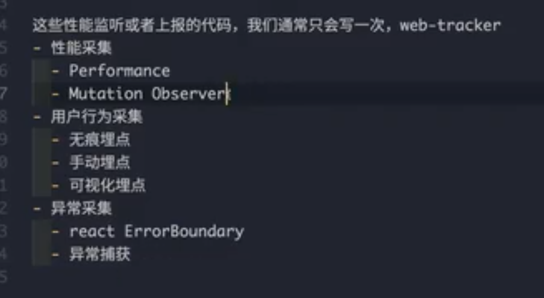
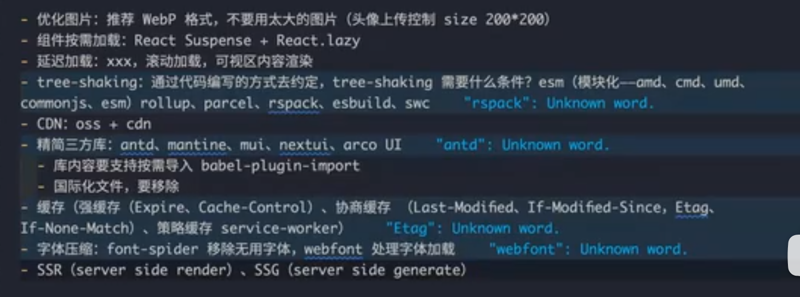

# 首屏加载慢

1. 网络延迟
2. 文件太大

## 网络延迟

1. cdn
2. 预加载
3. 预渲染

## 文件太大

1. 分包 thunk
2. 懒加载
3. 压缩
4. 缓存（强缓存和协商缓存和 service worker）
5. 服务端渲染
6. 局部的 ssr（落地页、营销页）

## 首屏加载指标

FP
FCP
Performance API

FMP
LCP
FMP 可以使用 Mutation Observer 来实现。

ssr，有可交互事件（TTI）

- TBI（）和 TTI（从 FCP-->可交互中间的时间）

## 具体优化的细节

# react 优化

# vue 优化
