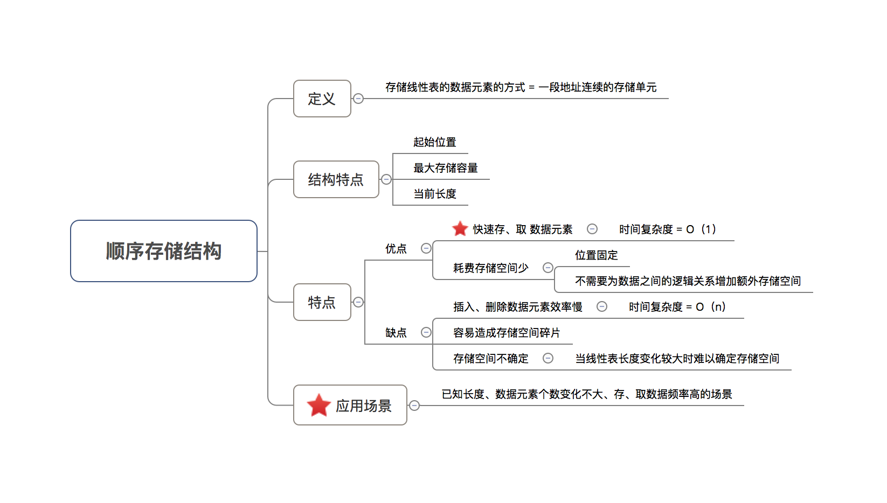
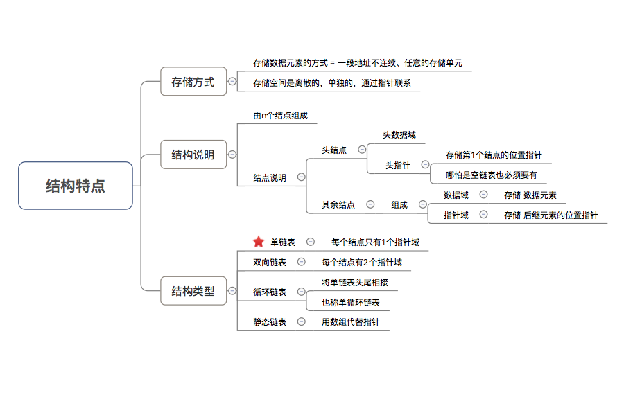
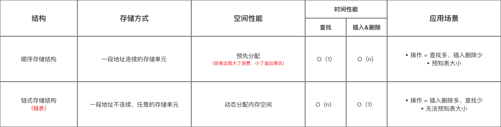
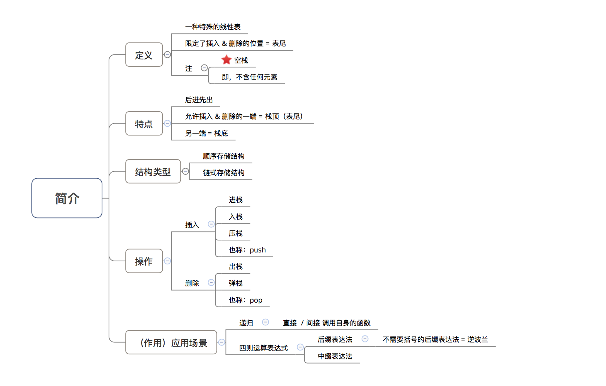
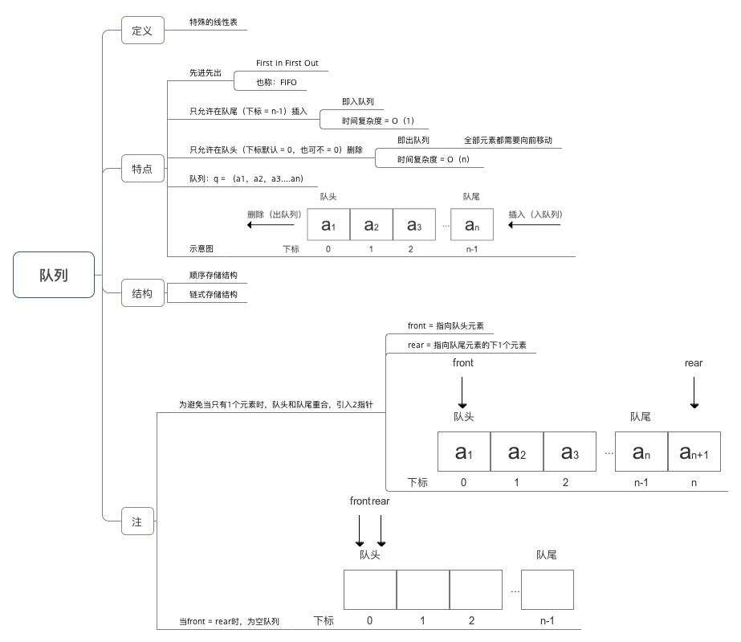
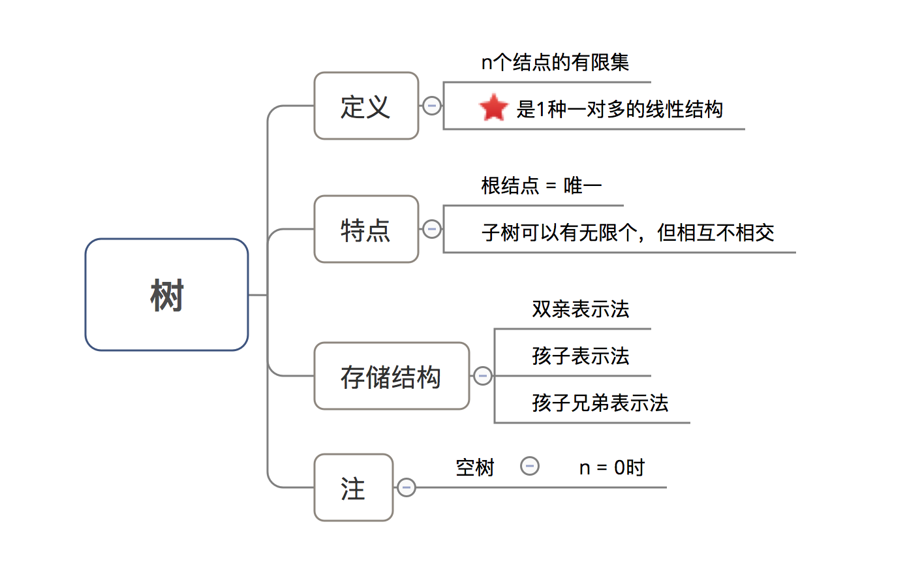
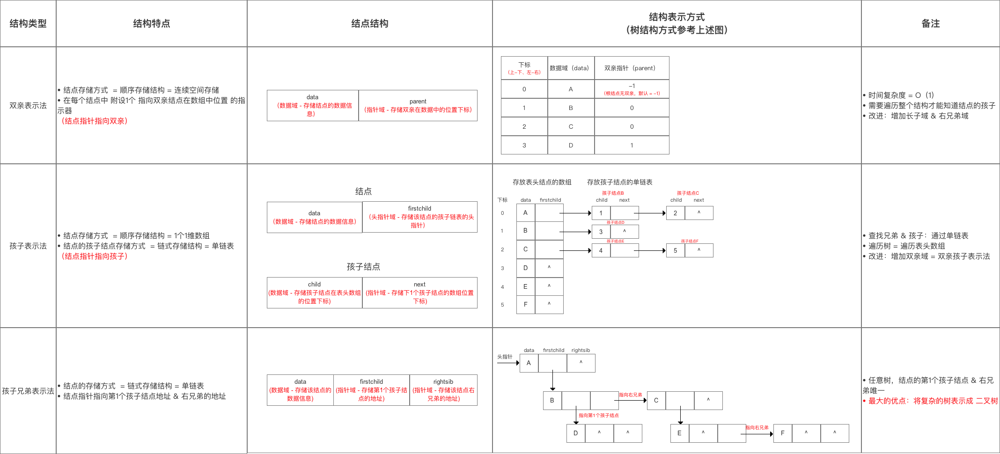
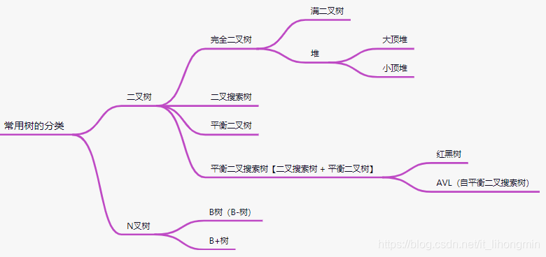
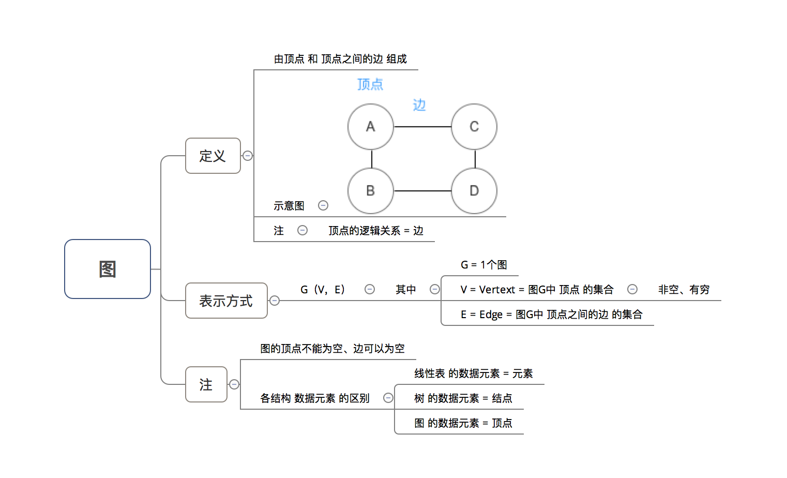

# 基本的

排序
线性表：数组、链表、栈与队列
树：含特殊的树，如二叉树、红黑树等
串：如字符串
查找
图

# 排序算法

## 冒泡

```js
function bubbleSort(arr) {
  for (let i = 0; i < arr.length - 1; i++) {
    for (let j = 0; j < arr.length - 1 - i; j++) {
      if (arr[j] > arr[j + 1]) {
        swap(arr, j, j + 1)
      }
    }
  }
}
function swap(arr, i, j) {
  let temp = arr[i]
  arr[i] = arr[j]
  arr[j] = temp
}
```

## 选择排序

选择排序的思想是：双重循环遍历数组，每经过一轮比较，找到最小元素的下标，将其交换至首位。

```js
function selectionSort(arr) {
  let minIndex
  for (let i = 0; i < arr.length - 1; i++) {
    minIndex = i
    for (let j = i + 1; j < arr.length; j++) {
      if (arr[minIndex] > arr[j]) {
        minIndex = j
      }
    }
    //进行交换到首位
    let temp = arr[i]
    arr[i] = arr[minIndex]
    arr[minIndex] = temp
  }
}
```

- 都是两层循环，时间复杂度都为 O(n2)_O_(*n*2);
- 都只使用有限个变量，空间复杂度 O(1)_O_(1)。

## 快速排序

快速排序算法的基本思想是：

从数组中取出一个数，称之为基数（pivot）
遍历数组，将比基数大的数字放到它的右边，比基数小的数字放到它的左边。遍历完成后，数组被分成了左右两个区域
将左右两个区域视为两个数组，重复前两个步骤，直到排序完成

```js
function quickSort(arr) {
  if (arr.length <= 1) return arr
  let pivotIndex = Math.floor(arr.length / 2)
  let pivot = Math.splice(pivotIndex, 1)[0]
  const left = []
  const right = []
  for (let i = 0; i < arr.length; i++) {
    if (arr[i] < pivot) {
      left.push(arr[i])
    } else {
      right.push(arr[i])
    }
  }
  return quickSort(left).concat([pivot], quickSort(right))
}
```

尽管快速排序在最差情况下的时间复杂度是 O(n2)，但在实际应用中，通过合理选择基准元素（如随机选择或“三数取中”法），快速排序通常表现得非常高效，接近其平均时间复杂度 O(nlog⁡n)。

## 归并排序

```js
function merge(leftArr, rightArr) {
  let result = []
  while (leftArr.length > 0 && rightArr.length > 0) {
    if (leftArr[0] < rightArr[0]) {
      result.push(leftArr.shift())
    } else {
      result.push(rightArr.shift())
    }
  }
  return result.concat(leftArr).concat(rightArr)
}
function mergeSort(array) {
  if (arr.length === 1) return array
  let middle = Math.floor(array.length / 2)
  let left = array.slice(0, middle)
  let right = array.slice(middle)
  return merge(mergeSort(left), mergeSort(right))
}


/**
 * @param {number[]} arr
 */
function mergeSort(arr) {
   if (arr.length <= 1) return arr;  // 合并两个if检查
  const middle = Math.floor(arr.length / 2);
  const left = arr.slice(0, middle);
  const right = arr.slice(middle);
  mergeSort(left)
  mergeSort(right)
  let l = 0,r = 0
  while (l < left.length || r < right.length) {
    if (r == right.length || (l < left.length && left[l] <= right[r]))
      arr[l + r] = left[l++];
    else
      arr[l + r] = right[r++];
  }
}
```

**归并排序的时间复杂度始终为 O(nlog⁡n)**，无论输入数据的初始顺序如何。这使得归并排序在处理大规模数据时表现得非常稳定。然而，由于其空间复杂度为 O(n)，在内存使用方面可能不如一些原地排序算法（如快速排序）高效。

# 查找

静态查找：顺序、有序、线性索引
动态查找：二叉树、平衡二叉树（左右树深度之差不能超过 1）
散列查找

有序：二分查找（logn）

# 线性表

## 数组（顺序存储结构）

存储线性表的数据元素的方式 = 一段地址连续的存储单元


## 链表（链式存储结构）




## 栈（顺序存储结构、链式存储结构）



## 队列（顺序存储结构、链式存储结构）



# 树




## 树的分类


满二叉树、完全二叉树、二叉搜索树、平衡二叉树

深度优先、广度优先

# 串

字符串

# 图


