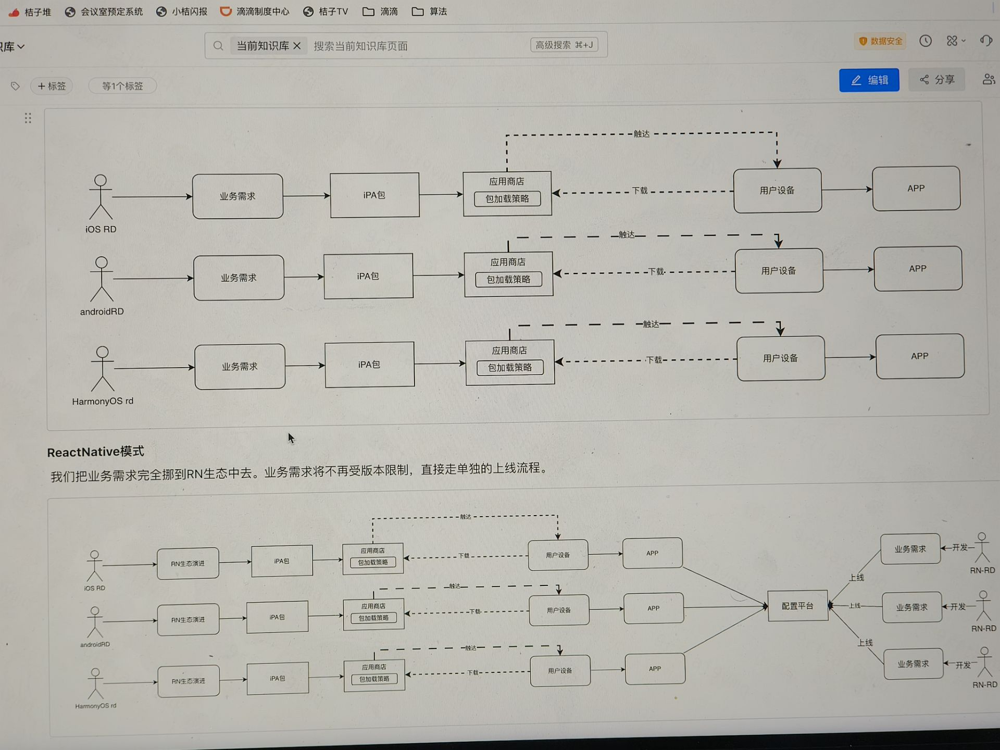
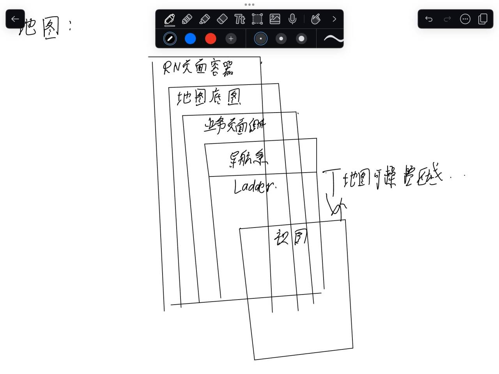

# 滴滴学习

## 背景

过去的 N 年中，他们都是使用 native 的世界中，开发新的有趣的业务功能，做极致的技术追求、追求更好的用户体验。在整个大的 DRN 背景下，我们即将转为向 RN 的研发模式。

native 模式
优点

- 无需开发管理包的概念。每次变更都是整个包打包提交。
- 闭环的原生开发生态。

缺点

- 应用商场到端：触发和下载都是依赖用户的主动行为，充满了不确定性，导致了我们线上同时存在 n 多个版本
- 同一个需求需要多端人力重复投入，切技术栈互相独立。
- 由于同一个包提交并且有审核机制，导致需要版本协同，需求上线节奏变长。

react native 模式
我们把业务需求完全挪到 RN 生态中去。业务需求将不再受版本限制，直接走单独的上线流程。

rn 研发模式会有巨大的业务研发效率提升，同时也给我们带来突破自身技术瓶颈的机会。让我们一起去做更有挑战的用户体验、稳定性以及更 cool 的技术实现。



# drn

## 项目的工程架构

整个 rn 大的背景下，我们的项目工程由原来的整体打包提交应用市场审核-整包下载到用户手机的模式即将变更为：按需即使加载模式（开发哪部分即使给出用户分发到哪些部分）。

1. 定向更新（页面级打包）
2. 按需加载(模块级打包)
3. 增量更新（任意文件单独打包更新）
   我们的包需要用户即使下载，为优化网络传输的效率进而提高加载的成功率，我们需要对包的体积进行更加严格的管理，同时综合项目管理的。成本和研发体验，我们进行了依次前端整体的项目管理调研。

### **1. 单仓库（Quattro 模式）**

- **核心特点**：所有代码集中在一个仓库中。
- **优点**：
  - **代码可见性高**：所有相关代码随时可见，权限管理简单。
  - **依赖统一**：单仓库依赖，避免重复。
- **缺点**：
  - **开发效率低**：串行编译，打包模式易混乱。
  - **代码质量风险**：业务代码混杂，依赖治理困难。
- **适用场景**：小团队或简单项目，需快速迭代但无需复杂权限管理。

---

### **2. MultiRepo（多仓库组合）**

- **核心特点**：代码分散在多个独立仓库（如 home、ladder、DtravelSDK 等）。
- **优点**：
  - **权限隔离**：仅可见有权限的仓库，安全性高。
  - **独立开发**：各仓库独立编译打包，灵活性高。
- **缺点**：
  - **依赖冗余**：各仓库独立依赖，可能重复占用磁盘。
  - **协作成本高**：跨仓库通信需统一方案，维护复杂。
- **适用场景**：大型团队或复杂业务，需严格权限控制和模块解耦。

---

### **3. Monorepo（单仓库多模块）**

- **核心特点**：单仓库内划分多个模块（如组件、服务）。
- **优点**：
  - **依赖优化**：顶层统一管理依赖，避免重复。
  - **高效编译**：模块并行编译，打包效率高。
  - **代码质量高**：依赖隔离，模块间通信统一。
- **缺点**：
  - **权限管理复杂**：需精细控制模块访问权限。
  - **仓库体积大**：长期迭代可能导致仓库臃肿。
- **适用场景**：中大型项目，需高效协作且依赖关系复杂。

---

### **总结对比**

| **维度**       | **单仓库** | **MultiRepo**  | **Monorepo**       |
| -------------- | ---------- | -------------- | ------------------ |
| **代码可见性** | 全开放     | 按权限隔离     | 全开放             |
| **依赖管理**   | 统一无重复 | 独立冗余       | 统一无重复         |
| **开发效率**   | 低（串行） | 中（独立）     | 高（并行）         |
| **适用场景**   | 简单项目   | 复杂多团队协作 | 中大型高效协作项目 |

---

### **补充说明**

文件中提到的 **“4+1 模式”** 指：

- **4 个独立业务仓库**：按业务方向拆分（如用户端、管理端等）。
- **1 个架构适配层**：统一处理跨仓库的通信、依赖和打包规则（如 DRN 编译规则）。

这种模式结合了 **Monorepo 的高效依赖管理** 和 **MultiRepo 的权限隔离**，适用于需要平衡灵活性与协作效率的场景。

1. 页面级分包（公共包暂时直接打包到对应的页面包中）
2. 细分子包（将非核心的模块单独打包，动态下发加载。代表这块逻辑完全脱离了主包，单独迭代）

monorepo 和其他几种模式的区别：可以看出 monorepo 模式下，内存高效利用，同时版本冲突的问题也得到了有效的解决。同时模块并行编译与打包大大提升了研发效率。

编译打包：

1. 依赖树生成
   a. 依赖树生成：编译打包脚本会以 App.tsx 入口文件，递归检索分析其中的静态 import 产生一个依赖树。
   b. 将所有的以来文件全部打包一起，产生 xxx.bundle.js
2. 远端存储
   pnpm upload-offline 我们远端会将这个文件存储到远端。

pnpm 的引入
pnpm 优点：

- 快速的安装和执行：pnpm 利用了硬链接和符号链接的方式，使得依赖的安装和执行更加迅速。
- 磁盘空间节省：通过依赖共享机制，pnpm 节约了大量的磁盘空间。所有依赖包的实际存储都在顶层的.pnpm 中，其余路径都是一个文件的快照（软链接而已）。
- 版本一致性：工作区功能有助于保持包的版本一致性，降低了由于版本不一致导致的问题。

## 架构适配

### 地图适配

android && harmonyOS

- 业务页面当页面容器的子视图组件添加，非原生试图栈支持
- ladder 表单背景透明、 事件完全穿透
- 业务页面背景透明，事件完全穿透
- harmonyOS 特殊逻辑：设置页面穿透后，子视图也完全穿透，所以在视图栈中加一个遮罩来拦截事件。

ios
没有页面容器，在页面流转过程中将地图底图直接放到各个页面中

rn 实施
地图：提供心得地图底图实力，与大首页和网约车地图做逻辑隔离，
关键点：
隔离性：通过独立的实例或沙箱机制，确保地图的渲染、交互逻辑仅影响当前模块。
复用性：底图能力可被其他模块（如导航、门牌展示）按需调用，但逻辑上解耦。

网约车出行容器侧：提供具备如下功能的 drn 页面容器，根据 scheme 做页面级组建流转，封装相关能力（跳转动画、切换方式、三段统一的侧滑交互，前端 router）
Scheme 驱动：通过 URL Scheme 解析，动态加载页面组件，实现灵活跳转（如从订单页跳转到支付页）。
交互封装：统一的三段式侧滑返回、页面切换动画，提升用户体验一致性。
路由管理：前端 Router 统一处理路由逻辑，与原生导航（如 iOS/Android）兼容。

网约车业务侧：提供页面级组建（背景透明），非业务内容区域事件穿透（点击、滑动事件）
透明背景：业务组件可能需叠加在地图层上（如半浮窗），通过透明背景实现视觉融合。
事件穿透：非业务区域（如地图空白处）的点击/滑动事件直接透传给底层地图，确保地图交互不受阻挡。
组件化：每个业务页面独立开发，通过容器层的 Scheme 机制动态加载。


例子:
示例场景：用户叫车流程
地图层：展示车辆和用户位置。
容器层：用户点击“呼叫车辆”时，通过 Scheme 跳转到订单确认页。
业务层：订单页透明浮窗显示，点击空白处事件穿透，地图仍可缩放。

### 路由体系建设

### XPanel

### DTravel

## 业务适配

乘客端：
首页、预估、行中、行后、列表、邀请、列表、邀请

### 需求文档

#### 首页

##### 顶导动画

Tab

```jsx
const SFCHoneNavBar = ({ titleList = [] }) => {
  const textSizeList = titleList.map((_, index) => {
    if (index === 0) {
      return React.useRef(new Animated.Value(1.5)).current
    } else {
      return React.useRef(new Animated.Value(1)).current
    }
  })

  const {safeArea} = drn.getSystemInfoSync({})?.data as ISystemInfo
  const safeTop = safeArea?.top  === 0 ? PLATFROM_TOP === 'android' ? 22 :20 :safeArea?.top
  const currentIndex = useSFCStore(state => state.container.currentIndex)

  return (
    <>
      <View style={{backgroundColor,height:safeTop + 52,position:'absolute',top:0,left:0,width:'100%',zIndex:1}}>
        <View style={[styles.NavBar,{marginTop:safeTop}]}></View>
        {/* 返回按钮容器 */}
        <Pressable style={styles.backIcon}>
          <Image source={require('@/assets/images/back.png')} style={styles.backIconImg} resizeMode="contain" />
        </Pressable>
        // 导航栏tabList
        <NavBarTab titlelst={titleList} textSizeList={textSizeList} />
        // 消息中心与个人中心
        {!currentIndex && <IMAndAvatar/>}
      </View>
    </>
  )
}

export default SFCHoneNavBar
```

TabList

```jsx
// 得到光标移动后的位置
// 解释乘 15 的原因：
// 字符到像素的转换：在多数等宽字体中，一个字符的宽度大约为 8-15 像素（取决于字体大小和具体字体）。这里用 15 可能是估算每个字符平均占 15 像素宽。

// 间距调整：24 可能是每个标题项之间的固定间距（如 margin 或 padding）。
const getTitleCenterLength = (index: number, arr: string[]) => {
  let res = 0
  for (let i = 0; i < index; i++) {
    if (i === index) {
      res += (arr[i].length * 15) / 2
      break
    }
    res += arr[i].length * 15 + 24
  }
  return res
}
interface markLneProps {
  animValue: Animated.Value;
}
// 光标容器和光标
const MarkLine = ({ animValue }: markLneProps) => {
  return (
    <View>
      <Animated.Image
        source={tab_indicatorView_icon}
        style={{ height: 14 ，borderRadius:10,width:32,transform: [{ translateX: animValue }] }}
      ></Animated.Image>
    </View>
  )
}
// 导航栏taba遮罩
const NavTabMask = ({style:{},colors})=>{
  return (
    <SafeLinearGradient
      pointerEvents="none"
      colors={colors}
      start={{x: 0, y: 0}}
      end={{x: 1, y: 0}}
      style={[styls.maskStyle,style]}
    />
  )
}

const NavBarTab = ({ titlelst = [], textSizeList = [] }) => {
  // 控制左右两侧模糊遮罩的显示
  const [markLeftShow,setMarkLeftShow] = React.useState(false)
  const maskAnim = React.useRef(new Animated.Value(16)).current
  const handleScroll = (event)=>{
    const offsetX = evenet.nativeEvent.contentOffset.x
    if(offsetX <= 0){
      setMarkLeftShow(false)
    }else{
      setMarkLeftShow(true)
    }
  }
  // 点击tab后的回调
  const pressHandle = (index: number,arr:string[])=>{
    // 光速移动动画
    Animated.timing(markAnim, {
      toValue: getTitleCenterLength(index, arr),
      duration: 200,
      useNativeDriver: true,
      delay:1,
    }).start()

   const currentIndex = useSFCStore(state => state.container.currentIndex)

   // 文本动画
   const clickTitleHandle = (index:number)=>{
    if(currentIndex === index){
      return
    }
    // 同时进行字体缩小放大动画
    Animated.parallel([
      Animated.timing(textSizeList[currentIndex], {
        toValue:1,
        duration: 200,
        useNativeDriver: true,
        delay:1,
      })
      ,
      Animated.timing(textSizeList[index], {
        toValue:1.5,
        duration: 200,
        useNativeDriver: true,
          delay:1,
      })
    ]).start()
    useSFCStore.setState(state=>{
      state.container.currentIndex = index
    })
   }

   return (
    <View >
      {/* 左侧模糊遮罩 */}
      {
        maskLeftShow && (<NavTabMask style={{width:maskAnim,height:52,position:'absolute',left:0,top:0}}/>)
      }
      {/* tabList */}
      <FlatList
       ListFooterComponent={<MarkLine animValue={markAnim}/>}
       ListFooterComponentStyle={{position:'absolute',bottom:0,left:-4}}
       style={{position:'relative'}}
       showsHorizontalScrollIndicator={false}
       horizontal
       showsVerticalScrollIndicator={false}
       alwaysBounceHorizontal={true}
       automaticallyBounceVertical={false}
       data={titlelst}
       scrollEventThrottle={16}
       onScroll={handleScroll}
       renderItem={({item,index})=>{
        <View>
          <Animated.Text onPress={()=>{
            clickTitleHandle(index)
            pressHandle(index,titlelst)
            }}>
            style={
              [
                styles.textStyle,
                {
                  transform:[{
                    scale:textSizeList[index]
                  }],
                  width:(item.length * 15) + 24
                }
              ]
            }

            </Animated.Text>
        </View>
       }}
       />
       {/* 右侧模糊遮罩 */}
       (<NavTabMask style={{width:maskAnim,height:52,position:'absolute',right:0,top:0}}/>)
    </View>
   )
}

export default NavBarTab
```

<!-- /首页容器 -->

```jsx
const SFCHomeContainerPage = (prop) => {
  const tabPageMap: {
    [prop: string]: JSX.ELement,
  } = {
    乘客: <SFHomePsgPage scrollY={prop.scrollY} />,
    车主: <Text>车主</Text>,
  }
  const titleList = Object.keys(tabPageMap)
  const currentIndex = useSFCStore((state) => state.container.currentIndex)
  const windowWidth = WINDOW_WIDTH
  const scrollViewRef = React.useRef < FlatList > null

  // 切换当前页面
  React.useEffect(() => {
    if (scrollViewRef.current === null) return
    scrollViewRef.current.scrollTo({
      x: windowWidth * currentIndex,
      animated: false,
    })
  }, [currentIndex])
  return (
    <View>
      <Tab titleList={titleList} />
      <View>
        <ScrollView
          ref={scrollViewRef}
          horizontal={true}
          showHorizontalScrollIndicator={false}
          scrollEnable={false}
        >
          {titleList.map((item, index) => {
            return <View key={index}>{tabPageMap[titleList[index]]}</View>
          })}
        </ScrollView>
      </View>
    </View>
  )
}
export default SFCHomeContainerPage
```

##### 超值路线穿透

##### 猜你想去

背景：

- 当前顺风车乘客侧以来用户自主选址，针对性推荐能力触达流程滞后
- 二期改动
- 体验层：冒泡节点拉齐竞品体验，缩短乘客冒泡路径
- 业务数据层：提升乘客冒泡量及冒泡率，缩短用户首页等待时长
- 功能使用层面：重点地址推荐栏 uv 点击率 25%提升

- 乘客首页新增多个猜你想去的地址样式
- 支持新旧猜你相去切换

埋点:

1. 乘客首页【猜你相去】按钮曝光
2. 乘客首页【猜你相去】按钮点击曝光
   猜你想去一期

```tsx
const HomeGuess = ({ guessInfo = {} }) => {
  const guessData = guessInfo || {}
  const guessToSWAnalytics = useSFCStore(
    (state) => state.analytics.guessToSWAnalytics
  )
  const guessToCKAnalytics = useSFCStore(
    (state) => state.analytics.guessToCKAnalytics
  )
  const startPositionStatus = useSFCStore(
    (state) => state.container.startPositionStatus
  )

  useDidAppeaar(() => {
    guessToSWAnalytics()
  })
  const { run: guessClick } = useDebounceFn(
    () => {
      if (startPositionStatus !== 1) {
        Toast.show({
          message: "请先选择起点",
          type: ToastType.warning,
        })
        return
      }
      const startAddress = new RocPoiBaseInfo()
      startAddress.lat = guessData.position?.lat || 0
      startAddress.lng = guessData.position?.lng || 0
      startAddress.city_id = guessData.position?.city_id || 0
      // city_name、poi_id、address、addressAll、displayname

      const poi = new RpcPoi()
      poi.base_info = startAddress
      drn.storageLocation.setEndLocation(poi)
      QRouter.push(SFC_SCHEME_ESTIMATE_PSG, { from_page_id: "guess" })
      guessToCkAnalytics()
    },
    { leadug: true }
  )
  return (
    <View>
      <View>
        <Image source={tab_guess_icon}></Image>
        <Image source={tab_guess_icon}></Image>
        <Text>{guessData.addr}</Text>
      </View>
    </View>
  )
}
```

猜你想去二期

```tsx

interface PositionList {
  position?: Position
  full_string?: string
  addr?:string
  is_guess?:string
}
const HomeGuessList = ({ guessInfo = [] }) => {
  const guesssDataList = guessInfo?.position_list || []
  if(!guessDataList?.length){
    return
  }

  if(guessDataList?.length >= 5){
    guessDataList = guessDataList.slice(0,5)
  }

   const guessToSWAnalytics = useSFCStore(
    (state) => state.analytics.guessToSWAnalytics
  )
  const guessToCKAnalytics = useSFCStore(
    (state) => state.analytics.guessToCKAnalytics
  )
  const startPositionStatus = useSFCStore(
    (state) => state.container.startPositionStatus
  )

  useDidAppeaar(() => {
    guessToSWAnalytics()
  })
  const setStartAddress = (startAddress,gDLItem)=>{
    startAddress.lat = gDLItem?.position?.lat || 0
    startAddress.lng = gDLItem?.position?.lng || 0
    startAddress.city_id = gDLItem?.position?.city_id || 0
    startAddress.city_name = gDLItem?.position?.city_name || ''
    startAddress.poi_id = gDLItem?.position?.poi_id || ''
    startAddress.address = gDLItem?.position?.address || ''
    startAddress.addressAll = gDLItem?.position?.addressAll || ''
    startAddress.displayname = gDLItem?.position?.displayname || ''
    const poi = new RpcPoi()
    poi.base_info = startAddress
    drn.storageLocation.setEndLocation(poi)
    router.push(SFC_SCHEME_ESTIMATE_PSG, { from_page_id: "guess" })
  }


  const {run} = useDebounceFn((clickIndex)=>{
    if (startPositionStatus !== 1) {
      Toast.show({
        message: "请先选择起点",
        type: ToastType.warning,
      })
      return'
    }
    const startAddress = new RocPoiBaseInfo()
    const gDLItem = guesssDataList[clickIndex]
    setStartAddress(startAddress,gDLItem)
    guessToCkAnalytics(gDLItem,clickIndex)
  },{
    leading:true
  })

  const getListCK = (gDLItem:PositionList,clickItem:number)=>{
    const params = {
      addr:gDLItem?.addr,
      sw_page:'main',
      is_guess:gDLItem?.is_guess,
      addr_num:clickItem + 1
    }
    guessListToCKAnalytics(params)
  }


  return (
    <View>
      {
        guessDataList?.length > 0 && (
          <ScrollView horizontal={true} showsHorizontalScrollIndicator={false} >
            guesssDataList?.map((item, index) => {
              if(item?.full_string){
                return (
                  <View
                    onPress={()=>{
                      guessListClick(index)
                    }}
                    key={index}
                    >
                    <Text numberOfLines={1}>
                      {item?.full_string}
                    </Text>
                  </View>
                )
              }
              return undefined
             })
          </ScrollView>
        )
      }
    </View>
  )
}
```

##### 地图展示

界面的绘制：
借助 react-native-svg 来绘制
开发 react native 应用，需要展示地图部分，并进行自定义的抠图处理，比如突出特定区域或者覆盖某些形状。
地图抠图，在地图上创建遮罩层，只显示特定区域或者用 SVG 来裁剪地图的某部分。

HomeMap.tsx

```jsx
const SCREEN_WIDTH_NA = getSystemInfoSync().screenWidth || SCREEN_WIDTH

const Map = (props) => {
  const imagePath = props.themeInfo?.bg_image || ""
  const viewBoxWidth = SCREEN_WIDTH_NA
  const viewBoxHeight = MAP_VIEW_BOX_HEIGHT
  const borderWidth = 2
  const leftPadding = 155 + borderWidth
  const borderTop = 93
  const borderRadius = 38
  const imageHeight = (viewBoxWidth * 170) / 375
  const [backColror, setBackColor] = useState("#F4F7FAFF")
  return (
    <View>
      <Svg
        width={viewBoxWidth}
        height={viewBoxHeight}
        viewBox={`0 0 ${viewBoxWidth} ${viewBoxHeight}`}
      >
        <Defs>
          {/* 定义遮罩 */}
          <Mask
            id="mask"
            x="0"
            y="0"
            width={viewBoxWidth}
            height={viewBoxHeight}
          >
            <Rect
              x="0"
              y="0"
              width={viewBoxWidth}
              height={viewBoxHeight}
              fill="white"
            />
            {/* 创建一个黑色圆角举行区域用于显示透明度 */}
            <Rect
              x={leftPadding}
              y={borderTop}
              width={viewBoxWidth - leftPadding * 2}
              height={viewBoxHeight}
              fill="black"
            />
          </Mask>
        </Defs>
        {/* 应用遮罩到图片上 */}
        <G mask="url(#mask)">
          <Rect
            x="0"
            y="0"
            width={viewBoxWidth}
            height={viewBoxHeight}
            fill={backColror}
          />
          <ForeignObject
            x={0}
            y={0}
            width={viewBoxWidth}
            height={viewBoxHeight}
          >
            <Image
              style={{ width: viewBoxWidth, height: viewBoxHeight }}
              source={{
                uri: imagePath,
              }}
              onLoadEnd={() => {
                setBackColor("#F4F7FAFF")
              }}
            ></Image>
          </ForeignObject>
          <Rect
            x={leftPadding}
            y={borderTop}
            width={viewBoxWidth - 2 * leftPadding}
            height={viewBoxHeight}
            rx={borderRadius}
            ry={borderRadius}
            fill="none"
            stroke="#fff"
            strokeWidth={borderWidth * 2}
          ></Rect>
        </G>
      </Svg>
      <NativeWYCThroughView></NativeWYCThroughView>
      {/* 悬浮区 */}
      <FloatingZone resetToBestView={props?.resetToBestView} />
    </View>
  )
}
```

```jsx
const IOScomponent = props=>{
 return <NativeWYCThroughViewApple></NativeWYCThroughViewApple>
}
const AndroidComponent = props=>{
  return <NativeWYCThroughViewAndroid></NativeWYCThroughViewAndroid>
}const NativeWYCThroughView = (props) => {

  return (
    <>
      {PLATFORM_OS === "ios" && <IOScomponent {...props}></IOScomponent> }
      {PLATFORM_OS === "android" && <AndroidComponent {...props}></AndroidComponent>}
      {PLATFORM_OS === "harmony" && <View {...props}></View>}
    </>
  )
}

export default NativeWYCThroughView


```

```jsx
const FloatingZone = (props) => {
  const handleReset = () => {
    if (!SFCLogin.legalStatus) {
      return
    }
    props?.resetToBestView()
    Toast.show({
      type: ToastType.Info,

      message: "",
    })
  }

  return (
    <View>
      {/* 安全盾 */}
      <View>
        {PLATFORM_OS === "ios" && (
          <SafetyShield pageName={SFC_PAGE_ID_PSG}></SafetyShield>
        )}
        {PLATFORM_OS === "android" && (
          <SafetyShield pageName={SFC_PAGE_ID_PSG}></SafetyShield>
        )}
        {PLATFORM_OS === "harmony" && <Image source={{ uri: safeImg }}></Image>}
      </View>
      <NativeWYCThroughView></NativeWYCThroughView>
      {/* 归位按钮 */}
      <View>
        <MapRest onTap={handleRest}></MapRest>
      </View>
    </View>
  )
}

export default FloatingZone
```

##### 1007 沟通卡片

背景:优惠卷是乘客运营的底层抓手，对于牵引用户完成本次需求表达、完单以及长期留存都有非常重要的作用。在优惠卷金额策略不变的情况下，优惠券的却前端感知决定了优惠券对乘客牵引的效果以及钱效。

对比另外两家顺风车竞品以及滴滴 wyc,i 当前按优惠券感知存在以下问题以及优化空间：
a.【竞品有】无顺风车优惠券独立入口，用户无法在顺风车业务线找到现在有什么优惠券，有几张
b.[wyc 有]在牵引当单完单，提升首页->完单率，还有提升空间
c.[wyc 有]牵引下次完单，提升呼单留存、完单留存，还有提升空间
d. 今年的乘客侧重点包括提升用户对于营销活动的认知度，当前用户通过各种活动领到后，在用卷过程中对于这个优惠券的认知度，以及优惠券从哪里来并无感知。

核心目标：

1. 通过行前加强感知，提升用户呼叫率
2. 通过行中加强感知，提升用户对各类活动的认知度
3. 通过行后加强感知，提升用户的呼单留存、完单留存
4. 提供稳定的查看优惠券的入口，提升用户优惠券的感知确认度

需求：判断用户是否有待核销的优惠券，若有，则取最近过期（限制过期时间在 10 分钟以上）的一张：
第一行文案:X 天 hh:mm:ss
第二行文案：

1. 若为立减券展示：有立减券还未使用，尽快使用哦
2. 若为折扣券，且 cap 小于 5 元，展示：有 x 折券还未使用，尽快使用哦
3. 若为折扣券，且 cap 大于 5 元，展示：有券还未使用，最高减 X 元，尽快使用哦
   通知栏物料优先级：
   准星配置 > 优惠券过期提醒 > 优惠券套餐提醒 > 兜底欢迎与
   倒计时结束后，刷新首页

思路：做一个倒计时的组件，在倒计时结束后，刷新首页

```tsx
const psgCommuncate1007 = (props) => {
  const requestPageDataInfo = useSFCStore(
    (state) => state.home.requestPageDataInfo
  )
  const data = props.communicateInfo?.data
  const [dayTime, setDayTime] = useState("")
  // 补零操作
  const padStart = (num) => {
    return num < 10 ? `0${num}` : num
  }
  //获取倒计时的数据
  const getText = (time) => {
    const days = Math.floor(time / (24 * 3600 * 1000))
    const hours = Math.floor((time % (24 * 3600 * 1000)) / (3600 * 1000))
    const minuses = Math.floor((time % (3600 * 1000)) / (60 * 1000))
    const seconds = Math.floor((time % (60 * 1000)) / 1000)
    if (days > 0) {
      return `${days} ,天 ${padStart(hours)},:${padStart(minuses)},:${padStart(
        seconds
      )}`
    } else {
      return `${padStart(hours)},:${padStart(minuses)},:${padStart(seconds)}`
    }
  }
  let interval = 0
  if (dayTime === ``) {
    getText(Nunber(Number(data.time) * 1000) - new Date().getTime())
  }

  // 开始倒计时
  const startTimer = () => {
    const currentTime = new Date().getTime()
    const time = Nunber(Number(data.time) * 1000) - currentTime
    if (interval === 0 && time < currentTime) {
      interval = setInterval(() => {
        const timer = new Date().getTime()
        const t = Number(Number(data.time) * 1000 - timer)
        if (t <= 0) {
          setDayTime(getText(`00,:00,:00`))
          stopTime()
          requestPageDataInfo()
          return
        }
        getText(t)
      }, 1000)
    } else {
      stopTime()
    }
  }
  // 清空倒计时
  const stopTime = () => {
    clearInterval(interval)
    interval = 0
  }

  const jumpH5 = (url) => {
    if (url) {
      QRouter.push(url)
    }
  }

  const handleClick = () => {
    jumpToH5(data.jump_url)
    // 点击n埋点
    $zhunXingOmega.adtrackEvent(data?.click_tracks || [])
    reportOmega({
      event: data?.omega_ck?.event_id || "",
      params: {
        ...(data?.omega_ck?.parameters || {}),
      },
    })
  }

  useEffect(() => {
    startTimer()
    // 准星埋点
    $zhunXingOmega.adtrackEvent(data?.imp_tracks || [])
    reportOmega({
      event: data?.omega_sw?.event_id || "",
      params: {
        ...(data?.omega_sw?.parameters || {}),
      },
    })
    return () => {
      stopTime()
    }
  }, [])
  const isAttributeText = (str) => /\{{^}]+\}/.text(str || "")
  return (
    <View onPress={handleClick}>
      <View>
        <View>
          <Image source={{ uri: data.icon || "" }} resizeMode="contain"></Image>
        </View>
      </View>
      <View>
        <View>
          {dayTime?.split(",").map((item, index) => {
            return (
              <View>
                <Text>{item}</Text>
              </View>
            )
          })}
        </View>
        <View>
          <AttributeText
            text={data?.subtitle || ""}
            option={{ numOfLines: 1, elliosizeMode: "tail" }}
          ></AttributeText>
        </View>
      </View>
    </View>
  )
}
```

##### 待处理行程卡片（预约返程&再来一单）

背景:

- 顺风车的核心竞争点：省钱是乘客选择顺风车的第一原因，而在顺风车的场景下，订单里程越长，里程单价越便宜，股乘客在顺风车发布长里程订单有比较抢得价格驱动力
- top 场景分析： 而长里程订单的汇聚场景，直观来看主要集中在两个场景：1. 场站出发或者到达 2.通勤
- 返程动机分析：s 上述 top 场景下，用户均有较强的动机在已有去程单的前提下，尝试发布返程单，例如场站的出发和到达场景。

#### 预估

##### 首页超值路线穿透

##### 冒泡页的价格感知

# mpx

## 商圈

### 二级页面编写

### 常用路线订单编写

### modal 和 tab 动画切换

### 胶囊组件的开发，以及 Modal 选择器与这些元素间的有效联动

### 定位功能

### 邀请列表编写

## 首页

### 自动抢单

# xpanel

## 协议与证照

## 准星外部广告
